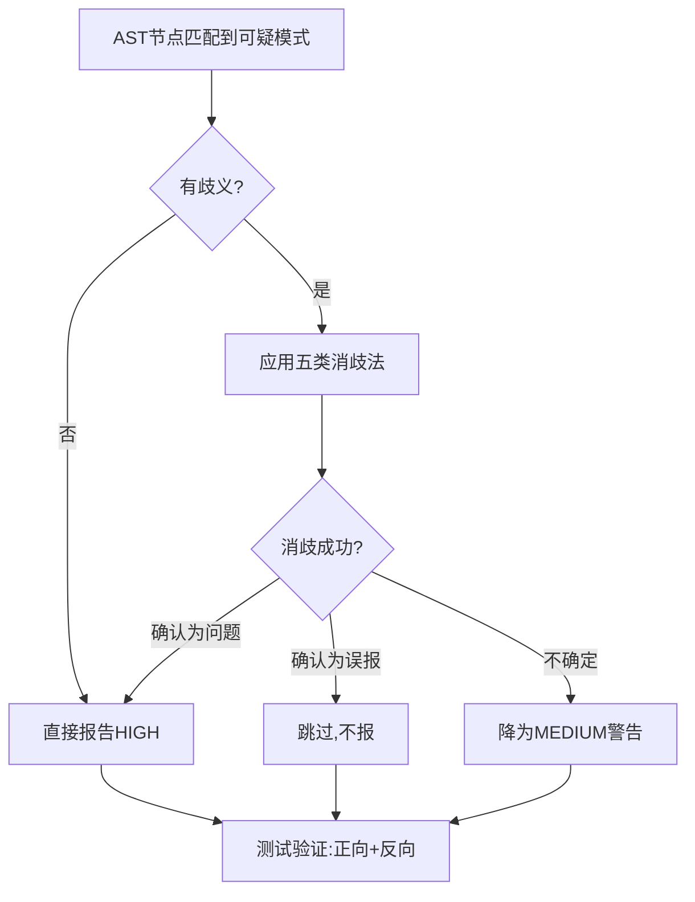

# AST静态分析五类消歧法

## 问题

Python是动态类型语言，AST（抽象语法树）只包含语法信息，不包含运行时类型信息。这导致基于AST的静态分析工具面临根本挑战：**同名方法在不同上下文中语义完全不同**。

典型例子：
- `str.join()` vs `Thread.join()`：方法名相同，一个是字符串操作，一个是线程等待
- `items = []`：是list还是deque？AST无法知道
- `x in items`：在for循环内是O(n)查找，在顶层可能是正常的集合操作

直接按方法名/模式匹配会产生大量误报（false positive），导致开发者不信任工具，最终跳过检查。

## 模式：五类消歧策略

### 1. 同名消歧法（Name-based Disambiguation）

**问题**：同名方法在不同接收者类型上语义不同。

**策略**：结合变量名命名约定 + 构造函数类型追踪：
- 变量名包含 `thread`/`worker`/`lock`/`rwlock` → 并发原语
- 变量名后缀 `_set`/`_dict`/`_map` → 集合类型
- 追踪赋值语句：如果 `x = threading.Lock()` 则x是锁

```python
# 反例：str.join() 不应被识别为线程join
result = ",".join(items)  # 变量名不含thread/worker→非线程join

# 正例：Thread.join() 应被识别
worker_thread.join(timeout=5)  # 变量名含thread→线程join
```

### 2. 类型推断法（Type Inference via Naming）

**问题**：AST无法推断运行时类型。

**策略**：利用项目命名约定做启发式类型推断：
- `*_list` / `*_items` → list类型
- `*_set` → set类型
- `*_dict` / `*_map` → dict类型
- `*_lock` / `*_mutex` → 锁类型

**局限**：依赖团队遵守命名约定。对不遵循约定的代码，保守处理（不报或降为警告）。

### 3. 上下文覆盖法（Context Coverage）

**问题**：相同代码模式在不同上下文中风险等级不同。

**策略**：遍历AST时维护上下文状态（如循环深度、函数名、类名）：
- `x in list` 在for/while循环内（loop_depth > 0）→ 线性查找，报告BOUNDARY问题
- `x in list` 在顶层（loop_depth == 0）→ 正常操作，不报
- AST节点访问器必须覆盖所有相关节点类型（For/While/If/With/Try/FunctionDef等）

**常见遗漏节点**：`ast.AsyncFor`（异步for循环）、`ast.While`、`ast.IfExp`（三元表达式内的循环）

### 4. 作用域限制法（Scope Limitation）

**问题**：跨函数/跨文件的数据流分析复杂度极高。

**策略**：将分析范围限制在单个函数/方法内部，不做跨过程分析：
- 函数参数类型：仅根据参数名后缀推断，不追踪调用点传入的实际类型
- 外部模块返回值：保守处理，不推断返回类型
- 类属性：仅在类定义范围内分析

**原则**：局部分析足够捕获80%的问题，跨过程分析的复杂度不值得边际收益。

### 5. 测试跳过法（Test Code Exclusion）

**问题**：测试代码中的故意错误/反例会被误报。

**策略**：自动跳过测试代码：
- 函数名以 `test_` 开头 → 跳过
- 类名以 `Test` 开头 → 跳过
- 文件路径包含 `/tests/` 或 `test_` 前缀 → 跳过
- 检查器本身的测试文件需要特殊标注（如通过conftest配置）

## 核心原则：Precision over Recall

> **宁可漏报（false negative），不可误报（false positive）**

- 误报的代价：开发者不信任工具 → `--no-verify` 跳过所有检查 → 防线全面失效
- 漏报的代价：个别问题未被自动检测 → Code Review和CI层兜底
- 消歧失败时的策略：**降级为警告（MEDIUM）而非报错（HIGH）**，或直接不报

## 消歧决策流程



## 复用场景

开发任何Python AST静态分析工具时作为开发checklist：
- 代码规范检查器
- 安全漏洞扫描器
- 性能反模式检测器
- 复杂度分析工具

## 常见误区

1. **过度依赖正则表达式**：正则无法处理嵌套结构和上下文，AST是Python静态分析的正确基础
2. **追求100%检测率**：静态分析有理论极限（Rice定理），接受漏报，专注降低误报
3. **忽略测试覆盖**：每个消歧规则必须有对应的正向（应报）和反向（不应报）测试用例
4. **不区分HIGH/MEDIUM**：确定的问题报HIGH，不确定的报MEDIUM，给开发者判断空间

> **关联模式**：
> - [precision-over-recall](../methodology-patterns/tools-automation/precision-over-recall.md) — 精确率优先于召回率
> - [three-tier-check-tool](three-tier-check-tool.md) — 检查工具三段式架构
> - [chain-pre-commit-hooks](chain-pre-commit-hooks.md) — 链式pre-commit钩子架构
