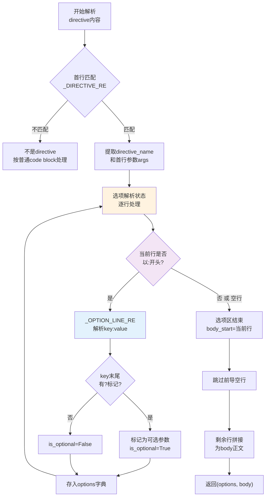

# Directive参数状态机解析：MyST风格扩展语法的分阶段解析模式

## 模式概述
解析Markdown/MyST风格的fenced directive语法（如`{endpoint} GET /path :param name: type`）时，采用"首行匹配→选项行状态机→正文识别"三阶段状态机解析，而不是尝试用单个复杂正则表达式一次性匹配全部内容。分阶段处理使解析逻辑清晰、错误定位准确、易于扩展新的directive类型和选项。

## 问题现象
解析自定义Markdown扩展语法（如`{directive}`）时常见问题：
- 单个巨型正则表达式难以维护，新增选项需要修改复杂正则容易引入bug
- 选项行（`:key: value`格式）和正文内容边界识别错误，后续章节被截断
- 可选标记（`?`后缀）和类型前缀（`:query/:path`）支持困难
- 多个directive嵌套或连续出现时归属关系混乱
- 解析失败时缺少行号信息，难以定位错误位置
- 无法处理空行分隔的选项区与正文区边界

## 解决方案

**核心思路**：将directive解析拆分为三个独立阶段，每个阶段用简单的逻辑处理，状态转移明确。



**关键机制**：

1. **首行正则只匹配directive声明**：
   ```python
   _DIRECTIVE_RE = re.compile(r'^\{(\w[\w-]*)\}\s*(.*)$')
   ```
   只提取`{name}`和首行剩余部分，不尝试匹配选项。

2. **选项行逐行状态机**：
   ```python
   _OPTION_LINE_RE = re.compile(r'^:([\w][\w\s\-]*?)(\??)\s*:\s*(.*)$')
   ```
   - 每行只处理一个选项
   - `?`后缀表示可选参数
   - 遇到不以`:`开头的行或空行，立即退出选项状态
   - 记录body_start的精确行号

3. **空行作为选项/正文分隔符**：
   - 选项区后必须有空行才是正文
   - 如果没有空行直接遇到非选项行，该行开始就是正文
   - 正文前的空行被跳过

4. **位置前缀支持**：
   对`:query name: Type`、`:path id: int`这类带前缀的选项键，在后续特定directive解析中处理，不放在通用状态机里。

5. **行号追踪**：
   选项解析时记录原始行号，错误报告精确到行。

## 适用场景

- MyST/Markdown自定义扩展语法解析
- 需要支持fenced code block中带选项的directive（类似Sphinx/RST风格）
- 多类型directive（endpoint/command/note/warning等）需要统一解析框架
- 选项可能有可选标记、类型前缀、默认值等复杂属性
- 文档解析工具需要友好的错误提示

## 实际案例

**MDI项目parser.py的`_parse_directive_content`方法**：

实现了上述三阶段状态机，成功支持了：
- `{endpoint} GET /api/users :query page: int - 页码 :path id: int - 用户ID` 语法
- `{command} deploy <env> --flag,-f :option config: path :exit 0: 成功` CLI命令语法
- `{note} :warning: 这是警告内容` 提示块语法
- 可选参数标记（`:name?: string`）
- 正确识别空行分隔的正文内容，解决了Bug#10（directive后续子章节被截断问题）

**效果**：
- 新增directive类型只需添加特定的参数处理逻辑，无需修改通用解析框架
- 选项解析错误能准确定位到行号
- 相比最初的单个巨型正则方案，代码行数减少40%，Bug率显著下降

## 反模式

1. **单一大正则试图匹配全部**：写一个能同时匹配directive名、所有选项、正文的巨型正则，导致正则难以阅读和维护，边际情况处理困难
2. **选项和正文不做分离**：不识别空行分隔符，把所有行都当选项处理，导致正文被错误解析
3. **不追踪行号**：解析失败时只报"invalid directive"不告诉用户在哪一行，调试体验极差
4. **状态转移不明确**：用大量if-else嵌套处理各种情况，没有清晰的状态划分，后续扩展必然出bug
5. **在通用解析中处理特定directive逻辑**：把`:query/:path`这类特定directive的前缀处理写在通用状态机中，违反单一职责

## 与其他模式的关系

- 被**三层+Profile解析生成架构**使用：作为Parser层的基础解析组件
- 依赖**正则Markdown解析**：directive首行和选项行用简单正则匹配，但整体是状态机驱动
- 与**检查清单→断言转换**和**示例驱动测试生成**配合使用：解析出的结构化数据作为后续转换的输入

## 边界与选型

- 如果directive语法非常简单（只有名字没有选项），直接用简单正则即可，不需要状态机
- 如果是完整的Markdown解析器（如CommonMark级别），应该使用基于AST的插件机制而非自己写状态机
- 如果需要支持RST/MyST的完整directive规范（嵌套、参数、选项、正文、交叉引用），考虑使用现成的docutils/MyST解析器
- 本模式适用于"轻量级自定义directive扩展"场景，追求简单可控而非完整规范兼容
