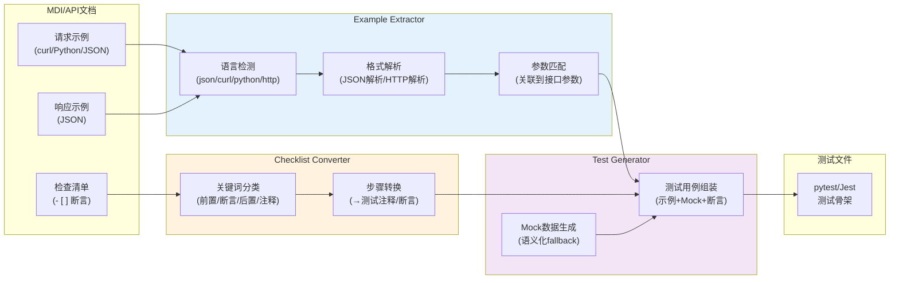

# 示例驱动测试生成：从文档代码块提取可执行测试数据

## 模式概述
在从API/接口文档生成测试代码时，不依赖纯Mock数据，而是提取文档中已有的example代码块作为真实测试数据。文档更新时测试自动更新，解决"文档漂移"问题，同时提升测试数据的真实性。

## 问题现象
接口文档自动生成测试代码时，常见问题：
- 纯Mock数据（随机字符串、固定值"test"）缺乏语义，无法发现真实边界问题
- 测试数据与文档示例不一致，文档写"返回200+用户对象"但测试断言硬编码了旧字段
- 文档示例中的错误码、边界值没有被测试覆盖
- 手动维护测试数据成本高，文档更新后测试忘记同步更新

## 解决方案

**核心思路**：文档中的example代码块是作者精心编写的典型输入/输出，比自动Mock数据更有价值——提取它们作为测试数据。



**关键机制**：

1. **多格式示例解析**：支持JSON、Python dict、curl命令、HTTP原始格式等不同语言的代码块
2. **上下文感知匹配**：根据代码块前后的段落文本推断其用途（请求示例/响应示例/错误示例）
3. **检查清单→断言转换**：通过关键词分类：
   - 含"前置"/"准备"/"given" → setup步骤
   - 含"应"/"验证"/"assert"/"expect"/"返回" → 断言步骤
   - 含"清理"/"后置"/"teardown" → teardown步骤
   - 其他 → 注释
4. **Mock数据作为fallback**：当示例缺失时用语义化Mock（根据参数名和类型生成，如email字段生成"user@example.com"）
5. **边界值补充**：在示例基础上自动补充边界值测试（必填参数缺失、类型错误、越界值）

## 适用场景

- API文档（OpenAPI/MDI/自定义格式）→ 测试代码生成
- CLI工具文档 → 集成测试生成
- 接口定义变更频繁、文档即Single Source of Truth的项目
- 需要测试与文档强同步、避免文档漂移

## 实际案例

**MDI项目pytest_gen.py**：
- 从`example python`代码块提取API调用参数
- 从`example response`/```json```代码块提取期望响应
- 从`## 验收标准`章节的复选框列表提取断言步骤
- 生成的测试文件包含：
  - 从文档示例提取的真实请求/响应数据
  - 从checklist转换的断言注释
  - 语义化Mock数据填充缺失参数
  - 边界值测试用例

**效果**：
- 生成的测试不再是空洞的`assert response is not None`，而是包含真实数据的具体断言
- 文档更新example代码块后重新生成测试，自动同步
- checklist中的验收标准自动出现在测试代码中作为注释提醒开发者

## 反模式

1. **盲目信任示例正确性**：示例代码可能本身有错，应该标记为"基于文档示例"而非"必然正确"
2. **不做参数关联**：提取了JSON但没关联到具体接口参数，导致数据无法被正确使用
3. **完全依赖示例放弃Mock**：示例只覆盖happy path，仍然需要Mock补充边界值和异常场景
4. **检查清单不做分类**：直接把所有checkbox当断言，导致前置条件被当成assert调用报错

## 与其他模式的关系

- 依赖**三层+Profile解析生成架构**作为基础设施
- 与**结构化文档diff**配合：文档示例变更时通过diff检测到，提醒更新测试

## 边界与选型

- 文档本身没有example代码块时，此模式无法发挥作用，退化为纯Mock数据生成
- 文档与代码分离的项目（文档不随代码版本控制），示例可能过时
- 性能测试/压力测试场景不适用，需要专门的性能测试数据生成
