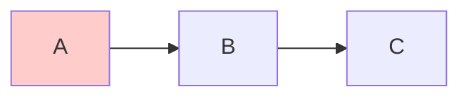
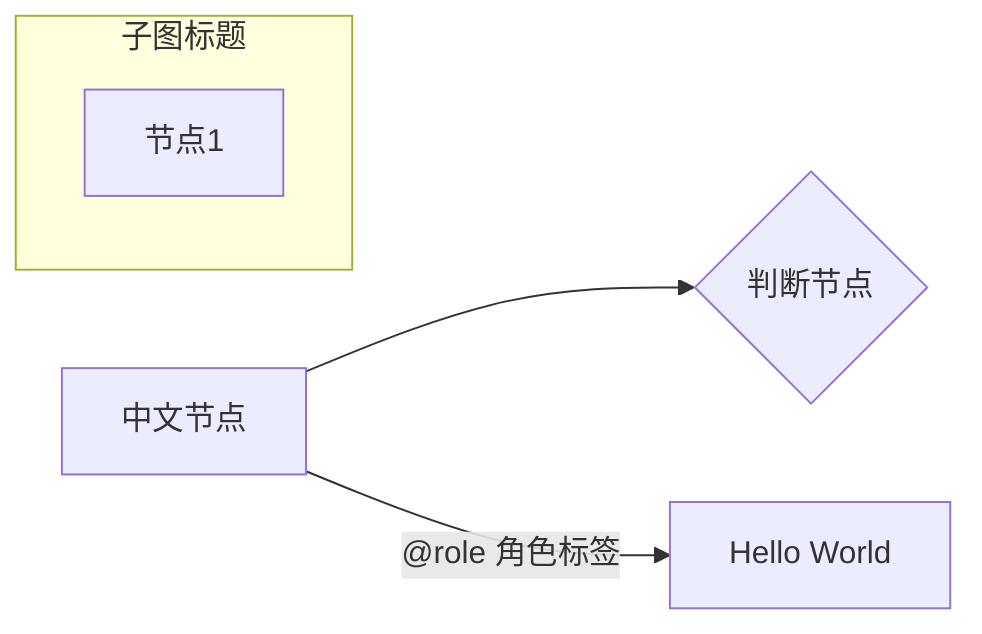
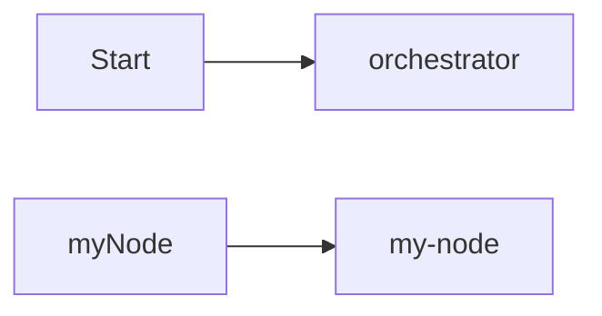
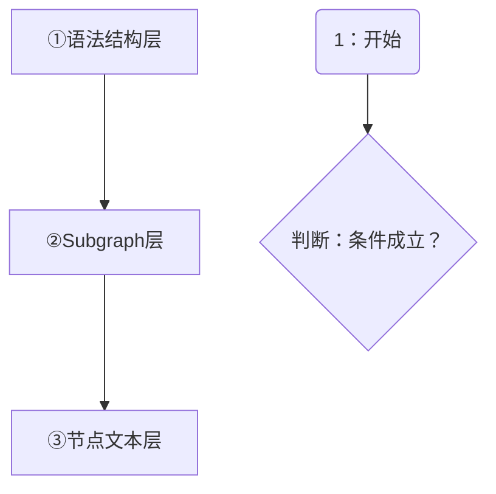
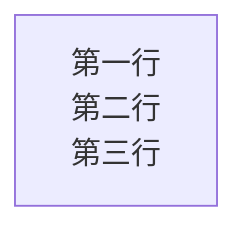
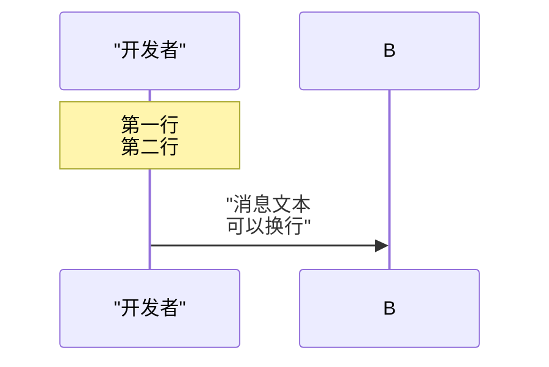
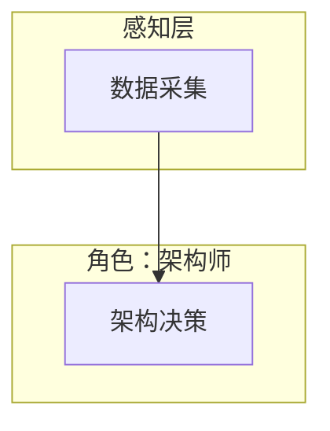
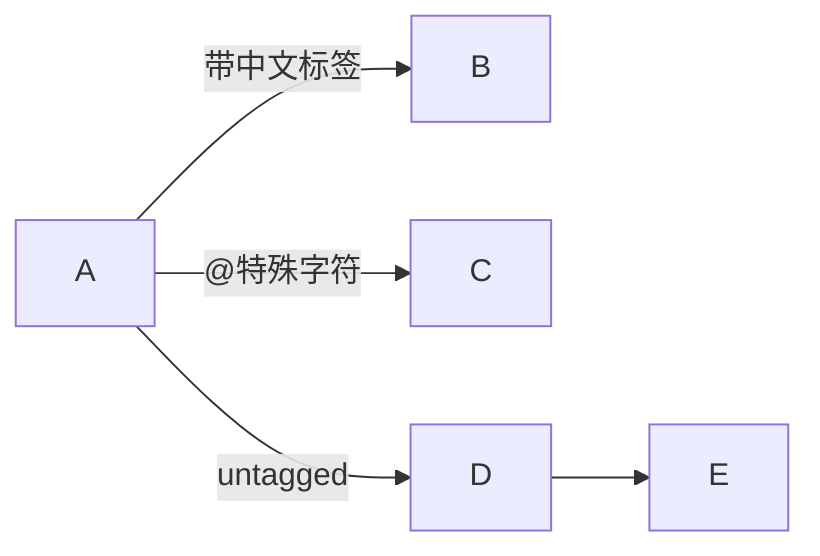
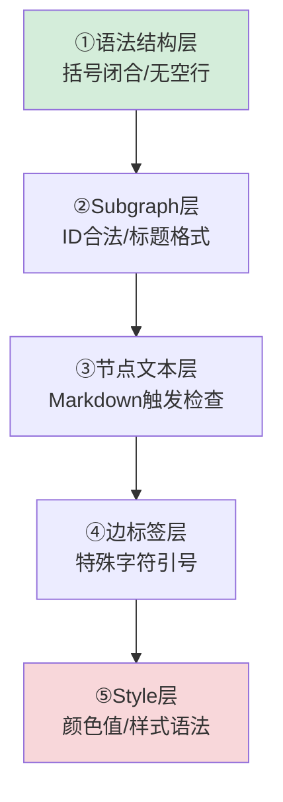
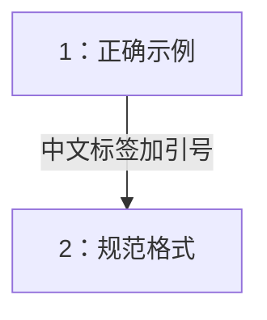

# Mermaid 安全编码七规则

## 模式概述

在 Markdown 文档中使用 Mermaid 图表时，遵循七条安全编码规则可系统性避免 95% 以上的渲染失败问题。该模式从多次渲染故障修复中萃取，覆盖空行、文本引号、列表触发、Subgraph 格式、边标签、代码示例围栏选择、产物双验证等核心陷阱，并已通过自动化检查脚本（check-mermaid.py）在全项目验证有效，且已集成至 CI 流水线。

## 成熟度

**L3（标准化+工具检查）** - 已满足以下条件：
- 在 SpecWeave 项目 653+ Markdown 文件上验证有效
- 已有自动化检查脚本 `.agents/scripts/check-mermaid.py`（覆盖空行、引号、列表触发、换行符等6类问题）
- 已有安全模板目录 `.agents/templates/mermaid-templates/`
- 待完成：CI 强制集成（L3→L4 跃迁条件）

## 核心规则

### 规则 1：禁止空行

Mermaid 代码块（```` ```mermaid ... ``` ````）内部**禁止使用任何空行**。空行会被部分渲染器（如飞书）解析为代码块结束，导致后续内容渲染失败。

**错误示例：**
```
flowchart LR
    A --> B

    B --> C
    style A fill:#ffcccc
```

**正确示例：**


**适用范围**：所有 Mermaid 图表类型（flowchart、sequenceDiagram、classDiagram、stateDiagram 等）。空行在 flowchart 中已确认导致解析中断，在其他图类型中行为未明，统一禁止最安全。

### 规则 2：文本引号原则

包含以下情况的节点标签、边标签、subgraph 标题，一律用双引号 `"..."` 包裹：

- 含中文字符
- 含特殊字符（`@`、`:`、`.`、`(`、`)`、`-`、空格等）
- 含英文短语（超过一个单词）

**必须加引号：**


**可以省略引号（纯英文单词/标识符）：**


> ⚠️ **重要区分**：双引号解决的是 Mermaid **语法层**解析问题（告诉解析器这是一个完整文本），但引号内的文本仍会被 Mermaid 内置的 Markdown 渲染器处理。
>
> **两阶段解析模型**：Mermaid 文本解析分两阶段独立运作——①语法解析阶段：引号帮助识别节点/标签边界；②Markdown渲染阶段：引号无穿透效果，内部文本照常进行 Markdown 解析（列表、加粗、链接等）。因此加引号不能阻止列表触发，必须从内容层面消除触发模式。

### 规则 2b：避免 Markdown 列表触发

节点文本中避免使用以下 Markdown 列表触发模式，即使已用双引号包裹也会触发解析：

| 禁止模式 | 错误示例 | 正确写法 |
|---------|---------|---------|
| 数字+英文句点+空格 | `A["1. 启动协议"]` | `A["1：启动协议"]`（中文冒号） |
| 短横线+空格（无序列表） | `A["- 项目A"]` | `A["-项目A"]` 或 `A["·项目A"]` |
| 星号+空格（无序列表） | `A["* 注意"]` | `A["*注意"]` 或 `A["⚠ 注意"]` |

**正确示例：**


**根本原则**：Mermaid 节点文本中不要使用 Markdown 列表语法。需要编号时使用中文冒号（`1：`）、全角句点（`1．`）、圈号数字（`①`）等不触发列表的格式。

### 规则 2c：节点换行使用 `<br/>`

Mermaid 节点文本内的换行**统一使用 HTML 的 `<br/>` 标签**，禁止使用 `\n` 转义字符。

**为什么？** `\n` 在 flowchart/stateDiagram 节点中不会被解释为换行（部分渲染器显示为字面文本，部分压缩为单行）；虽然 `\n` 在 sequenceDiagram 的 Note 和消息文本中可以换行，但统一使用 `<br/>` 可以避免记忆上下文差异。

**错误示例：**
```
flowchart LR
    A["第一行\n第二行\n第三行"]
```

**正确示例：**




**记忆口诀**：Mermaid 中换行一律用 `<br/>`，不要用 `\n`。

### 规则 3：Subgraph 安全格式

Subgraph 必须使用英文 ID + 显式中文标题格式：

```
subgraph EN_ID ["中文标题"]
    ...
end
```

**格式要点：**
- **ID 必须为英文标识符**：字母开头，不含中文、全角字符、特殊符号（含全角冒号 `：`）
- **中文标题放在双引号内**：格式为 `["标题文本"]`
- **ID 与方括号之间有空格**，方括号与引号之间无空格
- **Subgraph 块之间禁止空行**（参见规则1）

**错误写法：**
```
subgraph 感知层
subgraph 角色：架构师
subgraph S1["感知层"]
```

**正确写法：**


### 规则 4：边标签格式

边标签统一使用 `-->|"标签"|目标` 格式，含中文/特殊字符的标签必须双引号包裹，纯英文标识符标签可省略引号。

**格式要点：**
- **含中文/特殊字符的标签**：双引号包裹，放在 `||` 内，如 `-->|"标签"|B`
- **纯英文标识符标签**：可省略引号，如 `-->|untagged|B`
- **标签与箭头之间无空格**：`-->|"标签"|` 是正确的，`--> |"标签"|` 是错误的
- **无边标签的箭头**：直接使用 `-->` 即可

**错误写法对照：**
| 错误写法 | 问题 | 正确写法 |
|---------|------|---------|
| `-->|数据|B` | 中文标签未加引号 | `-->|"数据"|B` |
| `-->|@role|B` | 特殊字符未加引号 | `-->|"@role"|B` |
| `--> |"标签"| B` | 箭头与标签间有空格 | `-->|"标签"|B` |

**正确示例：**


### 规则 5：分层排查验证法

Mermaid 渲染错误存在"分层屏蔽"效应——结构层错误会阻止解析器到达内容层，修复结构错误后内容层错误才会显现。修复时应按五层顺序逐层排查，并预期错误会"层层暴露"。



| 层级 | 检查内容 | 典型错误 |
|------|---------|---------|
| ①语法结构层 | 括号/引号/direction 闭合、有无空行 | 空行截断、括号不匹配 |
| ②Subgraph层 | ID 合法性、标题格式 | 中文裸ID、全角冒号在ID中 |
| ③节点文本层 | 是否触发 Markdown 解析 | `数字. `、`- ` 触发列表 |
| ④边标签层 | 特殊字符是否加引号 | `@role`、中文标签无引号 |
| ⑤Style层 | 颜色值、样式语法 | 颜色名错误、fill格式错误 |

**心态要点**：不要因为修复后仍报错就认为方向错误，这是分层屏蔽效应——修复一个错误后暴露的是被屏蔽的旧错误，不是新引入的错误。继续逐层排查直到自动化工具报告 0 错误。

### 规则 6：代码示例围栏选择规则

在文档中展示 Mermaid 代码时，必须根据代码的完整性和正确性选择正确的围栏类型，**不是所有Mermaid代码都应该用```mermaid围栏**：

| 围栏类型 | 使用场景 | 判断标准 |
|---------|---------|---------|
| ` ```mermaid ` | **完整可渲染图表** | 代码是完整的、语法正确的Mermaid图表，应该被渲染器正常显示 |
| ` ``` `（普通围栏） | **代码片段/错误示例** | 代码是不完整的片段（含`...`省略）、错误示范、或仅用于展示语法，**不应该被渲染** |

**核心原则**：Mermaid解析器不知道你在"展示错误代码"——它看见` ```mermaid `就会尝试渲染。如果你写的代码本身包含错误（故意展示错误写法）或是不完整片段，必须使用普通代码块。

**错误示例（用mermaid围栏包裹错误代码）：**
````
在§2.2中，我们展示了问题代码：
```mermaid
flowchart TD
    A["这里用了数字.空格开头"] --> B["这里也用了数字.空格"]
    ...（省略后续代码）
```
````
> 结果：Mermaid会尝试渲染这段代码，`数字. `触发列表错误，`...`是无效语法→渲染失败。

**正确示例（错误示例用普通围栏，完整图表用mermaid围栏）：**
````
问题代码片段（不渲染）：
```
flowchart TD
    A["这里用了数字.空格开头"] --> B["这里也用了数字.空格"]
    ...（省略后续代码）
```

修复后的完整图表（可渲染）：

````

> 来源：retrospective-mermaid-list-fix-first-principles-20260710 复盘——在讲解Mermaid陷阱的文档中，连续4次因错误使用围栏类型（用mermaid围栏包裹错误示例/不完整片段）导致渲染失败。

### 规则 7：产物双验证规则

修复Bug或创建新文档后，运行自动化检查时**必须同时覆盖两类文件**，不能只验证被修复的文件：

| 验证范围 | 说明 | 常见盲区 |
|---------|------|---------|
| **修复目标文件** | 你正在修复的那个出问题的文件 | 通常不会遗漏 |
| **新建/修改的产物文件** | 修复过程中新创建的模式文件、复盘文档、README等 | **最容易遗漏！** |

**为什么？** 修复Bug时你的注意力集中在"修复对象"上，但修复过程中新建的文档（模式文件、复盘报告等）同样可能包含Mermaid错误——而且因为你专注于"解释陷阱"而非"避免陷阱"，在陷阱文档中犯同样错误的概率反而更高（参见[quoting-scope-limits.md](../../patterns/methodology-patterns/tools-automation/quoting-scope-limits.md)中的"陷阱讲解自犯效应"）。

**验证命令（推荐）：**
```powershell
# 修复后同时验证修复目标+产物所在目录
python .agents/scripts/check-mermaid.py --path <修复目标目录>
python .agents/scripts/check-mermaid.py --path <新创建文件所在目录>
python .agents/scripts/check-links.py --path <复盘/产物目录>
```

> 来源：retrospective-mermaid-list-fix-first-principles-20260710 复盘——修复原始Bug用时10分钟，但修复修复过程中新创建文件的4个Mermaid错误用时15分钟，原因就是只验证了修复目标文件，没有验证新创建的复盘文档和模式文件。

## 渲染器兼容性说明

不同 Markdown 渲染器对 Mermaid 的容错度不同。本地预览正常不能保证在所有渲染环境中正常。

| 平台 | Mermaid 版本 | 容错度 | 已知严格点 |
|------|-------------|--------|-----------|
| GitHub | 较新 | 宽松 | 一般问题都能渲染 |
| VS Code 预览 | 取决于插件 | 中等 | 空行可能不报错 |
| 飞书文档 | 定制版 | 严格 | 列表触发、空行零容忍 |
| GitLab | 较新 | 中等 | 部分语法有差异 |

**实践原则**：编写时就按照最严格渲染器的要求来，不要依赖容错；使用自动化脚本系统性扫描。

## 验证方法

### 自动化检查（推荐）

运行项目内置的 Mermaid 语法检查脚本：

```powershell
python .agents/scripts/check-mermaid.py
```

该脚本支持检测以下问题：
1. Mermaid 代码块内空行
2. Subgraph 中文裸 ID
3. 节点文本含列表触发模式（`数字. `、`- `、`* `）
4. 节点/边标签中文/特殊字符未加引号
5. 全角冒号在 Subgraph ID 中
6. 节点文本内使用 `\n` 换行（应使用 `<br/>`）
7. participant 别名含中文/空格未加引号（sequenceDiagram）
8. 迁移标签/状态描述含空格未加引号（stateDiagram）

支持 `--fix` 参数自动修复部分问题（空行、引号、`\n`→`<br/>`）。

> ⚠️ **注意**：check-mermaid.py 只检查` ```mermaid `围栏内的代码。如果你错误地将不完整片段/错误示例放在mermaid围栏中，脚本会检测到错误；但如果你应该使用mermaid围栏却误用了普通围栏（图表无法渲染），脚本无法检测——围栏选择是人工判断，参见规则6。

### 双验证原则

修复Bug或创建新文档后，必须对以下两类目录都运行检查：
```powershell
# 1. 验证修复目标（正在修复的文件所在目录）
python .agents/scripts/check-mermaid.py --path <修复目标目录>
# 2. 验证新产物（本次创建/修改的复盘/模式/文档所在目录）
python .agents/scripts/check-mermaid.py --path <产物目录>
python .agents/scripts/check-links.py --path <产物目录>
```

不要只验证被修复的文件——修复过程中新创建的文档同样需要验证。

### 分层环境验证

五层排查之外，建议按以下环境逐层验证：
1. **Mermaid Live Editor**：验证基本语法
2. **本地 Markdown 预览**：VS Code 等本地环境
3. **目标平台**：GitHub/GitLab/飞书等实际部署环境
4. **自动化脚本**：运行 `python .agents/scripts/check-mermaid.py`

## 相关资产

- **检查脚本**：`.agents/scripts/check-mermaid.py`
- **安全模板**：`.agents/templates/mermaid-templates/`（5种常用图表模板，内置安全格式）
- **开发规范**：`docs/development-standards.md`（Mermaid 编码规范章节）
- **陷阱速查表**：[mermaid-trap-cheatsheet.md](mermaid-trap-cheatsheet.md)
- **分层可视化模式**：[mermaid-layered-visualization.md](../methodology-patterns/document-architecture/mermaid-layered-visualization.md)
- **根因诊断模式**：[root-cause-diagnosis.md](../methodology-patterns/governance-strategy/root-cause-diagnosis.md)（分层错误屏蔽概念）

## 质量检查清单

编写 Mermaid 图表后，对照以下清单检查：

- [ ] 代码块内无任何空行
- [ ] 含中文/特殊字符/空格的节点文本已用双引号包裹
- [ ] 节点文本无「数字.空格」「- 空格」「* 空格」等列表触发模式
- [ ] 节点内换行统一使用 `<br/>`，未使用 `\n`
- [ ] Subgraph 使用 `ID ["标题"]` 格式，ID 为纯英文
- [ ] 边标签使用 `-->|"标签"|` 格式（中文/特殊字符加引号）
- [ ] participant 别名含中文/空格已加双引号（sequenceDiagram）
- [ ] Style 语句前无空行
- [ ] 代码示例使用正确围栏：完整可渲染图表用```mermaid，片段/错误示例用普通```
- [ ] 修复后双验证：已对修复目标文件**和**新创建的产物文件运行check-mermaid.py
- [ ] 运行 `check-mermaid.py` 无错误无警告

> 来源：Mermaid 渲染兼容性问题修复复盘（retrospective-mermaid-rendering-fix-20260626），Mermaid 渲染回归治理失效复盘（retrospective-mermaid-rendering-regression-20260629）补充规则2c换行符规范与自动化检查第6-8项；Mermaid列表触发错误第一性原理修复复盘（retrospective-mermaid-list-fix-first-principles-20260710）补充规则6（代码示例围栏选择）和规则7（产物双验证）。
