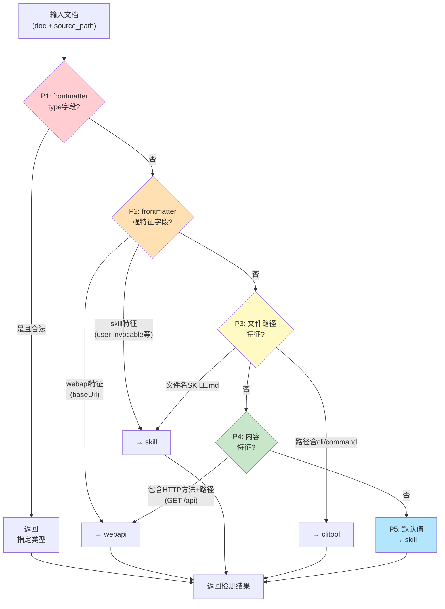

# Profile自动检测：多格式/多Schema工具的零配置类型识别

## 模式概述
支持多种文档类型/Profile的工具（如同时支持Web API/Skill/CLI三种格式的解析器），通过分层特征匹配策略自动检测输入文档的类型，用户不需要显式指定`--profile`参数。按"显式声明→强特征→弱特征→内容特征→默认值"的优先级顺序检测，兼顾准确性和零配置体验。

## 问题现象
多格式/多Schema工具设计时常见问题：
- 要求用户必须手动指定`--type`/`--profile`参数，使用门槛高，新手容易填错
- 自动检测逻辑单一（只看文件扩展名），经常误判
- 检测逻辑散落在代码各处if-else，新增类型需要修改多处
- 没有置信度概念，检测错误时无法提示用户确认
- 显式用户指定的类型和自动检测结果冲突时没有处理策略
- 文件名、frontmatter、内容特征等多个信号源没有优先级划分

## 解决方案

**核心思路**：设计分层的信号源优先级链，从高置信度到低置信度依次检测，命中即返回；用户显式声明具有最高优先级，默认值作为兜底。



**关键机制**：

1. **五级优先级信号源**：
   | 优先级 | 信号源 | 置信度 | 示例 |
   |--------|--------|--------|------|
   | P1 | frontmatter显式type字段 | 极高 | `type: webapi` |
   | P2 | frontmatter特征字段 | 高 | `baseUrl` → webapi, `user-invocable` → skill |
   | P3 | 文件路径/文件名 | 中 | `SKILL.md` → skill, 文件名含`cli` → clitool |
   | P4 | 内容特征正则 | 低 | 包含`GET /api/...` → webapi |
   | P5 | 默认值 | - | 返回最常用类型作为兜底 |

2. **显式声明优先原则**：
   如果用户在frontmatter中明确指定了`type: webapi`，直接使用，跳过所有后续检测——用户显式意图高于一切自动推断。

3. **特征字段集合设计**：
   ```python
   # 每个Profile定义自己的"强特征字段"
   skill_indicators = {"argument-hint", "user-invocable", "paths"}
   webapi_indicators = {"baseurl", "host", "schemes"}
   ```
   只检查frontmatter键名是否存在，不检查值，降低误判率。

4. **路径特征作为辅助信号**：
   - 文件名完全匹配（如`SKILL.md`大写）：高置信度
   - 路径段包含关键词（如`skills/`目录）：中置信度
   - 文件名包含关键词（如`xxx-cli.md`）：中低置信度

5. **内容特征最后检测**：
   遍历文档所有章节标题和内容，用正则匹配特定模式（如HTTP方法+路径），作为最后手段。内容检测成本较高（需要遍历全文），但在所有其他信号都缺失时能救命。

6. **新增Profile的扩展点**：
   新增类型只需：
   - 在`_PROFILE_MAP`中注册
   - 添加该类型的frontmatter特征字段集合
   - 添加该类型的文件名/路径特征
   - 添加该类型的内容正则（如需要）
   - 检测逻辑主流程不需要修改

## 适用场景

- 支持多种文档格式的解析器/编译器/代码生成器
- 约定优于配置（Convention over Configuration）设计的工具
- 零配置CLI工具，用户不想记命令行参数
- 文档类型可以从内容/文件名/元数据推断的场景
- 需要兼顾新手友好（零配置）和老手灵活（显式指定）的工具

## 实际案例

**MDI项目profiles/__init__.py的`detect_profile_type`函数**：

对MDI工具的3个验证案例自动检测全部正确：
- `examples/user-api.md`：包含`baseUrl` frontmatter字段 → webapi ✅
- `examples/todo-api.md`：内容中有`GET /todos`等HTTP方法+路径 → webapi ✅
- `examples/file-cli.md`：文件名包含"cli" → clitool ✅

**效果**：
- 用户不需要输入`--profile webapi`参数，直接`mdi validate user-api.md`即可工作
- 零配置体验降低使用门槛
- 支持显式指定`--profile`参数覆盖自动检测（满足高级用户需求）
- 3个验证案例全部检测正确，没有误判

## 反模式

1. **只看文件扩展名**：`.md`文件无法区分是API文档还是CLI文档，扩展名信号信息量太低
2. **没有优先级所有信号一起投票**：简单多数投票会导致弱信号推翻强信号（如内容里偶然出现"GET"单词就误判为webapi）
3. **用户显式指定还被自动检测覆盖**：用户说`--profile clitool`但工具检测到内容有GET就强行改成webapi，这是严重的体验问题
4. **检测逻辑散落在各处**：解析器里写一点、生成器里写一点、验证器里再写一点，新增类型时改不全
5. **没有默认值兜底**：所有特征都不匹配时直接报错，不给用户一个合理的默认体验
6. **检测结果不透明**：自动选了profile但不告诉用户选了哪个、为什么选，检测错误时用户无法排查
7. **新增Profile需要修改主检测逻辑**：违反开闭原则，每次加类型都要改if-else链，容易引入回归

## 与其他模式的关系

- 被**三层+Profile解析生成架构**使用：作为Parser/Validator之间的协调组件，在验证前确定使用哪个Profile规则集
- 与**能力矩阵**模式相关：Profile本质上是能力/规则集合的选择器
- 与**Directive参数状态机解析**配合使用：解析出通用结构后，再通过Profile检测选择特定的验证/生成规则

## 边界与选型

- 如果工具只支持一种格式/Profile，不需要自动检测，徒增复杂度
- 如果格式之间差异极大（如二进制格式vs文本格式），自动检测误判率高，应该要求用户显式指定
- 高风险场景（如生产部署配置）应该要求用户显式指定类型，不要依赖自动检测
- 如果检测准确率无法达到90%以上，不如不做——频繁误判比要求用户手动指定体验更差
- 自动检测是"便利功能"不是"必须功能"，始终应该提供显式指定的方式覆盖检测结果
- 可以考虑在检测结果置信度低时输出警告（如"未明确检测到类型，默认使用skill，可用--profile指定"）
