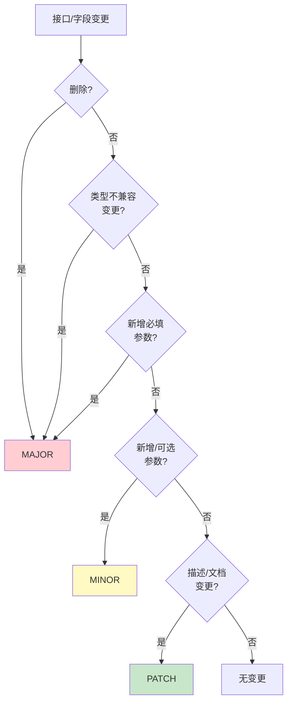

# 结构化文档Diff与语义化版本建议：接口定义变更管理模式

## 模式概述
对结构化文档（接口定义、配置文件、Schema）进行字段级diff，自动判断变更严重性（MAJOR/MINOR/PATCH），进行影响分析，建议语义化版本号升级。解决"文档/配置变更不知道影响多大、该升什么版本"的问题。

## 问题现象
接口文档/配置Schema变更时常见问题：
- 改了一个字段但不知道哪些下游代码受影响
- 版本号随意升级（一直1.0.0或乱升MAJOR）
- 代码审查时看不出变更的破坏性程度
- 不知道该通知哪些使用方、是否需要重新生成代码
- Changelog需要手动维护，容易遗漏破坏性变更

## 解决方案

**核心数据模型**：

```python
class ChangeType(Enum):
    ADDED = "added"
    REMOVED = "removed"
    MODIFIED = "modified"

class ChangeSeverity(Enum):
    MAJOR = "major"      # 破坏性变更，不兼容
    MINOR = "minor"      # 向后兼容新增功能
    PATCH = "patch"      # 向后兼容修复
```

**严重性判定规则**：



**实现步骤**：

1. **解析两份文档为强类型模型**（复用Parser层输出，不做文本diff）
2. **按主键匹配元素**：接口用(method, path)做key，字段/参数用name做key
3. **字段级对比**：对每个元素的每个属性（name/summary/type/required/description等）逐一比较
4. **严重性传播**：子元素（参数/响应/错误码）的严重性冒泡到父元素（接口），接口严重性冒泡到文档整体
5. **影响分析**：基于变更类型映射到下游产物影响（代码生成/类型定义/测试/Mock等）
6. **版本建议**：根据整体严重性建议版本升级（MAJOR+1.0.0 / +0.1.0 / +0.0.1）
7. **Changelog生成**：按类别输出结构化变更列表

**关键设计决策**：
- 不做文本行diff（diff工具已做），做语义diff（理解变更含义）
- 严重性由规则定义而非人工标注，确保一致性
- frontmatter/metadata变更单独处理（name字段删除是MAJOR，description变更是PATCH）
- 影响分析结果明确告诉用户"哪些东西需要重新生成/重新测试"

## 适用场景

- IDL（接口定义语言）文档变更管理（OpenAPI/MDI/AsyncAPI/Protobuf）
- 配置Schema版本管理
- 数据库Migration版本管理（类似思路）
- API网关路由配置变更审查
- 任何需要"字段级diff+版本建议"的结构化文档场景

## 实际案例

**MDI项目versioning.py**：
- 对比两个MDIDocument对象，检测：
  - frontmatter字段增删改（name删除=MAJOR，description修改=PATCH）
  - 接口增删改（接口新增=MINOR，接口删除=MAJOR，方法修改=MAJOR）
  - 参数增删改（必填参数新增=MAJOR，可选参数新增=MINOR，参数删除=MAJOR）
  - 响应增删改（状态码删除=MAJOR，状态码新增=MINOR）
  - 错误码增删改
- 影响分析覆盖8类下游产物：python_types/typescript_types/openapi_spec/mcp_schema/pytest_tests/jest_tests/cli_skeleton/markdown_docs
- 自动建议版本升级：current_version → suggested_version，附原因列表
- CLI `mdi diff old.md new.md --bump` 一键输出对比+版本建议

**效果**：
- 删除接口时自动标记"破坏性变更"，提醒重新生成所有下游产物
- 新增可选参数时建议MINOR版本升级，不需要修改现有调用方
- 描述文本修改建议PATCH版本，不影响功能

## 反模式

1. **做文本行diff而非语义diff**：行diff无法理解"这是参数删除"还是"参数换了个顺序"，产生大量假阳性
2. **新增必填参数标记为MINOR**：新增必填参数会导致现有调用方不传该参数就失败，必须是MAJOR
3. **严重性不冒泡**：参数级别的MAJOR没有传播到接口/文档级别，导致整体版本建议错误
4. **没有影响分析**：只告诉用户"变了"但不说"影响什么"，用户无法决策

## 与其他模式的关系

- 依赖**三层+Profile解析生成架构**的Parser层获取结构化模型
- 与**diff-driven-refactoring**互补：diff-driven-refactoring关注代码重构的diff驱动改进，本模式关注文档/schema的版本管理

## 边界与选型

- 非结构化纯文本文档（散文、笔记）不适用，语义diff无法理解自然语言变更含义
- 版本管理要求不严格的小项目/内部项目可能不需要，直接用git diff足够
- 二进制格式（Protobuf二进制）需要特定解析器，模式思想适用但实现不同
