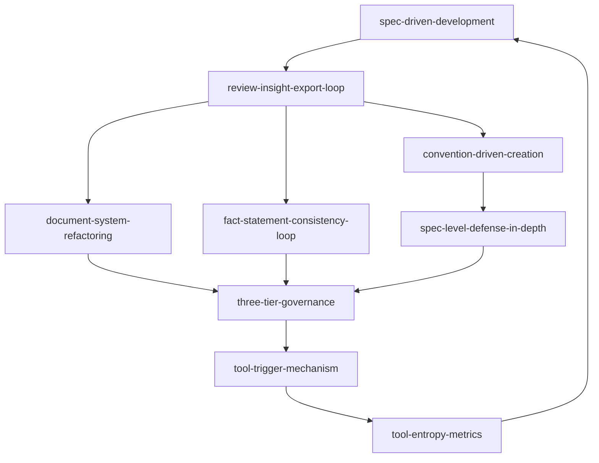

# 方法论模式

> 可复用的开发方法论与工作流程模式，每个模式描述一个经过验证的"如何做"指南。

## 模式列表

| 模式 | 说明 | 适用场景 |
|------|------|---------|
| [spec-driven-development.md](spec-driven-development.md) | Spec-driven 开发流程，"先设计后实施"的完整方法论 | 任何需要"先设计后实施"的 AI 辅助开发任务 |
| [review-insight-export-loop.md](review-insight-export-loop.md) | 复盘→洞察→导出知识闭环，含报告结构模板 | 项目复盘、经验萃取、知识沉淀 |
| [document-system-refactoring.md](document-system-refactoring.md) | 文档体系原子化重构方法论，含六步流程 | 大型文档拆分、模块化重组 |
| [tool-trigger-mechanism.md](tool-trigger-mechanism.md) | 工具开发触发器机制，3 次手动操作触发自动化评估 | 重复性操作的自动化决策 |
| [three-tier-governance.md](three-tier-governance.md) | 三层治理模型（原子化→自动化→验证），含实施检查清单 | 文档体系、代码库、配置管理的治理 |
| [tool-entropy-metrics.md](tool-entropy-metrics.md) | 工具熵减度量体系，含 ROI 公式与已实施工具的熵减分析 | 自动化投资决策、工具价值评估 |
| [fact-statement-consistency-loop.md](fact-statement-consistency-loop.md) | 事实表述一致性闭环，修正一处→搜索同类→统一修正 | 文档事实性修正、命名规范统一、术语一致性调整 |
| [convention-driven-creation.md](convention-driven-creation.md) | 约定驱动创建模型，先读范例提取模板再填充内容，零结构决策 | 成熟规范体系内的模块扩展 |
| [spec-level-defense-in-depth.md](spec-level-defense-in-depth.md) | 规范层纵深防御模型，权限定义+验证机制+防滥用+审计追溯四维防护 | 涉及特权操作的模块安全设计 |
| [content-migration-workflow.md](content-migration-workflow.md) | 文档内容迁移标准操作流程，存量盘点→缺口计算→富化归档→验证闭环 | 从综合性文档提取结构化内容迁移至独立规范文件 |
| [suggestion-priority-driven-execution.md](suggestion-priority-driven-execution.md) | 建议执行优先级驱动模型，高/中/低优先级分类 + 投入估算 + 状态追踪 | 复盘报告改进建议执行 |
| [report-as-tracking.md](report-as-tracking.md) | 报告即追踪载体，每执行一个建议后立即更新报告状态形成闭环 | 所有复盘报告的改进建议章节 |

## 成熟度定义

| 等级 | 定义 | 验证条件 |
|------|------|---------|
| L1 实验性 | 仅 1 次成功案例，待更多验证 | 验证次数 = 1 |
| L2 已验证 | ≥ 2 次成功案例，模式稳定 | 验证次数 ≥ 2 |
| L3 可复用 | 已被其他任务复用，有文档化示例 | 复用次数 ≥ 1 |

> 详细评估标准见 [patterns/README.md](../README.md#模式成熟度评估标准)。

## 模式关系

**演进路径**：从"如何开发"（spec-driven）→"如何复盘"（review-loop）→"如何重构"（document-refactoring）→"如何治理"（three-tier）→"何时自动化"（tool-trigger）→"如何度量"（tool-entropy），形成完整的**开发→复盘→优化→治理→自动化→度量**闭环。`fact-statement-consistency-loop` 是 `review-insight-export-loop` 在文档修正场景的具体应用，其验证阶段可纳入 `three-tier-governance` 的验证层。`convention-driven-creation` 是 `spec-driven-development` 在高成熟度体系下的简化路径（范例即规格），`spec-level-defense-in-depth` 为涉及特权操作的模块提供安全设计蓝图，其验证维度可纳入 `three-tier-governance` 的验证层。

## 使用指南

1. **首次使用**：从 `spec-driven-development.md` 开始，它是所有模式的基础。
2. **项目复盘**：参考 `review-insight-export-loop.md` 的结构模板。
3. **文档优化**：遇到大型文档需要拆分时，使用 `document-system-refactoring.md` 和 `three-tier-governance.md`。
4. **工具决策**：不确定是否值得自动化时，参考 `tool-trigger-mechanism.md` 和 `tool-entropy-metrics.md`。
5. **文档修正**：修正文档中的事实表述时，使用 `fact-statement-consistency-loop.md` 确保全局一致性。
6. **模块扩展**：在成熟规范体系内创建新模块时，使用 `convention-driven-creation.md` 实现零结构决策。
7. **安全设计**：涉及特权操作的模块，使用 `spec-level-defense-in-depth.md` 设计四维防护。

> **关联模块**：
> - `../code-patterns/` — 代码模式
> - `../architecture-patterns/` — 架构模式
> - `../../frameworks/` — 决策框架
> - `../../concepts/` — 知识概念