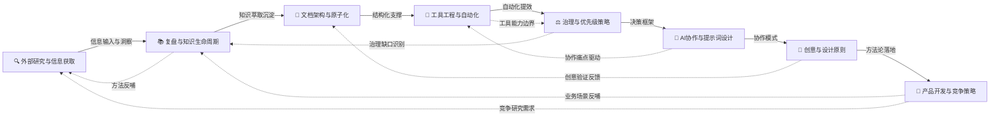

# 方法论模式

> 可复用的开发方法论与工作流程模式，每个模式描述一个经过验证的"如何做"指南。

## 主题导航

按核心主题思想分类，共8个主题类别，便于按场景快速定位相关模式：

| 主题目录 | 中文名称 | 模式数 | 核心描述 | 详细列表 |
|---------|---------|-------|---------|---------|
| retrospective-knowledge | 复盘与知识生命周期 | 32 | 项目复盘、知识萃取、洞察沉淀、经验迁移、知识沉淀工作流SOP | [查看](CATEGORIES.md#retrospective-knowledge--复盘与知识生命周期) |
| research-knowledge | 外部研究与知识融合 | 3 | 外部网站分析、Vendor仓库高层文档优先研究、跨Vendor知识融合、信息源分层兜底、访问障碍应对、多源验证 | [查看](CATEGORIES.md#research-knowledge--外部研究与知识融合) |
| document-architecture | 文档架构与原子化 | 38 | 文档重构、原子化拆分、文档治理、结构设计、教程认知阶梯、内容加工漏斗、双向导航、多产品对比学习 | [查看](CATEGORIES.md#document-architecture--文档架构与原子化) |
| tools-automation | 工具工程与自动化 | 28 | 工具决策、自动化、工具链、安全修改、工具故障降级、共享库引力、度量画像、网页提取工具选择 | [查看](CATEGORIES.md#tools-automation--工具工程与自动化) |
| governance-strategy | 治理与优先级策略 | 58 | 治理模型、优先级决策、问题解决、流程规范、提交质量门、元复盘闭环、渐进式工具提取 | [查看](CATEGORIES.md#governance-strategy--治理与优先级策略) |
| ai-collaboration | AI协作与提示词设计 | 35 | AI Skill设计、提示词工程、人机协作、子代理Git三不准规范、团队共享AI同事、主动介入Agent、安全信任设计、源码锚点二次校验、契约文档协调中枢、模块级agents扩展、references渐进式披露、Gotchas领域特化、Skill渐进式披露封装、视觉操作闭环、Skill标准化流程 | [查看](CATEGORIES.md#ai-collaboration--ai协作与提示词设计) |
| creative-design | 创意与设计原则 | 7 | 视觉设计、认知锚点、角色设计、创造力 | [查看](CATEGORIES.md#creative-design--创意与设计原则) |
| product-growth | 产品开发与竞争策略 | 22 | 产品Spec、增长、赛事、定位、交付、硬件产品设计、双产品矩阵 | [查看](CATEGORIES.md#product-growth--产品开发与竞争策略) |

## 快速访问：多阶段 Sub-agent 协作模式集

> 以下三个模式共同构成多阶段 sub-agent 协作的完整质量传递体系，源自 scikit-build-core Wiki 教程创建任务（2026-07-05）的复盘洞察萃取。

| 模式 | 成熟度 | 作用 |
|------|--------|------|
| [spec-driven-batch-doc-generation](ai-collaboration/spec-driven-batch-doc-generation.md) | L2 升级 | 整体工作流：Spec 驱动 + 知识库驱动 + 研究-契约-编写三阶段 |
| [navigation-hub-filename-contract](ai-collaboration/navigation-hub-filename-contract.md) | L2 升级 | 文件名契约传递：导航枢纽文件全局清单 + 契约文档协调中枢 |
| [source-anchor-verification-protocol](ai-collaboration/source-anchor-verification-protocol.md) | L1 新建 | 行号契约传递：研究阶段标注校验状态，编写阶段按状态决策 |

**协同关系**：`spec-driven-batch-doc-generation` 定义整体工作流 → `navigation-hub-filename-contract` 解决文件名契约传递 → `source-anchor-verification-protocol` 解决行号契约传递，三者共同覆盖多阶段 sub-agent 协作中的"结构一致性"与"内容准确度"两大质量维度。

## 成熟度定义

| 等级 | 定义 | 验证条件 |
|------|------|---------|
| L1 实验性 | 仅 1 次成功案例，待更多验证 | 验证次数 = 1 |
| L2 已验证 | ≥ 2 次成功案例，模式稳定 | 验证次数 ≥ 2 |
| L3 可复用 | 已被其他任务复用，有文档化示例 | 复用次数 ≥ 1 |

> 详细评估标准见 [patterns/README.md](../README.md#模式成熟度评估标准)。

## 主题关系图

方法论体系按线性递进关系组织，前序主题为后序主题提供基础支撑，同时各主题通过复盘反哺上游：

**说明**：线性主链路为「外部研究 → 复盘知识 → 文档治理 → 工具自动化 → 治理策略 → AI协作 → 创意设计 → 产品增长」，代表方法论从信息获取、知识沉淀到业务落地的完整正向演进。虚线为反哺回路：产品实践产生的新经验回流到复盘环节，竞争分析需求回流到外部研究，设计验证发现的问题回流到文档治理，以此形成持续优化的闭环。

## 使用指南

1. **首次使用**：从 [creative-design/spec-driven-development.md](creative-design/spec-driven-development.md) 开始，它是所有模式的基础。
2. **项目复盘**：参考 [retrospective-knowledge/review-insight-export-loop.md](retrospective-knowledge/review-insight-export-loop.md) 的结构模板。
3. **完整知识沉淀**：从复盘到提交的全流程，使用 [retrospective-knowledge/knowledge-sedimentation-workflow-sop.md](retrospective-knowledge/knowledge-sedimentation-workflow-sop.md) 增强版五步法SOP。
4. **文档优化**：遇到大型文档需要拆分时，使用 [document-architecture/document-system-refactoring.md](document-architecture/document-system-refactoring.md) 和 [governance-strategy/three-tier-governance.md](governance-strategy/three-tier-governance.md)。
5. **工具决策**：不确定是否值得自动化时，参考 [tools-automation/tool-automation-decision-model.md](tools-automation/tool-automation-decision-model.md)。
6. **文档修正**：修正文档中的事实表述时，使用 [document-architecture/fact-statement-consistency-loop.md](document-architecture/fact-statement-consistency-loop.md) 确保全局一致性。
7. **模块扩展**：在成熟规范体系内创建新模块时，使用 [governance-strategy/convention-driven-creation.md](governance-strategy/convention-driven-creation.md) 实现零结构决策。
8. **安全设计**：涉及特权操作的模块，使用 [governance-strategy/spec-level-defense-in-depth.md](governance-strategy/spec-level-defense-in-depth.md) 设计四维防护。
9. **Git提交卫生**：所有代码/文档提交前，使用 [governance-strategy/commit-quality-gate-staging-inspection.md](governance-strategy/commit-quality-gate-staging-inspection.md) 暂存区卫生五步法。
10. **子代理协作**：调用子代理创建/修改文件时，使用 [ai-collaboration/subagent-git-three-prohibitions.md](ai-collaboration/subagent-git-three-prohibitions.md) 子代理"三不准"规范。
11. **赛事运营**：设计产品驱动赛事时，使用 [product-growth/contest-growth-flywheel.md](product-growth/contest-growth-flywheel.md) 和 [product-growth/contest-funnel-aperture.md](product-growth/contest-funnel-aperture.md)。
12. **UGC 传播**：需要撬动用户传播时，使用 [product-growth/controlled-uncontrollable-ugc-rules.md](product-growth/controlled-uncontrollable-ugc-rules.md)。
13. **增长设计**：评估转化节点摩擦时，使用 [creative-design/intentional-friction-design.md](creative-design/intentional-friction-design.md)。
14. **改进价值论证**：需要说服团队投入资源做系统性改进时，使用 [retrospective-knowledge/counterfactual-debt-analysis.md](retrospective-knowledge/counterfactual-debt-analysis.md) 推演不做的复利代价。
15. **模式萃取质量**：评估洞察是否值得归档为全局模式时，使用 [retrospective-knowledge/experience-transfer-mapping.md](retrospective-knowledge/experience-transfer-mapping.md) 做跨领域迁移映射验证通用性。
16. **批量文档治理**：需要将新方法论/模板批量推广到≥5个对象时，使用 [governance-strategy/phased-rollout-validation.md](governance-strategy/phased-rollout-validation.md) 三阶段渐进验证。
17. **原子化前置分类**：批量原子化前，使用 [document-architecture/classification-disposition-decision-tree.md](document-architecture/classification-disposition-decision-tree.md) 四类决策树避免过度拆分和重复工作。

> **关联模块**：
> - `../../code-patterns/` — 代码模式
> - `../../architecture-patterns/` — 架构模式
> - `../../../frameworks/` — 决策框架
> - `../../../concepts/` — 知识概念
