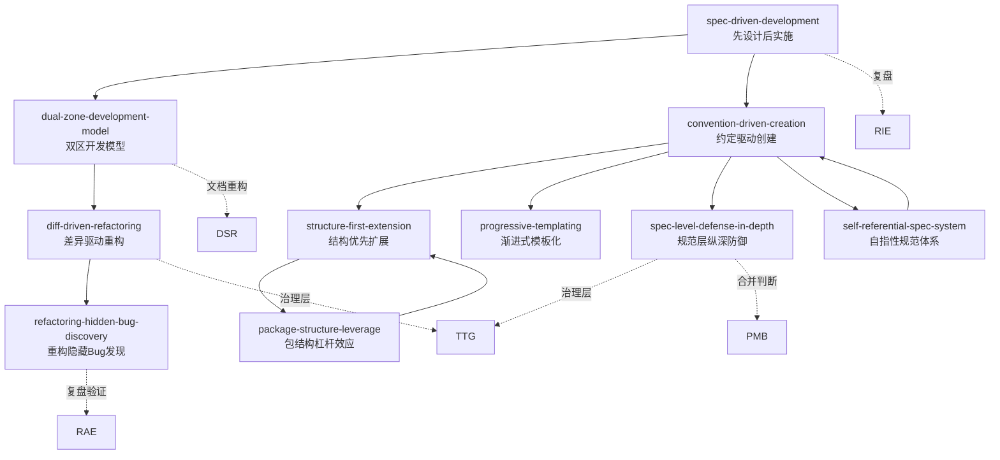
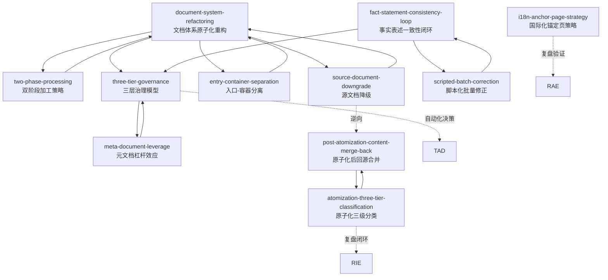
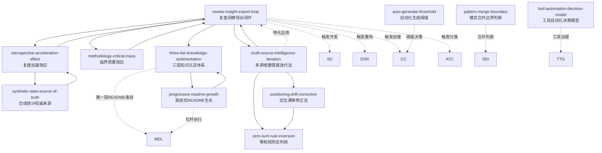
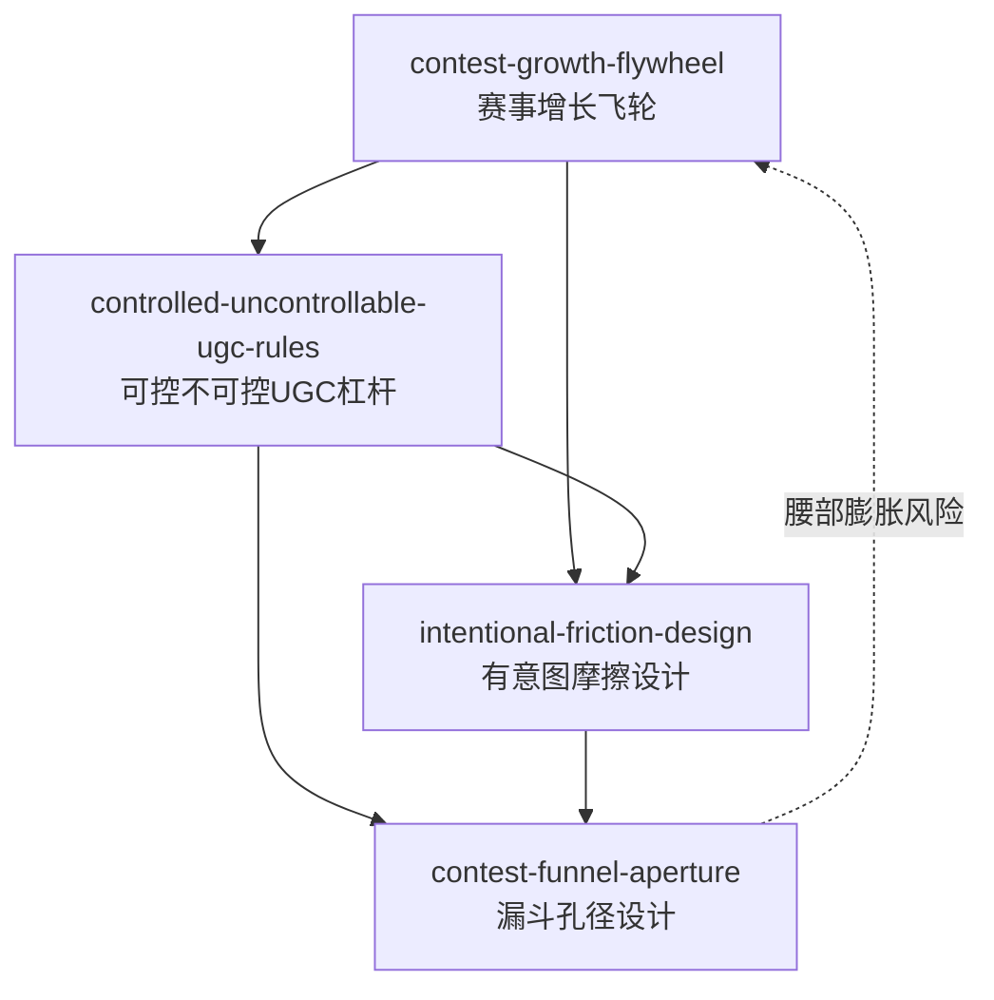
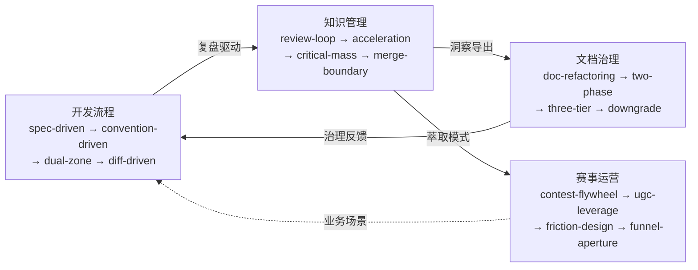

# 方法论模式

> 可复用的开发方法论与工作流程模式，每个模式描述一个经过验证的"如何做"指南。

## 模式列表

| 模式 | 说明 | 成熟度 | 适用场景 |
|------|------|--------|---------|
| [spec-driven-development.md](spec-driven-development.md) | Spec-driven 开发流程，"先设计后实施"的完整方法论 | L3 | 任何需要"先设计后实施"的 AI 辅助开发任务 |
| [review-insight-export-loop.md](review-insight-export-loop.md) | 复盘→洞察→导出知识闭环，含报告结构模板 | L2 | 项目复盘、经验萃取、知识沉淀 |
| [document-system-refactoring.md](document-system-refactoring.md) | 文档体系原子化重构方法论，含六步流程 | L2 | 大型文档拆分、模块化重组 |
| [contest-growth-flywheel.md](contest-growth-flywheel.md) | 赛事增长飞轮模型，将参赛步骤映射为产品增长触点 | L1 | AI 产品冷启动、工具型用户增长 |
| [controlled-uncontrollable-ugc-rules.md](controlled-uncontrollable-ugc-rules.md) | 「可控的不可控」UGC 传播杠杆，精细化规则引导用户自主传播 | L1 | 社交媒体 UGC 传播、品牌活动 |
| [intentional-friction-design.md](intentional-friction-design.md) | 「有意图的摩擦」设计原则，区分战略转化节点与无意义障碍 | L1 | 增长设计转化节点评估 |
| [contest-funnel-aperture.md](contest-funnel-aperture.md) | 赛事漏斗孔径设计，每层最优「筛孔径」与衔接原则 | L1 | 赛事运营、评审流程设计 |
| [tool-automation-decision-model.md](tool-automation-decision-model.md) | 工具自动化决策模型：3 次手动触发评估 + 成本公式 + ROI 度量 + 熵分类体系 | L2 | 重复性操作的自动化决策与工具价值评估 |
| [three-tier-governance.md](three-tier-governance.md) | 三层治理模型（原子化→自动化→验证），含实施检查清单 | L2 | 文档体系、代码库、配置管理的治理 |
| [fact-statement-consistency-loop.md](fact-statement-consistency-loop.md) | 事实表述一致性闭环，修正一处→搜索同类→统一修正 | L2 | 文档事实性修正、命名规范统一、术语一致性调整 |
| [convention-driven-creation.md](convention-driven-creation.md) | 约定驱动创建模型，先读范例提取模板再填充内容，零结构决策 | L2 | 成熟规范体系内的模块扩展 |
| [spec-level-defense-in-depth.md](spec-level-defense-in-depth.md) | 规范层纵深防御模型，权限定义+验证机制+防滥用+审计追溯四维防护 | L1 | 涉及特权操作的模块安全设计 |
| [dual-zone-development-model.md](dual-zone-development-model.md) | 双区开发模型（非正式区→质量门禁→正式区） | L2 | 新实体的开发工作流规范 |
| [short-command-patterns.md](short-command-patterns.md) | 短指令模式库：登记已验证的 AI 协作快捷指令 | L2 | AI 人机协作指令优化 |
| [five-category-asset-coverage.md](five-category-asset-coverage.md) | 五类资产覆盖原则：概念/模式/脚本/报告/索引五类互补覆盖 | L2 | 知识产出质量控制 |
| [reference-as-trigger.md](reference-as-trigger.md) | 引用即触发协作模式：用户选中行号触发精确实施 | L2 | 复盘报告改进建议执行 |
| [content-migration-workflow.md](content-migration-workflow.md) | 文档内容迁移标准操作流程，存量盘点→缺口计算→富化归档→验证闭环 | L2 | 从综合性文档提取结构化内容迁移至独立规范文件 |
| [suggestion-priority-driven-execution.md](suggestion-priority-driven-execution.md) | 建议执行优先级驱动模型，高/中/低优先级分类 + 投入估算 + 状态追踪 | L2 | 复盘报告改进建议执行 |
| [report-as-tracking.md](report-as-tracking.md) | 报告即追踪载体，每执行一个建议后立即更新报告状态形成闭环 | L2 | 所有复盘报告的改进建议章节 |
| [structure-first-extension.md](structure-first-extension.md) | 结构阅读先行：扩展前先完整阅读包结构，同概念域追加、异概念域新建 | L2 | 已有模块的功能扩展决策 |
| [amphibious-positioning-model.md](amphibious-positioning-model.md) | 两栖定位模型：通过资产清单+泛化路径图+落地案例三支柱支撑双重定位 | L1 | 积累大量可复用资产的项目的定位升级 |
| [diff-driven-refactoring.md](diff-driven-refactoring.md) | 差异驱动重构：逐段对比→标注重复/相似/独有→分类提取→回归验证 | L1 | 两个及以上功能重叠文件的合并重构 |
| [progressive-templating.md](progressive-templating.md) | 渐进式模板化：硬编码验证→模板分离→多类型扩展三阶段 | L1 | 将硬编码内容转化为可复用模板 |
| [retrospective-acceleration-effect.md](retrospective-acceleration-effect.md) | 复盘加速效应：高频复盘→低延迟改进→知识转化率递增 | L1 | 长时间密集开发会话中的知识管理 |
| [two-phase-processing.md](two-phase-processing.md) | 双阶段加工策略：大型文档先横切（原子化）再纵切（模块化）的固定先后顺序 | L1 | >200 行文档的深度加工 |
| [auto-generate-threshold.md](auto-generate-threshold.md) | 自动化阈值判断：手动条目占比 30% 阈值 + 模式成熟度 validation_count≥2 自动升级规则 | L2 | 存在自动化工具与手工维护共存的项目；模式库需要批量成熟度扫描时 |
| [scripted-batch-correction.md](scripted-batch-correction.md) | 脚本化批量修正安全决策：根据旧名称出现模式（路径引用/代码标识符）选择脚本化或手动 | L1 | 跨多文件的批量重命名/内容替换 |
| [package-structure-leverage.md](package-structure-leverage.md) | 包结构杠杆效应：三层结构（定义层+导出层+兼容层）使新增功能成本从 O(n) 降至 O(1) | L1 | 代码包/模块结构设计与评估 |
| [refactoring-hidden-bug-discovery.md](refactoring-hidden-bug-discovery.md) | 重构中隐藏 Bug 发现：重构真实 ROI = 消除重复 + 隐藏问题发现 + 结构基础 | L1 | 代码重构的收益评估与规划 |
| [i18n-anchor-page-strategy.md](i18n-anchor-page-strategy.md) | 国际化锚定页策略：仅翻译核心索引表 + 路由指引，避免全量翻译的维护成本爆炸 | L1 | 项目文档国际化第一步的策略选择 |
| [atomization-three-tier-classification.md](atomization-three-tier-classification.md) | 原子化三级分类策略：新建模式/已有覆盖/原地保留三级判断，替代"每个发现都新建模式" | L1 | 复盘报告或综合性文档的原子化任务 |
| [post-atomization-content-merge-back.md](post-atomization-content-merge-back.md) | 原子化后内容回源合并：深度分析提取后源文档降级为概要+引用，模式文件为唯一权威来源 | L1 | 原子化完成后的源文档清理 |
| [self-referential-spec-system.md](self-referential-spec-system.md) | 自指性规范体系：规范定义自身，形成"规范即测试"效应——规范变更触发全景验证 | L1 | AI 智能体规范体系或自描述系统的设计评估 |
| [methodology-critical-mass.md](methodology-critical-mass.md) | 方法论临界质量效应：模式数突破 6 后从线性累积跃迁至组合爆炸，知识生产边际收益递增 | L1 | 方法论模式库的知识生产阶段评估与资源分配 |
| [meta-document-leverage.md](meta-document-leverage.md) | 元文档杠杆效应：元文档（README/导航/索引）的战略价值远超功能文档，决定读者留存率 | L1 | 项目文档体系资源分配的优先级决策 |
| [synthetic-stats-source-of-truth.md](synthetic-stats-source-of-truth.md) | 合成统计的权威数据来源：跨文件统计数据应从 metadata 全量重算，而非增量推算，避免偏差累积 | L1 | 跨多文件维护合成统计数据的体系 |
| [pattern-merge-boundary.md](pattern-merge-boundary.md) | 模式合并边界判断：三维重叠度（场景/机制/建议）>70% 合并，30-70% 独立判断，<30% 独立创建 | L1 | 原子化过程中两个洞察高度重叠时的合并决策 |
| [entry-container-separation.md](entry-container-separation.md) | 入口-容器分离原则：README（人类）最大精简、AGENTS（AI）路由级保留、.agents/ 全量承载 | L1 | 入口文件技术细节过载时的精简迁移 |
| [source-document-downgrade.md](source-document-downgrade.md) | 源文档降级模式：大型文档原子化后不删除源文档，降级为引用导航页 | L2 | 大型文档原子化拆分后的收尾处理 |
| [three-tier-knowledge-sedimentation.md](three-tier-knowledge-sedimentation.md) | 三层知识沉淀体系：洞察原文（第三层）→ 专题报告（第二层）→ README 条目（第一层）的递进式知识网络 | L1 | 完成概念深度分析后需将认知沉淀为不同深度的知识资产 |
| [progressive-readme-growth.md](progressive-readme-growth.md) | 渐进式 README 生长：每完成一轮知识产出即追加一行技术创新点，最低成本持续提升 README 价值密度 | L1 | README 已建立索引型表格，需要持续将新认知纳入入口文档 |
| [retrospective-four-step-method.md](retrospective-four-step-method.md) | 复盘四步法：回顾目标→还原事实→分析偏差→提炼经验，含四步产出物对照表与误区清单 | L1 | 任何需要结构化复盘的项目结项、阶段里程碑、关键事件 |
| [cognitive-anchor-visualization.md](cognitive-anchor-visualization.md) | 认知锚点可视化模式：将配图从装饰升级为认知传递，先识别锚点再选择其一可视化 | L2 | 技术文档配图、博客文章插图、教育内容可视化 |
| [character-driven-design-system.md](character-driven-design-system.md) | 角色驱动设计系统模式：功能性角色而非吉祥物，五条核心原则+五维自检框架 | L2 | AI Skill 角色设计、品牌 IP 化应用、教育类 AI 产品 |
| [visual-atomization-principle.md](visual-atomization-principle.md) | 视觉原子化原则：一张图一个认知锚点，跨领域同构验证文档与视觉原子化 | L2 | 技术文档配图、教育内容可视化、演示文稿概念图 |
| [constraint-driven-creativity.md](constraint-driven-creativity.md) | 约束驱动创造力模式：通过严格视觉约束聚焦核心信息，色彩功能分工体系 | L2 | AI 生成内容视觉规范、文档模板设计、UI/UX 设计系统 |
| [ai-skill-judgment-layer.md](ai-skill-judgment-layer.md) | AI Skill 判断层设计模式：工具负责生产，判断负责选择，三层能力模型 | L2 | AI Skill 产品化设计、差异化竞争定位、内容生成工具评估 |
| [skill-three-layer-value-model.md](skill-three-layer-value-model.md) | AI Skill 三层价值模型：能力层快速贬值，判断层和风格层是持续竞争优势 | L2 | AI Skill 价值评估、技术选型决策、团队能力建设规划 |
| [prove-usefulness-check.md](prove-usefulness-check.md) | 证明有用性自检模式：好的组件不可减去，去掉后系统功能受损才保留 | L2 | Skill 设计评估、角色必要性验证、文档架构精简、代码冗余清理 |
| [insight-iceberg-model.md](insight-iceberg-model.md) | 洞察冰山模型：现象层→模式层→原理层三层递进分析，含关键转折点与高质量洞察三特征 | L1 | 从多个项目复盘报告中萃取跨项目规律认知 |
| [extraction-four-layer-funnel.md](extraction-four-layer-funnel.md) | 萃取四层漏斗：去噪→结构化→标准化→可操作化，含"四可"质量标准 | L1 | 洞察→可复用知识条目的加工转化场景 |
| [export-four-channel-progressive.md](export-four-channel-progressive.md) | 导出四渠道递进：文档化→模板化→工具化→制度化，含渐进式策略与决策准则速查 | L1 | 知识资产的外化推广与影响力扩散 |
| [atomization-three-criteria-test.md](atomization-three-criteria-test.md) | 原子化三标准检验：单一职责/独立可测/命名聚合三准则互验 | L1 | 判定单元是否达到"原子级"粒度，避免过度/不足拆分 |
| [modularization-interface-design.md](modularization-interface-design.md) | 模块化接口设计四步法：边界→接口→耦合→版本，含七级耦合标尺与 30 秒准则 | L1 | 将原子单元组合为可维护、可扩展的模块 |
| [closed-loop-pdca-mapping.md](closed-loop-pdca-mapping.md) | 闭环PDCA映射：四步闭环与戴明环的映射，含双正反馈回路机制 | L1 | 在熟悉 PDCA 的团队中推广复盘-洞察-萃取-导出闭环 |
| [methodology-five-level-maturity.md](methodology-five-level-maturity.md) | 方法论五级成熟度：借鉴CMMI的五级评估框架，含跃迁路径与评估方法 | L1 | 评估方法论实施成熟度与对标行业最佳实践 |
| [multi-source-intelligence-iteration.md](multi-source-intelligence-iteration.md) | 多源增量情报迭代法：五子系统（缺口驱动采集/可信度分层/版本化原子迭代/洞察→策略→行动管道/结构性差异化）构成的多轮决策分析引擎 | L2 | 多源信息逐步释放的竞争分析、赛事准备、竞品调研、政策研判 |
| [positioning-drift-correction.md](positioning-drift-correction.md) | 定位漂移修正法：三阶段（识别→剥离→重构）修正产品定位中"借用外部标签"导致的品类窄化与时效风险 | L1 | 产品定位/品牌叙事/投资 pitch 中使用了平台方或赛事方术语的场景 |
| [zero-sum-rule-inversion.md](zero-sum-rule-inversion.md) | 零和规则反利用：将竞争场景中的限制性条款从障碍转换为策略聚焦器，在 Best Shot 模式下最大化先发优势的边际回报 | L1 | 赛事策略/招投标/资源分配等有明确限制性条款的竞争场景 |
| [search-replace-fragility.md](search-replace-fragility.md) | SearchReplace 并发脆弱性与大块替换策略：多轮 SearchReplace 可靠性指数级下降，大块替换用整体读写策略 | L1 | 涉及同一文件多处编辑的 AI 协作场景 |
| [path-discipline.md](path-discipline.md) | 高强度编辑中的路径与幂等性纪律：路径确认三步走+回滚备份规则，防止文件污染与不可恢复断裂 | L1 | 涉及多文件创建/编辑的高强度会话 |
| [insight-two-tier-structure.md](insight-two-tier-structure.md) | 洞察两档结构：基础档/完整档双轨写作，10-20%核心概念承担80%解释力（帕累托法则） | L2 | 洞察库建设、设计决策记录、产品原则库 |
| [rolling-retro-eight-steps.md](rolling-retro-eight-steps.md) | 滚动复盘八步：文档一致性的低成本保障机制，每轮15-30分钟维持多轮迭代一致性 | L3 | 多文件文档项目、AI协作项目、知识库长期维护 |
| [spec-nine-section-narrative.md](spec-nine-section-narrative.md) | Spec九节叙事弧：产品定义的完整Checklist（定位→功能→交互→内容→留存→合规→商业→技术→价值） | L2 | 产品Spec撰写、AI应用产品定义、文化/工具类产品 |
| [dual-audience-extraction-model.md](dual-audience-extraction-model.md) | 双受众萃取模型：一次投入产出两类资产——面向Agent的模板+面向人类的方法论，分开撰写效果更好 | L2 | 方法论沉淀、开源项目文档、知识库资产化 |
| [three-layer-delivery-pipeline.md](three-layer-delivery-pipeline.md) | 三层递进流水线：文档先行→原型验证→对外包装，严格顺序禁止颠倒，防止过度承诺 | L3 | 路演/参赛/产品发布、Demo制作、落地页/官网设计 |
| [document-entropy-three-strategies.md](document-entropy-three-strategies.md) | 文档声明熵增三策：人工同步字段过时是必然，推荐"移除变量+免责声明"零成本方案 | L3 | 所有文档项目、README统计字段、洞察库条数声明 |
| [insight-library-evolution.md](insight-library-evolution.md) | 洞察库演化规律：三阶段（描述期/展开期/系统期）、概念完备线信号、5个锚点洞察识别 | L2 | 洞察库建设、ADR系统、理解陌生项目文档体系 |

## 成熟度定义

| 等级 | 定义 | 验证条件 |
|------|------|---------|
| L1 实验性 | 仅 1 次成功案例，待更多验证 | 验证次数 = 1 |
| L2 已验证 | ≥ 2 次成功案例，模式稳定 | 验证次数 ≥ 2 |
| L3 可复用 | 已被其他任务复用，有文档化示例 | 复用次数 ≥ 1 |

> 详细评估标准见 [patterns/README.md](../README.md#模式成熟度评估标准)。

## 模式关系

> 方法论模式按领域分为以下三个关系图，分开展示以提升可读性。跨领域引用在图中以虚线标注。

### 开发流程关系图

**说明**：`spec-driven-development` 为开发流程的顶层入口，派生 `dual-zone-development-model`（双区开发）和 `convention-driven-creation`（约定驱动创建）。`convention-driven-creation` 在高成熟度体系下特化为四种具体场景：`structure-first-extension`（代码扩展）、`progressive-templating`（模板化）、`spec-level-defense-in-depth`（安全设计）、`self-referential-spec-system`（自指规范）。`package-structure-leverage` 为 `structure-first-extension` 提供量化理论支撑。`diff-driven-refactoring` 是开发流程在代码重构场景的类比应用，`refactoring-hidden-bug-discovery` 为其深化（回归验证暴露的往往是原代码潜伏的 Bug）。

### 文档治理关系图

**说明**：`document-system-refactoring` 是文档治理的核心引擎，派生 `two-phase-processing`（大型文档先横切再纵切）、`three-tier-governance`（原子化→自动化→验证）、`entry-container-separation`（入口文件按受众分配细节）、`source-document-downgrade`（拆分后降级为索引页）。`fact-statement-consistency-loop` 是文档修正场景的一致性保证，`scripted-batch-correction` 为其在批量重命名场景的特化。`meta-document-leverage` 解释"为什么优先重构索引而非正文"的理论依据。`atomization-three-tier-classification` 在原子化前增加已有覆盖判断，`post-atomization-content-merge-back` 为其后续步骤（创建模式后回源合并），`source-document-downgrade` 为其逆向操作（拆分完成后降级为导航页）。

### 知识管理关系图

**说明**：`review-insight-export-loop` 是知识管理的核心闭环（复盘→洞察→导出），派生 `retrospective-acceleration-effect`（高频复盘→低延迟改进→知识转化率递增）和 `methodology-critical-mass`（模式数突破 6 后从线性累积跃迁至组合爆炸），两者构成时间维度的微观/宏观互补。`multi-source-intelligence-iteration` 是该闭环在竞争分析场景的特化应用——将单次复盘升级为多源多轮的持续情报迭代。`three-tier-knowledge-sedimentation` 是"洞察→导出"环节的精化——将单次导出分解为三层（洞察原文/专题报告/README 条目），明确了每层的受众、深度和创建条件。`progressive-readme-growth` 承接第一层（README 条目），提供了以最低成本持续注册新认知的操作流程。`tool-automation-decision-model`（由 tool-trigger-mechanism 与 tool-entropy-metrics 合并）统一了触发条件判断 + ROI 度量 + 熵分类体系。`synthetic-stats-source-of-truth` 是 `fact-statement-consistency-loop` 在合成统计数据维护场景的应用。`auto-generate-threshold` 提供自动化与手工维护的量化决策标准（30% 阈值）。`pattern-merge-boundary` 基于三维重叠度为相似模式提供合并决策标准。

### 赛事运营关系图

### 全局演进路径

> 三领域通过 `review-insight-export-loop` 串联形成完整闭环：开发流程产出代码/文档 → 文档治理进行原子化与质量管控 → 知识管理复盘萃取为方法论模式 → 新方法论模式反哺开发流程。赛事运营模式作为知识管理的业务场景延伸，为产品增长与用户运营提供可直接复用的方法论。

## 使用指南

1. **首次使用**：从 `spec-driven-development.md` 开始，它是所有模式的基础。
2. **项目复盘**：参考 `review-insight-export-loop.md` 的结构模板。
3. **文档优化**：遇到大型文档需要拆分时，使用 `document-system-refactoring.md` 和 `three-tier-governance.md`。
4. **工具决策**：不确定是否值得自动化时，参考 `tool-automation-decision-model.md`。
5. **文档修正**：修正文档中的事实表述时，使用 `fact-statement-consistency-loop.md` 确保全局一致性。
6. **模块扩展**：在成熟规范体系内创建新模块时，使用 `convention-driven-creation.md` 实现零结构决策。
7. **安全设计**：涉及特权操作的模块，使用 `spec-level-defense-in-depth.md` 设计四维防护。
8. **赛事运营**：设计产品驱动赛事时，使用 `contest-growth-flywheel.md` 和 `contest-funnel-aperture.md`。
9. **UGC 传播**：需要撬动用户传播时，使用 `controlled-uncontrollable-ugc-rules.md`。
10. **增长设计**：评估转化节点摩擦时，使用 `intentional-friction-design.md`。

> **关联模块**：
> - `../code-patterns/` — 代码模式
> - `../architecture-patterns/` — 架构模式
> - `../../frameworks/` — 决策框架
> - `../../concepts/` — 知识概念