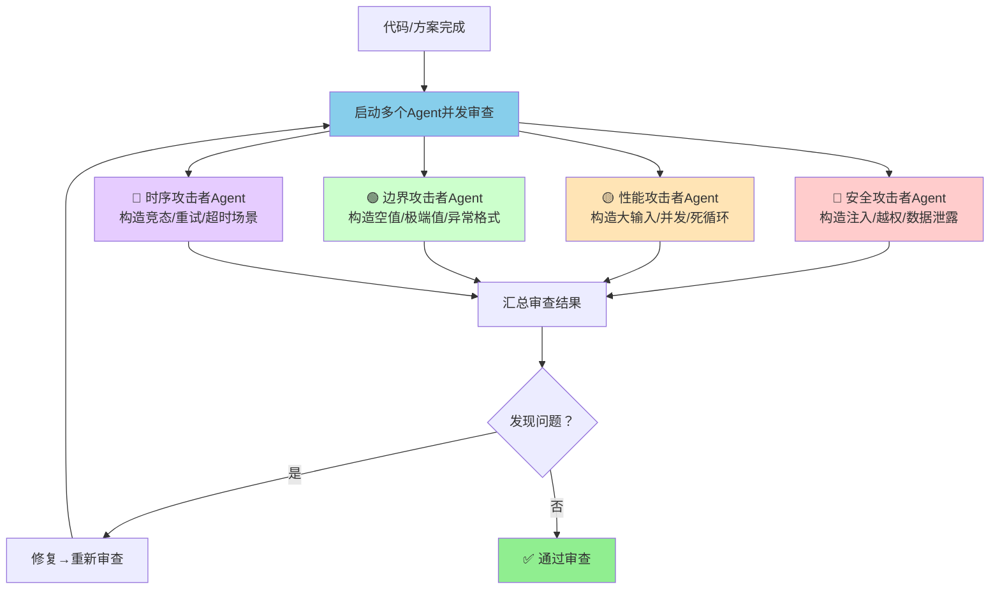
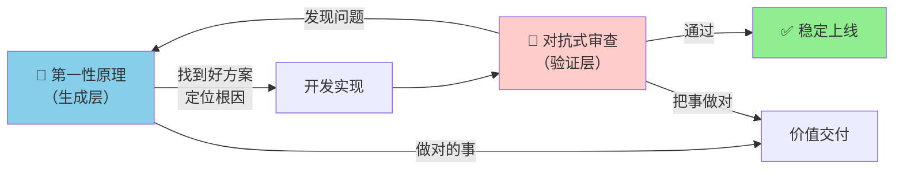

> **来源**：从卡兹克"Vibe Coding两大神级Prompt"文章提炼，经[vibe-coding-prompts-learning-analysis复盘](../../../reports/insight-extraction/external-learning/retrospective-vibe-coding-prompts-learning-analysis-20260704/insight-extraction.md#洞察2)系统化验证。文章作者卡兹克实战验证（AIHOT项目40个Agent并发审查，发现OOM死循环、未来时间污染、性能炸弹等关键BUG）。

# 对抗式审查 Prompt 模式（Adversarial Review Prompt Pattern）

## 模式类型
方法论模式（AI协作/提示词工程/质量保障）

## 成熟度
L2 已验证（2次验证来源：卡兹克AIHOT项目40-Agent实战审查 + Vibe Coding Prompt文章系统化分析）

## 适用场景

| 场景 | 适用度 | 说明 |
|------|--------|------|
| 代码审查/BUG狩猎 | ✅✅✅ 核心场景 | 多Agent从攻击者视角找边界BUG |
| 上线前质量门禁 | ✅✅✅ 核心场景 | 保证AI生成代码稳健上线 |
| 安全审计/渗透测试思路 | ✅✅ 强烈推荐 | 模拟恶意用户构造攻击输入 |
| 架构评审 | ✅✅ 推荐 | 从破坏性角度检验架构韧性 |
| 文档审查 | ✅✅ 推荐 | 找逻辑漏洞、事实错误、论证薄弱点 |
| 方案评审 | ✅ 推荐 | 质疑假设、找反例 |
| 简单脚本/一次性代码 | ⚠️ 不必使用 | 投入产出比低 |
| 创意写作/灵感发散 | ❌ 不适用 | 对抗思维会抑制创造力 |

## 问题背景

AI写代码的核心矛盾：
- **第一性原理**能帮AI找到好方案、定位根因，但**无法保证代码稳健上线**
- AI"自审"有根本性盲区——自己写的代码自己审，和人类一样有**确认偏差**（confirmation bias）
- 单Agent审查时，Agent倾向于"证明代码正确"而非"找出代码问题"
- 边界条件、异常输入、极端场景是AI自审最容易遗漏的地方

典型AI自审遗漏的BUG类型：
- OOM死循环：大输入触发内存爆掉→被杀→重试→再爆
- 时间污染：时区错误导致"未来时间"数据污染整条链路
- 性能炸弹：异常输入触发指数级计算
- 缓存穿透：异常数据导致探活机制假阳性
- 安全漏洞：未校验输入导致注入攻击

这些BUG的共同特征：**正常路径走不出来，只有站在"搞破坏"的角度才能发现。**

## 核心规则

### Prompt 标准形式

**Claude Code（Ultracode动态工作流）**：
```
开启 Ultracode(动态工作流,会有 N 个 Agent 进行并发)来对之前开发的功能进行对抗式审查
```

**Codex（多Agent模式）**：
```
开启多 Agent 帮我进行对抗性审查
```

**通用形式**：
```
从恶意用户/攻击者的角度，对以下代码/方案进行对抗式审查，找出所有可能的边界问题、安全漏洞和崩溃路径。
```

### 核心机制：多Agent并发 + 攻击者视角



### 四大攻击者角色定义

| 攻击者角色 | 攻击目标 | 典型攻击手法 | 典型发现 |
|-----------|---------|------------|---------|
| **安全攻击者** | 数据安全、权限控制 | SQL注入、XSS、越权访问、敏感数据泄露 | 未校验输入、权限绕过 |
| **性能攻击者** | 系统稳定性、资源消耗 | 大文件上传、并发请求、递归死循环、正则回溯 | OOM死循环、性能炸弹、DoS漏洞 |
| **边界攻击者** | 输入校验、异常处理 | 空值、超长字符串、特殊字符、未来/过去时间、格式错误 | 未来时间污染、空指针、类型错误 |
| **时序攻击者** | 并发安全、重试机制 | 竞态条件、重复提交、超时重试、部分失败 | 缓存穿透、数据不一致、重试风暴 |

### 对抗式审查 vs 单Agent自审对比

| 维度 | 单Agent自审 | 多Agent对抗式审查 |
|------|-----------|-----------------|
| 审查视角 | "证明代码正确" | "证明代码有问题" |
| 思维模式 | 防御性（检查有没有明显错误） | 进攻性（构造攻击来击穿系统） |
| 边界覆盖 | 常规边界 | 极端+恶意边界 |
| BUG发现率 | 低（确认偏差） | 高（攻击者无偏见） |
| 时间成本 | 低 | 中高（多Agent并发） |
| 适用阶段 | 开发中快速检查 | 上线前/定期全局审查 |

### 与第一性原理的闭环关系



- **第一性原理**：保证**做对的事**——方向正确、根因被真正定位
- **对抗式审查**：保证**把事做对**——实现稳健、边界被覆盖、能稳定上线
- 二者构成"生成-验证"完整闭环

## 实施步骤

### 步骤1：选择审查时机
- **功能完成后、上线前**：必须执行对抗式审查
- **定期全局审查**：每2-3周对整个项目做一次"从第一性原理出发的对抗式审查"
- **重大重构后**：重构影响范围大，必须审查
- **新模型上线后**：可用对抗式审查测试新模型能力，同时发现技术债

### 步骤2：定义审查范围
- 明确审查目标（特定功能/模块/整个项目）
- 明确审查维度（安全/性能/边界/时序，或全部）
- 提供代码上下文（仓库路径、相关文件、架构说明）

### 步骤3：启动多Agent对抗审查
- Claude Code：使用"开启Ultracode...进行对抗式审查"
- Codex：使用"开启多Agent帮我进行对抗性审查"
- 通用场景：明确要求Agent从攻击者视角构造异常输入

### 步骤4：收集并分类问题
- 按严重程度分类（P0崩溃/P1严重/P2一般/P3建议）
- 按问题类型分类（安全/性能/边界/时序）
- 每个问题附带：攻击路径、复现条件、影响范围

### 步骤5：修复并回归
- 修复发现的问题
- 对修复后的代码重新执行对抗式审查（回归验证）
- 直到所有P0/P1问题修复，P2问题评估后决定是否阻塞上线

### 步骤6：定期全局审查实践
- 周期：每2-3周
- 方式：让Agent从最底层原理出发，并发审查架构、依赖关系、代码质量、文档对应
- 附加价值：同时测试新模型能力，每次都能挑出之前没注意到的技术债和潜在风险

## 验证案例

### 案例1：AIHOT项目对抗式审查（40个Agent并发）
- **工具**：Claude Code Ultracode动态工作流
- **规模**：近40个Agent并发审查，跑了很久
- **发现的关键BUG**：
  1. **OOM死循环**：后台worker处理大任务时内存爆掉→被杀→自动重试→又爆→无限循环。对抗路径：恶意用户提交50MB HTML搞崩worker→从入口到崩溃全链路审查。后来真的看到过100MB的HTML
  2. **未来时间污染BUG**：某信源文章发布时间因时区错误显示为未来时间，排到精选信息流最前面，污染推送→RSS→日报整条链路。自审完全想不到，但攻击者视角会问"如果发布时间是未来怎么办？"
  3. **HTML清洗模块性能炸弹**：异常HTML触发性能问题
  4. **翻译模块同类隐患**：与HTML清洗类似的边界隐患
  5. **部署探活缓存穿透假阳性**：探活机制被异常数据干扰
- **效果**：作者称"自从用了对抗式审查，对自己代码和项目的信心变得很强"

### 案例2：全局定期审查（第一性原理+对抗式审查组合）
- **周期**：每2-3周
- **方式**："从第一性原理出发的对抗式审查"
- **覆盖**：架构、依赖关系、代码质量、文档对应
- **附加价值**：测试新模型能力 + 发现技术债 + 发现潜在风险
- **验证**：每次都能挑出之前没注意到的问题

## 在本项目（SpecWeave）中的应用场景

| 应用场景 | 具体用法 |
|---------|---------|
| 检查脚本审查 | 写完`.agents/scripts/`下的检查脚本后，从"绕过检查"角度对抗式审查 |
| 模式文件验证 | 新模式入库前，从"误用/滥用/边界情况"角度审查 |
| 规范制定审查 | 新规范制定后，从"恶意合规"（表面符合但实质违反）角度审查 |
| CI流水线安全 | 审查CI脚本是否有注入、权限泄露等安全问题 |
| 文档断链检测 | 从"各种断链场景"角度审查链接检查工具的覆盖率 |
| 定期全局审视 | 每2-3周对整个.agents/体系做一次对抗式审查 |

## 规则/匹配/分类/推荐系统的反例构造方法（2026-07-11自举验证补充）

> **来源**：2026-07-11 seven-concepts-trigger CLI工具元方法论自举验证实战
>
> **核心洞察**：正向测试只能验证"该匹配的都匹配了"，V反例测试能验证"不该匹配的不会乱匹配"——后者是正向测试覆盖不到的盲区，关键词匹配/规则引擎类功能天然存在"泛化过度"风险。

### 适用场景

✅ 必须使用反例构造的功能类型：
- 规则引擎（if-else分支判断）
- 关键词匹配/分类器
- 推荐系统/决策系统
- CI检查脚本/静态分析规则
- 任何有"默认匹配"或" fallback逻辑"的功能
- 输入校验/黑名单/白名单逻辑

❌ 不需要反例构造的场景：
- 纯数学计算（1+1=2，输出唯一确定）
- 确定性算法（排序、查找等有唯一正确答案）
- 已经由完备类型系统保证的场景（如TypeScript严格类型下的undefined检查）

### 反例构造五步法

**Step 1：识别"应该不通过"的场景**
先列出功能的"正向匹配场景"（正向测试覆盖的），然后反过来思考：
- 什么输入看起来"像"但实际上"不是"目标场景？（语义模糊边界）
- 什么输入完全无关，但可能触发关键词命中？（泛化过度）
- 什么输入是混合场景？（同时符合多个规则）
- 什么输入是空/极端/异常值？（边界值）

**Step 2：四类标准反例模板（至少选3类）**

| 反例类型 | 构造方法 | seven-concepts-trigger示例 | 预期结果 |
|---------|---------|---------------------------|---------|
| **🔴 完全无关输入** | 输入与领域完全无关的内容，验证不会误匹配 | "做个蛋糕"、"今天天气不错" | 返回"无匹配/低置信度"，而非推荐某个流程 |
| **🟡 模糊边界输入** | 输入"像"目标场景但本质不是，验证泛化边界 | "修个家具"（"修"触发Bug关键词，但不是软件开发） | 正确区分领域，不误判 |
| **🟢 混合场景输入** | 输入同时符合两个场景，验证组合推荐正确 | "重构并做复盘" | 正确返回A→V→C→R→I→E组合，而非单一场景 |
| **🔵 边界/异常输入** | 空输入、超长输入、特殊字符、噪声输入 | 空字符串、全是标点符号 | 优雅处理，不崩溃，合理提示 |

**Step 3：每个反例明确预期结果**
反例不是"随便输入点奇怪的东西"，每个反例必须有**明确的预期正确输出**：
- ✅ 正确预期："做个蛋糕"应该返回"无匹配/非开发任务"，置信度<30%
- ❌ 错误预期："输入奇怪的东西看看会不会崩溃"——不明确，无法判定通过/失败

**Step 4：反例数量指导**

| 功能影响等级 | 反例数量要求 |
|-------------|-------------|
| 高影响（核心流程、安全、数据一致性） | ≥3个反例，覆盖至少3类模板 |
| 中影响（工具功能、推荐、辅助决策） | ≥2个反例，覆盖至少2类模板 |
| 低影响（简单脚本、一次性工具） | ≥1个反例（无关输入） |

**Step 5：修复后正向回归**
修复反例发现的Bug后，**必须重跑所有正向测试**——防止修复边界case时破坏了正常匹配逻辑。

### 实战案例：seven-concepts-trigger反例构造

**正向测试**：16种典型场景，100%通过（"修复线上Bug"→W2问题解决流程）

**V反例测试发现问题**：
- 输入"做个蛋糕"：因为关键词列表中有"做个"（"做个功能"），被误识别为"新功能开发（默认）"，置信度40%
- 这是典型的**泛化过度**问题——正向测试完全覆盖不到

**修复方式**：从is_dev_related关键词列表中移除过于泛化的"做个"，替换为更具体的开发相关词（"重构"、"提交"、"commit"、"单元测试"等）

**修复后验证**：
- ✅ "做个蛋糕"正确返回"无匹配/非开发任务"，置信度20%
- ✅ 16个正向场景仍然100%通过——修复没有破坏正常功能

### 反模式补充：正向测试通过就上线

| 反模式 | 表现 | 后果 | 正确做法 |
|--------|------|------|---------|
| **正向测试通过就上线** | 只测"该匹配的都匹配"，不测"不该匹配的别乱匹配" | 边界case在用户现场触发，推荐错误结果，降低工具可信度 | 规则类功能必须做V反例测试，至少构造3个"应该不匹配"的反例 |
| **反例不设预期** | 随便输入点奇怪的东西，"没崩溃就算通过" | 反例测试走过场，发现不了逻辑Bug | 每个反例必须有明确的预期正确输出 |
| **修复反例后不回归** | 修复边界case后直接提交，不重跑正向测试 | 修复引入新Bug，正常场景被破坏 | 修复后必须重跑所有正向测试，确保正常功能不受影响 |
| **凑数反例** | 为了满足"≥2个反例"的要求，构造牵强的反例（如已被类型系统禁止的undefined输入） | 反例测试形式化，浪费时间，无实际价值 | 反例必须是真实可能发生的场景，而非理论上存在但实际不可能出现的情况 |

---

## 通用反模式

| 反模式 | 为什么错误 | 正确做法 |
|--------|----------|---------|
| 只用单Agent做"对抗式审查" | 单Agent无法真正并发多角度攻击，容易遗漏 | 必须多Agent并发，每个Agent扮演不同攻击者角色 |
| 对抗式审查替代第一性原理 | 对抗式审查找问题但不保证方向对，可能"正确地做错事" | 第一性原理+对抗式审查形成闭环 |
| 审查后不做回归验证 | 修复可能引入新问题 | 修复后必须重新执行对抗式审查 |
| 只在上线前做审查 | 问题发现越晚修复成本越高 | 开发过程中就做小范围对抗审查，上线前做全面审查 |
| 对抗审查只看代码不看架构 | 架构级问题比代码级问题影响更大 | 定期全局审查必须覆盖架构层面 |
| 规则类功能只做正向测试 | 正向测试覆盖不到"不该匹配的别乱匹配"的泛化过度问题 | 规则/匹配/分类/推荐类功能必须做V反例测试，构造≥3个"应该不通过"的反例 |

## 与其他模式的关系

| 关联模式 | 关系类型 | 关系说明 |
|---------|---------|---------|
| [first-principles-prompt-pattern.md](first-principles-prompt-pattern.md) | 互补闭环 | 第一性原理管"生成好方案"，对抗式审查管"验证方案稳健"，二者构成"生成-验证"闭环 |
| [tdd-static-analysis-five-test-suites.md](../tools-automation/tdd-static-analysis-five-test-suites.md) | 互补 | TDD五套测试是自动化验证，对抗式审查是AI驱动的智能验证，二者互补 |
| [dual-quality-gate-subagent.md](../governance-strategy/dual-quality-gate-subagent.md) | 思想同源 | 双质量门禁与对抗式审查共享"多重验证"的质量保障理念 |
| [triangular-source-verification.md](../retrospective-knowledge/triangular-source-verification.md) | 思想同源 | 三源验证和多Agent对抗审查都强调"多角度交叉验证" |
| [multi-agent-parallel-execution.md](../../architecture-patterns/multi-agent-parallel-execution.md) | 实现基础 | 多Agent并行执行是对抗式审查的技术基础 |

## Changelog

- 2026-07-11 | update | 补充「规则/匹配/分类/推荐系统反例构造五步法」，新增第三个验证案例（seven-concepts-trigger自举验证），validation_count 2→3
- 2026-07-08 | create | 初始版本，基于卡兹克文章和vibe-coding-prompts-learning-analysis复盘提炼，L2成熟度
