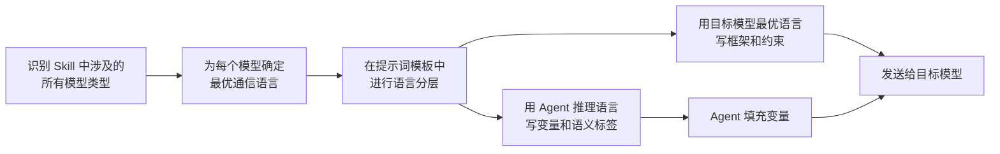

> **已原子化自**：[insight-extraction.md 洞察 5](../../../reports/competitive-analysis/retrospective-ian-xiaohei-source-analysis-20260625/insight-extraction.md) —— Ian Xiaohei Illustrations 仓库源码分析

# 双语提示词工程（Bilingual Prompt Engineering）

## 模式类型

方法论模式

## 成熟度

L2 已验证（Ian Xiaohei Illustrations 完整实践验证）

## 适用场景

Skill 内部涉及跨模型调用（如 Agent 调用图像生成模型、Agent 调用代码执行环境）时，需要为不同目标模型的提示词选择最优语言。

## 问题背景

在 AI 工程中，一个 Skill 往往需要跨多个模型进行通信：

- **推理模型**（如 Claude、GPT）：理解用户意图、分解任务、做决策
- **执行模型**（如图像生成模型、代码模型）：接收指令、产出具体结果

不同模型对不同语言的理解能力是不同的：
- 推理模型在中文推理任务上表现良好
- 图像生成模型在英文 prompt 上的质量显著优于中文
- 代码模型对英文技术术语的识别准确率更高

如果为所有模型使用统一语言（如全中文或全英文），至少有一方会因语言不匹配而损失性能。解决方案是：在提示词模板中进行**语言分层**——用 Agent 推理语言写变量和语义标签，用目标模型的最优语言写执行指令。

## 核心规则

### 规则 1：识别每个下游模型的最优语言

| 模型类型 | 最优语言 | 原因 |
|---------|---------|------|
| 推理/对话模型 | Agent 的推理语言 | 语义理解更准确 |
| 图像生成模型 | 英文 | 训练数据以英文为主，概念映射更精确 |
| 代码生成模型 | 英文 | 编程术语的英文表示更标准 |
| 翻译模型 | 目标语言 | 自然的翻译方向 |

### 规则 2：在提示词模板中做语言分层

提示词模板应包含两种语言的元素，各司其职：

| 语言 | 用途 | 位置 |
|------|------|------|
| Agent 推理语言 | 变量占位符、语义标签 | `{花括号内}` |
| 目标模型最优语言 | 提示词框架、约束条件、执行指令 | 模板主体 |

### 规则 3：变量占位符使用语义化命名

变量名应让 Agent 理解「这个位置应该填什么概念」，而非简单的 `{var1}`、`{var2}`：

```text
✅ {正文配图主题}  →  Agent 理解：这里填文章核心主题
✅ {结构类型}      →  Agent 理解：这里填构图类型
❌ {input1}        →  Agent 不理解这是什么
```

### 规则 4：约束条件使用目标模型的最优语言

图像模型的约束条件用英文书写（因为图像模型对英文的理解更精确），但语义标签留给 Agent 用中文填充：

```text
Theme:
{正文配图主题}           ← 中文变量，Agent 理解

Structure type:
{结构类型}               ← 中文变量，Agent 理解

Constraints:
One image explains only one core structure.   ← 英文约束，图像模型理解
Keep the main subject around 40%-60% of the canvas.
```

## 操作流程



## 实施检查清单

- [ ] 是否识别了 Skill 中涉及的所有模型类型？
- [ ] 是否为每个模型确定了最优通信语言？
- [ ] 变量占位符是否使用语义化命名？
- [ ] 约束条件是否使用了目标模型的最优语言？
- [ ] 两种语言是否各司其职、互不干扰？

## 反例警示

| 错误做法 | 后果 |
|---------|------|
| 全部使用中文 prompt 发送给图像模型 | 图像模型的英文训练数据无法最优映射，生成质量下降 |
| 全部使用英文 prompt（包括变量名） | Agent 对英文变量的语义理解可能不精确 |
| 变量名使用无意义编号 | Agent 无法判断变量含义，填充错误率上升 |
| 在中英文之间频繁切换（同一句内混用） | 两种模型都困惑，解析错误率上升 |

## 正例

Ian Xiaohei Skill 的 prompt-template.md：

```text
Theme:
{正文配图主题}                    ← 中文变量：Agent 用中文理解

Structure type:
{结构类型}                        ← 中文变量：Agent 用中文理解

Constraints:
One image explains only one core structure.  ← 英文约束：图像模型最优理解
Chinese handwritten labels:
{标注词1} / {标注词2} / {标注词3}    ← 中文变量 + 英文框架
```

## 与现有模式的关系

- `programmable-creativity-algorithm.md`：本模式关注「用什么语言写提示词」，该模式关注「提示词中写什么内容」。两者共同构成 AI Skill 的提示词工程体系。

> **关联模块**：
> - `programmable-creativity-algorithm.md`
