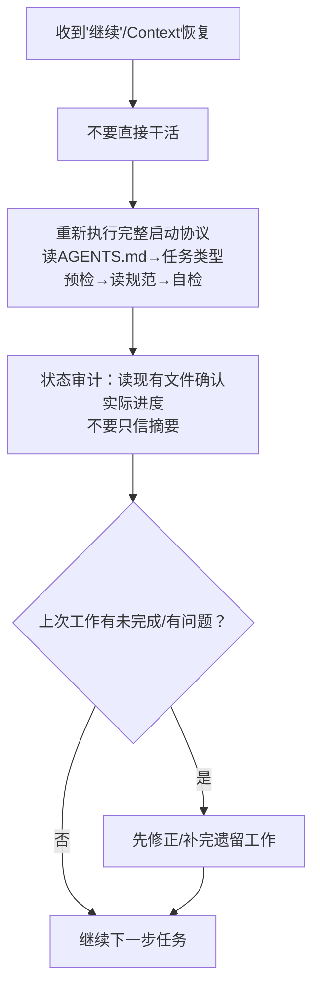

+++
id = "pattern-context-recovery-protocol"
domain = "methodology"
layer = "methodology"
maturity = "L1"
validation_count = 1
reuse_count = 0
documentation_level = "standard"
source = "docs/retrospective/reports/project-governance/tools-and-automation/retrospective-forum-posting-skill-optimization-20260629/export-suggestions.md#经验教训8和14"

[bindings]
rules = []
references = ["availability-heuristic-structural-guard.md", "nonlinear-correction-cost.md", "process-vs-experience-intuition.md"]
skills = []
+++

> **提炼自**：[export-suggestions.md 经验教训8/14](../../../reports/project-governance/tools-and-automation/retrospective-forum-posting-skill-optimization-20260629/export-suggestions.md) —— forum-posting Skill 优化复盘

# Context 恢复协议重执行模式（Context Recovery Protocol Rerun）

## 模式类型

方法论模式（AI协作/会话管理）

## 成熟度

L1 首次提炼（forum-posting Skill 优化 context continuation 场景验证）

## 适用场景

以下场景必须主动重建全局上下文，不能假设已有信息足够：
- 收到会话历史摘要（summary/context continuation）继续工作
- 长会话（>20轮对话）后切换任务主题
- 被中断后恢复工作
- 用户说"继续"但没有给出完整上下文

## 问题背景

长会话或 context continuation 场景下存在**认知视野收窄**问题：
1. 摘要（summary）是高度压缩的，只保留了"做了什么"，但丢失了"为什么这么做"、"有哪些规范"、"哪些路由规则"
2. 工作记忆中的上下文是片面的——你记得刚做完的事，但忘了启动阶段的全局规范
3. "就近直觉"偏差会让你只关注当前正在看的文件，忽略 vendor 等跨边界资产
4. 依赖摘要继续工作，相当于"凭摘要中的记忆"做事，本质和"凭经验直觉做事"是同一类问题

典型错误：
- 摘要说"正在开发check-skill-quality.py"，你就直接去改代码，不重新读AGENTS.md
- 摘要提到已经完成了A、B、C，你就假设规范都已经读过了，直接做D
- 工作目录在根目录，就想当然地认为不需要检查vendor资产

## 核心规则

### 规则 1：Context恢复 = 重新执行完整启动协议

收到"继续"或summary后，**必须**重新执行完整的AGENTS.md启动协议，不能跳步：
1. 重新读AGENTS.md全文
2. 重新执行任务类型预检（步骤2.0），检查是否命中vendor方法论资产
3. 按路由表重新读取所有相关规范
4. 执行自检清单（步骤3.5）确认无遗漏
5. 然后才继续工作

> **为什么？** 摘要可能遗漏了规范路由信息，而跳过启动协议的非线性返工成本极高。地基错了，后面盖的楼都要推倒。

### 规则 2：不要信任工作记忆中的"我知道"

即使你"觉得"记得规范内容，也要花2分钟扫一遍：
- 规范可能更新了
- 你可能记错了关键细节
- 你可能遗漏了上次会话中新增的规则
- 确认只花2分钟，比事后返工便宜得多

### 规则 3：恢复后先做状态审计

不要一上来就继续写代码/改文档，先花1分钟确认状态：
- 哪些产出物已经完成了？（读文件确认，不要只信摘要）
- 哪些任务还在TODO列表里？
- 上次停在什么地方？有没有做到一半的工作？
- 验证一下上次的工作是否真的完成了（运行测试/检查脚本）

### 规则 4：Context恢复触发条件

| 场景 | 是否需要重执行启动协议 |
|-----|---------------------|
| 收到"继续" + 有summary | ✅ 必须 |
| 会话中断>30分钟后恢复 | ✅ 必须 |
| 会话轮次>30轮后切换新任务 | ✅ 必须 |
| 用户切换了完全不同的话题 | ✅ 必须 |
| 同一任务连续执行（<10轮） | ❌ 不需要 |
| 只是回答一个简单问题 | ❌ 不需要 |

## 实施检查清单

Context恢复后自问：
- [ ] 我重新读AGENTS.md了吗？
- [ ] 我重新做任务类型预检了吗？
- [ ] 我读了所有相关规范吗？还是只凭摘要中的记忆？
- [ ] 我读了现有文件确认实际进度，而不是只信summary？
- [ ] 我验证了上次的产出物是真的完成了吗？
- [ ] 我执行自检清单了吗？

## 反例警示

| 错误做法 | 后果 |
|---------|------|
| 收到summary说"开发check-skill-quality.py中"，直接去改代码，不读AGENTS.md | 遗漏了vendor规范路由，不知道Skill应该用五要素模型，写出来的脚本不符合规范 |
| 摘要说"已经更新了vendor/AGENTS.md"，就假设改对了，不读文件确认 | 可能有语法错误、路径错误、链接错误没被发现 |
| "我记得启动协议内容，不用再读了" | 记忆是不可靠的，特别是长会话后认知资源已经消耗很多 |
| 一收到"继续"就直接改TODO列表里下一项 | 可能跳过了状态审计，不知道上一项其实没做完 |

## 正例

本次优化场景：
- 用户说"继续"，提供了summary
- 没有直接去改脚本，而是重新读AGENTS.md，确认任务类型
- 读文件确认check-skill-quality.py的实际状态（发现有HTML实体转义错误）
- 先修复了脚本中的语法问题，再继续后续任务
- 避免了"摘要说脚本写完了，但实际上跑不起来"的问题

## 与现有模式的关系

- `availability-heuristic-structural-guard.md`：本模式是可得性启发防范在Context恢复场景的具体应用——"我记得"是典型的认知偏差，需要结构性机制（重执行协议）来对抗
- `nonlinear-correction-cost.md`：本模式的理论基础——跳过重执行的返工成本是非线性的
- `process-vs-experience-intuition.md`："凭summary记忆继续做"属于"凭经验直觉做事"的一种形式，违反流程合规原则
