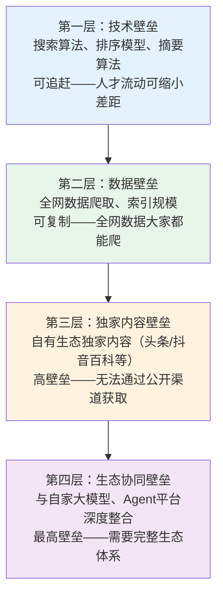

> **提炼自**：[WPS Comate 文章分析·洞察萃取 INS-005](../../../reports/competitive-analysis/retrospective-wps-comate-analysis-20260706/insight-extraction.md) —— 洞察5：生态整合（云文档+PPT+Wiki+系统集成）构成不可复制的竞争壁垒
> **验证扩展**：[火山引擎豆包搜索复盘](../../../reports/competitive-analysis/retrospective-volcengine-searchinfinity-learning-20260706/README.md) —— 补充"独家内容壁垒"维度，验证四层竞争壁垒模型（技术/数据/独家内容/生态协同）

# 生态壁垒评估框架（Ecosystem Barrier Evaluation）

## 模式类型

方法论模式（AI协作/产品策略）

## 成熟度

L2 验证级（3+ 案例验证：WPS Comate 办公生态 + Microsoft Copilot M365 生态 + 火山引擎豆包搜索内容生态）

## 适用场景

- AI 创业公司竞争策略：评估自身是否具备生态整合优势，或是否需要与生态厂商合作
- 投资者赛道评估：区分"有生态壁垒的 Agent"和"纯工具型 Agent"
- 产品架构设计：考虑 Agent 产品应调用哪些底层能力，如何构建生态护城河
- AI Agent 产品竞争力分析：识别竞争对手的生态深度及其对长期竞争格局的影响

## 问题背景

在 AI 模型能力日益趋同的背景下，仅凭模型能力难以建立持久的竞争壁垒。然而，许多 AI 创业公司和产品评估者仍将注意力集中在模型能力上，忽视了生态深度这一更根本的竞争维度。这导致两个核心问题：

1. **壁垒误判**：投资者和产品经理将"模型能力强"等同于"竞争壁垒高"，忽视了模型能力可被追赶，而生态深度不可速成
2. **能力边界误判**：产品设计者高估了 AI 模型的能力边界，认为 Agent "什么都能做"，但实际上 Agent 能做什么取决于它能调用哪些底层能力（文档格式处理、系统集成、数据连接），而非模型的智能程度

典型症状：
- 一个 AI 创业公司声称要做"企业级 Agent"，但无法生成真 PPT 文件（只能输出图片或文本），无法读取企业 OA 系统数据
- 投资者评估 Agent 产品时仅关注模型评测分数，忽略生态深度
- 产品团队在架构设计中未考虑底层生态建设，上线后发现 Agent 能力边界远超预期

## 核心规则

### 规则 1：能力边界由生态决定

Agent 能做什么不取决于模型的智能程度，而取决于它能调用哪些底层能力。具体而言，Agent 的能力边界 = 模型智能 × 生态调用能力。模型智能决定了"理解任务"的上限，生态调用能力决定了"执行任务"的上限。如果一个 Agent 无法调用原生文档格式引擎，它就无法生成真 PPT 文件；如果无法接入企业 OA 系统，它就无法查询业务流程数据。

> **为什么？** 模型智能解决的是"理解问题"的能力，生态调用解决的是"执行任务"的能力。两者缺一不可，但生态调用能力往往被低估——因为它在产品演示中不如模型能力直观。

### 规则 2：生态深度不可速成

原生办公生态（云文档、PPT、表格、PDF、邮件、日程、通讯录）的构建需要长期积累，无法通过短期 API 集成替代。真正的生态深度包含三个层次：格式层（原生文档格式引擎，支持真文件生成和编辑）、数据层（企业数据连接，CRM/OA/ERP 系统集成）、协作层（云文档共享、权限管理、版本控制）。每一层都需要数年时间构建，纯 Agent 创业公司无法在短期内复制。

> **为什么？** 生态深度不是 API 调用能力，而是底层引擎和基础设施的积累。生成一个"看起来像 PPT 的图片"只需要模型能力，但生成一个"可编辑的真 PPT 文件"需要完整的文档格式引擎。前者是功能，后者是生态。

### 规则 3：评估 Agent 长期竞争力应看生态深度而非仅看 AI 模型能力

在评估一个 Agent 产品的长期竞争力时，生态深度是比模型能力更根本的维度。模型能力会随着基础模型的进步而趋同（所有 Agent 都能调用最先进的模型），但生态深度不会——它是产品独有的、不可复制的资产。评估框架应包含：生态广度（覆盖多少种原生能力）、生态深度（每种能力的原生程度，真文件 vs 模拟）、生态独占性（是否有竞争对手无法获取的独有能力）。

> **为什么？** 模型能力是可替代的——今天用 GPT，明天可以用 Claude，后天可以用开源模型。但生态深度是产品独有的——WPS 的文档格式引擎只有 WPS 有，Microsoft 的 M365 生态只有 Microsoft 有。

### 规则 4：竞争壁垒四层模型——技术可追赶，内容与生态不可复制

通过火山引擎豆包搜索案例验证，竞争壁垒可分为四个递进层次，越往下壁垒越高、越难复制：

| 壁垒层级 | 说明 | 可复制性 | 追赶周期 | 典型案例 |
|---------|------|---------|---------|---------|
| **技术壁垒** | 算法能力、模型效果、工程优化 | 中——可通过人才招聘和技术投入追赶 | 6-18个月 | 搜索排序算法、摘要生成质量 |
| **数据壁垒** | 数据规模、覆盖度、更新频率 | 高——全网数据对所有竞争者开放 | 3-12个月（可购买/爬取） | 全网网页索引规模 |
| **独家内容壁垒** | 自有平台的独家内容资源、垂直领域数据 | 低——竞争对手无法通过公开市场获取 | 不可速成（需要自有内容生态积累） | 头条号内容、抖音百科、微信公众号内容 |
| **生态协同壁垒** | 与自有大模型、开发平台、应用生态的深度整合 | 极低——需要完整的产品矩阵和生态体系 | 不可速成（需要多年生态建设） | 豆包搜索+豆包大模型+火山引擎平台协同 |

> **为什么？** 技术壁垒和数据壁垒是"硬壁垒"，可以通过资金投入和人才招聘在一定时间内弥补；但独家内容壁垒和生态协同壁垒是"时间壁垒"——它们建立在企业多年积累的内容生态和产品矩阵之上，无法通过短期投入复制。这正是为什么内容平台型公司（字节、腾讯、阿里）做AI基础设施有天然优势。

**壁垒评估四问**：
1. 产品有哪些技术优势？竞争对手多久能追上？
2. 数据从哪里来？竞争对手能否获取同样的数据？
3. 有什么独家内容或资源是竞争对手拿不到的？
4. 是否与自家其他产品形成生态协同？这种协同有多深？

## 实施检查清单

评估 AI Agent 产品竞争力时自问：
- [ ] Agent 的能力边界是否由生态调用能力决定，而非仅由模型智能决定？
- [ ] 产品的生态深度是否包含格式层（原生文档引擎）、数据层（企业系统集成）、协作层（云文档共享）？
- [ ] 生态深度是否构成不可复制的竞争壁垒？纯 Agent 创业公司能否在短期内复制？
- [ ] 模型能力是否可被替代（切换基础模型），而生态能力不可被替代？
- [ ] 产品是否在生态独占性（竞争对手无法获取的能力）维度上有优势？
- [ ] 是否将生态深度纳入产品竞争力评估的核心维度，而非仅关注模型评测分数？
- [ ] 是否已用四层壁垒模型（技术/数据/独家内容/生态协同）完整评估竞争格局？
- [ ] 独家内容壁垒是否为不可复制的自有内容资产，而非公开可获取的数据？
- [ ] 生态协同是否深度整合（API级/数据级/账号级），而非浅层的品牌联动？

## 反例警示

| 错误做法 | 后果 |
|---------|------|
| 仅关注模型评测分数，忽略生态深度 | 高估产品竞争力，低估生态型竞争对手的长期优势 |
| Agent 声称能生成 PPT 但实际只能输出图片 | 用户期望落空，产品定位失信 |
| 试图通过 API 集成短期构建生态深度 | 功能表面完整但底层薄弱，无法应对复杂场景 |
| 认为"模型能力更强"就能弥补生态差距 | 模型能力趋同后，生态差距成为决定性因素 |
| 产品架构设计不考虑底层生态建设 | 上线后发现能力边界远低于预期，需要推倒重来 |

## 正例

**WPS Comate 的实践**：
- 拥有完整的办公生态——云文档、PPT、表格、PDF 等原生能力
- Agent 可以调用原生文档格式引擎，生成真 PPT 文件（.pptx），而非图片
- 可以交付云文档链接，而非仅输出纯文本
- 集成企业 Wiki 知识库，支持自然语言查询全域数据
- 连接 CRM、OA 等企业系统，Agent 可以跨系统获取业务数据
- 生态深度覆盖格式层（原生文档引擎）、数据层（Wiki/CRM/OA）、协作层（云文档共享）

**Microsoft Copilot 的实践**：
- 深度集成 Microsoft 365 生态——Word、Excel、PowerPoint、Teams、Outlook
- Agent 可以调用原生 Office 文档格式引擎，生成和编辑真文件
- 通过 Microsoft Graph 连接企业数据（邮件、日历、文件、人员）
- 生态深度覆盖办公全场景，构成不可复制的竞争壁垒

**火山引擎豆包搜索（SearchInfinity）的实践**：
- 深度整合字节跳动内容生态——头条号文章、抖音百科、抖音视频内容
- 独家内容壁垒：头条号和抖音百科是字节自有内容生态，其他搜索引擎无法获取
- 生态协同壁垒：与豆包大模型深度整合，搜索结果专为大模型消费设计，不是简单加API
- 四层壁垒分布：技术壁垒（搜索算法/摘要生成）→ 数据壁垒（全网索引，可追赶）→ 独家内容壁垒（头条/抖音内容，不可复制）→ 生态协同壁垒（与豆包大模型+火山引擎平台一体化，最高壁垒）
- 核心洞察：通用搜索API的技术和数据壁垒终将趋同，字节的长期护城河在于独家内容+生态协同

**SpecWeave 的对应实践**：
- `.agents/` 规范体系作为 SpecWeave 的"生态深度"——不是单个工具，而是完整的智能体协作基础设施
- 阶段守卫、SG-LOG、handoff 协议等机制构成不可复制的协作生态
- 方法论的持续积累（模式库、复盘体系）形成知识生态的复利效应

## 与 SpecWeave 的映射

| 生态壁垒维度 | SpecWeave 对应机制 | 映射关系 |
|------------|-------------------|---------|
| 格式层（原生文档引擎） | Markdown 作为标准格式，版本控制 | 格式生态 |
| 数据层（企业系统集成） | `.agents/` 规范体系 + 知识库 | 知识生态 |
| 协作层（云文档共享） | handoff 协议 + SG-LOG 共享 | 协作生态 |
| 独家内容层（自有积累） | 项目记忆库、模式库、复盘体系持续积累 | 知识复利壁垒 |
| 生态协同层 | 多Agent协作+规范+工具链完整体系 | 体系化壁垒 |
| 生态独占性 | 自有方法论体系不可复制 | 知识壁垒 |

## 与现有模式的关系

- `vertical-saas-mcp-capability-exposure.md`：共享"生态深度决定能力边界"的核心逻辑——垂直 SaaS 通过 MCP 协议暴露领域能力，本模式关注生态深度作为竞争壁垒
- `team-shared-ai-colleague.md`：生态深度是团队共享 AI 同事模式的基础设施支撑——没有云文档共享和权限管理，团队共享上下文难以落地
- `output-format-collaboration-capability.md`：本模式的"格式层生态"是输出格式-协作能力映射的底层支撑——没有原生文档格式引擎，云文档交付和真文件格式输出无法实现
- `saas-hardware-three-layer-funnel.md`：共享"生态壁垒"的竞争逻辑——SaaS 硬件三层漏斗中软件生态是核心变现手段，本模式中办公生态是核心竞争壁垒
- [ai-native-user-reversal-design.md](../product-growth/ai-native-user-reversal-design.md)：互补模式——用户逆向定位解决"产品为谁设计"的定位问题，本模式解决"凭什么持续赢"的壁垒问题。AI原生定位+生态壁垒=可持续的AI产品竞争力
- [ai-consumption-metadata-design.md](../product-growth/ai-consumption-metadata-design.md)：本模式的"独家内容壁垒"在API层体现为元数据中标注is_exclusive字段，与元数据增强模式协同——壁垒不仅是战略层面，也要在API设计中体现
- [ai-api-extreme-parameterization.md](../product-growth/ai-api-extreme-parameterization.md)：生态协同样式在API层体现为跨产品参数协同（如搜索API与大模型API的参数打通），极致参数化是生态协同在开发者体验层的体现

## 设计启示

生态壁垒评估框架的核心价值在于**将竞争评估的焦点从"谁的模型更强"转移到"谁的生态更深"**。在设计 AI Agent 产品时，应优先考虑生态建设而非模型优化——因为模型能力会趋同，而生态深度不会。对于 AI 创业公司，应诚实地评估自身生态位置：如果无法构建格式层生态（原生文档引擎），可以选择与生态厂商合作，或在数据层和协作层构建差异化优势。