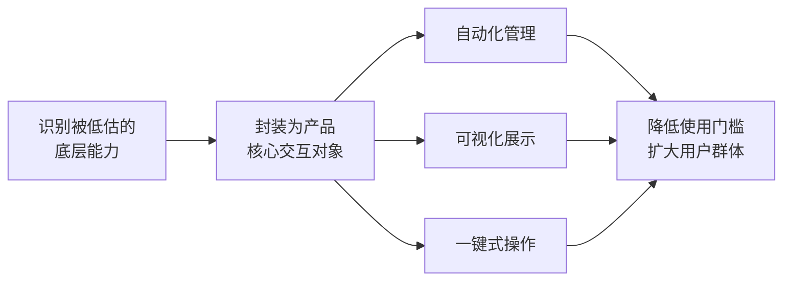

# 一等公民抽象模式

## 模式类型
方法论模式 / 产品设计

## 成熟度
L1 已验证（1次验证，2026-07-06 Orca IDE 文章分析）

## 适用场景

- 存在功能强大但因使用门槛高而未被广泛采用的底层技术概念
- 需要将某一技术能力从"专家工具"推广到"大众基础设施"
- 产品设计阶段识别"被低估的底层能力"作为创新突破口
- 新工具/平台需要对已有技术概念进行重新封装

## 核心模式

## 实施步骤

### 步骤 1：识别被低估的底层能力

寻找满足以下条件的技术概念：
- 功能强大，能解决真实问题
- 但使用门槛高（仅限命令行、需要专业知识、配置复杂）
- 在目标用户群体中渗透率低
- 有明确的"封装后更易用"的路径

### 步骤 2：设计核心交互抽象

将底层概念转化为产品的一等公民：
- 在 UI 中给予与核心功能同等级的位置
- 设计直观的交互方式（拖拽、点击、可视化）
- 提供自动化能力（一键操作、批量处理）
- 建立状态可视化（进度、结果、差异对比）

### 步骤 3：降低认知门槛

- 用用户熟悉的语言描述功能，而非底层技术术语
- 提供预设模板和最佳实践
- 渐进式暴露高级功能

## 案例分析

### Orca 案例
- **底层能力**：Git Worktree（Git 2.5 引入，多年仅被少数高级开发者使用）
- **封装方式**：将 Worktree 作为 IDE 核心对象，一键创建、可视化切换、差异对比
- **效果**：普通开发者也能享受并行开发的便利，多代理协作成为可能

### 类比案例
- **Docker**：将 Linux 容器技术（cgroups/namespace）封装为易用的命令行工具
- **Kubernetes**：将容器编排封装为声明式配置
- **Git**：将版本控制从手动备份文件夹变为自动化操作

## 相关模式

- [isolation-over-sharing](isolation-over-sharing.md) - 隔离式并行模式
- [full-workflow-integration](../tools-automation/full-workflow-integration.md) - 全流程整合模式