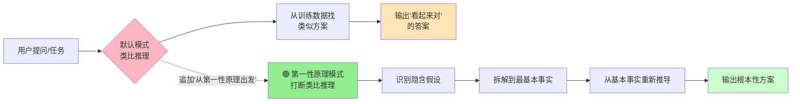

> **来源**：从卡兹克"Vibe Coding两大神级Prompt"文章提炼，经[vibe-coding-prompts-learning-analysis复盘](../../../reports/insight-extraction/external-learning/retrospective-vibe-coding-prompts-learning-analysis-20260704/insight-extraction.md#洞察1)系统化验证。文章作者卡兹克实战验证（AIHOT飞书推送BUG修复、SpaceX火箭成本重构跨领域案例），社区称"神之Prompt"。

# 第一性原理 Prompt 模式（First-Principles Prompt Pattern）

## 模式类型
方法论模式（AI协作/提示词工程）

## 成熟度
L3 反复验证（4次验证来源：卡兹克AIHOT项目实战 + SpaceX跨领域案例验证 + 2026-07-09类比错误反面案例 + 2026-07-10递归践行案例——写"不要类比推理"的洞察时自己又犯类比推理错误，完美验证践行鸿沟）

## 适用场景

| 场景 | 适用度 | 说明 |
|------|--------|------|
| 调试BUG/定位根因 | ✅✅✅ 核心场景 | 打断"治标"思维，逼Agent找底层原因 |
| 架构设计/技术选型 | ✅✅✅ 核心场景 | 避免照搬"常见方案"，从需求本质出发 |
| 方案评审/需求分析 | ✅✅ 强烈推荐 | 质疑假设、重新推导 |
| 产品定义/功能设计 | ✅✅ 推荐 | 剥掉"行业惯例"，从用户本质需求出发 |
| 简单CRUD/常规任务 | ⚠️ 不必使用 | 简单任务类比推理即可，第一性原理反而增加token消耗 |
| 创造性写作/灵感发散 | ❌ 不适用 | 类比推理在创意场景更有价值 |

## 问题背景

大语言模型（LLM）默认采用**类比推理**工作模式：
- 你让它写一个过滤函数，它从训练数据里找几万个类似函数，给你写一个"差不多"的
- 你让它修一个BUG，它先看"类似BUG通常怎么修"，给你一个"看起来对"的补丁
- **致命缺陷**：它跳过了"这个问题真的应该这么解吗？"的关键步骤

类比推理在常规场景足够高效，但在以下场景会导致严重问题：
1. **治标不治本**：修了表层症状，底层隐患仍在，未来必然复发
2. **方案平庸**：照搬"最佳实践"而不思考是否适合当前场景
3. **深层BUG遗漏**：复杂系统的底层问题无法通过类比找到

## 核心规则

### Prompt 标准形式

在原有 Prompt 后面追加一句话即可：

```
从第一性原理出发
```

或者更针对性地：

```
根据第一性原理来找一下原因
```

**极简设计**：
- 不需要安装Skill、不需要写System Prompt、不需要复杂模板
- 一句话七个字，打断AI默认的类比推理快思考路径
- 任务稍微复杂一点时，这个Prompt几乎是万能的

### 底层机理：打断快思考，启动慢思考



**核心机制**：
1. **打断类比推理**：七个字强制AI跳过"找类似方案"的捷径
2. **识别隐含假设**：逼AI列出"你默认认为对的事情"，然后质疑它们
3. **拆解到基本事实**：剥掉所有"行业惯例"、"常见做法"、"别人都这么做"的层
4. **从基本事实重新推导**：像马斯克算铝合金+碳纤维+燃料成本一样，从零开始构建方案

### 第一性原理四步法

| 步骤 | 动作 | 示例（AIHOT BUG修复） |
|------|------|---------------------|
| 1. 识别假设 | 列出"大家都认为对"的前提 | "国产模型测试时改坏了OpenAI抓取" |
| 2. 拆解元素 | 拆到不可再分的基本事实 | 抓取规则→路由配置→流量分发机制 |
| 3. 从零推导 | 从基本事实出发重新构建方案 | 发现4月写的流量路由层底层隐患 |
| 4. 验证突破 | 确认新方案是否根本性解决 | 重构底层路由，机制上消除复发可能 |

### 普通Prompt vs 第一性原理Prompt对比

| 维度 | 普通Prompt（类比推理） | 加"从第一性原理出发" |
|------|---------------------|-------------------|
| 思维模式 | 快思考（System 1） | 慢思考（System 2） |
| 方案质量 | "看起来对"的表层方案 | 根本性解决方案 |
| BUG修复 | 治标（修症状） | 治本（修根因） |
| 架构设计 | 照搬"最佳实践" | 从需求本质推导 |
| Token消耗 | 较低 | 略高（推理更深） |
| 适用场景 | 常规/简单任务 | 复杂/关键任务 |

## 实施步骤

### 步骤1：判断是否需要第一性原理
- 任务复杂度是否中高？（简单CRUD不需要）
- 错误是否反复出现？（反复出现说明治标不治本）
- 是否涉及架构/设计决策？（决策影响大，值得深思）
- 回答任一"是"→使用第一性原理Prompt

### 步骤2：追加Prompt
- 在原有问题/指令后面追加："从第一性原理出发"
- 修BUG时更精确："根据第一性原理来找一下原因"
- 设计时更精确："从第一性原理出发重新设计这个方案"

### 步骤3：验证结果深度
- 检查AI是否质疑了"默认假设"
- 检查是否拆解到了底层要素
- 检查方案是否解决了根因而非症状
- 如果仍然停留在类比层面，追加追问："还有没有更深层的原因？"

### 步骤4：结合对抗式审查形成闭环
- 第一性原理找到好方案后，使用[对抗式审查Prompt模式](adversarial-review-prompt-pattern.md)验证方案稳健性
- 定期（2-3周）对整个项目做"从第一性原理出发的对抗式审查"

## 跨领域迁移案例

### SpaceX火箭成本重构（经典案例）
- **行业共识（类比结论）**：火箭发射就得花几个亿
- **第一性原理拆解**：铝合金+碳纤维+航空级燃料+其他材料成本只有售价的2%
- **重新推导**：从材料成本出发重新设计制造流程
- **结果**：发射成本降低90%
- **启示**：第一性原理的威力在于"剥掉所有既定假设"

### AIHOT飞书推送BUG修复（Vibe Coding案例）
- **初步修复（类比推理）**：国产模型改坏了OpenAI抓取，修好就行
- **第一性原理追问**：根据第一性原理来找原因
- **深度发现**：4月写的流量路由层底层隐患，国产模型改动只是表层触发点
- **根本性解决**：重构底层路由，从机制上消除复发可能
- **启示**：一个BUG反复出现时，必须从第一性原理追根因

## 在本项目（SpecWeave）中的应用场景

| 应用场景 | 具体用法 |
|---------|---------|
| 调试检查脚本BUG | 脚本误报/漏报时追加"从第一性原理出发分析原因" |
| 架构模式选型 | 评估新模式是否适用时，从本项目实际约束而非"行业惯例"出发 |
| 规范设计决策 | 制定规则时，从"为什么需要这条规则"的本质出发 |
| 复盘根因分析 | S2分析过程中追问深层原因 |
| 代码审查 | Review代码时不只看"是否符合规范"，而是从第一性原理判断设计是否合理 |

## ⚠️ 践行鸿沟：知道≠做到（L3验证核心发现）

> **本项目亲身验证的递归践行现象**：第一性原理最危险的陷阱不是"不知道"，而是"知道了但没做到"。

### 递归践行定律

你刚把"类比推理导致错误"写入反面教材，下一个简单任务中你大概率会立刻再犯一次类比推理错误。**这不是因为你没学会，而是因为**：

1. **大脑的双系统本能**：System 1（快思考/类比/直觉）是默认模式，System 2（慢思考/第一性原理/推理）需要主动启动
2. **简单任务自动触发System 1**：任务越简单、越"不用想"，大脑越倾向于走捷径
3. **错误本身就是验证**：第二次犯错恰恰证明了"践行鸿沟"的正确性——用践行错误验证关于践行错误的理论，形成递归闭环

### 本项目三次递归践行实例

| 时间 | 事件 | 类比推理错误 |
|------|------|------------|
| 2026-07-09 | 格式修正任务 | 看到`file:///`格式就批量套用，没查开发规范 |
| 2026-07-10 | 文档更新任务 | 看到retrospective/README.md链接到目录就类比套用，没验证IDE需要具体文件 |
| 2026-07-10 | 写本洞察时 | 正在写"不要凭直觉数路径层级"的洞察，自己又凭直觉写错路径层级 |

### 应对策略

- **建立强制检查点**：使用[决策前三查模式](pre-decision-three-checks.md)，在关键决策点强制触发System 2
- **自动化验证**：用工具（如check-links.py、测试套件）做对抗式审查，弥补自审的确认偏差
- **接受"反复掉坑"是常态**：不要因为"我已经学过了"就放松警惕，每次简单任务都是类比推理的触发点

## 反模式

| 反模式 | 为什么错误 | 正确做法 |
|--------|----------|---------|
| 所有任务都加"从第一性原理出发" | 简单任务不需要慢思考，浪费token且增加延迟 | 只在复杂/关键/反复出问题的场景使用 |
| 加了Prompt但不验证结果深度 | AI可能仍然给出类比层面的回答，只是措辞更"深刻" | 追问"还有没有更深层的原因"验证是否真的触及本质 |
| 只用第一性原理不用对抗式审查 | 找到好方案≠方案稳健，缺少验证环节 | 第一性原理+对抗式审查形成"生成-验证"闭环 |
| 把第一性原理当成"万能咒语" | 七个字不是魔法，核心是背后的思维方式 | 理解机理而非机械套用 |

## 与其他模式的关系

| 关联模式 | 关系类型 | 关系说明 |
|---------|---------|---------|
| [adversarial-review-prompt-pattern.md](adversarial-review-prompt-pattern.md) | 互补闭环 | 第一性原理管"生成好方案"，对抗式审查管"验证方案稳健"，二者构成"生成-验证"闭环 |
| [bilingual-prompt-engineering.md](bilingual-prompt-engineering.md) | 可组合 | 第一性原理是中文Prompt（推理模型最优语言），符合双语提示词工程原则 |
| [root-cause-diagnosis.md](../governance-strategy/root-cause-diagnosis.md) | 思想同源 | 5-Whys根因分析与第一性原理共享"追到底层"的思维方式 |
| [five-category-asset-coverage.md](../retrospective-knowledge/five-category-asset-coverage.md) | 应用场景 | 定期全局审查时可结合第一性原理做深度资产审视 |
| [pre-decision-three-checks.md](pre-decision-three-checks.md) | 互补执行 | 决策前三查是第一性原理的强制检查点机制，防止"知道但没做到" |

## Changelog

- 2026-07-08 | create | 初始版本，基于卡兹克文章和vibe-coding-prompts-learning-analysis复盘提炼，L2成熟度
- 2026-07-09 | update | 新增"践行鸿沟"反面案例和常见陷阱，关联决策前三查模式，validation_count从1更新为2
- 2026-07-10 | update | v1.2学习文档更新时发现递归践行现象（写"不要类比推理"洞察时又犯类比推理错误），maturity升L3，validation_count更新为4，新增递归践行验证来源，补充"践行鸿沟"和"递归践行"标签
