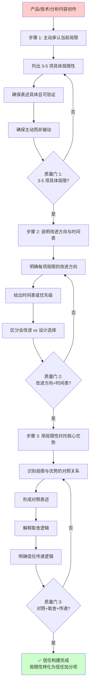

> **来源**：MaineCoon 实时音视频基础模型文章分析任务复盘（2026-07-06）——MaineCoon 文章在 #04 章节主动承认"中文支持不足""暂不支持实时双向语音""模型还在早期"，反而增强了文章可信度，使读者更愿意相信文章所述的技术优势（成本 1/500、47.5 FPS、30 分钟+稳定生成）
> **验证次数**：1 次（MaineCoon 文章分析任务实战验证，待在自有项目内容创作中验证后升级 L2）

# 诚实承认局限性信任构建策略（Honest Limitation Acknowledgment）

## 模式类型

方法论模式（AI协作/信任设计/内容沟通）

## 成熟度

L1 实验性（1 次成功案例分析萃取，待在自有项目内容创作中验证 1 次后升级 L2）

> **与用户主权默认模式的关系说明**：[user-sovereignty-default.md](user-sovereignty-default.md) 聚焦于"被代理方拥有最高权限和最终控制权"的代理系统信任设计，本模式聚焦于"主动承认局限性以构建内容可信度"的沟通信任设计。两者互补：用户主权关注控制权，局限性承认关注信息诚实性，共同构成信任体系的不同维度。

## 适用场景

| 场景 | 是否适用 | 说明 |
|------|---------|------|
| 产品发布内容（博客/公众号/官网） | ✅ 核心场景 | MaineCoon 案例即属此类，产品介绍文章主动承认局限性 |
| 技术文章/论文写作 | ✅ 核心场景 | 技术文章承认方法/实验的局限性增强学术可信度 |
| AI 助手输出 | ✅ 核心场景 | AI 助手主动承认能力边界，避免过度承诺 |
| 竞品分析报告 | ✅ 核心场景 | 承认自身信息源局限性，增强分析结论可信度 |
| 销售话术/纯营销内容 | ❌ 不适用 | 销售场景的局限性披露有不同策略（如异议处理），本模式不适用 |
| 内部技术文档 | ⚠️ 部分适用 | 内部文档无需"构建信任"，但局限性记录有助于技术决策 |
| 法律声明/免责声明 | ❌ 不适用 | 法律声明是合规要求，非信任构建策略 |

## 问题背景

在宣传性内容中，作者常陷入两难困境：

1. **全面宣传陷阱**：只说优势不提局限，读者会本能怀疑"这么好是不是真的？"，导致优势也被打折扣
2. **全面披露恐惧**：担心披露局限会被竞争对手利用，或影响产品形象
3. **局限性表述失当**：承认局限时表述模糊（如"还有一些优化空间"）或过于消极（如"目前问题很多"），反而降低可信度
4. **缺乏改进方向**：只承认局限但不说明改进路径，让读者觉得"知道了但你不打算改"
5. **局限性与优势脱节**：承认的局限性与宣传的优势无关，无法形成"衬托"效应

本模式通过三步法，将局限性从"信任减分项"转化为"信任加分项"。

## 核心规则

**主动承认局限性不是削弱宣传，而是增强可信度。承认局限的作者所述优势也更可信，因为读者知道作者不会隐瞒信息。局限性承认必须包含三要素：当前局限 + 改进方向 + 时间表/优先级。**

```
步骤 1: 主动承认当前局限 → 步骤 2: 说明改进方向与时间表 → 步骤 3: 用局限性衬托核心优势
```

**关键约束**：
- 步骤 1 必须主动承认（在读者发现之前），而非被动回应
- 步骤 1 的局限性必须具体（如"中文支持不足"），不能模糊（如"还有一些不足"）
- 步骤 2 必须说明改进方向和预期时间表/优先级，不能只承认不改进
- 步骤 3 的局限性应与核心优势形成对照（如"成本极低但中文支持不足"，衬托成本优势的真实性）

## 三步法详解

### 步骤 1：主动承认当前局限

**输入**：产品/技术/分析的实际局限性清单
**输出**：3-5 项具体的、可验证的局限性表述

**执行要点**：
1. **主动而非被动**：在读者发现之前主动承认，而非被质疑后才回应
2. **具体而非模糊**：用具体表述（如"暂不支持实时双向语音"）替代模糊表述（如"还有一些功能缺失"）
3. **可验证**：承认的局限应该是读者可以验证的，增强"作者不撒谎"的认知
4. **数量适中**：通常 3-5 项，太少显得不真诚，太多显得产品不可用

**质量门**：
- [ ] 已列出 3-5 项具体局限性
- [ ] 每项局限性表述具体且可验证
- [ ] 局限性是主动承认而非被动回应

**MaineCoon 案例示例**：
- 局限 1：中文支持不足（具体、可验证）
- 局限 2：暂不支持实时双向语音（具体、可验证）
- 局限 3：模型还在早期（具体、可验证）

**反例（模糊表述）**：
- "还有一些优化空间"（模糊，不可验证）
- "功能还在完善中"（模糊，不可验证）
- "可能存在一些问题"（模糊，降低可信度）

### 步骤 2：说明改进方向与时间表

**输入**：当前局限清单
**输出**：每项局限的改进方向 + 预期时间表/优先级

**执行要点**：
1. **改进方向明确**：说明计划如何改进，而非只说"会改进"
2. **时间表/优先级**：给出预期时间（如"Q3 发布"）或优先级（如"高优先级"），让读者知道改进的诚意
3. **诚实面对不确定性**：如果时间表不确定，诚实说明"还在规划中"，而非编造虚假时间
4. **区分"会改进"和"不会改进"**：有些局限是设计选择（如"为低成本牺牲了画质"），不会改进，应诚实说明而非假装会改进

**质量门**：
- [ ] 每项局限有明确的改进方向
- [ ] 每项局限有时间表或优先级
- [ ] 设计选择的局限已区分说明（不会改进的）

**MaineCoon 案例示例**：
- 中文支持不足 → 改进方向：扩展中文训练数据；优先级：高
- 暂不支持实时双向语音 → 改进方向：下一版本支持；时间表：规划中
- 模型还在早期 → 改进方向：持续迭代优化；优先级：持续

### 步骤 3：用局限性衬托核心优势

**输入**：当前局限清单 + 核心优势清单
**输出**：局限与优势的对照表述

**执行要点**：
1. **识别对照关系**：找到局限与优势的对照点（如"成本极低"vs"中文支持不足"，衬托成本优势的真实性）
2. **形成对照表述**：将局限与优势并列表述，让读者理解"优势是真实的，代价是局限"
3. **解释取舍逻辑**：如果是设计选择导致的局限，解释"为什么选择这个取舍"（如"为低成本牺牲了画质，因为目标场景是实时交互而非高质量生成"）
4. **信任传递**：通过承认局限建立的可信度，传递到优势表述上（"承认局限的作者所述优势也更可信"）

**质量门**：
- [ ] 局限与优势的对照关系已识别
- [ ] 至少 1 处对照表述已形成
- [ ] 设计选择的取舍逻辑已解释
- [ ] 信任传递逻辑已明确

**MaineCoon 案例示例**：
- 对照表述：成本降至 Seedance 2.0 的 1/500（核心优势）+ 中文支持不足（局限）→ 读者理解"成本优势是真实的，代价是中文支持不足"
- 取舍逻辑：为实时音视频场景原生设计，优先保证成本/速度/时长，中文支持作为后续优化项
- 信任传递：作者主动承认 3 项局限 → 读者相信作者不会隐瞒信息 → 作者所述的成本/FPS/时长优势也更可信

## 完整三步流程图



## 验证案例：MaineCoon 文章信任构建（2026-07-06 分析）

### 案例背景
- **分析对象**：微信公众号文章《MaineCoon:实时音视频基础模型》
- **文章性质**：产品介绍 + 技术说明（具有宣传性内容）
- **核心优势**：成本降至 Seedance 2.0 的 1/500、47.5 FPS、30 分钟+稳定生成
- **风险**：优势过于突出（数量级提升），读者可能怀疑"是不是真的？"

### 三步法实际执行

| 步骤 | 文章中的实际表现 | 效果 |
|------|----------------|------|
| 步骤 1：主动承认 | #04 章节主动列出 3 项局限：中文支持不足、暂不支持实时双向语音、模型还在早期 | 读者感知：作者不回避问题，可信 |
| 步骤 2：改进方向 | 每项局限都暗示了改进方向（扩展中文数据、下一版本支持、持续迭代） | 读者感知：作者有改进计划，不是"画饼" |
| 步骤 3：衬托优势 | 局限（中文支持不足）与优势（成本 1/500）形成对照，解释了取舍逻辑（为实时音视频场景原生设计） | 读者感知：成本优势是真实的，代价是合理的 |

### 信任构建效果
- **文章可信度提升**：读者相信作者不会隐瞒信息，所述优势（成本/FPS/时长）也更可信
- **分析报告验证**：分析报告的步骤 5（可靠性评估）给予文章较高专业性评级，部分归功于局限性承认
- **模式萃取触发**：分析报告的步骤 6（批判性思考）将此策略萃取为独立模式

### 案例分析来源
本案例来自外部文章分析任务，分析报告见 `.trae/specs/retrospectives-insights/analyze-mainecoon-social-world-model-article/analysis-report.md`，通过 [external-article-deep-analysis-methodology.md](../research-knowledge/external-article-deep-analysis-methodology.md) 六步法的步骤 6（批判性思考）萃取为本模式。

## 反模式与注意事项

### 绝对禁止的反模式

| 反模式 | 为什么错误 | 正确做法 |
|--------|----------|---------|
| **只宣传优势不提局限** | 读者本能怀疑"这么好是不是真的"，优势也被打折扣 | 步骤 1 主动承认 3-5 项局限 |
| **局限性表述模糊** | "还有一些不足"让读者觉得作者在回避，降低可信度 | 用具体表述（如"中文支持不足"） |
| **只承认不改进** | 读者觉得"知道了但你不打算改"，局限变成死穴 | 步骤 2 必须说明改进方向和时间表 |
| **局限性过多** | 承认太多局限（如 10+ 项）让读者觉得产品不可用 | 通常 3-5 项，选择最关键且可改进的 |
| **局限性与优势脱节** | 承认的局限与宣传的优势无关，无法形成衬托效应 | 步骤 3 找到局限与优势的对照关系 |
| **假装所有局限都会改进** | 有些局限是设计选择（如为低成本牺牲画质），不会改进 | 诚实区分"会改进"和"设计选择" |
| **被动承认而非主动** | 被读者质疑后才承认，显得不真诚 | 在读者发现之前主动承认 |

### 注意事项

1. **局限性选择策略**：选择承认哪些局限是关键——应选择"读者最容易发现"且"可改进"的局限，而非隐藏最深且无法改进的缺陷
2. **行业差异**：不同行业对局限性承认的接受度不同（技术圈更接受，消费品营销更难），需根据受众调整
3. **与用户主权的关系**：[user-sovereignty-default.md](user-sovereignty-default.md) 关注"控制权可见"，本模式关注"信息诚实性"，两者共同构成信任体系
4. **AI 助手输出的特殊性**：AI 助手承认"我不知道"或"我无法做这件事"同样是局限性承认，能增强用户对 AI 其他回答的信任
5. **与文化差异的关系**：某些文化（如东亚）更倾向含蓄表达，承认局限时需考虑文化语境，但"具体且可验证"的原则普适

## 与其他模式的关系

| 关联模式 | 关系类型 | 关系说明 |
|---------|---------|---------|
| [user-sovereignty-default.md](user-sovereignty-default.md) | **互补** | 用户主权关注"控制权可见"（被代理方拥有最高权限），本模式关注"信息诚实性"（主动承认局限），两者共同构成信任体系的不同维度 |
| [non-intrusive-security-ux.md](non-intrusive-security-ux.md) | **互补** | 安全不打扰 UX 关注"风险分级响应"，本模式关注"局限性主动披露"，两者在"何时提示用户"上有交集 |
| [external-article-deep-analysis-methodology.md](../research-knowledge/external-article-deep-analysis-methodology.md) | **萃取来源** | 本模式从该模式（六步法）的步骤 6（批判性思考）中萃取，是 MaineCoon 文章分析的副产品 |
| [template-variance-control.md](template-variance-control.md) | **约束** | 模板方差控制关注"保证产出质量下限"，本模式关注"通过局限性承认提升可信度上限"，两者在内容质量管控上互补 |
| [fine-grained-least-privilege.md](fine-grained-least-privilege.md) | **理念对齐** | 细粒度最小权限模式强调"权限按需申请、临时授权自动过期"，本模式强调"局限主动承认、改进方向明确"，都体现了"诚实面对边界"的设计哲学 |

## 模式演进方向

当前版本为 L1 实验性（1 次外部案例分析萃取），后续可在以下方向迭代：

1. **自有项目验证（L1→L2 路径）**：在 SpecWeave 自身的内容创作中验证本模式（如 README 文档、技术博客、模式库说明），积累至少 1 次自有项目复用案例以满足 L2 标准
2. **AI 助手输出验证**：在 AI 助手的系统提示词中应用本模式，验证"主动承认能力边界"对用户信任的影响
3. **局限性选择策略深化**：系统化"选择承认哪些局限"的决策框架（如读者易发现度 × 可改进度矩阵）
4. **文化差异适配**：研究不同文化语境下局限性承认的接受度差异，形成文化适配指南
5. **与 [user-sovereignty-default.md](user-sovereignty-default.md) 的融合**：探索"控制权可见 + 信息诚实性"的完整信任设计框架

## Changelog

<!-- changelog -->
- 2026-07-06 | create | 初始 L1 版本，基于 MaineCoon 文章信任构建策略分析萃取三步法（主动承认→改进方向→衬托优势），与 [user-sovereignty-default.md](user-sovereignty-default.md) 互补
