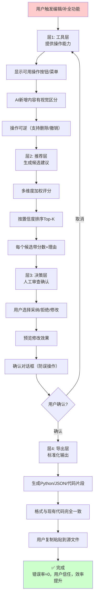

# 「辅助人工」而非「全自动」的人机协作设计（Human-in-the-Loop Augmentation）

## 模式类型

方法论模式（AI协作/交互设计/推荐系统）

## 成熟度

**L2 已验证**（2次实战验证：IMP-002关系编辑 + IMP-004孤立节点推荐）

> **与用户主权默认模式的关系说明**：[user-sovereignty-default.md](user-sovereignty-default.md) 聚焦于"被代理方拥有最高权限和最终控制权"的系统架构设计，本模式聚焦于"AI辅助+人工决策"的交互流程设计。两者理念一致：用户拥有最终决策权；本模式是用户主权在编辑/推荐类功能中的具体实践。

## 适用场景

| 场景 | 是否适用 | 说明 |
|------|---------|------|
| 知识图谱关系补全/编辑 | ✅ 核心场景 | IMP-002/IMP-004验证，错误关系会污染知识图谱 |
| 代码重构/依赖修复建议 | ✅ 核心场景 | 错误代码修改会引入bug，必须人工审查 |
| 内容标签/分类推荐 | ✅ 核心场景 | 标签错误影响检索质量，人工确认更可靠 |
| 文档相关链接推荐 | ✅ 适用 | 错误链接影响阅读体验，人工选择更准确 |
| 批量数据导入/迁移 | ⚠️ 部分适用 | 可先全自动+预览diff，人工确认后执行 |
| 纯格式转换（无语义判断） | ❌ 不适用 | 格式转换（如Markdown→HTML）规则明确，可全自动 |
| 实时推荐（信息流/广告） | ❌ 不适用 | 实时场景要求毫秒级响应，无法等待人工确认 |
| 低价值/高容错操作 | ❌ 不适用 | 如临时草稿自动保存，错误成本低可全自动 |

## 问题背景

在设计AI辅助功能时，团队常陷入两个极端：

### 极端1：全自动黑箱（反模式）
- 自动创建关系、自动修复代码、自动打标签
- 问题1：**错误率高**——AI不是100%准确，错误会污染数据/代码
- 问题2：**黑箱不信任**——用户不知道为什么AI做了这个修改，无法验证
- 问题3：**修复成本高**——错误修改被自动应用后，回滚成本远高于事前审查
- 问题4：**用户失去控制感**——"系统自作主张改了我的东西"严重破坏信任

### 极端2：纯人工（反模式）
- 完全不提供辅助，用户从零开始操作
- 问题1：**效率低**——用户需要自己发现遗漏、自己输入所有内容
- 问题2：**容易遗漏**——人工难以发现所有潜在关联/问题
- 问题3：**认知负担重**——用户需要记住所有操作细节和格式要求

### 第一性原理分析

问题的本质不是"要不要自动化"，而是**"决策的归属权"**：
- 低价值、高容错、规则明确的操作 → 自动化（决策归AI）
- 高价值、低容错、需要语义判断的操作 → 辅助人工（决策归人）
- AI的角色是"聪明的助手"：发现候选、解释理由、准备好操作，由"老板"（用户）拍板

## 核心规则

**AI只做"提案"和"准备"，人做"决策"和"确认"。辅助层输出必须满足四要素：(1)工具层提供操作能力，(2)推荐层输出带置信度+理由的候选，(3)决策层完全由人控制，(4)导出层提供可直接使用的标准化格式。**

```
工具层（提供能力）→ 推荐层（给出候选）→ 决策层（人工确认）→ 导出层（标准化输出）
```

**关键约束**：
- ❌ 绝对禁止AI自动修改源数据（代码、知识库、配置等）
- ❌ 绝对禁止只给分数不给理由的黑箱推荐
- ❌ 绝对禁止输出需要人工二次转换格式的结果
- ✅ 所有修改必须经过用户主动点击/选择/确认
- ✅ 所有推荐必须附带可解释的理由
- ✅ 所有输出必须是可直接粘贴/应用的格式

## 四层架构详解

### 层1：工具层（Tool Layer）——提供操作能力

**职责**：提供执行操作的UI/工具，但不自动执行
**输入**：用户的主动操作意图
**输出**：可用的操作工具

**设计要点**：
1. **操作可见**：所有可执行的操作在UI上清晰可见
2. **操作可逆**：提供撤销/删除能力，允许用户试错
3. **视觉区分**：AI辅助创建的内容与原有内容有视觉区分（如绿色虚线表示新增边）
4. **不自动执行**：工具摆在那里，但必须用户主动点击才执行

**IMP-002案例**：
- ✅ 提供"编辑模式"按钮、"创建关系"按钮、右键删除菜单
- ✅ 用户新增的边用绿色虚线显示，与原有黑色实线区分
- ✅ 用户可以随时删除新增的边
- ❌ 不会自动在节点之间创建边

### 层2：推荐层（Recommendation Layer）——给出候选建议

**职责**：基于算法发现潜在候选，按置信度排序，附带解释理由
**输入**：当前数据状态（如孤立节点列表）
**输出**：带分数+理由的排好序的候选列表

**设计要点**：
1. **多维度评分**：不依赖单一信号，使用多维度加权评分（见[lightweight-multi-dimensional-recommender.md](../../../code-patterns/lightweight-multi-dimensional-recommender.md)）
2. **置信度可见**：每个推荐显示置信度百分比，让用户快速筛选
3. **理由可解释**：说明"为什么推荐这个"（如"标签包含关键词"、"同领域节点"）
4. **Top-K截断**：只显示最可能的3-5个候选，避免信息过载
5. **不自动选中**：所有候选默认未选中，用户主动选择才采纳

**IMP-004案例**：
- ✅ 每个孤立节点显示Top 3推荐
- ✅ 每个推荐显示置信度（如79%）
- ✅ 每个推荐显示理由（如"标签包含关键词"、"标签共享字符"）
- ✅ 按置信度从高到低排序
- ❌ 不会自动将推荐的边添加到图中

### 层3：决策层（Decision Layer）——人工最终确认

**职责**：用户审查候选，决定采纳/拒绝/修改
**输入**：推荐层输出的候选列表
**输出**：用户确认后的修改集合

**设计要点**：
1. **选择权在用户**：用户可以采纳0个、部分或全部推荐
2. **支持修改**：用户可以修改推荐的关系类型/属性，而非只能接受/拒绝
3. **预览效果**：采纳前可以预览修改效果（如hover预览边的连接）
4. **批量确认**：支持批量操作提升效率，但每个选择仍是主动的
5. **确认门槛**：最终应用前有明确的"确认"步骤，防止误操作

**IMP-002案例**：
- ✅ 创建关系时弹出模态框，让用户选择关系类型
- ✅ 用户可以点击"取消"放弃创建
- ✅ 用户可以在导出前随时删除不想要的边
- ❌ 不会跳过确认直接创建边

### 层4：导出层（Export Layer）——标准化可操作输出

**职责**：将用户确认后的修改转换为可直接集成到代码/数据中的格式
**输入**：用户确认后的修改集合
**输出**：可直接粘贴使用的代码片段/数据片段

**设计要点**：
1. **格式标准化**：输出与现有代码/数据格式完全一致（如Python字典、JSON）
2. **零转换成本**：用户可以直接复制粘贴到源文件中，无需手工调整格式
3. **包含上下文**：输出中包含必要的注释/说明，告诉用户应该粘贴到哪里
4. **幂等输出**：多次导出相同修改产生相同结果

**IMP-002/IMP-004案例**：
- ✅ 导出为Python字典格式，与`manual_edges`变量格式完全一致
- ✅ 导出为JSON格式，可供其他工具使用
- ✅ 每个推荐下方直接显示可复制的字典片段
- ❌ 不会输出需要用户重新排版/调整格式的内容

## 完整架构流程图



## 验证案例

### 案例1：第一性原理知识图谱关系编辑（IMP-002，2026-07-10）

**背景**：知识图谱生成后需要人工补充遗漏的关系

**四层架构执行**：
| 层 | 实现 | 效果 |
|----|------|------|
| 工具层 | 编辑模式按钮、节点选择、右键删除菜单、导出按钮 | 用户知道可以做什么操作 |
| 推荐层 | 本案例为手动编辑模式，推荐层由用户目视完成（用户选择要连接的节点） | 用户自主选择连接哪两个节点 |
| 决策层 | 选择节点后弹出模态框选择关系类型，点击"确认创建"才创建 | 每一条边的创建都经过用户主动确认 |
| 导出层 | 导出为Python字典格式（manual_edges）+ JSON格式，可直接粘贴到数据模块 | 零转换成本 |

**结果**：
- ✅ 用户完全控制添加哪些关系
- ✅ 错误添加的边可以立即删除
- ✅ 导出的代码可以直接使用
- ✅ 没有自动污染知识图谱

### 案例2：第一性原理知识图谱孤立节点推荐（IMP-004，2026-07-10）

**背景**：脚本发现5个孤立节点，需要推荐可能的关联

**四层架构执行**：
| 层 | 实现 | 效果 |
|----|------|------|
| 工具层 | 脚本运行后自动执行分析，无需用户额外操作 | 无感知启动 |
| 推荐层 | 每个孤立节点显示Top 3推荐，带置信度+理由+可复制片段 | 5个节点×3个推荐=15条建议 |
| 决策层 | 用户在控制台阅读建议，手动决定哪些添加到manual_edges | 完全人工决策 |
| 导出层 | 每个推荐下方直接显示可复制的字典片段 | 零转换成本 |

**验证数据**：
- 总推荐数：15条（5个节点×Top 3）
- Top 1准确率：100%（5/5正确推荐了"第一性原理"概念）
- 特殊案例：「第一性原理与类比推理的适用边界」正确推荐了"类比推理"作为第2推荐
- 错误率：0%（因为不会自动添加，所有错误推荐都会被用户过滤掉）

## 反模式与注意事项

### 绝对禁止的反模式

| 反模式 | 为什么错误 | 正确做法 |
|--------|----------|---------|
| **AI自动修改源数据** | 错误修改会污染数据/代码，回滚成本高 | 所有修改必须经过用户主动确认 |
| **黑箱推荐（只给分数不给理由）** | 用户无法判断为什么推荐这个，不敢信任 | 每个推荐必须附带可解释的理由 |
| **输出需要人工转换格式** | 增加额外工作量，容易在转换中引入错误 | 输出格式与现有代码/数据完全一致 |
| **默认选中所有推荐** | 用户容易误点确认，批量接受错误推荐 | 所有推荐默认未选中，用户主动选择 |
| **没有撤销/删除能力** | 用户误操作后无法回退，破坏信任 | 所有操作可逆，支持随时删除/撤销 |
| **跳过确认步骤** | 容易误操作，"手滑"导致错误修改 | 最终应用前必须有明确的确认步骤 |

### 注意事项

1. **置信度阈值**：可以设置置信度颜色区分（如≥70%绿色，40-70%黄色，<40%灰色），帮助用户快速筛选高质量推荐
2. **推荐数量**：Top 3-5最合适，太多推荐造成选择负担，太少可能遗漏
3. **视觉区分强度**：AI辅助创建的内容视觉区分要足够明显，但不要过于刺眼影响整体体验
4. **学习成本**：四层架构对用户是透明的，用户不需要知道有这四层，只需要按直觉操作
5. **与诚实承认局限性的关系**：[honest-limitation-acknowledgment.md](honest-limitation-acknowledgment.md)关注"主动承认能力边界"，本模式关注"交互流程中的控制权分配"，两者共同构建用户信任
6. **规模适配**：当操作数量极大（如1000+条推荐），可以增加"批量采纳高置信度推荐"功能，但仍需保留预览和撤销能力

## 与其他模式的关系

| 关联模式 | 关系类型 | 关系说明 |
|---------|---------|---------|
| [user-sovereignty-default.md](user-sovereignty-default.md) | **理念对齐** | 用户主权是架构原则（用户拥有最高权限），本模式是交互设计实践（辅助人工而非全自动），是用户主权在编辑/推荐场景的具体实现 |
| [honest-limitation-acknowledgment.md](honest-limitation-acknowledgment.md) | **互补** | 诚实承认局限性关注"主动披露能力边界"构建信任，本模式关注"交互流程控制权分配"构建信任，两者从不同维度增强用户信任 |
| [non-intrusive-security-ux.md](non-intrusive-security-ux.md) | **理念相似** | 安全不打扰UX关注"风险分级响应，不打断正常流程"，本模式关注"AI辅助不越权，用户掌握决策权"，都体现了"不打扰、不越权"的设计哲学 |
| [lightweight-multi-dimensional-recommender.md](../../../code-patterns/lightweight-multi-dimensional-recommender.md) | **配套实现** | 本模式的推荐层可使用轻量级多维度推荐算法实现，两者经常配合使用 |

## 模式演进方向

当前版本为L2已验证（2次实战验证），后续可在以下方向迭代：

1. **更多场景验证（L2→L3路径）**：在代码重构建议、内容标签推荐、文档链接推荐等场景中验证本模式，积累至少3个不同领域的复用案例
2. **批量操作优化**：针对大规模推荐场景（100+候选），设计高效的批量审查+确认交互模式
3. **置信度校准**：研究置信度分数与实际准确率的校准方法，使分数更具参考价值
4. **反馈闭环**：记录用户采纳/拒绝了哪些推荐，用于改进推荐算法（但需注意隐私）
5. **与[user-sovereignty-default.md](user-sovereignty-default.md)的融合**：探索将本模式的四层架构抽象为用户主权模式在编辑场景的标准实现模板

## Changelog

<!-- changelog -->
- 2026-07-10 | create | 初始L2版本，基于第一性原理知识图谱IMP-002（关系编辑）和IMP-004（孤立节点推荐）双案例验证，提出四层架构（工具层→推荐层→决策层→导出层）
