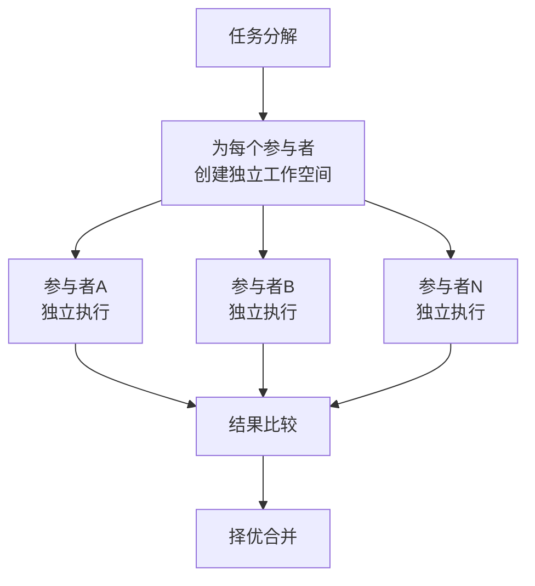

# 隔离优于共享模式

## 模式类型
方法论模式 / 架构设计 / 代理协作

## 成熟度
L1 已验证（1次验证，2026-07-06 Orca IDE 文章分析）

## 适用场景

- 多个 AI 代理需要同时修改同一代码库
- 多个参与者需要并行处理同一数据集
- 并行实验需要避免相互干扰
- 需要比较多种方案后择优选择

## 核心模式

## 实施步骤

### 步骤 1：创建独立工作空间

为每个参与者（代理/人/进程）创建完全隔离的工作空间：
- 代码：独立 Git Worktree 或分支
- 数据：独立数据集副本
- 环境：独立容器或虚拟环境

### 步骤 2：并行执行

- 所有参与者在各自的工作空间中独立执行
- 无需设计复杂的协调机制或锁
- 各参与者输出互不干扰

### 步骤 3：结果比较与择优

- 汇总所有参与者的输出
- 建立统一的比较标准（质量、性能、可读性等）
- 由决策者（人类或自动化规则）选择最优方案

### 步骤 4：合并与清理

- 将选中的方案合并到主干
- 清理未选中的工作空间

## 设计原则

1. **隔离 > 共享**：与其设计复杂的共享状态管理，不如让每个参与者拥有独立空间
2. **人类决策**：机器擅长执行，但最终的选择应该由人类做
3. **事后合并**：先并行执行，再比较合并，而非在过程中协调

## 案例分析

### Orca 案例
- **场景**：一个 Prompt 同时发送给 5 个代理做代码重构
- **隔离方式**：每个代理在独立 Git Worktree 中运行
- **效果**：文件互不覆盖，开发者比较差异后选择最佳方案合并

### 类比案例
- **Git 分支模型**：每个功能在独立分支开发，合并前不互相干扰
- **微服务架构**：每个服务独立部署，通过 API 通信
- **A/B 测试**：不同版本独立运行，根据数据选择最优

## 相关模式

- [first-citizen-abstraction](first-citizen-abstraction.md) - 一等公民抽象模式
- [full-workflow-integration](../tools-automation/full-workflow-integration.md) - 全流程整合模式