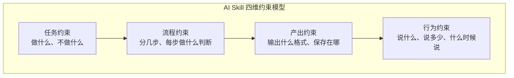
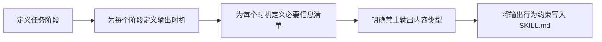

> **已原子化自**：[insight-extraction.md 洞察 4 + 规律 1](../../../reports/competitive-analysis/retrospective-ian-xiaohei-source-analysis-20260625/insight-extraction.md) —— Ian Xiaohei Illustrations 仓库源码分析

# 输出行为规范（Output Behavior Specification）

## 模式类型

方法论模式

## 成熟度

L2 已验证（Ian Xiaohei Illustrations 完整实践验证）

## 适用场景

设计 AI Skill 时，需要约束 Agent 不仅「产出正确的结果」，还要「以合适的方式与人沟通」——控制 Agent 何时说话、说什么、说多少。

## 问题背景

大多数 AI Skill 设计只关注三个维度：任务约束（做什么）、流程约束（怎么做）、产出约束（输出什么格式）。但这三个维度忽略了一个关键问题：**Agent 在完成任务的过程中如何与用户沟通**。

AI Agent 有一个天然的坏习惯——喜欢在完成任务后进行「邀功式解释」。如果不加约束，Agent 会在每步操作后写一大段解释，既浪费 token 又降低用户体验。这正是「输出行为约束」要解决的问题——它是 Skill 设计的**第四维度**。



## 核心规则

### 规则 1：定义「何时说话」

明确 Agent 的输出时机：

- 生成前输出什么（如「策略摘要」）
- 生成中是否需要进度反馈
- 生成后输出什么（如「交付清单」）
- 什么情况下保持沉默

### 规则 2：定义「说什么」

为每个输出时机定义必要的信息清单：

```text
生成后的交付清单应包含：
- 生成了几张
- 每张图的用途
- 保存路径
- 哪些最稳，哪些是可选
```

### 规则 3：定义「不说什么」

明确禁止的输出内容类型：

```text
不要长篇解释风格理论；让图自己说话。
```

### 规则 4：输出口径与任务阶段绑定

不同任务阶段的输出行为应有不同的约束：

| 阶段 | 输出约束 |
|------|---------|
| 策略规划 | 输出要短而准，只列出 shot list |
| 实际生成 | 静默执行或仅进度反馈 |
| 交付确认 | 输出交付清单（四要素） |
| 质量迭代 | 仅输出修改内容，不重复解释 |

## 操作流程



## 实施检查清单

- [ ] 是否定义了 Agent 在哪些时点输出？
- [ ] 每个输出时机是否有必要信息清单？
- [ ] 是否明确禁止了特定的输出内容类型（如「不要长篇解释」）？
- [ ] 输出行为约束是否与任务阶段绑定？
- [ ] 是否区分了「面向用户的输出」和「内部推理」？

## 反例警示

| 错误做法 | 后果 |
|---------|------|
| 只定义产出格式，不约束 Agent 的沟通行为 | Agent 每步都写大段解释，token 消耗翻倍 |
| 约束过于严格（如「永远不要解释」） | 用户无法理解 Agent 的决策，降低信任 |
| 不同任务阶段使用统一的输出约束 | 策略阶段的摘要太简略，交付阶段的信息太啰嗦 |
| 未定义「沉默时机」 | Agent 在不需要沟通的阶段仍频繁输出 |

## 正例

Ian Xiaohei Skill 的输出口径（SKILL.md）：

```
生成前的策略输出要短而准。生成后的交付要包含：
- 生成了几张
- 每张图的用途
- 保存路径
- 哪些图最稳，哪些图是可选

不要长篇解释风格理论；让图自己说话。
```

## 与现有模式的关系

- `dual-interface-repository.md`：本模式关注「Agent 说什么」，该模式关注「文件放在哪」。两者共同构成 AI Skill 工程的行为层 + 物理层设计。
- `progressive-context-disclosure.md`：该模式控制「给 Agent 多少信息（输入）」，本模式控制「Agent 输出多少信息（输出）」。两者共同优化 Agent 的 token 利用率。
- `symptom-prescription-qa.md`：本模式控制「正常流程的输出行为」，该模式控制「异常流程的反馈行为」。

> **关联模块**：
> - `dual-interface-repository.md`
> - `progressive-context-disclosure.md`
> - `symptom-prescription-qa.md`
