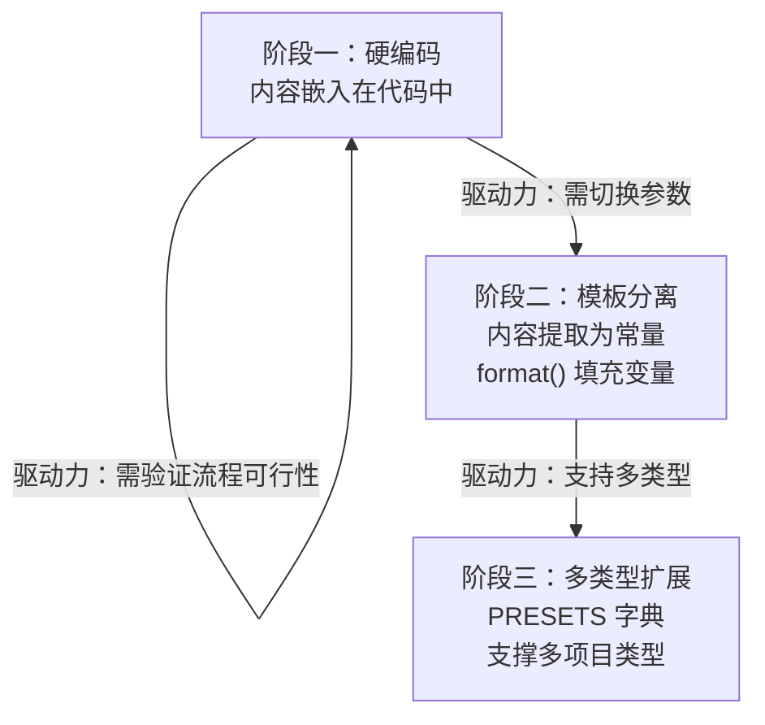
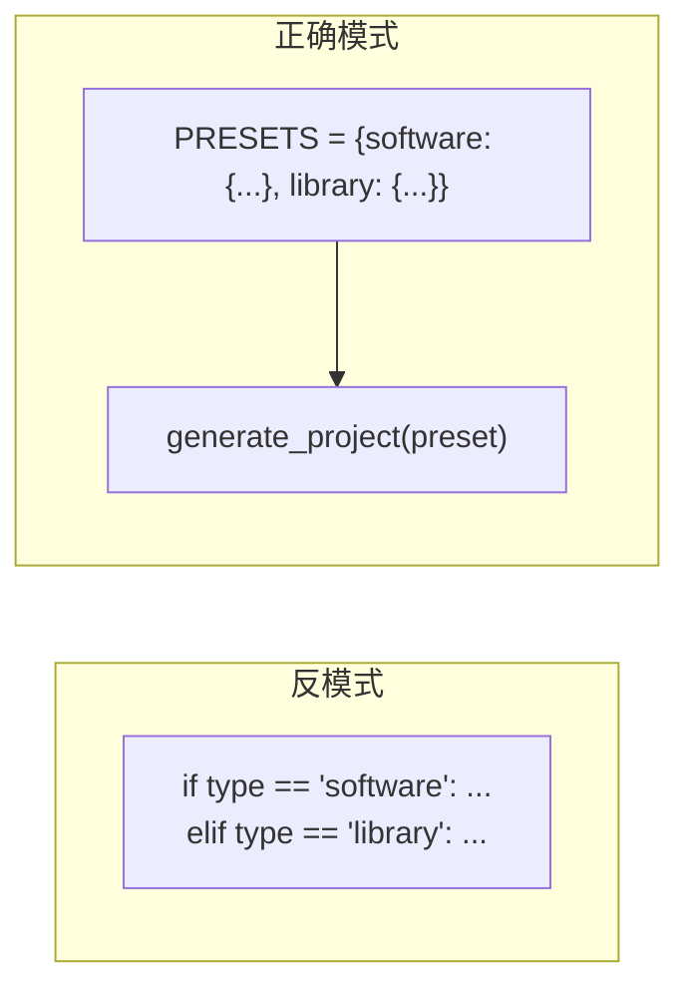

+++
id = "progressive-templating"
domain = "methodology"
layer = "methodology"
maturity = "L1"
validation_count = 1
reuse_count = 0
documentation_level = "standard"
source = "docs/retrospective/reports/retrospective-insight-extraction-comprehensive-20260623.md#七、中优先级改进建议执行"

[bindings]
rules = []
references = ["convention-driven-creation.md"]
skills = []
+++

> **来源**：从 `docs/retrospective/reports/retrospective-insight-extraction-comprehensive-20260623.md` 七、中优先级改进建议执行 — S6 执行萃取 拆分

# 渐进式模板化（Progressive Templating）

## 模式类型
方法论模式

## 成熟度
L1 实验性（基于 S6 agents.py 开发过程的单次萃取）

## 适用场景
需要将硬编码内容转化为可复用的模板时，希望避免过度设计和不必要的模板引擎依赖。

## 问题背景

从零设计模板引擎有两个常见陷阱：

- **过度设计**：在需求未明确时引入 Jinja2/Mustache 等模板引擎，增加不必要的依赖
- **过早抽象**：在只有 1-2 个实例时就试图提取通用模板，导致模板抽象不准确

本模式提供一种**需求驱动、逐层抽象**的替代路径。

## 操作流程

渐进式模板化分为三个阶段，每阶段由一个驱动力触发：

## 三阶段详解

### 阶段一：硬编码

| 维度 | 内容 |
|------|------|
| 目标 | 验证 CLI 流程可行性，确保代码逻辑正确 |
| 形式 | 内容直接内嵌在 `format()` 调用或字符串拼接中 |
| 决策原则 | **先用能跑起来的代码验证思路，不花时间设计模板** |
| 技术债务 | 硬编码是一次性的——它将在阶段二中被替换 |

### 阶段二：模板分离

| 维度 | 内容 |
|------|------|
| 触发条件 | 需要根据参数（如 `--lang`）切换内容 |
| 形式 | 内容提取为模块级常量（如 `AGENTS_MD_TEMPLATE`），用 `str.format()` 填充变量 |
| 关键决策 | **使用内置工具（str.format）而非外部模板引擎如果变量数 ≤ 6 且无循环/条件逻辑** |

### 阶段三：多类型扩展

| 维度 | 内容 |
|------|------|
| 触发条件 | 需要支持多种项目类型（如 software vs library） |
| 形式 | 建立 `ROLE_PRESETS` 字典，将类型差异集中到数据层，代码层保持通用 |
| 抽象模式 | **差异在数据（PRESETS），共性在代码（generate_project 函数）** |

## 关键原则

1. **硬编码不是债务，是信息来源**：阶段一的硬编码内容为阶段二的模板化提供了准确的变量候选
2. **驱动力决定升级时机**：只有在新需求迫使模板化时才升级，不预先做"将来可能用到"的抽象
3. **内置工具优先于外部依赖**：`str.format()` 在 70% 的场景中足够用，引入 Jinja2 仅当需要循环/条件/过滤器等高级特性
4. **差异在数据、共性在代码**：多类型支持的抽象质量取决于差异是否被正确归入数据层

## 效率数据

| 方式 | 从零设计模板 | 渐进式模板化 |
|------|------------|------------|
| 模板设计耗时 | 需预先推理所有变量 | 从硬编码实例中提取，效率高 3 倍 |
| 依赖风险 | 可能引入不必要的模板引擎 | 仅在需要时引入 |
| 模板准确性 | 可能过度或不足抽象 | 由实际使用驱动，精准匹配需求 |

## 成功案例

| 任务 | 阶段一 | 阶段二 | 阶段三 |
|------|--------|--------|--------|
| S6 agents.py init 开发 | 硬编码 AGENTS.md 内容验证流程 | 提取为 `AGENTS_MD_TEMPLATE` 常量 + `--lang` 参数 | `ROLE_PRESETS` 字典支持 software/library 两类 |

## 与现有模式的关系

是 `convention-driven-creation`（先读范例再扩展）在模板化场景的特化——"先写一个实例（阶段一），再提取为模板（阶段二），最后扩展到多类型（阶段三）。"

> **关联模块**：
> - `convention-driven-creation.md`
> - `.agents/scripts/agents.py`
