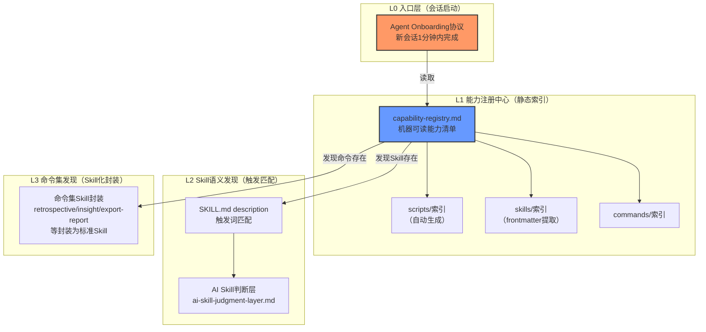
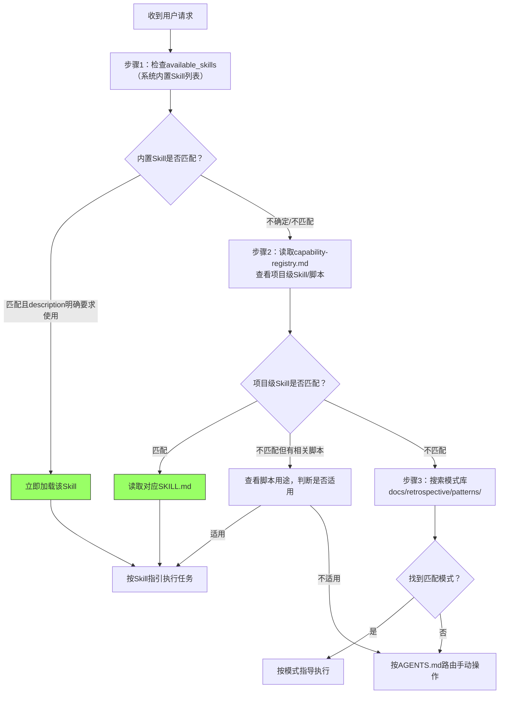
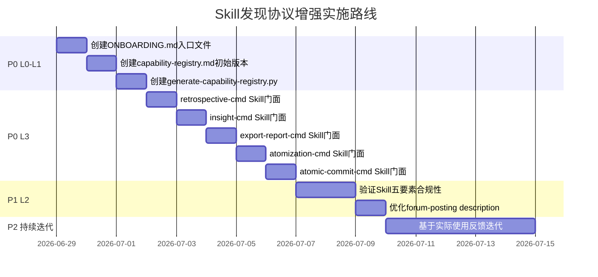

> **来源**：Firecrawl 系统学习复盘（洞察1+洞察4）+ 架构优先级评估复盘（洞察A+洞察B）
> **验证次数**：1次（本SOP为规范设计，基于Firecrawl参照系+forum-posting实践经验）

# Skill 发现协议增强 SOP

## 模式类型
方法论模式（AI协作架构模式）

## 成熟度
L1 设计完成（基于Firecrawl参照系和forum-posting实践经验设计，待逐步实现验证）

## 适用场景

| 场景 | 是否适用 | 说明 |
|------|---------|------|
| 新会话启动/Agent首次接入 | ✅ 核心场景 | Onboarding协议快速建立上下文 |
| 任务执行中需要选择工具/Skill | ✅ 核心场景 | 三层发现机制快速定位能力 |
| 新Skill/命令/脚本添加后 | ✅ 适用 | 能力注册中心自动索引 |
| 跨vendor子模块能力调用 | ✅ 适用 | 统一发现接口屏蔽边界复杂度 |
| 简单单文件操作（如读一个已知文件） | ⚠️ 部分适用 | 直接操作，无需走完整发现流程 |
| 人类开发者手动查找文档 | ❌ 不适用 | 本协议面向AI Agent设计 |

## 问题背景

当前SpecWeave存在**"能力发现层缺失"**问题——AI在新会话中需要：
1. **手动遍历目录**：通过LS/Glob逐个查看`.agents/`、`docs/`下有什么文件
2. **猜触发词**：不确定用户的说法是否对应某个Skill
3. **不知道有什么命令**：retrospective/insight/export-report等命令集没有统一入口
4. **PDR读取负担重**：前置文档强制读取协议（PDR）要求读大量文档，但Agent不知道"哪些是必须的、哪些是按需的"

类比Firecrawl的设计哲学：Firecrawl不要求用户先研究API文档再调用，而是通过`/scrape`、`/crawl`的Keyless设计让新用户零成本试用。SpecWeave同样需要一个Agent-First的能力发现层，让新会话的Agent在1-2轮工具调用内就能知道"我能做什么、该用什么工具"。

**目标**：实现"Agent-First"的能力发现——不需要人类预先说明所有功能，AI自己能快速发现可用能力并正确使用。

---

## 三层发现机制架构



---

## 分步详解

### 第一步：Agent Onboarding 协议（L0 入口层）

**目标**：新会话启动时，Agent在1-2轮工具调用内完成能力发现，建立基本上下文，而非盲目遍历目录。

#### 1.1 Onboarding 文件位置与格式

创建单一入口文件：`.agents/ONBOARDING.md`（YAML frontmatter + Markdown）

> **为什么放在.agents/根目录？** 与AGENTS.md同级，是Agent接入的第二份文档（AGENTS.md是全局规则，ONBOARDING.md是能力索引），避免深层路径发现成本。

#### 1.2 Onboarding 内容结构

```yaml
---
version: "1.0"
last_updated: "2026-06-29"
schema: "specweave-onboarding-v1"
---

# SpecWeave Agent Onboarding

## 快速开始（3步）

1. **读取本文件** → 你已经在这里了
2. **读取能力注册中心** → [.agents/capability-registry.md](capability-registry.md)
3. **根据任务类型加载对应Skill** → 见下表

## 能力速查表

| 你要做什么 | 应该用什么 | 去哪里找 |
|-----------|-----------|---------|
| 执行复盘/洞察/导出 | retrospective命令集 | [.agents/commands/](commands/) 或对应Skill |
| 操作论坛帖子 | forum-posting Skill | [.agents/skills/forum-posting/SKILL.md](skills/forum-posting/SKILL.md) |
| 代码审查 | TRAE-code-review Skill | 内置Skill（见available_skills列表） |
| 浏览器自动化 | integrated_browser MCP | MCP工具（见mcp_file_system_servers） |
| 原子化/文件重构 | 脚本工具 | [.agents/scripts/](scripts/) |
| 检查链接/验证规范 | check-*.py脚本 | [.agents/scripts/](scripts/) |
| 查阅技术知识库 | docs/knowledge/ | [docs/knowledge/README.md](../docs/knowledge/README.md) |
| 查阅复盘模式库 | docs/retrospective/patterns/ | [docs/retrospective/patterns/README.md](../docs/retrospective/patterns/README.md) |

## 必知vs按需

| 文档 | 何时读 | 优先级 |
|------|--------|--------|
| AGENTS.md | **每个会话必读**（启动协议） | 🔴 必须 |
| capability-registry.md | **每个会话必读**（本协议） | 🔴 必须 |
| .agents/rules/stage-guardrails.md | 涉及跨阶段操作前 | 🟡 按需 |
| .agents/protocols/pre-document-reading.md | 进入开发阶段前 | 🟡 按需 |
| 具体模块的规范 | 操作该模块时 | 🟢 按需 |
| docs/knowledge/*.md | 需要相关知识时 | 🟢 按需 |

## 任务类型→路由映射

| 任务关键词 | 路由目标 |
|-----------|---------|
| "复盘"、"retrospective" | retrospective命令集 |
| "洞察"、"insight" | insight命令集 |
| "导出报告"、"export" | export-report命令集 |
| "发帖"、"论坛"、"forum" | forum-posting Skill |
| "Skill"、"技能"、"创建技能" | skill-creator vendor Skill + skill-development.md |
| "原子化"、"拆分文件" | atomization命令集 + finalize-atomization.py |
| "检查链接" | check-links.py |
| "CI检查" | ci-check.ps1/ci-check.sh |
```

#### 1.3 Onboarding 读取规则

```
新会话启动协议（修订版）：
1. 读取 AGENTS.md（全局规则，已存在）
2. 读取 .agents/ONBOARDING.md（本协议新增，能力索引入口）
3. 根据任务类型，读取 capability-registry.md 的对应章节
4. 按需加载具体Skill/脚本/命令文档，而非全量预读
```

> **与PDR协议的关系**：Onboarding协议不是替代PDR（前置文档读取），而是给PDR一个"导航地图"——Agent通过Onboarding快速知道"哪些是必须的、哪些是按需的"，避免盲目遍历。

---

### 第二步：能力注册中心（L1 静态索引层）

**目标**：提供机器可读的能力清单，Agent不用遍历目录就能知道有哪些脚本、Skill、命令可用。

#### 2.1 注册中心文件位置与格式

创建：`.agents/capability-registry.md`

格式：YAML frontmatter（供脚本解析）+ Markdown表格（供Agent阅读）

#### 2.2 注册中心内容结构

```yaml
---
version: "1.0"
last_generated: "2026-06-29"
generator: "generate-capability-registry.py"
schema: "specweave-capability-registry-v1"
counts:
  scripts: 12
  skills: 1
  commands: 5
  workflows: 3
---

# SpecWeave 能力注册中心

> 本文档由脚本自动生成，不要手动编辑。重新生成：`python .agents/scripts/generate-capability-registry.py`

## 脚本索引（.agents/scripts/）

| 脚本名 | 用途 | 触发关键词 | 安全等级 | 支持dry-run |
|--------|------|-----------|---------|------------|
| check-links.py | 链接有效性验证与修复 | "检查链接"、"修复链接" | 读+修复 | ✅ |
| check-gitignore.py | Git忽略规则验证 | "检查gitignore" | 只读 | ✅ |
| check-vendor.py | vendor目录合规验证 | "检查vendor"、"子模块验证" | 只读 | ✅ |
| generate-nav.py | 导航表生成 | "生成导航" | 写 | ❌ |
| generate-dashboard.py | Spec进度看板生成 | "生成看板" | 写 | ❌ |
| finalize-atomization.py | 原子化一键收尾 | "收尾原子化" | 写 | ❌ |
| generate-tests.py | 测试骨架生成 | "生成测试" | 写 | ✅ |
| ci-check.ps1 | CI综合检查 | "CI检查"、"提交前检查" | 只读 | ✅ |
| generate-capability-registry.py | 生成本注册中心 | "更新能力索引" | 写 | ❌ |
| ... | ... | ... | ... | ... |

## Skill索引（.agents/skills/）

| Skill名 | 触发词 | 方案数 | 路径 |
|---------|--------|-------|------|
| forum-posting | "发帖"、"论坛"、"forum.trae.cn"、"回复帖子"、"清理草稿" | 2（脚本+MCP） | [.agents/skills/forum-posting/SKILL.md](skills/forum-posting/SKILL.md) |

## 命令集索引（.agents/commands/）

| 命令 | 用途 | 触发词 | 路径 |
|------|------|--------|------|
| retrospective | 项目复盘 | "复盘"、"retrospective"、"回顾" | [.agents/commands/retrospective.md](commands/retrospective.md) |
| insight | 洞察萃取 | "洞察"、"insight"、"分析问题" | [.agents/commands/insight.md](commands/insight.md) |
| export-report | 导出报告 | "导出报告"、"export"、"生成报告" | [.agents/commands/export-report.md](commands/export-report.md) |
| atomization | 文档原子化 | "原子化"、"拆分"、"atomize" | [.agents/commands/atomization.md](commands/atomization.md) |
| atomic-commit | 原子提交 | "提交"、"commit"、"原子提交" | [.agents/commands/atomic-commit.md](commands/atomic-commit.md) |

## 工作流索引（.agents/workflows/）

| 工作流 | 适用场景 | 路径 |
|--------|---------|------|
| feature-development | 新功能/扩展/重构 | [.agents/workflows/feature-development.md](workflows/feature-development.md) |
| code-review | PR审查 | [.agents/workflows/code-review.md](workflows/code-review.md) |
| testing | 测试执行 | [.agents/workflows/testing.md](workflows/testing.md) |

## 知识库索引（docs/knowledge/）

| 领域 | 文档 | 何时查阅 |
|------|------|---------|
| vendor子模块 | VENDOR-INTEGRATION.md | 涉及跨项目协同时 |
| 平台集成 | forum-automation.md | 操作论坛时 |
| 排障 | troubleshooting/*.md | 遇到问题时 |
```

#### 2.3 自动生成脚本

创建生成脚本：`.agents/scripts/generate-capability-registry.py`

功能：
- 扫描 `.agents/scripts/*.py` 和 `.agents/scripts/*.sh`/`.ps1`，提取docstring作为用途
- 扫描 `.agents/skills/*/SKILL.md`，提取frontmatter中的name、description
- 扫描 `.agents/commands/*.md`，提取标题和描述
- 生成上述Markdown文档
- 可在CI中运行确保注册中心与实际内容同步

---

### 第三步：Skill 语义发现增强（L2 触发匹配层）

**目标**：让Agent通过用户的自然语言描述，准确匹配到应该使用的Skill，解决"underdrigger"（该用Skill时没用）和"misd-trigger"（不该用时乱⽤）问题。

#### 3.1 Description 规范增强（基于五要素模型）

每个Skill的`description`字段必须包含：

```yaml
description: "【强制】当用户提到以下内容时必须使用本Skill：<触发词1>、<触发词2>、<同义词1>、<口语化表达>。
本Skill提供<方案数>种方案，封装了<核心优势>，不要手动拼接操作。"
```

**关键要求**（来自skill-development.md 3.1节）：
1. **完整触发词列表**：包含所有可能的用户表述（包括口语化、同义词）
2. **强制措辞**："必须使用此技能"/"不要手动操作"
3. **核心优势说明**：为什么用Skill比手动操作好
4. **Pushy但不误导**：针对underdrigger倾向，description需要足够"有说服力"

#### 3.2 AI Skill判断层决策流程

Agent在收到用户请求后，按以下流程判断是否使用Skill、使用哪个Skill：



**详细决策规则**（参考 `ai-skill-judgment-layer.md`）：

| 信号 | 判断 | 动作 |
|------|------|------|
| 用户明确说"用xx Skill" | 强匹配 | 直接加载指定Skill |
| 用户请求包含Skill description中的触发词 | 匹配 | 加载该Skill |
| 用户请求的操作领域是Skill封装的领域 | 弱匹配 | 先读SKILL.md确认是否适用，适用则使用 |
| 不确定是否有Skill | 未匹配 | 读capability-registry.md索引查找 |
| 找不到对应能力 | 无匹配 | 告知用户当前能力边界，或按通用流程手动执行 |

#### 3.3 Skill加载后的渐进式披露

读取SKILL.md后，不要立即执行：
1. **先读决策树**：根据Decision Tree选择合适方案
2. **读安全检查清单**：写操作必须先确认dry-run/预览机制
3. **读Why-Explanation**：理解关键规则背后的原因，应对边界情况
4. **常用命令/步骤内联，复杂内容引用知识库**：遵循Progressive Disclosure原则，不预读所有引用文档

---

### 第四步：命令集Skill化封装（L3 命令发现层）

**目标**：将retrospective/insight/export-report/atomization/atomic-commit五个命令集封装为标准Skill格式，让命令像Skill一样可被发现和使用，而不是靠"知道有这个命令"才能调用。

#### 4.1 命令集Skill化的必要性

当前命令集（`.agents/commands/`）存在的问题：
- Agent不知道有哪些命令（除非读过commands/README.md）
- 命令没有统一的触发描述
- 命令的参数、前置条件、安全机制分散在文档中

Skill化后：
- 命令出现在capability-registry.md的Skill索引中
- 命令有统一的description触发词
- 命令遵循五要素模型（Decision Tree/Safety Checklist/Why-Explanation）

#### 4.2 封装方式

**方案**：不移动现有commands/目录结构，而是在`.agents/skills/`下为每个命令创建轻量SKILL.md，作为入口门面，内容引用到commands/下的详细文档。

```
.agents/skills/
├── forum-posting/          # 现有完整Skill
│   └── SKILL.md
├── retrospective-cmd/      # 新增：复盘命令Skill门面
│   └── SKILL.md
├── insight-cmd/            # 新增：洞察命令Skill门面
│   └── SKILL.md
├── export-report-cmd/      # 新增：导出报告Skill门面
│   └── SKILL.md
├── atomization-cmd/        # 新增：原子化Skill门面
│   └── SKILL.md
└── atomic-commit-cmd/      # 新增：原子提交Skill门面
    └── SKILL.md
```

#### 4.3 命令Skill门面模板

以retrospective-cmd为例：

```yaml
---
name: retrospective-cmd
version: 1.0.0
description: "当用户提到'复盘'、'retrospective'、'回顾'、'总结经验'时，必须使用此Skill。提供项目复盘流程的标准化执行指引，包括复盘模板、洞察萃取、报告生成全流程。不要手动组织复盘流程——本Skill已封装标准化步骤。"
argument-hint: "<复盘类型> [范围]"
user-invocable: true
paths:
  - ".agents/commands/retrospective.md"
  - "docs/retrospective/reports/"
---

# Retrospective 命令 Skill

> ⚠️ **本Skill是命令入口门面**，详细步骤见 [.agents/commands/retrospective.md](../../commands/retrospective.md)

## 1. 功能描述

提供标准化的项目复盘执行能力：
- 复盘流程引导（七步/四步模型）
- 洞察萃取（从执行过程中提炼可复用模式）
- 改进建议生成（带优先级的行动项）
- 知识沉淀（写入模式库/知识库）

核心功能：引导复盘流程 → 萃取洞察 → 生成建议 → 沉淀知识。

## 2. 何时使用本技能

当用户提到以下内容时触发：
- "复盘"、"retrospective"、"回顾"、"做个复盘"
- "总结经验"、"总结一下"、"回顾一下"
- "萃取洞察"、"insight"（与insight-cmd协同）
- 项目里程碑/关键事件完成后

## 3. 方案选择决策树

```
需要执行复盘？
├─ 刚完成一个完整任务/项目？ → 标准复盘流程（参考retrospective.md四步法）
├─ 需要从对话中直接萃取洞察？ → insight-cmd（更轻量）
└─ 需要导出正式报告？ → export-report-cmd（与本Skill配合使用）
```

## 4. 快速开始

```
步骤1：读取 [.agents/commands/retrospective.md](../../../../../.agents/commands/retrospective.md) 了解完整流程
步骤2：按四步法执行：回顾目标 → 还原事实 → 分析偏差 → 提炼经验
步骤3：洞察萃取参考 [extraction-four-layer-funnel.md](../retrospective-knowledge/extraction-four-layer-funnel.md)
步骤4：生成改进建议，按优先级排序
```

## 5. 安全检查清单

- [ ] 复盘前已明确目标和范围（不是泛泛的"总结一下"）
- [ ] 事实还原基于数据和记录，而非主观印象
- [ ] 洞察提炼为可复用模式，而非停留在具体事件
- [ ] 行动项有明确的责任方和验收标准
- [ ] 沉淀知识时更新了对应模式库/知识库索引

## 6. 参考

- 完整命令文档：[.agents/commands/retrospective.md](../../../../../.agents/commands/retrospective.md)
- 四步法模型：[retrospective-four-step-method.md](../retrospective-knowledge/retrospective-four-step-method.md)
- 洞察萃取漏斗：[extraction-four-layer-funnel.md](../retrospective-knowledge/extraction-four-layer-funnel.md)
```

> **为什么用门面模式而非移动文件？** 保持commands/目录的原始语义（命令定义）和skills/目录（Skill入口）分离；门面只做发现和路由，详细内容仍在commands/，避免内容重复和同步问题。

---

## 实施路径（分阶段）



### P0阶段（立即实施）
1. ✅ 创建 `.agents/ONBOARDING.md`（本SOP中1.2节的内容）
2. ✅ 创建 `.agents/capability-registry.md`（初始版本，先手动维护，脚本后补）
3. ✅ 为5个命令集创建Skill门面（轻量版本，先解决"能不能发现"问题）
4. ✅ 修改AGENTS.md启动协议，在步骤1后增加"步骤1.5：读取ONBOARDING.md"

### P1阶段（近期优化）
1. 实现 `generate-capability-registry.py` 自动生成脚本
2. 验证所有Skill（含新增命令门面）的description符合五要素模型
3. 基于实际会话反馈，调整触发词和决策树

### P2阶段（长期演进）
1. 为高频率脚本（如check-links.py、finalize-atomization.py）也创建Skill门面
2. 探索vendor子模块能力的统一注册（跨三层路由的能力发现）
3. 增加"能力使用统计"——哪些能力最常被调用、哪些经常被误触发，用于持续优化

---

## 验收标准

### L0 Onboarding协议验收
- [ ] 新会话中Agent按"AGENTS.md → ONBOARDING.md → 按需加载"顺序工作
- [ ] Agent不再需要盲目LS/Glob遍历.agents/目录来发现有什么能力
- [ ] ONBOARDING.md中的能力速查表覆盖了80%以上常用操作
- [ ] "必知vs按需"表格帮助Agent减少不必要的预读

### L1 能力注册中心验收
- [ ] capability-registry.md存在且包含scripts/skills/commands三个索引
- [ ] 注册中心中的条目数与实际文件数一致
- [ ] 每个条目包含用途和触发关键词
- [ ] 生成脚本可运行，重新生成后无人工改动差异

### L2 Skill语义发现验收
- [ ] 所有SKILL.md的description符合"触发词+强制措辞+核心优势"三要素
- [ ] Agent能根据用户的口语化表达匹配到正确Skill（underdrigger率降低）
- [ ] 多方案Skill都有清晰的Decision Tree
- [ ] 写操作Skill都有Safety Checklist（dry-run/幂等/验证）

### L3 命令集Skill化验收
- [ ] 5个命令集都有对应的-cmd Skill门面
- [ ] 命令Skill出现在capability-registry.md中
- [ ] 通过Skill门面可以找到完整的命令文档（链接有效）
- [ ] 门面不重复命令文档内容，只做路由和快速指引

---

## 反模式（请勿这样做）

1. **"大而全的预读"**：新会话启动时把.agents/下所有文档读一遍——违背Agent-First原则，浪费上下文窗口
2. **"注册中心信息过载"**：把每个脚本的所有参数都放进注册中心——注册中心只做索引，细节在目标文件中
3. **"门面复制内容"**：Skill门面重复复制commands/下的详细内容——导致内容不同步
4. **"description写功能简介"**：description是触发入口，不是产品介绍页
5. **"只有静态索引没有语义匹配"**：仅靠capability-registry的表格查找不够，需要description的语义触发作为补充
6. **"一刀切要求所有东西都Skill化"**：低频、单一用途的脚本不需要Skill化，保持简单

---

## 与现有模式的关系

| 关联模式 | 关系 |
|---------|------|
| `skill-five-elements-model.md` | 本协议L2层的Skill质量标准，所有Skill必须满足五要素 |
| `skill-three-layer-value-model.md` | Skill的价值分层模型，指导哪些能力需要Skill化 |
| `ai-skill-judgment-layer.md` | Agent选择Skill的决策流程，本协议L2层依赖此模式 |
| `context-recovery-protocol.md` | 新会话上下文恢复，本协议L0 Onboarding是其增强版 |
| `progressive-context-disclosure.md` | 渐进式披露，指导Skill内容分层（内联常用内容，引用细节） |
| PDR协议（pre-document-reading.md） | Onboarding为PDR提供导航地图，不替代PDR |
| 启动协议（AGENTS.md） | 本协议是AGENTS.md启动协议的能力发现层扩展 |

---

## 实践案例

1. **forum-posting Skill**：当前唯一实现了五要素模型的完整Skill，其description（含完整触发词列表）、双方案决策树、Safety Checklist可作为参考样板
2. **Firecrawl参照系**：Firecrawl的Keyless模式（零配置开始）+ Agent-Readable服务描述（`.well-known/agent.json`提案）是本协议设计的外部灵感来源——核心思想是"让Agent自己发现能力，而非人类预先告知"
