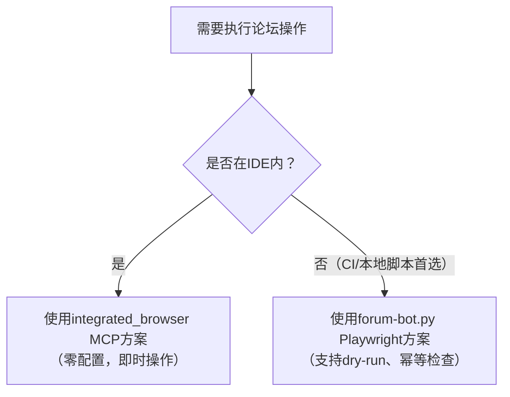
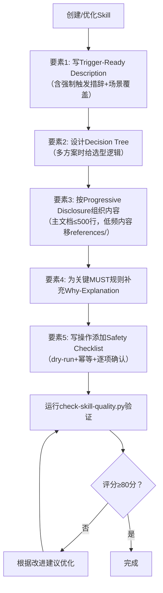

> **提炼自**：[insight-extraction.md](../../../reports/project-governance/tools-and-automation/retrospective-forum-posting-skill-optimization-20260629/insight-extraction.md) + vendor skill-creator 方法论 —— forum-posting Skill 优化实践

# Skill 五要素模型（Skill Five Elements Model）

## 模式类型

方法论模式（AI协作/Skill开发）

## 成熟度

L1 首次提炼（forum-posting Skill 优化完整验证，已被 SKILL-TEMPLATE 和 check-skill-quality.py 采用）

## 适用场景

创建新 Skill 或优化现有 Skill 时，确保 Skill 文档结构完整、触发准确、安全可靠、可维护性高。

本模型定义了高质量 AI Skill 必须包含的五个核心要素，每个要素解决一个特定问题，共同构成可预测、高质量的 Skill 开发标准。

**优化现有Skill时的前置步骤：资产盘点**

在开始修改Skill文档之前，必须先盘点项目中已有的相关资产，而不是只盯着现有SKILL.md文件改：
- ✅ 检查是否已有相关脚本/工具可以整合进Skill
- ✅ 检查是否已有可复用的共享库函数（如lib/下）
- ✅ 检查是否已有相关规则/规范文档需要引用
- ✅ 检查vendor/下是否有更权威的方法论资产需要遵循
- ✅ 检查是否已有类似Skill可以参考模式

> **为什么？** 只盯着现有文档内容改，容易重复造轮子、忽略项目中已有的基础设施、错过更成熟的方法论。资产盘点确保你的优化是站在整个项目的肩膀上，而不是闭门造车。

## 问题背景

Skill 开发常见问题：
1. **触发不准**：description 写得像功能简介，缺少触发词，导致该触发时不触发（undertrigger）
2. **决策负担重**：多方案场景只罗列方案不给决策树，Agent 需要自行判断选型
3. **信息过载**：SKILL.md 写得过长（>1000行），核心信息被淹没，Agent 抓不住重点
4. **边界情况差**：只罗列 MUST 规则不解释 Why，遇到边界情况 Agent 无法判断
5. **写操作不安全**：没有 dry-run、幂等检查和确认清单，容易误操作

## 核心要素

### 要素 1：Trigger-Ready Description（触发就绪描述）

**解决问题**：undertrigger（该触发时不触发）

Description 不是功能简介，是给模型看的"触发广告"，必须包含：
- ✅ **强制触发措辞**：显式写明"当用户提到XX时，**必须使用此技能**"
- ✅ **触发场景覆盖**：所有同义词、近义词、相关表述
- ✅ **反例排除**：明确说明"不要使用此技能"的场景（可选但推荐）
- ✅ **长度建议**：≥150字符，确保足够触发词覆盖

**正面示例**（来自 forum-posting）：
> Discourse论坛（forum.trae.cn）自动化操作。当用户需要发帖、编辑帖子、更新帖子、回复帖子、跟帖、发布论坛内容、清理草稿、读取帖子、操作forum.trae.cn、使用forum-bot脚本时，必须使用此技能。

**反面示例**：
> 论坛操作工具。

### 要素 2：Decision Tree（决策树/方案选型指引）

**解决问题**：多方案场景下 Agent 的决策负担

当 Skill 提供多种实现方案时（如双方案模式），不能只并列罗列方案，必须提供：
- ✅ **树形决策逻辑**：什么条件下用方案A，什么条件下用方案B
- ✅ **优先级说明**：默认首选哪个方案， fallback 方案是什么
- ✅ **判断依据**：给出明确的判断标准，而非让 Agent 自行权衡

**Mermaid 决策树示例**：


### 要素 3：Progressive Disclosure（渐进式披露）

**解决问题**：信息过载，核心内容被淹没

SKILL.md 不是越长越好，应该控制在 **≤500行**，采用分层结构：
- ✅ **核心层**（SKILL.md 主文件，≤500行）：最常用、最关键的信息（触发条件、核心流程、安全检查、MUST规则）
- ✅ **参考层**（references/ 子目录）：低频使用的详细说明、API文档、边缘情况处理
- ✅ **示例层**（examples/ 子目录，可选）：完整的 few-shot 示例

**Why？** 模型的上下文窗口是有限的，核心信息越浓缩，被正确遵循的概率越高。低频内容移到子文档，需要时再读取。

### 要素 4：Why-Explanation（设计意图解释）

**解决问题**：边界情况判断能力差

只写"MUST do X"是不够的——遇到规范没覆盖的边界情况时，Agent 需要理解**为什么要有这条规则**才能做出正确判断。

格式要求：
- 关键 MUST 规则后紧跟引用块
- 以 `> **为什么？**` 开头
- 用1-3句话解释设计意图、权衡考虑、不这样做的后果

**示例**：
> **MUST**：支持双方案（forum-bot.py + integrated_browser MCP）。
> 
> **为什么？** forum-bot.py 是本地/CI首选（支持dry-run、幂等检查、登录持久化），integrated_browser是IDE内即时操作首选（零配置）。只提供一个方案会导致场景适配性差。

### 要素 5：Safety Checklist（安全检查清单）

**解决问题**：写操作误执行、不可恢复的破坏

所有涉及**写操作**（创建/编辑/删除/发布/更新）的 Skill，必须包含结构化安全检查清单：
- ✅ **Dry-run 机制**：执行前先预览结果，确认后再实际执行
- ✅ **幂等性检查**：重复执行不会产生副作用（如"帖子已存在则跳过"）
- ✅ **逐项检查清单**：用 `- [ ]` 格式列出执行前必须确认的项
- ✅ **存在性检查**：操作目标不存在/已存在时的处理逻辑

**清单示例**（来自 forum-posting）：
```
执行写操作前逐项确认：
- [ ] 是否已通过 dry-run/预览确认内容正确？
- [ ] 是否已检查目标是否已存在（避免重复发布）？
- [ ] 幂等检查条件是否满足？
- [ ] 是否需要用户显式确认？
```

## 操作流程



## 验证工具

- **自动化检查**：运行 `.agents/scripts/check-skill-quality.py` 自动检测五要素完整性，输出0-100分质量评分
- **模板参考**：`.agents/skills/SKILL-TEMPLATE.md` 包含完整五要素框架，直接填空即可
- **参考样例**：`.agents/skills/forum-posting/SKILL.md` 是经过验证的正面样例（95分）

## 实施检查清单

**优化现有Skill前：**
- [ ] 是否做了资产盘点？检查项目中已有的脚本、共享库、相关规范、vendor方法论资产？

**创建/优化 Skill 后对照检查：**
- [ ] Description 是否包含"必须使用此技能"强制措辞？
- [ ] Description 是否覆盖了所有触发场景和同义词？
- [ ] 多方案时是否提供了决策树而非并列罗列？
- [ ] SKILL.md 主文档是否≤500行？
- [ ] 关键MUST规则后是否有Why解释？
- [ ] 写操作是否包含dry-run机制？
- [ ] 写操作是否有幂等性检查？
- [ ] 是否有结构化的安全检查清单（- [ ]格式）？
- [ ] 是否运行了check-skill-quality.py验证？

## 评分标准

check-skill-quality.py 评分规则：
| 检查项 | 失败扣分 | 权重 |
|-------|---------|------|
| Frontmatter name/description 缺失 | -15/项 | 最高 |
| Description 缺少强制触发措辞 | -5 | 高 |
| 写操作缺少dry-run | -15 | 最高 |
| 文件超过500行 | -15 | 高 |
| 缺少Why解释 | -5 | 中 |
| 缺少安全检查清单 | -5 | 中 |
| 使用file:///绝对路径 | -15 | 高 |
| 多方案缺少决策树 | -5 | 中 |
| 建议字段缺失 | -5/项 | 低 |

**合格线**：≥70分；**优秀线**：≥90分。

## 反例警示

| 错误做法 | 违反要素 | 后果 |
|---------|---------|------|
| Description只写"论坛操作工具" | 要素1 | undertrigger，用户说"发帖"时模型不知道要用这个Skill |
| 只写"方案A和方案B都可以用" | 要素2 | Agent随机选方案，场景适配性差 |
| SKILL.md写了800行，所有内容堆在一起 | 要素3 | Agent抓不住重点，关键规则被忽略 |
| 写满MUST但没有一条解释为什么 | 要素4 | 边界情况时Agent胡乱判断 |
| 写操作直接执行没有预览 | 要素5 | 误操作无法恢复 |

## 正例

forum-posting SKILL.md v1.1.0：
- Description 248字符，包含"必须使用此技能"强制措辞
- 双方案配有完整Mermaid决策树
- 313行（≤500行）
- 7个Why解释
- 11项安全检查清单
- check-skill-quality.py 评分：95分

## 与现有模式的关系

- `progressive-templating.md`：本模式的要素3（渐进式披露）是渐进式模板化在Skill文档结构中的具体应用
- `symptom-prescription-qa.md`：check-skill-quality.py的改进指引输出采用了症状-处方模式
- `dry-run-first.md`：本模式要素5（安全检查清单）将dry-run-first作为写操作Skill的强制要求
