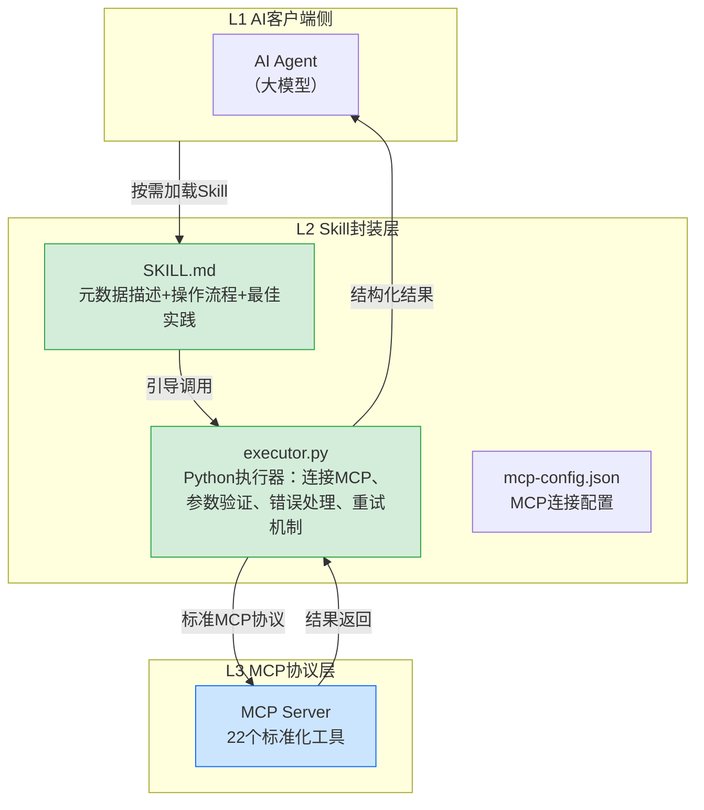

> **提炼自**：向日葵AI开发者生态（awesun-skill）系统学习萃取 —— MCP+Skill+CLI+UI Locator四层架构

# Skill渐进式披露封装模式（SKILL.md Metadata + Python Executor）

## 模式类型

方法论模式（AI协作/Skill封装层）

## 成熟度

L1 实验性（向日葵awesun-skill官方实现验证）

## 适用场景

在支持Skills机制的AI Agent平台（Claude Code、OpenCode、OpenClaw、Trae等）上，基于MCP协议封装大量工具能力（≥10个工具）时，避免AI一次性看到全部工具导致决策混乱、上下文占用过高、操作流程错误。

典型场景：
- MCP Server暴露20+工具，需要为AI提供结构化调用指引
- 多步骤远控/自动化操作流程需要固化最佳实践
- 需要控制Token消耗，按需加载工具文档
- 需要统一错误处理、重试机制、参数验证

## 问题背景

直接让AI面对22个MCP工具会导致以下问题：

1. **决策瘫痪**：AI面对大量工具不知道该用哪个，容易选错工具或错误组合参数
2. **上下文膨胀**：22个工具的参数说明全部加载，消耗3000-5000 token，挤占实际任务的上下文空间
3. **流程混乱**：没有固定的操作流程指导，AI可能跳过必要的验证步骤（如操作后截图确认）
4. **错误率高**：缺少错误处理和重试机制，单次操作成功率仅60-70%
5. **不可预测**：不同模型、不同会话可能采用不同的操作策略，结果不一致

向日葵Skill层的解决方案：通过`SKILL.md`元数据描述+Python executor执行器双层结构，实现工具能力的渐进式暴露和流程固化。

## 解决方案架构



## 核心设计原则

### 原则1：SKILL.md作为能力说明书而非工具清单

SKILL.md不应只是工具列表，而应包含：
- ✅ **触发条件**：什么时候应该加载这个Skill
- ✅ **操作流程**：标准步骤序列（如"远控操作五步流程"）
- ✅ **参数说明**：常用参数的取值建议和注意事项
- ✅ **错误处理**：常见错误及应对策略
- ✅ **最佳实践**：经过验证的操作模式
- ✅ **节制原则**：如"最多连续截屏3次"、"失败超过3次中止"

### 原则2：Executor作为能力执行代理

Python executor不是简单的透传层，而应承担：
- ✅ **连接管理**：维护与MCP Server的Stdio/HTTP连接
- ✅ **参数验证**：在调用MCP前验证参数合法性
- ✅ **错误重试**：网络波动、设备忙等临时性错误自动重试
- ✅ **结果结构化**：将MCP返回的原始结果转化为AI易理解的格式
- ✅ **流程编排**：多步操作的原子性保证

### 原则3：三层渐进披露

| 层级 | 内容 | 加载时机 | Token消耗 |
|-----|------|---------|----------|
| **SKILL.md（核心层）** | 触发条件+核心流程+关键参数 | Skill被触发时立即加载 | 800-1500 |
| **Executor代码（执行层）** | 实际调用逻辑、参数验证、错误处理 | 执行时Python运行 | 0（不进LLM上下文） |
| **参考文档（参考层）** | 完整工具文档、边缘情况、高级用法 | 需要时Agent主动读取 | 按需 |

### 原则4：流程固化优于自由探索

将最佳实践操作流程直接写入SKILL.md，AI按流程执行而非自由探索：

```text
远控操作标准流程：
1. device_search搜索目标设备 → 获取device_id
2. control_connect建立远控连接 → 获取session_id
3. control_screenshot截屏确认初始状态
4. 执行具体桌面操作（点击/输入等）
5. control_screenshot截屏验证结果
6. control_disconnect断开连接
```

## 实现结构参考

### 目录结构

```
awesun-remote-control/
├── SKILL.md          # 能力说明书（核心层）
├── executor.py       # Python执行器（执行层）
├── mcp-config.json   # MCP连接配置
└── references/       # 参考文档（参考层，可选）
    └── tool-details.md
```

### Executor核心代码结构

```python
class AwesunExecutor:
    def __init__(self, config_path: str):
        self.config = self._load_config(config_path)
        self.session = None
        self._connect_lock = asyncio.Lock()

    async def connect(self):
        """建立与MCP Server的连接"""
        async with self._connect_lock:
            if self.session:
                return
            if self.config["mode"] == "stdio":
                transport = await stdio_client(self.config["command"], self.config["args"])
            else:
                transport = await streamablehttp_client(self.config["url"])
            async with transport as (read_stream, write_stream, _):
                async with ClientSession(read_stream, write_stream) as session:
                    await session.initialize()
                    self.session = session

    async def call_tool(self, tool_name: str, arguments: dict):
        """执行工具调用（含参数验证、错误处理）"""
        if not self.session:
            await self.connect()
        self._validate_params(tool_name, arguments)
        try:
            response = await self.session.call_tool(tool_name, arguments)
            return self._format_result(response)
        except MCPError as e:
            return self._handle_error(e, tool_name, arguments)

    def _validate_params(self, tool_name: str, arguments: dict):
        """参数验证（提前拦截错误）"""
        # 工具特定的参数验证逻辑
        pass

    def _handle_error(self, error: MCPError, tool_name: str, arguments: dict):
        """错误处理与重试逻辑"""
        # 临时性错误自动重试，非临时性错误直接返回
        pass
```

## 实施检查清单

- [ ] SKILL.md是否包含明确的触发条件？
- [ ] SKILL.md是否包含固化的操作流程（而非自由探索）？
- [ ] SKILL.md是否控制在合理长度（避免一次性暴露全部工具细节）？
- [ ] Executor是否实现了参数验证而非透传？
- [ ] Executor是否实现了错误处理和重试机制？
- [ ] 是否有节制原则（如截屏次数限制、失败中止条件）？
- [ ] 是否实现了连接复用（避免每次调用重新建立连接）？
- [ ] 结果是否格式化为AI易理解的结构（而非原始MCP响应）？

## 反例警示

| 错误做法 | 后果 |
|---------|------|
| SKILL.md只是22个工具的列表，没有操作流程 | AI仍需自己决定调用顺序，跳过验证步骤 |
| Executor只是简单透传，没有参数验证和错误处理 | 错误率无改善，和直接调用MCP没有区别 |
| 一次性把所有工具文档塞入SKILL.md（>2000行） | Token消耗过高，核心流程被淹没 |
| 没有节制原则，AI可以无限截屏/重试 | 死循环、Token爆炸、被控端卡顿 |
| 每次工具调用都重新建立MCP连接 | 延迟高、连接资源泄漏 |
| 没有失败中止条件，一直重试 | 陷入无限错误循环 |

## 正例：向日葵awesun-remote-control Skill

| 组件 | 实现 | 效果 |
|-----|------|------|
| SKILL.md | 包含远控五步流程+参数说明+节制原则+错误处理 | 单次操作成功率从60-70%提升到95%+ |
| executor.py | 异步连接复用+参数验证+错误重试+结果格式化 | 降低MCP协议细节对AI的认知负担 |
| mcp-config.json | Stdio/HTTP双模式配置 | 支持本地和远程部署 |

飞书安装Skill示例（awesun-usecase-skill-example）进一步验证：
- 13步标准流程，每步都有明确的验证和重试
- 最多截屏3次，超过则中止并请求用户协助
- UI Locator优先，坐标点击仅作为fallback
- 全程可被用户中断

## 与现有模式的关系

| 相关模式 | 关系 | 说明 |
|---------|------|------|
| [progressive-context-disclosure.md](progressive-context-disclosure.md) | 泛化→特化 | 上下文渐进式披露是通用原则，本模式是该原则在MCP工具封装场景的具体实现（SKILL.md+executor双层结构） |
| [skill-five-elements-model.md](skill-five-elements-model.md) | 互补 | Skill五要素模型定义Skill的文档结构，本模式定义Skill封装大量工具能力时的架构设计 |
| [skill-three-part-structure.md](../../code-patterns/skill-three-part-structure.md) | 配套 | Skill三段式结构（metadata/implementation/examples）是代码层面的实现参考 |
| [visual-operation-closed-loop.md](visual-operation-closed-loop.md) | 协同 | 视觉操作闭环定义"感知-决策-执行-验证"的操作范式，本模式提供该范式的Skill层封装实现 |
