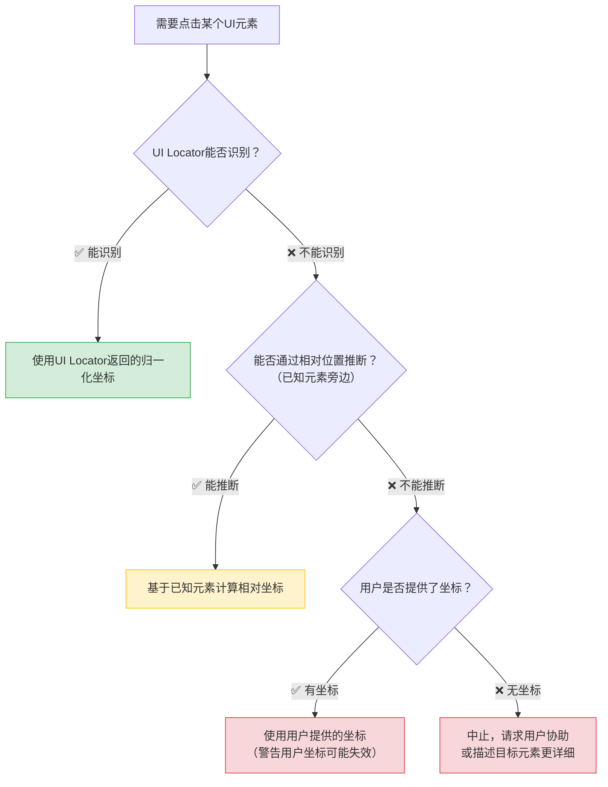

> **提炼自**：向日葵awesun-usecase-skill-example（飞书安装Skill）官方示例萃取 —— 场景化Skill开发最佳实践

# Skill标准化操作流程模式（Four Principles for Workflow Skill Design）

## 模式类型

方法论模式（AI协作/场景化Skill设计）

## 成熟度

L1 实验性（向日葵飞书安装Skill官方示例验证）

## 适用场景

开发面向特定业务场景的操作型Skill时（如"远程安装软件"、"批量配置设备"、"自动化部署应用"等），需要将多步骤操作流程固化为可重复、可验证、可失败中止的标准化流程。

典型场景：
- 软件远程安装/升级/卸载自动化
- 跨设备批量运维操作
- 标准化业务流程自动化（如"新员工入职电脑配置"）
- 多步骤GUI操作任务（需要视觉闭环验证）
- 任何需要"按部就班执行、出错就停"的确定性任务

## 问题背景

开发场景化操作Skill时，常见设计缺陷：

1. **没有重试机制**：一次点击失败就整个任务失败，实际上可能只是网络延迟或UI响应慢
2. **截屏无节制**：AI遇到不确定情况就疯狂截屏，消耗大量Token，被控端卡顿
3. **失败不中止**：某一步失败后继续执行后续步骤，导致在错误状态上累积更多错误
4. **坐标依赖强**：大量使用固定坐标点击，UI稍有变化（分辨率/窗口位置/版本升级）就全部失效
5. **无状态管理**：没有记录哪些步骤已完成、哪些失败，出错后无法从断点续传
6. **步骤粒度过粗**：一个步骤包含多个操作，无法定位具体哪一步失败

向日葵飞书安装Skill示例展示了操作型Skill的四大设计原则，有效解决上述问题。

## 四大核心设计原则

### 原则1：有限重试（Bounded Retry）

每个操作步骤都应该有重试机制，但必须设置明确上限：

```text
单步重试规则：
- 每个步骤最多重试 2-3 次
- 重试前必须重新截图+重新定位（不要用第一次的坐标）
- 重试时可以尝试备用策略（如第一次用语义定位，重试时用相对定位）
- 达到重试上限后立即中止，报告失败步骤和当前状态
```

**反模式**：
- ❌ 只试一次，失败就放弃（网络波动时成功率低）
- ❌ 无限重试直到成功（死循环、Token爆炸、可能误操作）
- ❌ 重试时不重新截图（用旧坐标重复点击同样错误的位置）

### 原则2：截屏节制（Screenshot Discipline）

截屏是消耗Token和被控端资源的操作，必须严格节制：

| 场景 | 允许截屏 | 限制 |
|-----|---------|------|
| 操作前确认状态 | ✅ | 每步操作前1张 |
| 操作后验证结果 | ✅ | 每步操作后1张 |
| 重试前重新定位 | ✅ | 每次重试1张 |
| "我看看现在什么情况" | ❌ 禁止 | 无目的截屏是浪费 |
| 连续多张截图找东西 | ❌ 禁止 | 先分析再行动，不要扫射式截图 |

**量化限制**：
- 单步操作（含重试）截屏 ≤ 3张
- 整个任务截屏总数 ≤ 步骤数 × 2
- 两次截屏之间必须有操作或等待，不能连续空截屏

### 原则3：失败中止（Fail-Fast Abort）

任何步骤达到重试上限后，必须立即中止整个任务，而不是继续尝试后续步骤：

```text
中止流程：
1. 立即停止后续操作
2. 截取当前错误界面（留存证据）
3. 报告：已完成哪些步骤、哪一步失败、失败原因（附截图描述）
4. 请求用户协助：需要用户确认/接管/提供更多信息
5. 清理资源（断开连接等）
```

> **为什么？** 在错误状态上继续操作只会制造更多混乱。比如"下载安装包"失败了，后续"打开安装包"、"点击下一步"全部没有意义，还可能误点其他按钮造成破坏。

### 原则4：UI Locator优先（Locator-First Strategy）

元素定位策略必须遵循明确优先级：



**坐标使用三原则**：
1. 永远优先用语义定位（UI Locator）
2. 坐标必须使用归一化格式[0.0, 1.0]
3. 使用坐标时必须警告：坐标可能因分辨率/窗口位置/版本变化而失效

## 标准步骤结构模板

Skill中的每个操作步骤应遵循统一结构：

```markdown
### 步骤N：[步骤名称]

**目标**：[本步要达成什么结果]
**前置条件**：[执行本步前必须满足的状态]
**工具**：[使用哪些MCP工具/Skill能力]
**重试策略**：[本步特有的重试规则，如无特殊则使用默认]

**执行流程**：
1. 截屏确认当前状态（验证前置条件）
2. 定位目标元素（UI Locator优先）
3. 执行操作（点击/输入/等待）
4. 等待界面响应（0.5-2秒）
5. 截屏验证结果
6. 判断：
   - 成功 → 进入下一步
   - 失败，未超限 → 重试（回到步骤1）
   - 失败，已超限 → 中止

**成功判据**：[如何判断本步成功了，如"安装向导窗口出现"]
**失败判据**：[什么情况算失败，如"出现错误弹窗"/"等待10秒仍无响应"]
**异常处理**：[遇到特定错误时的应对，如"如果出现UAC弹窗，点击'是'""]
```

## 飞书安装Skill验证案例

飞书远程安装Skill完整实现了四大原则：

| 原则 | 具体实现 |
|-----|---------|
| **有限重试** | 每步最多重试2次，重试前重新截图+重新定位，达到上限中止 |
| **截屏节制** | 每步操作前1张+操作后1张，重试时1张，单步≤3张 |
| **失败中止** | 任何步骤失败后立即停止，报告已完成步骤和失败原因，截图留证 |
| **UI Locator优先** | 所有按钮/输入框都通过UI Locator定位，无硬编码坐标 |

**13步流程结构**：
1. 连接设备 → 2. 确认桌面状态 → 3. 打开浏览器 → 4. 导航下载页 → 5. 点击下载 → 6. 等待下载 → 7. 打开安装包 → 8. 安装向导(下一步) → 9. 等待安装 → 10. 点击完成 → 11. 验证启动 → 12. 确认成功 → 13. 断开连接

每一步都遵循上面的标准步骤结构，有明确的成功/失败判据。

## 实施检查清单

设计/开发操作型Skill时对照检查：

**重试机制**：
- [ ] 每个操作步骤是否都有重试机制？
- [ ] 是否设置了单步最大重试次数（2-3次）？
- [ ] 重试前是否重新截图定位（不重复使用旧坐标）？
- [ ] 达到重试上限是否中止而非死循环？

**截屏节制**：
- [ ] 是否有明确的截屏规则（何时可以截屏、何时禁止）？
- [ ] 单步截屏是否≤3张？
- [ ] 是否禁止了无目的的连续截屏？
- [ ] 两次截屏之间是否有操作或等待？

**失败中止**：
- [ ] 任何步骤失败后是否立即停止后续操作？
- [ ] 中止时是否截取错误界面留存证据？
- [ ] 中止时是否报告已完成/失败步骤？
- [ ] 中止时是否清理资源（断开连接等）？

**定位策略**：
- [ ] 是否优先使用UI Locator语义定位？
- [ ] 固定坐标是否仅作为最后fallback？
- [ ] 使用坐标时是否警告用户可能失效？
- [ ] 坐标是否使用归一化格式[0.0, 1.0]？

**步骤设计**：
- [ ] 每个步骤是否有明确的目标和成功/失败判据？
- [ ] 步骤粒度是否足够细（一个步骤一个操作）？
- [ ] 每个步骤是否有前置条件验证？
- [ ] 是否有异常处理（特定弹窗/错误的应对）？

## 反例警示

| 错误做法 | 违反原则 | 后果 |
|---------|---------|------|
| 点击失败就放弃，不重试 | 有限重试 | 网络延迟/UI响应慢导致不必要的任务失败 |
| 无限重试直到成功 | 有限重试 | 死循环，Token爆炸，可能反复点击危险按钮 |
| 重试时不重新截图，重复点同一坐标 | 有限重试 | 如果第一次点偏了，重试继续点错误位置 |
| 遇到不确定就连续截5-10张图 | 截屏节制 | Token浪费严重，被控端卡顿，AI陷入观察瘫痪 |
| 下载失败后继续点击"打开安装包" | 失败中止 | 打开了错误的文件或空文件夹，操作完全不可控 |
| 所有点击都用固定坐标(500, 300) | UI Locator优先 | 窗口移动/分辨率变化/版本升级后全部失效 |
| 一个步骤包含"打开浏览器+导航+下载+安装" | 步骤粒度 | 失败时无法定位具体哪一步出问题 |

## 与现有模式的关系

| 相关模式 | 关系 | 说明 |
|---------|------|------|
| [skill-progressive-disclosure-encapsulation.md](skill-progressive-disclosure-encapsulation.md) | 架构→流程 | Skill渐进式披露定义Skill层的架构（SKILL.md+executor），本模式定义SKILL.md中操作流程的设计原则 |
| [visual-operation-closed-loop.md](visual-operation-closed-loop.md) | 范式→实例 | 视觉操作闭环定义"感知-决策-执行-验证"通用范式，本模式是该范式在Skill流程设计中的具体应用（四大原则） |
| [skill-five-elements-model.md](skill-five-elements-model.md) | 互补 | Skill五要素模型定义Skill文档的完整性要素（触发/决策树/渐进披露/Why/安全），本模式定义操作流程的设计原则 |
| [output-behavior-specification.md](output-behavior-specification.md) | 配套 | 输出行为规范定义Skill如何向用户报告进度和结果，与本模式的失败中止报告相配合 |
