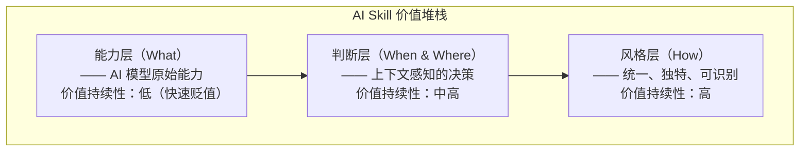

+++
id = "skill-three-layer-value-model"
domain = "methodology"
layer = "methodology"
maturity = "L2"
validation_count = 1
reuse_count = 0
documentation_level = "basic"
source = "docs/retrospective/reports/competitive-analysis/retrospective-ian-xiaohei-illustrations-learning-20260625/insight-extraction.md#规律认知21"
+++

> **来源**：从 Ian Xiaohei Illustrations 产品化实践中提炼

# AI Skill 三层价值模型

## 核心概念

AI Skill 的价值分为三层——能力层（AI 能做什么）、判断层（在什么上下文中做什么）、风格层（以什么方式做）。能力层价值快速贬值，判断层和风格层是持续竞争优势。

## 价值堆栈

## 各层详细说明

| 层级 | 核心问题 | 价值来源 | 贬值速度 | 示例 |
|------|---------|---------|---------|------|
| 能力层 | AI 能做什么？ | 底层模型能力 | 快（模型迭代加速） | 生成图片、文本摘要 |
| 判断层 | 在什么上下文中做什么？ | 上下文感知的决策 | 慢（需要领域知识） | 识别认知锚点、决定配图位置 |
| 风格层 | 以什么方式做？ | 统一、独特的输出风格 | 慢（品牌/设计资产） | 小黑角色系统、手绘线稿风格 |

## 评估方法

| 评估问题 | 对应层级 | 评分标准 |
|---------|---------|---------|
| 这个 Skill 的核心能力是否依赖特定模型？ | 能力层 | 依赖越强，价值越脆弱 |
| 这个 Skill 是否在"理解上下文后做出选择"？ | 判断层 | 决策越智能，价值越高 |
| 这个 Skill 是否有独特且一致的输出风格？ | 风格层 | 风格越独特，可替代性越低 |

## 设计策略

**向上堆叠**：在基础能力层之上，叠加判断层和风格层，形成持续竞争优势。

**避免单一依赖**：不要让 Skill 的价值完全依赖于底层模型能力。

**积累风格资产**：建立独特的输出风格，形成品牌辨识度。

## 适用场景

- AI Skill 产品化设计与评估
- AI 应用的差异化竞争定位
- 技术选型与投资决策
- 团队能力建设规划

## 核心价值

这个模型为 AI Skill 的价值评估提供了一个清晰的框架，帮助团队理解在哪里投入资源才能获得持续回报。
