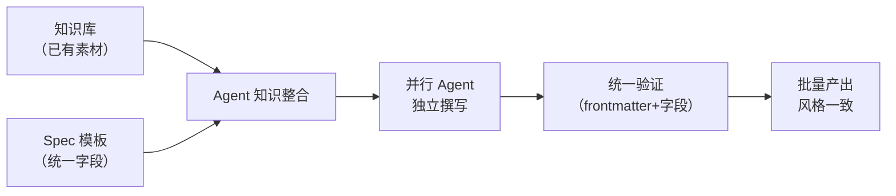

# Spec 驱动 + 知识库驱动的文档批量产出模式

## 模式类型
方法论模式 / AI协作

## 成熟度
L1 已验证（1次验证，2026-07-04 MyST统一化生态体系阶段1）

## 适用场景

- 需要批量产出大量风格一致的技术文档
- 知识库中已有覆盖目标主题的素材（≥80%覆盖度）
- 各文档主题之间独立，可拆分并行
- 有明确的统一模板（如8字段概念模板）

## 核心模式

## 实施步骤

### 步骤 1：评估知识库覆盖度

在启动批量文档撰写前，先评估知识库对目标主题的覆盖度：
- 覆盖度 ≥80%：Agent 可直接引用素材，效率最高
- 覆盖度 50-80%：Agent 需要部分从零研究，需增加超时
- 覆盖度 <50%：不适合本模式，应先补全知识库

### 步骤 2：设计统一模板

模板必须包含以下要素：
- 必填字段列表（如名称、分类层、核心定义、关键属性、关系等）
- 每个字段的期望格式（表格/列表/代码块）
- Frontmatter 规范（version、id、source 等）

### 步骤 3：拆分任务为独立单元

拆分原则：
- 每个任务对应一组独立的概念/主题
- 任务之间无共享状态依赖
- 每个 Agent 的 prompt 包含完整的上下文（模板 + 知识库参考路径）

### 步骤 4：并行执行

- 为每个独立任务创建独立 Agent
- 在 prompt 中明确文件路径和格式要求
- 设置足够的超时（参考文件数 ≥5 时建议 300s+）

### 步骤 5：统一验证

验证清单：
- [ ] 所有文件 frontmatter 包含 source 字段
- [ ] 所有文件包含必填字段
- [ ] 文件间术语一致
- [ ] 内部链接有效

## 关键约束

- 知识库覆盖度是产出质量的**上限**——知识库中没有的内容，Agent 无法凭空生成
- 模板是 Agent 协作的**接口契约**——模板定义越清晰，各 Agent 产出越一致
- 并行策略的适用边界：任务之间必须完全独立，无共享状态依赖

## 与相关模式的关系

- **markdown-as-interface**：本模式利用 Markdown 作为统一模板格式，是 markdown-as-interface 在文档批量产出场景的具体应用
- **skill-discovery-protocol**：本模式中 Agent 对知识库的引用可视为 skill-discovery 的变体

<!-- changelog -->
- 2026-07-04 | pattern | 初始创建：从 MyST 统一化生态体系阶段1 复盘萃取