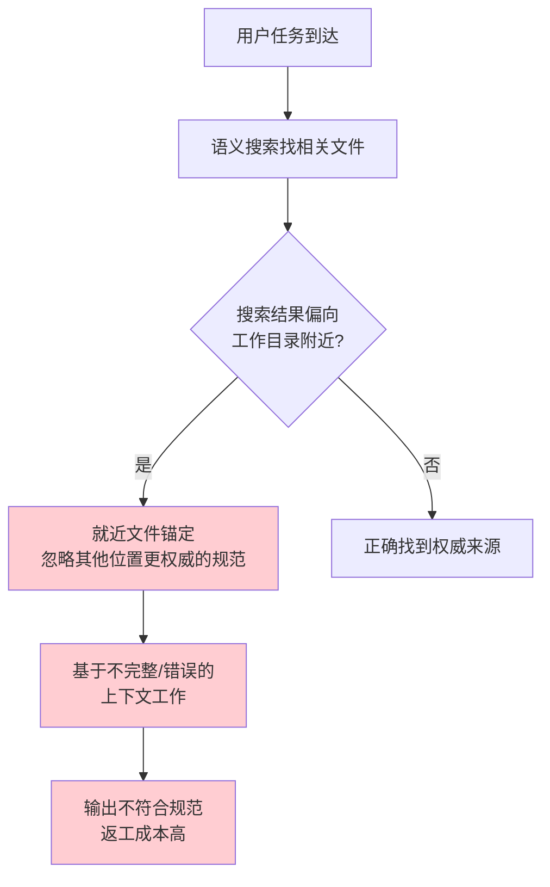

# 任务类型预检防偏差

## 模式概述

Agent在多模块/多项目/多子模块协作时，容易被"就近文件"锚定，产生**就近直觉偏差（availability heuristic）**——语义搜索天然倾向于返回工作目录附近的文件，导致"在错误的地方找答案"。任务类型预检是对抗这种系统性认知偏差的防御机制：在文件搜索前先做任务类型匹配，命中vendor/方法论资产则强制读取对应规范。

## 问题根源：就近直觉偏差

**为什么这是系统性偏差**：
- 语义搜索的相关性算法天然偏向同目录、同项目的文件
- Agent的"最近读取"上下文窗口倾向于放大就近文件的权重
- 跨项目子模块（如vendor/）中的规范虽然更权威，但物理距离更远
- 凭"经验直觉"工作时，容易只看工作目录下的文件，忽略跨边界资产

## 防御机制四层体系

### 第一层：任务类型预检（P0·强制）
在AGENTS.md启动协议步骤2.0强制执行：
> 无论工作目录是否在 vendor/ 内，先检查任务类型是否命中下表中的 vendor 方法论资产。命中则必须读取对应 vendor 规范，不得跳过。

**预检表示例**：

| 任务类型 | 必读入口 |
|---|---|
| Skill 创建/优化/调试 | vendor/flexloop/apps/chaos/.agents/skills/skill-creator/SKILL.md + .agents/rules/skill-development.md |
| 跨项目子模块协同 | .agents/VENDOR-INTEGRATION.md + vendor/AGENTS.md |
| （其他vendor资产持续补充） | ... |

### 第二层：三层路由强制
SpecWeave→vendor→flexloop 嵌套目录优先读取子模块AGENTS.md：
1. 工作目录在vendor/内：先读vendor/AGENTS.md（vendor区域入口路由）
2. 再按子模块路由表进入对应子模块（vendor/flexloop/AGENTS.md → vendor/flexloop/apps/chaos/AGENTS.md）
3. 退出vendor/目录后恢复SpecWeave路由

### 第三层：索引表而非搜索
用结构化的路由表和资产索引替代语义搜索的"就近直觉"：
- AGENTS.md中的"上下文路由表"是显式知识地图
- vendor/AGENTS.md中的"可用资产索引"是跨边界定位的权威来源
- 不依赖"搜一下看看有什么"，而是先查表确定应该读什么

### 第四层：自检检查点
加载Skill或开始生成产出物之前，逐项确认：
- □ 当前任务类型是否命中vendor方法论资产？
- □ 如命中，对应规范是否已读取？
- □ 是否已读取上下文路由表中所有与当前任务直接相关的入口？
- □ 是否有相关Skill应被加载？

## Why 有效

1. **对抗隐性偏差**：就近直觉是潜意识层面的偏差，Agent自己意识不到"我被就近文件锚定了"，必须用显式检查点强制拦截
2. **显式优于隐式**：结构化路由表是"显式知识地图"，比语义搜索的"隐式相关性"更可靠
3. **预检成本极低**：任务类型匹配只需要几秒钟，但能避免30分钟以上的返工（违反启动协议导致三重连锁错误）
4. **三层防御纵深**：预检→路由→索引→自检，多层防御确保不会遗漏权威规范

## 反模式

**反模式1：只看工作目录附近的文件**
- 任务是创建Skill，工作目录在SpecWeave主权区
- 只读了.agents/rules/skill-development.md
- 没读vendor/flexloop中更权威的skill-creator方法论
- 结果：Skill格式不符合上游规范，需要返工

**反模式2：依赖语义搜索找规范**
- 需要了解Skill开发规范
- 直接用语义搜索"Skill开发"
- 搜索返回工作目录附近的不完整文档
- 结果：基于过时/不完整信息工作

**反模式3：跳过启动协议直接干活**
- 收到任务后立即开始写代码/文档
- 不执行AGENTS.md启动协议的步骤1-3.5
- 结果：三重连锁错误——输出格式错误、文件路径错误、文档结构错误

## 验证案例

**案例1：vendor子模块Skill开发规范（本次验证）**
- 新增vendor方法论资产预检表（步骤2.0）
- 三层路由协议：SpecWeave→vendor→flexloop
- vendor区域治理模式确立："不萃取，在vendor组织"
- 避免了把flexloop的Skill规范错误复制到SpecWeave主权区

**案例2：渐进式披露架构发现**
- 任务类型预检命中Skill优化场景
- 强制读取vendor的skill-creator/SKILL.md
- 发现渐进式披露三层架构方法论
- 重构了5个命令Skill，L0/L1文件行数减少23-36%

## 适用场景

- 多项目/monorepo协作环境
- 包含git submodule/vendor的项目
- 有跨模块规范依赖的开发任务
- 任何需要"先找对规范再干活"的场景

## 实施检查清单

- [ ] 启动协议步骤2.0：任务类型预检（必做，不得跳过）
- [ ] 三层路由：工作目录在vendor/内时，先读vendor/AGENTS.md
- [ ] 使用路由表而非语义搜索确定必读文档
- [ ] 步骤3.5自检：加载Skill前逐项确认规范已读取
- [ ] 新增vendor资产时，同步更新预检表和路由索引
- [ ] 不凭"就近直觉"判断应该读什么文件

> 来源：来自 retrospective-daily-20260629 洞察4
> 关联模式：[progressive-context-disclosure.md](../ai-collaboration/progressive-context-disclosure.md)（渐进式上下文披露）、[skill-discovery-protocol.md](../ai-collaboration/skill-discovery-protocol.md)（Skill发现协议）、[three-layer-routing.md]()（三层路由协议）
