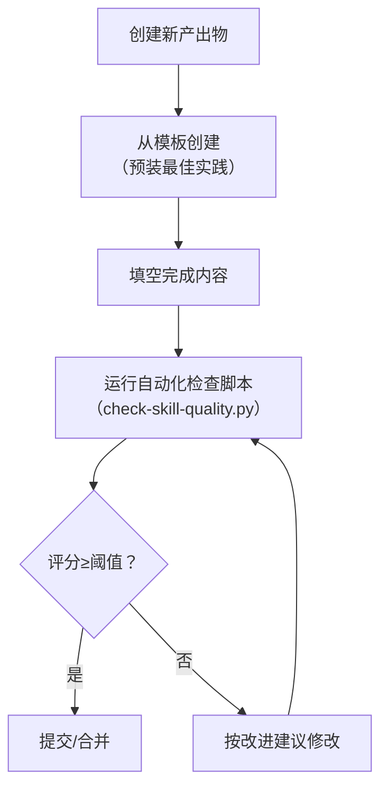

> **提炼自**：[export-suggestions.md 经验教训11](../../../reports/project-governance/tools-and-automation/retrospective-forum-posting-skill-optimization-20260629/export-suggestions.md) + SKILL-TEMPLATE.md 实践 —— forum-posting Skill 优化复盘

# 模板质量方差控制模式（Template Variance Control）

## 模式类型

方法论模式（质量保证/知识固化）

## 成熟度

L1 首次提炼（SKILL-TEMPLATE.md 实践验证，已被check-skill-quality.py引用）

## 适用场景

需要保证一类产出物（Skill文档、代码文件、报告、PR描述等）质量下限、降低不同执行者之间质量方差时。

常见于：
- 创建新Skill/新文档/新模块时需要统一结构
- 最佳实践已经提炼出来，但很难保证每次都被遵循
- 反复review纠错成本太高，希望第一次就做对
- 新人/新Agent上手时需要step-by-step填空式指南

## 问题背景

质量保证的传统手段是"写完再review"，但这种方式有几个问题：
1. **成本高**：review需要消耗资深人员/Agent的时间和认知资源
2. **滞后性**：问题已经写进去了才发现，返工成本高
3. **方差大**：不同reviewer标准不一致，同一个人不同时间状态也不同
4. **不可扩展**：产出物数量增加时，review能力不会线性增长
5. **依赖经验**：新手不知道"应该长什么样"，需要反复试错

典型表现：
- 每次写Skill都要重新想"应该包含哪些部分"
- 有的Skill写得很完善，有的缺这少那
- review时反复提同样的问题（"这里要加Why解释"、"这里缺安全清单"）

## 核心规则

### 规则 1：模板是"预装了最佳实践的填空表单"

好的模板不是"示例文档"，而是**已经把所有最佳实践、强制要素、检查清单都预装好**，使用者只需要填空：
- ✅ 固定结构已经写好（章节顺序、标题层级）
- ✅ 强制要素用占位符标注（`{{此处填写触发场景}}`）
- ✅ 每个部分有What/Why/How三层提示
- ✅ 正反例直接内嵌，不需要再去查文档
- ✅ 检查清单在末尾，填完直接打勾

> **为什么？** 如果模板只是一个空架子，使用者还是需要知道"应该填什么"，等于把质量负担又推回给了使用者。模板的价值是让"正确的做法"成为阻力最小的路径。

### 规则 2：模板五要素

一个能有效降低方差的模板必须包含：

| 要素 | 作用 | 示例（来自SKILL-TEMPLATE） |
|-----|------|-------------------------|
| **元数据骨架** | 所有必填字段预先占位 | name/description/version等frontmatter字段已经列好 |
| **结构占位** | 章节顺序固定，防止遗漏 | 五要素章节已经按顺序排好 |
| **填写提示** | 每个部分告诉使用者"这里应该填什么" | "> 这里写触发场景，必须包含'必须使用此技能'" |
| **正反示例** | 直观展示什么是对、什么是错 | "✅ 正面示例" / "❌ 反面示例"内嵌 |
| **验证清单** | 填完可以自检，不需要等review | 末尾的"- [ ] Description包含强制触发措辞"清单 |

### 规则 3：模板 vs 检查脚本 双剑合璧

模板是"事前预防"，自动化检查脚本是"事后门禁"，两者缺一不可：
- **模板**：让正确的做法更容易，第一次就写对
- **检查脚本**：即使漏了模板里的内容，脚本也会拦下来，给出改进建议

### 规则 4：模板不是一成不变的

模板本身也需要迭代：
- 当review中反复发现某类问题时 → 把这个检查项加到模板+脚本
- 当最佳实践更新时 → 更新模板
- 当某个检查项长期没人违反时 → 可以考虑从强制项降级为可选项
- 定期review模板本身，避免模板膨胀

> **为什么？** 模板是最佳实践的固化，而最佳实践是不断进化的。僵化的模板会变成负担。

### 规则 5：模板长度控制

模板本身也要遵循渐进式披露原则：
- 核心模板 ≤ 200行
- 示例和详细说明放到references/子文档
- 不要试图在模板里解释所有理论——使用者需要的是"做什么"，不是"为什么是这样"（Why解释可以用引用块简短说明）

## 实施检查清单

创建模板时自问：
- [ ] 所有必填项都有占位符吗？
- [ ] 每个部分有填写提示吗？还是只有一个空标题？
- [ ] 有正反例吗？
- [ ] 末尾有自检清单吗？
- [ ] 配套的自动化检查脚本存在吗？
- [ ] 模板长度≤200行吗？
- [ ] 用这个模板创建的新产出物，第一次就能达到80分以上吗？

## 效果对比

| 方式 | 平均质量分 | 首次通过率 | review时间/产出物 |
|-----|----------|-----------|-----------------|
| 无模板，自由发挥 | 50-60分 | 20% | 30分钟+反复修改 |
| 有模板但无检查脚本 | 70-80分 | 60% | 10-15分钟 |
| 模板+自动化检查 | 85-95分 | 90%+ | <5分钟（脚本已经把问题拦下来了） |

## 反例警示

| 错误模板类型 | 问题 |
|------------|------|
| 空壳模板（只有标题，没有内容提示） | 使用者还是不知道该填什么，等于没模板 |
| 过于复杂的模板（500+行，全是理论说明） | 使用者被吓跑，或者只填了表面内容跳过关键部分 |
| 模板没有配套检查 | 填不填模板里的内容全靠自觉，很快模板就被架空 |
| 模板常年不更新 | 最佳实践已经进化了，模板还是老样子，反而起反作用 |
| 只有模板没有示例 | "按这个格式写"但没有给出来什么叫"对"，使用者还是靠猜 |

## 正例

本次创建的SKILL-TEMPLATE.md：
- 包含完整的YAML frontmatter骨架
- 每个章节都有"> 这里填写..."提示
- Why解释、安全清单等都有格式示例
- 末尾有10项自检清单
- 配套check-skill-quality.py自动验证
- 使用模板创建的Skill天然符合五要素模型，第一次就能达到80分以上

## 与现有模式的关系

- `skill-five-elements-model.md`：本模式是Skill五要素模型的落地手段——五要素是"应该有什么"，模板是"让你一定能填上"
- `symptom-prescription-qa.md`：模板中的自检清单和自动化检查脚本的改进建议，都采用了症状-处方模式
- `progressive-templating.md`：本模式是渐进式模板化在质量控制场景的具体化
- `spec-as-code-automated-gates.md`：本模式的"模板+检查脚本"双剑合璧与规范即代码模式互补
