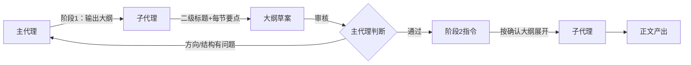

# 篇幅控制两阶段模式：先大纲后展开

## 模式概述

委托子代理创建内容型文档（技术教程、方案设计等）时，采用"阶段1输出大纲→主代理审核确认→阶段2按大纲展开正文"的两阶段模式，避免子代理一次性写出长文后方向跑偏、篇幅失控或结构不合理导致大规模返工。阶段1成本极低（大纲仅几十行），调整快；阶段2在确认的大纲框架内展开，降低方向性错误的风险。

## 问题现象

一次性委托子代理"写完整章节"的常见后果：

1. **方向跑偏**：子代理对章节重点的理解与主代理预期不一致，写出后整篇需要重写
2. **篇幅失控**：子代理倾向于"写全面"，简单主题写出500+行，信息密度低
3. **结构失衡**：某些小节展开过多，关键内容反而简略，重点不突出
4. **返工成本高**：500行正文如果结构有问题，重写比修改更高效，但重写成本远大于大纲调整

## 两阶段流程



### 阶段1：大纲输出

主代理向子代理发送任务，要求**仅输出大纲**：

```
任务：为"05-协议对比与选型指南"章节输出大纲
要求：
1. 仅输出二级和三级标题，每个标题下用1-2句话说明该节要讲什么
2. 不要写正文内容
3. 总行数控制在30-50行
4. 覆盖以下要点：四协议17维度对比表、选型决策树、分阶段采用路线图
5. 返回后等待主代理确认，不要自行展开
```

**主代理审核要点**：
- 章节结构是否覆盖所有需求要点
- 重点分配是否合理（关键内容是否有足够篇幅）
- 章节顺序是否符合逻辑递进
- 是否有冗余或跑偏的章节

### 阶段2：按大纲展开

大纲确认后，主代理发送阶段2指令：

```
任务：按以下确认的大纲展开正文
大纲：
（粘贴阶段1确认的大纲）

要求：
1. 严格按大纲结构展开，不要增减章节
2. 每节正文控制在X-Y行
3. 总行数不超过300行
4. [其他硬约束：frontmatter/导航/Mermaid安全规则等]
```

## 适用场景

- ✅ 内容型文档创建（技术教程、方案文档、白皮书）
- ✅ 预计篇幅>200行的章节
- ✅ 章节结构有多种合理组织方式，需要选择最优
- ✅ 主代理对内容方向有明确预期，需要确保子代理对齐
- ❌ 结构固定的模板文档（如API参考、配置说明）——直接按模板填写即可
- ❌ 短文档（<100行）——大纲审核成本可能超过直接写

## 与其他模式的关系

| 关系模式 | 关系类型 | 说明 |
|---------|---------|------|
| [subagent-atomic-task-template.md](subagent-atomic-task-template.md) | 配套 | 六要素模板用于阶段2指令，确保展开质量 |
| [three-stage-content-validation.md](../governance-strategy/three-stage-content-validation.md) | 前置 | 阶段1大纲审核是三段式验证中"任务级验证"的前置环节 |
| [spec-mode-doc-creation-workflow.md](spec-mode-doc-creation-workflow.md) | 相关 | Spec Mode的PRD→tasks→实施流程是两阶段模式的宏观应用 |

## 边界与选型

**何时使用两阶段**：
- 预计篇幅>200行
- 章节结构有多个可选方案
- 主代理对内容方向有明确预期

**何时直接委托**：
- 短文档（<100行）
- 结构已由tasks.md明确定义
- 子代理任务模板已包含详细大纲（六要素中的要素3已足够详细）

**成本权衡**：两阶段模式增加1次交互轮次（大纲审核），但可避免阶段2的大规模返工。当返工概率>30%时，两阶段模式的总成本更低。
