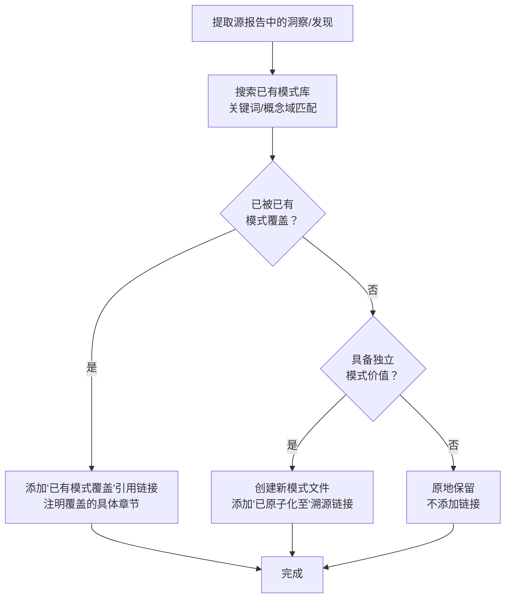

+++
id = "atomization-three-tier-classification"
domain = "methodology"
layer = "methodology"
maturity = "L1"
validation_count = 1
reuse_count = 0
documentation_level = "standard"
source = "docs/retrospective/reports/retrospective-atomization-execution-s1-7-20260624.md#四、萃取-4.1"

[bindings]
rules = []
references = ["review-insight-export-loop.md", "convention-driven-creation.md"]
skills = []
+++

> **来源**：从 `docs/retrospective/reports/retrospective-atomization-execution-s1-7-20260624.md` 四、萃取 4.1 拆分

# 原子化三级分类策略（Atomization Three-Tier Classification）

## 模式类型
方法论模式

## 成熟度
L1 实验性（1 次成功案例：execution-s1-s3.md + execution-s4-s7.md 原子化过程）

## 适用场景
对复盘报告或综合性文档进行原子化时，模式库已有一定积累（20+ 模式），需要高效判断每个洞察/发现的处理方式。

## 问题背景

原子化的常见误区是"每个发现都必须新建一个独立模式"。这种做法导致两个问题：

- **模式冗余**：新洞察与已有模式重叠，产生多个表述不同但实质相同的模式文件
- **维护负担**：冗余模式增加了索引维护成本和读者的选择困惑

当模式库积累到一定规模后，更高效的策略是三级分类——先判断是否已被已有模式覆盖，再决定新建还是原地保留。

## 核心规则

对源文档中的每个洞察/发现，按以下三级分类处理：

| 分类 | 判断条件 | 处理方式 | 溯源标注 |
|------|---------|---------|---------|
| **新建模式** | 洞察独立于已有模式，且具备跨任务复用价值 | 创建新模式文件，注册到索引 | `> **已原子化至**：[xxx.md]` |
| **已有覆盖** | 洞察的核心规则已被已有模式充分覆盖 | 添加引用链接指向已有模式 | `> **已有模式覆盖**：[xxx.md]——说明` |
| **原地保留** | 洞察不具备独立模式价值（一次性经验、过于具体） | 保留在源文档中，不添加链接 | 不添加标注 |

## 操作流程



### 判断"已有覆盖"的检查清单

- [ ] 已有模式的"核心规则"是否涵盖新洞察的主要观点？
- [ ] 已有模式的"适用场景"是否包含新洞察的触发条件？
- [ ] 已有模式的"操作流程"是否覆盖新洞察的建议步骤？
- [ ] 若以上三项均为"是"→已有覆盖；任一项为"否"→需进一步判断

### 判断"独立模式价值"的检查清单

- [ ] 洞察是否提出了≥2 个可操作的步骤或规则？
- [ ] 洞察是否可被其他项目/任务复用（非一次性经验）？
- [ ] 洞察是否与已有模式有明确的区分边界？
- [ ] 若以上三项均为"是"→新建模式；任一项为"否"→原地保留

## 量化数据

本批次原子化的三级分类分布：

| 分类 | 数量 | 占比 | 示例 |
|------|------|------|------|
| 新建模式 | 5 | 62.5% | auto-generate-threshold、package-structure-leverage 等 |
| 已有覆盖 | 2 | 25% | 发现二→retrospective-acceleration-effect |
| 原地保留 | 1 | 12.5% | 决策 S4-2（OR 逻辑歧义优先级，过于具体） |
| **合计** | **8** | **100%** | — |

> 注：原地保留的 1 个（决策 S4-2）在最终执行中被判定为不具备独立模式价值。

## 已有覆盖率的信号意义

```
已有覆盖率 = 已有覆盖数 / 总洞察数

已有覆盖率 < 20%  → 模式体系尚在成长期，大量认知未被系统化
已有覆盖率 20-40% → 模式体系进入成熟期，认知开始收敛
已有覆盖率 > 50%  → 模式体系接近饱和，新增模式应以补充边界为主
```

## 与现有模式的关系

- `review-insight-export-loop.md`：本模式是其"洞察→导出"环节的精化——在导出前增加"已有覆盖判断"步骤，避免冗余导出
- `convention-driven-creation.md`：已有覆盖判断本质上是"约定驱动创建"的反向应用——先读已有范例判断是否已存在，再决定是否创建

> **关联模块**：
> - `review-insight-export-loop.md`
> - `convention-driven-creation.md`
