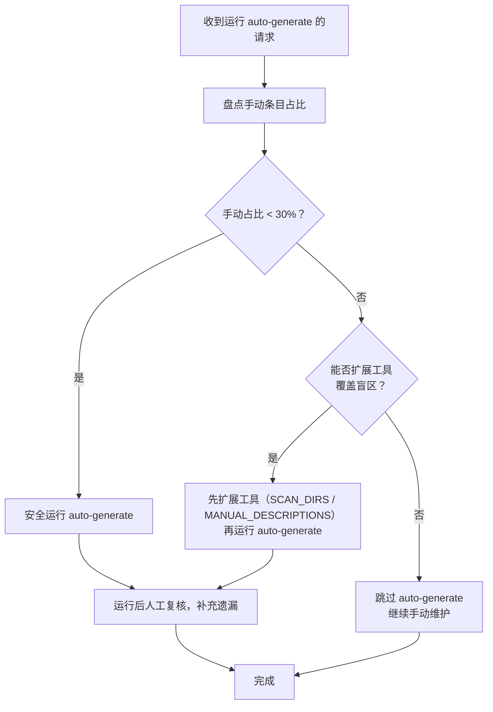

+++
id = "auto-generate-threshold"
domain = "methodology"
layer = "methodology"
maturity = "L1"
validation_count = 1
reuse_count = 0
documentation_level = "standard"
source = "docs/retrospective/reports/retrospective-comprehensive-20260623/execution-s1-s3.md#6.2-发现一"

[bindings]
rules = []
references = ["convention-driven-creation.md"]
skills = []
+++

> **来源**：从 `docs/retrospective/reports/retrospective-comprehensive-20260623/execution-s1-s3.md` 六、6.2 发现一 拆分

# 自动化生成与人工维护阈值（auto-generate-threshold）

## 模式类型
方法论模式

## 成熟度
L1 实验性（1 次成功案例：README.md NAV_TABLE 的 auto-generate vs 手动条目）

## 适用场景
项目中存在自动化生成工具（如导航表生成、文档索引生成、配置清单生成），同时存在无法被自动工具覆盖的手工维护条目。

## 问题背景

自动化生成工具在项目初期覆盖率高（结构简单、条目少），但随着项目复杂度增长会逐渐出现覆盖盲区。当手动条目积累到一定比例时，运行自动化工具反而会丢失精心维护的手工内容——此时"自动化"的边际价值转负。

常见困境：
- 自动化工具的扫描范围无法覆盖所有目录（如跨目录引用、非标准路径）
- 手工条目的描述文本经过精炼，自动提取无法还原同等质量
- 工具只能处理"文件"级别的条目，无法处理"目录"级别的引用

## 核心规则

### 阈值判断法则

```
手动条目占比 = 手动条目数 / 总条目数

手动条目占比 < 30%  → 可安全运行 auto-generate，手动补充少量遗漏
手动条目占比 ≥ 30%  → auto-generate 边际价值转负，应跳过或先扩展工具再运行
```

### 本案例数据

| 指标 | 数值 |
|------|------|
| 总条目数 | 13 |
| 手动条目数 | 5 |
| 手动占比 | ~38% |
| 决策 | 跳过 auto-generate |

手动条目覆盖盲区：
- `docs/retrospective/patterns/` — 目录引用，不是文件
- `prompt_extraction/` — 不在 SCAN_DIRS 扫描范围内
- 描述文本经过人工精炼

## 操作流程



## 步骤详解

### 步骤 1：盘点手动条目占比

| 操作 | 方法 |
|------|------|
| 识别手动条目 | 对比 auto-generate 输出与当前内容，标记差异项 |
| 统计占比 | 手动条目数 / 总条目数 |
| 分析盲区 | 逐条记录 auto-generate 无法覆盖的原因 |

### 步骤 2：判断阈值

- 占比 < 30%：可以安全运行，人工复核即可
- 占比 ≥ 30%：优先评估能否扩展工具覆盖盲区

### 步骤 3：扩展工具或跳过

| 盲区类型 | 扩展方向 |
|---------|---------|
| 目录不在扫描范围 | 扩展 `SCAN_DIRS` 配置 |
| 描述文本需人工精炼 | 在 `MANUAL_DESCRIPTIONS` 字典中维护 |
| 非文件级别引用（如目录） | 扩展扫描粒度支持目录级条目 |

## 实施检查清单

- [ ] 盘点自动生成工具的输出与当前内容的差异
- [ ] 计算手动条目占比
- [ ] 识别每个手动条目的覆盖盲区类型
- [ ] 若占比 ≥ 30%，评估扩展工具的可行性
- [ ] 若无法扩展，明确标记为"手动维护区"

## 成功案例

| 场景 | 文件 | 手动占比 | 决策 | 结果 |
|------|------|---------|------|------|
| README.md NAV_TABLE 更新 | README.md | ~38%（5/13） | 跳过 auto-generate | 保留 5 个手工编排条目，无误覆盖 |

## 与现有模式的关系

- `convention-driven-creation.md`：手工维护的条目描述属于"约定优于配置"的体现——描述文本有固定的风格与精炼规则，auto-generate 无法复现这种约定
- `structure-first-extension.md`：扩展 auto-generate 工具时，应遵循"结构阅读先行"原则，先理解工具架构再添加 SCAN_DIRS

> **关联模块**：
> - `convention-driven-creation.md`
> - `structure-first-extension.md`
