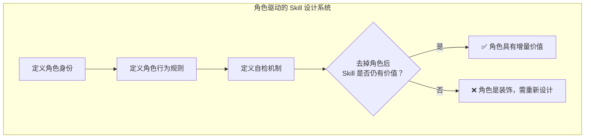

+++
id = "character-driven-design-system"
domain = "methodology"
layer = "methodology"
maturity = "L2"
validation_count = 1
reuse_count = 0
documentation_level = "basic"
source = "docs/retrospective/reports/competitive-analysis/retrospective-ian-xiaohei-illustrations-learning-20260625/insight-extraction.md#洞察2"
+++

> **来源**：从 Ian Xiaohei Illustrations 的"小黑"角色系统实践中提炼

# 角色驱动设计系统模式

## 核心概念

为 AI 生成内容引入一个"功能性角色"，该角色不是装饰品，而是系统功能的执行者和认知的演示者，并通过严格的自检规则确保角色的增量价值。

## 五条核心原则

| 原则 | 描述 | 深层设计哲学 |
|------|------|-------------|
| 1. 语义定位 | 角色不是吉祥物，是功能的执行者 | 角色是系统功能的执行者，不是品牌的装饰品 |
| 2. 动作必需 | 角色必须承担核心动作 | 每个画面都是一次"认知演示"，角色是演示者 |
| 3. 不可减去性 | 去掉角色后系统功能受损 | 角色存在必须产生增量价值，否则就是冗余 |
| 4. 风格克制 | 视觉语言严格收敛，聚焦内容 | 极简不是风格选择，是让认知锚点不被视觉噪音淹没 |
| 5. 调性精确 | 在专业性和趣味性间找到精确平衡 | 在专业性和趣味性之间找到精确平衡点 |

## 角色设计自检流程

## 五维自检框架

| 维度 | 自检问题 | 评估标准 |
|------|---------|---------|
| 语义定位 | 去掉"可爱"描述后角色还有价值吗？ | 角色价值不应依赖于"可爱"属性 |
| 动作必需 | 角色在画面里"做了什么"而非"站了什么位置"？ | 角色必须执行核心动作 |
| 不可减去性 | 去掉角色后输出结果的质量是否下降？ | 角色移除后功能受损 |
| 风格克制 | 是否有不必要的视觉元素在分散注意力？ | 视觉语言严格收敛 |
| 调性精确 | 是"奇怪有趣"还是"幼稚卖萌"？ | 在专业性和趣味性间找到平衡点 |

## 适用场景

- AI Skill 中的角色/Agent 设计
- 品牌 IP 的 AI 化应用
- 教育类 AI 产品的引导角色设计
- 任何需要"角色"但不想沦为吉祥物的 AI 产品

## 核心价值

这套角色系统本质上是一组**可执行的约束条件**，而非模糊的"风格指南"。每条原则都可以直接转化为代码或 prompt 中的检查规则。
