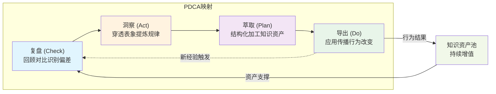

+++
id = "closed-loop-pdca-mapping"
domain = "methodology"
layer = "methodology"
maturity = "L1"
validation_count = 1
reuse_count = 0
documentation_level = "standard"
source = "docs/methodology-analysis-report.md#5.1"

[bindings]
rules = []
references = ["review-insight-export-loop.md", "retrospective-four-step-method.md", "retrospective-acceleration-effect.md"]
skills = []
+++

> **来源**：从 `docs/methodology-analysis-report.md` 第 5.1 节「闭环的结构与运行机制」拆分

# 闭环PDCA映射模型（Closed-Loop PDCA Mapping Model）

## 模式类型
方法论模式

## 成熟度
L1 实验性（1 次成功案例：methodology-analysis-report.md 综合方法论分析）

## 适用场景
将"复盘→洞察→萃取→导出"四步闭环映射到经典的 PDCA（Plan-Do-Check-Act）循环，便于在熟悉 PDCA 的团队中推广。

## 问题背景

"复盘→洞察→萃取→导出"作为知识管理领域的专业术语，对未受过组织学习训练的团队成员存在理解门槛。但 PDCA（戴明环）作为质量管理领域的经典框架，已经被广泛接受。

将四步闭环与 PDCA 建立映射，既降低了传播门槛，又借助 PDCA 的"循环迭代"心智模型强化"闭环自增强"理念。

## PDCA 映射表

| 复盘-洞察-萃取-导出 | PDCA 对应 | 角色说明 |
|------------------|----------|---------|
| 复盘 | Check（检查） | 对比目标与实际，识别偏差 |
| 洞察 | Act（行动/分析） | 分析偏差的深层原因，形成规律认知 |
| 萃取 | Plan（计划） | 将规律转化为可复用的知识资产和行动计划 |
| 导出 | Do（执行） | 将知识资产应用于实践，产生新的经验数据 |

## 闭环运行图



## 双正反馈回路

闭环的真正威力在于两个相互强化的正反馈回路：

### 回路一：知识增值回路

```
更好行动结果
    ↓
更高质复盘素材
    ↓
更深层洞察
    ↓
更高价值资产
    ↓
更有效行动
```

**机制说明**：每次导出产生的行为结果，成为下一轮复盘的更高质量素材，循环累积形成"知识资产复利增长"。

### 回路二：能力提升回路

```
做复盘 → 复盘能力提升
做洞察 → 洞察能力提升
做萃取 → 萃取能力提升
做导出 → 导出能力提升
```

**机制说明**：每次完整循环都在训练组织和个人的四项能力本身——做复盘的技能在复盘中提升。这种"学会如何学习"的元能力积累，是闭环体系最深层的价值。

## PDCA 映射的实操价值

| 价值维度 | 体现 |
|---------|------|
| 心智模型复用 | 团队成员已熟悉 PDCA，无需重新建立"循环迭代"的概念基础 |
| 角色类比 | Do/Check/Act/Plan 对应明确的执行角色（执行者/检查者/分析师/规划者） |
| 工具链兼容 | 现成的 PDCA 工具（看板、SOP 文档、复盘模板）可直接复用 |
| 跨领域迁移 | PDCA 在制造、医疗、软件开发等领域的应用经验可直接借鉴 |

## 与现有 PDCA 框架的衔接

| 现有框架 | 与本模式的关系 |
|---------|--------------|
| Deming PDCA 循环 | 经典源头，本模式是其"复盘/洞察/萃取/导出"特化版本 |
| OODA 循环（观察-调整-决策-行动） | 适用于紧急决策场景，与本模式互补 |
| AAR（After Action Review） | 美军复盘标准，专注于"复盘"环节，与本模式衔接 |

## 反模式警示

| 错误做法 | 后果 |
|---------|------|
| 把 PDCA 当作"四个独立步骤" | 失去循环迭代的核心价值 |
| 跳过"知识资产池"建立 | 每次循环从零开始，无法形成复利 |
| Do 阶段没有显式触发 Check | 闭环实际未闭合，下一轮复盘无依据 |
| 用"复盘报告"代替"知识资产" | 复盘报告归档 = 知识资产被埋没 |

## 配套实践

| 实践 | 频次 | 产出物 |
|------|------|--------|
| 周度站立复盘 | 每周 | 简版四步复盘记录（不超过 1 页） |
| 月度项目复盘 | 每月 | 标准四步复盘报告（4-6 页） |
| 季度跨项目元分析 | 每季 | 模式萃取与知识库更新 |
| 年度闭环健康度评估 | 每年 | 闭环成熟度评级 + 改进路线图 |

## 与现有模式的关系

- `review-insight-export-loop.md`：本模式是其与 PDCA 框架的桥接——通过 PDCA 映射降低传播门槛
- `retrospective-four-step-method.md`：本模式中"复盘"环节的具体操作方法
- `retrospective-acceleration-effect.md`：本模式中双反馈回路是"复盘加速效应"的底层机制

> **关联模块**：
> - `review-insight-export-loop.md` — 复盘→洞察→导出知识闭环
> - `methodology-five-level-maturity.md` — 方法论五级成熟度模型（评估闭环成熟度）
