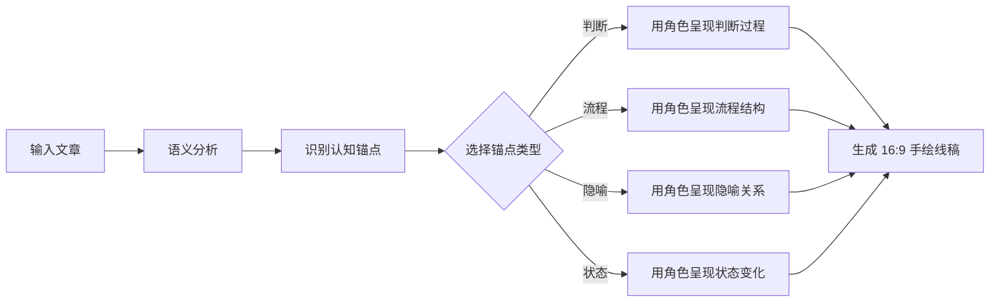

> **来源**：从 Ian Xiaohei Illustrations 项目实践中提炼

# 认知锚点可视化模式

## 核心概念

将配图从"装饰性元素"升级为"认知传递载体"。核心工作流：先识别文章中的认知锚点（判断/流程/隐喻/状态），再选择其一可视化，输出"把认知动作画出来"的图像。

## 传统配图 vs 认知锚点配图

| 维度 | 传统配图 | 认知锚点配图 |
|------|---------|-------------|
| 目标 | 让页面好看 | 让概念被记住 |
| 驱动 | 关键词搜索 | 语义理解 + 概念提取 |
| 产出 | 装饰性图片 | 认知动作的视觉化 |
| 与内容关系 | 松散关联 | 强语义绑定 |
| 记忆效果 | 读者可能忽略 | 读者忘了文字却记得图 |
| 创作门槛 | 低（搜图） | 高（需要理解文章） |

## 工作流程

## 设计原则

1. **语义优先**：先理解再生成，不盲目产出
2. **单锚点单图**：每张图只表达一个认知概念
3. **类型分类**：判断型/流程型/隐喻型/状态型，不同类型用不同视觉策略
4. **上下文感知**：配图与文本语义强绑定，非松散关联

## 适用场景

- 技术文档配图
- 博客文章插图
- 教育内容可视化
- 演示文稿概念图

## 核心价值

一个好的 AI Skill 不只是"做某件事"，而是"在理解上下文后做出有判断力的选择"。核心价值不在于"生成图片"，而在于"知道在哪里配图、配什么样的图"——这是一种**上下文感知的决策能力**。
