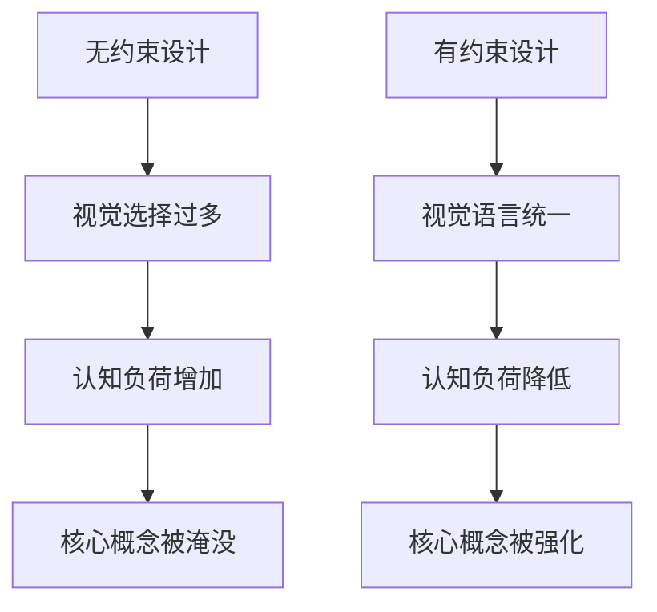

> **来源**：从 Ian Xiaohei Illustrations 视觉风格约束实践中提炼

# 约束驱动创造力模式

## 核心概念

通过严格的视觉/格式约束来聚焦核心信息传递，而非通过增加视觉元素来提升表现力。约束不是限制，而是创造力的框架。

## 约束 vs 无约束对比

## 约束维度与通用规则

| 维度 | Ian Xiaohei 实践 | 可迁移的通用规则 |
|------|-----------------|-----------------|
| 色彩 | 黑+红+橙+蓝，黑占 85% | 主色承载主体信息，辅色仅用于注意力引导 |
| 背景 | 纯白，无纹理/阴影/渐变 | 背景不应携带任何信息 |
| 空间 | 主体占 2/3~3/4 | 留白是信息架构的一部分 |
| 线条 | 细线、微抖 | 技术痕迹可见，不做完美主义 |
| 内容密度 | 一张图一个概念 | 单输出单职责 |

## 颜色功能分工

| 颜色 | 功能 | 占比 |
|------|------|------|
| 黑色 | 主体线稿（认知内容） | ~85% |
| 红色 | 强调/批注 | ~8% |
| 橙色 | 辅助标识 | ~5% |
| 蓝色 | 次要标注 | ~2% |

## 适用场景

- AI 生成内容的视觉规范制定
- 文档模板设计
- UI/UX 设计系统
- 任何需要控制 AI 输出一致性的场景

## 核心价值

这种颜色分配不是随意的——黑色承载认知主体，彩色仅用于引导注意力。这是一种**视觉信息架构**的设计思维，通过约束来聚焦认知。
