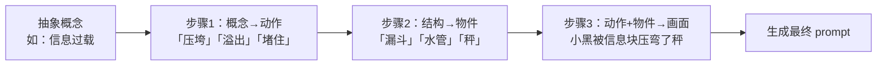

> **已原子化自**：[insight-extraction.md 洞察 3](../../../reports/competitive-analysis/retrospective-ian-xiaohei-source-analysis-20260625/insight-extraction.md) —— Ian Xiaohei Illustrations 仓库源码分析

# 可编程创意生成算法（Programmable Creativity Algorithm）

## 模式类型

方法论模式

## 成熟度

L2 已验证（Ian Xiaohei Illustrations 完整实践验证）

## 适用场景

当 AI Skill 需要生成具有一致风格但每次又需要新颖创意的视觉/文本内容时，通过结构化转换规则替代自由联想式的 prompt 工程。

## 问题背景

传统的 prompt 工程依赖 AI 模型的涌现能力——给一个模糊的创意方向，让 AI 自由发挥。这种方式有两个根本缺陷：

1. **结果不可预测**：同一个 prompt 在不同模型、不同时刻可能产生截然不同的输出
2. **风格漂移**：多次生成后，输出风格会逐渐偏离初始预期

大型创意型 AI 产品（如图像生成 Skill）需要通过工程手段来同时保证「风格稳定」和「创意新颖」。Ian Xiaohei Skill 的解决方案是：将创意生成从「自由联想」转化为「结构化隐喻转换」——给 AI 一套可以按步骤执行的转换规则，而非一个模糊的创意方向。

## 核心规则

### 可编程创意三步骤

将抽象概念通过三层映射转换为具体画面：

| 步骤 | 输入 | 转换操作 | 输出示例 |
|------|------|---------|---------|
| 1. 概念→动作 | 抽象概念（如「内容分发」） | 映射为物理动作 | 「分拣」「分流」「搬运」「沉淀」 |
| 2. 结构→物件 | 系统结构 | 映射为低科技物件 | 「漏斗」「纸箱」「水管」「秤」 |
| 3. 动作+物件→角色画面 | 物理动作 + 物件 | 由角色承担动作 | 小黑站在漏斗旁分拣内容块 |

### 可用对象池

为每个转换层提供预定义的「词汇表」，限制 AI 的选择空间，同时保证多样性：

- **物理动作池**：卡住、漏掉、变重、分拣、沉淀、发酵、开门、折叠、拆包、回流
- **低科技物件池**：纸箱、抽屉、旧机器、漏斗、秤、邮筒、门、井、梯子、水管
- **角色承担方式**：拉、扛、塞、捞、压、称、缝、剪、拧、守、推、接、拆、标记

### 转换约束

- 每次只选 1-2 个物件，不要堆满
- 动作要服务核心意思，不要为了怪而怪
- 必须重新发明隐喻，不能重复使用已有的成功案例

## 操作流程



## 实施检查清单

- [ ] 是否定义了概念→物理动作的映射规则？
- [ ] 是否提供了可选的物理动作词汇表？
- [ ] 是否定义了结构→低科技物件的映射规则？
- [ ] 是否提供了可选的低科技物件词汇表？
- [ ] 角色是否是动作的执行者（而非旁观者）？
- [ ] 是否每次生成了新的隐喻（而非复用旧案例）？

## 反例警示

| 错误做法 | 后果 |
|---------|------|
| 直接让 AI 自由发挥创意 | 输出风格不可控，质量波动大 |
| 只给出模糊的创意方向（如「画得有趣一点」） | AI 倾向于回归训练数据中的平均风格 |
| 提供固定的 few-shot 示例但无禁止复刻规则 | AI 反复使用相同的构图，输出趋同 |
| 物件池太大（50+ 选项） | AI 选择困难，反而回归默认模式 |

## 正例

Ian Xiaohei Skill 的原创隐喻生成法（composition-patterns.md）：

```
1. 把抽象概念换成一个物理动作：卡住、漏掉、变重、分拣、沉淀...
2. 把系统结构换成一个低科技物件：纸箱、抽屉、漏斗、邮筒...
3. 让小黑承担动作：卡在机器里、拉错线、守门、搬运...
```

## 与现有模式的关系

- `constraint-driven-creativity.md`：本模式是该模式在「创意生成」环节的具体化——约束驱动创造力通过全局视觉约束聚焦核心信息，可编程创意生成通过结构化转换规则生成每次不同的具体创意。前者是「框架」，后者是「算法」。
- `style-creativity-separation-control.md`：本模式生成的是「创意多样性」维度的输出，该模式通过正向约束保证「风格一致性」维度。两者共同实现风格稳定 + 创意多样的目标。

> **关联模块**：
> - `constraint-driven-creativity.md`
> - `style-creativity-separation-control.md`
