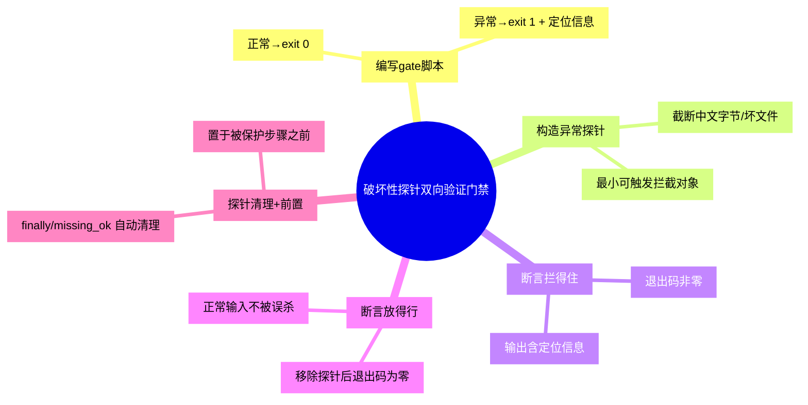

# 破坏性探针双向验证门禁

## 模式概述

为 CI 新增任何**校验性 gate 脚本**（格式检查、编码检查、lint、门禁）时，如果只验证「正常输入放行」而未验证「异常输入拦截」，那么这个 gate 可能形同虚设——脚本逻辑缺陷可能让它无条件放行。正确做法是对 gate **双向验证**：构造一个破坏性探针输入，断言脚本返回非零（拦得住）；移除探针后，断言返回零（放得行）。

核心思想：**CI gate 的价值不在于「通过时静默」，而在于「破坏时非零退出」**。未验证拦截分支的 gate 与不存在等价。探针测试是一次「自检」，保证 gate 自身逻辑正确，而不仅是数据正确。

该模式由 awesome-okf-xs 归档服务 CI 里程碑案例萃取：新增 `check-utf8.py`（77 行纯标准库，扫描 5,163 文件全通过）后，用含截断中文字节的临时探针文件测试——脚本退出码为 1 并提示拦截（拦得住）；移除探针后退出码为 0（放得行），双向闭环。同时将该 gate 置于依赖安装与 Sphinx 构建之前。

## 触发场景

**适用于**：
- 为 CI 管道新增任何校验性 gate 脚本（格式/编码/lint/门禁/约束检查）
- gate 脚本逻辑较复杂，存在"永远放行/永远拦截"逻辑缺陷风险
- gate 结果将作为 CI 是否继续的硬性关卡
- 需要确保 gate 持续有效（防后续改动破坏其拦截能力）

**不适用于**：
- 纯展示性检查（失败也不阻塞 CI，无需探针）
- 已由成熟框架强约束、行为确定无疑的工具（如编译器本身，无需额外探针）
- 一次性临时校验，无复用价值

## 核心做法（5 步）

1. **编写 gate 脚本**：明确输入契约——正常输入 → `exit 0`；异常输入 → `exit 1` 并输出定位信息（文件路径/行/原因），便于 CI 日志排查。

2. **构造异常探针输入**：构造一个能触发 gate 拦截的最小异常对象（如含截断中文字节的坏文件），作为探针输入。

3. **断言拦得住**：对探针输入运行 gate 脚本，断言退出码非零（`== 1`），并验证输出包含定位信息。拦截分支证明 gate 不虚设。

4. **断言放得行**：移除探针后重新运行 gate，断言退出码为零（`== 0`），证明正常输入不被误杀。

5. **探针自清理 + 前置放置**：探针文件用 `finally`/`missing_ok` 自动清理，不落库；在 CI 中将该 gate 置于其要保护的步骤之前（叠加前置完整性门禁 bp-preflight-integrity-gate 的前置原则）。

### 核心做法思维导图

## 反模式（3 个）

### 反模式1：只做正向冒烟（只测放行）

- **来源**：本案例若只跑正常文件（exit 0）即宣布 gate 完成，会掩盖脚本逻辑缺陷——无数个脚本只输出成功但从不真正校验
- **表现**：gate 对正常输入永远返回 0，从未验证对坏输入是否真正拦截
- **正确做法**：必须构造破坏性探针断言非零退出，双向验证才算闭环

### 反模式2：探针文件残留仓库

- **来源**：对抗审查——探针若手动清理可能遗漏，坏文件残留 git 仓库导致后续 CI 永久失败
- **表现**：探针文件在测试后未删除，污染仓库，gate 对已知坏输入常驻拦截
- **正确做法**：探针生成与清理封装在同一步骤内，用 `finally`/`missing_ok` 保证无论成败都清理

### 反模式3：gate 放被保护步骤之后

- **来源**：本案例将 check-utf8.py 置于 Install dependencies 之前（关键决策2），若放构建后则损坏已消耗资源且被构建错误掩盖
- **表现**：gate 存在但顺序错误，无法阻止后续步骤在坏输入上继续执行
- **正确做法**：gate 置于其保护步骤之前，保证最短路程拦截（叠加前置完整性门禁前置原则）

## 检验标准

- [ ] gate 对构造的破坏性探针返回非零退出码，并输出定位信息
- [ ] 移除探针后 gate 返回零退出码
- [ ] 探针文件经 `finally`/`missing_ok` 自动清理，`git status` 无残留
- [ ] gate 仍被采纳时能被再次触发/复用（持续有效）
- [ ] gate 位于其保护步骤之前（CI 顺序已核对）

## 跨场景迁移示例

### 迁移示例1：linter 或 formatter 的 CI 门禁自检

- 场景：新增 ESLint/Prettier check 作为 CI gate，但担心配置错误导致永远通过
- 迁移应用：构造一个含明显 lint 错误的探针文件断言失败；移除后断言通过；探针文件自动清理
- 迁移可行性：与编码检查同构（静态校验脚本 + 探针双向验证），跨语言通用

### 迁移示例2：schema 校验器门禁

- 场景：JSON/YAML schema 校验作为 CI gate，防配置格式漂移
- 迁移应用：构造一个违反 schema 的探针配置断言 exit≠0；改用合法配置断言 exit 0
- 迁移可行性：所有"数据合法性校验"类 gate 皆适用双向探针验证

### 迁移示例3：数据库迁移脚本校验门禁

- 场景：CI 中校验 SQL 迁移文件可执行、无语法错误
- 迁移应用：构造含语法错误的 SQL 探针断言失败；合法 SQL 断言通过；探针不落库
- 迁移可行性：跨领域验证——「验证器的有效性也需要验证」是通用测试思想

## 案例来源

| 案例 | 来源 | 验证对象 | 双向验证结果 |
|------|------|---------|-------------|
| awesome-okf-xs check-utf8.py | 七概念知识沉淀（sc-20260824-milestone-retro，模式E-2） | UTF-8 有效性扫描 gate | 探针坏文件 exit 1 拦截 + 移除后 exit 0 放行，双向闭环 |

## 配套资产

- 关联门禁实现：[check-utf8.py](../../../../projects/awesome-okf-xs/scripts/check-utf8.py)（含探针双向验证逻辑）
- 工作流配置：`projects/awesome-okf-xs/.github/workflows/pages.yml`（UTF-8 check 置于 Install dependencies 前，见关键决策2）
- 溯源复盘报告：[awesome-okf-xs-ci-integration-retrospective-20260824.md](../../reports/project-governance/awesome-okf-xs-ci-integration-retrospective-20260824.md)（模式E-2 + 洞察3 + 事实 F-19~F-21）
- 关联模式：[前置完整性门禁 bp-preflight-integrity-gate](preflight-integrity-gate.md)（gate 前置到构建前首道检查）、[历史基线文档修复法 bp-history-based-doc-repair](history-based-doc-repair.md)（探针坏文件的修复信源）

## 对抗审查记录

本模式经过 7 概念知识沉淀链路 V 阶段 4 视角对抗审查，采纳 5 条修正：
1. **魔鬼代言人**：只测放行的 gate 形同虚设 → 反模式1 强调双向验证，核心做法第 3/4 步分别断言拦截与放行
2. **魔鬼代言人**：探针若残留会污染/长期阻塞 → 反模式2 + 核心做法第 5 步 `finally`/`missing_ok` 自动清理，保证不落库
3. **新人视角**：读者不知何时该用 → 触发场景明确"校验类 gate 脚本"边界，不适用于排除展示性检查
4. **老板视角**：双向验证的投入产出 → 检验标准聚焦"拦截/放行/清理/前置"四项可操作指标，证明其防门禁失效价值
5. **未来视角**：gate 改动后可能失效 → 检验标准"gate 仍被采纳时能再次触发/复用"，保证持续有效（呼应 A2 自检步骤）