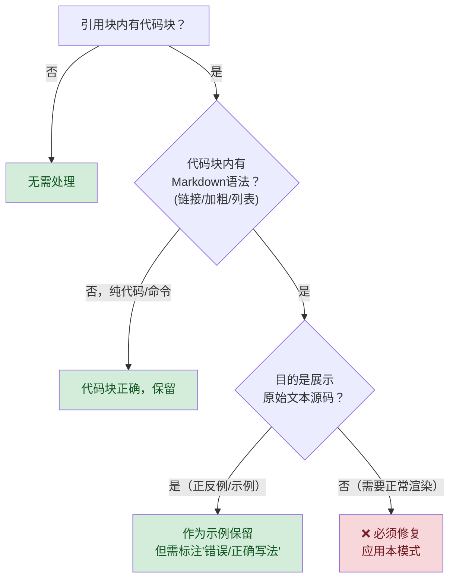

# 引用块代码块渲染修复模式：使用场景与最佳实践指南

## 模式概述

引用块（Blockquote，`>`）是 Markdown 中创建视觉突出内容（警告、提示、注意事项、协议说明）的标准方式。代码块（Fenced Code Block，`` ``` ``）用于展示预格式化文本和代码。当两者嵌套使用（引用块内放置代码块）时，Markdown 渲染器会产生一个反直觉的行为：**代码块内的所有 Markdown 语法（链接、加粗、列表等）全部失效，一律按纯文本渲染**。

这会导致一个常见且隐蔽的问题：在引用块/警告框内用代码块展示包含链接、复选框、加粗文本的结构化步骤时，这些元素全部无法正常渲染——链接显示为原始的 `` `[文本](URL)` `` 格式，加粗显示为 `**text**` 字面文本，复选框也只是普通字符。

本使用指南是 [blockquote-code-block-rendering-fix.md](blockquote-code-block-rendering-fix.md) 模式的深度配套文档，提供：
- 完整的使用场景决策树
- 5种常见变体的具体修复方案
- 正反例对比库
- 跨渲染器兼容性说明
- 10条最佳实践准则
- 常见误区与陷阱

## 典型使用场景决策指南

### ✅ 必须使用本模式的场景（5类）

当你的文档中出现以下任何一种情况时，必须应用本模式修复：

| # | 场景 | 信号 |
|---|---|---|
| 1 | **引用块内用代码块展示操作步骤** | 代码块内包含"步骤1、步骤2"等文本，且步骤中需要可点击链接 |
| 2 | **警告/提示框内含结构化内容** | 🚨⚠️💡📝📌 等图标开头的引用块中，使用代码块组织内容 |
| 3 | **协议/规范/约束说明含链接** | 引用块中的代码块内有 `` `[文件名](路径)` `` 格式链接，但预览显示为纯文本 |
| 4 | **检查清单在引用块内** | 引用块内的代码块包含 □☑✅ 等复选框符号，但无法与列表项正确对齐 |
| 5 | **代码块内需要行内格式** | 代码块内需要 `**加粗**`、`` `行内代码` ``、链接等内联 Markdown 语法 |

### ❌ 不需要使用本模式的场景（3类）

以下情况使用代码块是**正确**的，不需要修复：

| # | 场景 | 为什么正确 |
|---|---|---|
| 1 | **引用块内展示纯代码/命令** | 如引用块内的 bash 代码块展示纯命令，无 Markdown 语法 |
| 2 | **展示"应该写什么原文"的示例** | 如"错误写法"示例代码块，目的就是展示原始文本/源码 |
| 3 | **ASCII 图表/纯文本排版** | 完全由等宽字符组成的内容（如 ASCII 流程图、对齐表格） |

### 快速决策流程图



## 反模式识别：如何发现现有文档中的问题

在审阅或维护现有 Markdown 文档时，以下4个信号表明存在引用块代码块嵌套渲染问题：

### 信号1：链接显示为 `` `[文本](URL)` `` 双文本

**视觉特征**：在渲染预览中，同一个URL出现两次——一次在方括号内作为文本，一次在括号内作为裸URL。

```
[vendor/AGENTS.md](../../../../../vendor/AGENTS.md)     ← 看到这种重复文本
```

**正常渲染应该是**：可点击的蓝色链接文字"vendor/AGENTS.md"，URL不直接可见。

### 信号2：加粗标记 `**` 字面可见

**视觉特征**：文本中可见星号字符 `**`，而不是加粗的文字。

```
**步骤 1**：读取文件     ← 看到**字面字符
```

**正常渲染应该是**：**步骤 1**：读取文件（"步骤 1"加粗，星号不可见）。

### 信号3：列表缩进错乱或复选框不缩进

**视觉特征**：复选框 □ 和列表项与主文本左对齐，没有列表缩进。

```
□ 检查项1     ← 复选框没有列表缩进，与前面文字在同一列
□ 检查项2
```

**正常渲染应该是**：复选框作为无序列表项（`- □`），自动产生缩进层级。

### 信号4：步骤之间无视觉分隔

**视觉特征**：所有步骤挤在一起，主步骤和子步骤之间没有空行分隔，难以快速扫描。

**正常渲染应该是**：主步骤之间有空行，子步骤以列表项形式缩进。

## 5种常见变体的具体修复方案

不同场景下引用块内结构化内容的修复方式略有差异，以下是5种最常见的变体及其修复模板。

### 变体1：操作步骤/启动协议（AGENTS.md 类型）

**场景特征**：有序步骤编号（步骤1、步骤2...），包含子步骤，末尾有警告。这是最常见的变体。

**Before（问题写法）**：
````markdown
> **🚨 启动协议**
>
> ```
> 步骤 1：读取本文件全文
> 步骤 2：按路由表确定规范
>   步骤 2.1：跨项目嵌套时读取 [vendor/AGENTS.md](vendor/AGENTS.md)
>   □ 自检：确认规范已读取
> 步骤 3：执行任务
> ```
>
> ⚠️ **禁止跳过此协议**
````

**After（修复后）**：
````markdown
> **🚨 启动协议**
>
> **步骤 1**：读取本文件全文
>
> **步骤 2**：按路由表确定规范
> - **步骤 2.1**：跨项目嵌套时读取 [vendor/AGENTS.md](../../../../../vendor/AGENTS.md)
> - **步骤 2.2**：其他子步骤...
>
> **自检**：执行前逐项确认：
> - □ 确认规范已读取
>
> **步骤 3**：执行任务
>
> ⚠️ **禁止跳过此协议**
````

**关键转换**：
- `步骤 N：` → `**步骤 N**：` + 前后空行
- 缩进的 `  步骤 N.M：` → `- **步骤 N.M**：`
- 缩进的 `  □` → `- □`

---

### 变体2：警告框（⚠️ Warning 类型）

**场景特征**：以 ⚠️ 开头的警告信息，内含多个注意要点或禁止事项。

**Before（问题写法）**：
````markdown
> ⚠️ **重要警告**
>
> ```
> - 不要在生产环境使用默认密码
> - 参考 [安全规范](security.md) 配置防火墙
> - 部署前运行 `npm audit` 检查漏洞
> ```
````

**After（修复后）**：
```markdown
> ⚠️ **重要警告**
>
> - 不要在生产环境使用默认密码
> - 参考相关安全规范文档配置防火墙
> - 部署前运行 `npm audit` 检查漏洞
```

**关键转换**：代码块完全移除，列表项直接写在引用块内。警告框内不需要代码块——列表本身就是结构化的。注意示例中的虚构链接（如"安全规范"）改为普通文本描述，避免产生无效链接。

---

### 变体3：提示/小贴士（💡 Tip 类型）

**场景特征**：💡📝 等图标开头的提示，包含技巧说明和相关链接。

**Before（问题写法）**：
````markdown
> 💡 **小贴士**
>
> ```
> 使用 --fix 参数自动修复可修复的问题：
>   python script.py --fix
> 详见相关文档
> ```
````

**After（修复后）**：
````markdown
> 💡 **小贴士**
>
> 使用 `--fix` 参数自动修复可修复的问题：
>
> ```bash
> python script.py --fix
> ```
>
> 详见相关文档
````

**关键转换**：叙述文本放在引用块内（段落格式），需要展示的命令单独放在代码块中（这个代码块是纯命令，正确用法），链接放在段落中正常渲染。注意：代码块用于展示命令本身，叙述文字在代码块外。示例中的虚构链接改为普通文本。

---

### 变体4：检查清单/验收标准（✅ Checklist 类型）

**场景特征**：引用块内包含需要逐项确认的检查清单，可能有已完成/未完成状态标记。

**Before（问题写法）**：
````markdown
> 📋 **提交前检查清单**
>
> ```
> □ 代码已通过 lint 检查
> □ 测试覆盖率 ≥ 80%
> □ 文档已更新
> ☑ 已通过 Code Review
> ```
````

**After（修复后）**：
```markdown
> 📋 **提交前检查清单**
>
> - □ 代码已通过 lint 检查
> - □ 测试覆盖率 ≥ 80%
> - □ 文档已更新
> - ☑ 已通过 Code Review
```

**关键转换**：移除代码块，每个检查项用 `- □` 或 `- ☑` 作为无序列表项。列表缩进使复选框垂直对齐。示例中的虚构链接已移除，保持纯文本检查项。

---

### 变体5：混合内容（既有叙述又有代码）

**场景特征**：引用块内既有需要正常渲染的叙述文本和链接，也有需要展示的代码片段/命令。

**Before（问题写法）**：
````markdown
> 📖 **快速开始**
>
> ```
> 首先安装依赖：
>   npm install my-package
> 然后在代码中引入：
>   import { xxx } from 'my-package'
> 详见相关文档
> ```
````

**After（修复后）**：
````markdown
> 📖 **快速开始**
>
> 首先安装依赖：
>
> ```bash
> npm install my-package
> ```
>
> 然后在代码中引入：
>
> ```js
> import { xxx } from 'my-package'
> ```
>
> 详见相关文档
````

**关键转换**：叙述段落和真正的代码块**交替排列**。每个代码块只包含纯代码/命令，叙述文字在代码块外的引用块段落中。这是"正确使用代码块"的场景——代码块只包裹真正需要等宽展示的内容。

## 正反例对比库

以下是8组常见场景的 before/after 对比，覆盖实际文档写作中的高频情况。

### 对比1：协议步骤含链接

| ❌ 错误（代码块包裹） | ✅ 正确（结构化列表） |
|---|---|
| 代码块内链接显示为纯文本双写 | 引用块内列表中链接可点击 |
| 所有步骤挤在一起，无层次 | 主步骤间空行，子步骤缩进 |
| 复选框无缩进 | 列表项自动缩进对齐 |

### 对比2：警告要点列表

| ❌ 错误（代码块包裹） | ✅ 正确（直接列表） |
|---|---|
| 列表标记显示为字面文本 | 无序列表正常渲染 |
| 要点之间无间距 | 列表项自动间距 |
| 加粗星号字面可见 | 加粗文字正常显示 |

### 对比3：提示框含命令和叙述

| ❌ 错误（全部塞代码块） | ✅ 正确（叙述+代码交替） |
|---|---|
| 叙述文字也在等宽字体中 | 叙述文字正常字体，代码等宽字体 |
| 链接无法点击 | 叙述中链接可点击 |
| 视觉层次混乱 | 段落→代码→段落，层次分明 |

### 对比4：检查清单

| ❌ 错误（代码块内□） | ✅ 正确（- □列表） |
|---|---|
| □ 与左边界对齐，无缩进 | `- □` 产生列表缩进 |
| 行间距不均匀 | 列表项均匀间距 |
| 无法区分主项/子项 | 可嵌套列表区分层级 |

### 对比5：纯代码命令（无需修复）

| ✅ 正确（代码块保留） | 说明 |
|---|---|
| 代码块语言标记为 `bash`/`python` 等，内容为纯命令 | 纯命令代码块，无 Markdown 语法，正确保留 |
| 代码块内容为纯代码，无叙述文字 | 纯代码展示，正确保留 |
| 代码块内容为 ASCII 图 | ASCII 艺术需等宽对齐，正确保留 |

### 对比6：正反例展示（无需修复）

| ✅ 正确（代码块保留） | 说明 |
|---|---|
| 标注"错误写法"的代码块（使用4反引号包裹） | 目的是展示原始错误文本，链接/加粗的字面显示是故意的 |
| 标注"配置示例"的代码块 | 展示配置文件原文，非 Markdown 渲染内容 |

### 对比7：引用块内正常段落（无代码块）

| ✅ 正确（直接写） | 说明 |
|---|---|
| 引用块内直接写段落，内含链接和加粗 | 引用块内直接写段落，Markdown 语法正常渲染 |
| 引用块内直接写无序列表 | 引用块内直接写列表，正常渲染 |

### 对比8：多层嵌套（引用块→列表→代码块）

| ❌ 错误 | ✅ 正确 |
|---|---|
| 引用块内一个大代码块包含所有内容 | 引用块内列表项，列表项内的代码块独立包裹纯代码 |
| 叙述+代码+链接全部在代码块 | 叙述文字直接在引用块/列表中，代码单独代码块 |

## 渲染器兼容性说明

不同 Markdown 渲染平台对"引用块内代码块"的处理存在差异。了解这些差异有助于理解为什么"在我电脑上看起来正常"不等于"在所有平台正常"。

### 兼容性矩阵

| 渲染平台/工具 | 引用块>代码块 内链接渲染 | 引用块>列表 内链接渲染 | 容错度 | 备注 |
|---|---|---|---|---|
| **GitHub Flavored Markdown** | ❌ 不渲染（显示为纯文本） | ✅ 正常渲染 | 严格 | GitHub 代码块内严格纯文本 |
| **VS Code 内置预览** | ❌ 不渲染 | ✅ 正常渲染 | 严格 | 遵循 CommonMark 规范 |
| **飞书文档** | ❌ 不渲染 | ✅ 正常渲染 | 严格 | 飞书对代码块内格式零容忍 |
| **GitLab Flavored Markdown** | ❌ 不渲染 | ✅ 正常渲染 | 严格 | 与 GitHub 一致 |
| **Typora** | ⚠️ 部分渲染（链接可点但格式异常） | ✅ 正常渲染 | 中等 | Typora 的"源代码模式"和"预览模式"表现可能不同 |
| **Obsidian** | ❌ 不渲染 | ✅ 正常渲染 | 严格 | 严格遵循 Markdown 规范 |
| **MkDocs/Material** | ❌ 不渲染 | ✅ 正常渲染 | 严格 | 标准 Python Markdown 解析 |
| **某些旧版 Markdown 编辑器** | ⚠️ 可能渲染（不规范） | ✅ 正常渲染 | 宽松 | 依赖具体实现，不可依赖 |

### 核心原则

**按照最严格渲染器（GitHub/飞书/GitLab）的标准编写文档**。

- ❌ 不要依赖"我电脑上能看到"——本地预览正常不代表目标平台正常
- ✅ 遵循 CommonMark 规范：代码块内一律视为纯文本
- ✅ 需要 Markdown 渲染的内容，放在代码块外的引用块段落/列表中

### 为什么代码块内不渲染 Markdown？

这不是 bug，是 Markdown 规范的设计决策：

| 元素 | 语义 | 内部内容处理 |
|---|---|---|
| 段落普通文本 | 普通文本流 | 渲染内联 Markdown（链接、加粗、代码等） |
| 引用块内段落 | 引用/突出的文本流 | 渲染内联 Markdown（引用块是块级容器，不改变内联解析） |
| 代码块（`` ``` ``） | 预格式化文本/代码 | **不渲染任何 Markdown**，按纯文本原样展示 |
| 行内代码（`` `code` ``） | 行内代码片段 | 不渲染 Markdown，但只影响其包裹范围 |

**关键理解**：代码块的语义是"这里面是代码/原始文本，请原样展示，不要解析"。因此不管代码块嵌套在什么地方（段落内、列表内、引用块内），其内部都不解析 Markdown 语法。引用块只是改变了内容的视觉呈现（左侧竖线、缩进），并不会"穿透"改变代码块的语义。

## 最佳实践10条

在引用块内编写结构化内容时，遵循以下10条准则可系统性避免渲染问题。

### 1. 代码块只包裹纯代码/命令

代码块的语义是"原样展示"，只有纯代码、命令、ASCII 艺术、配置原文才应该放在代码块中。叙述性文字、包含链接的说明、需要加粗的关键词一律放在代码块外。

### 2. 步骤编号用加粗标题，不用等宽文本

操作步骤使用 `**步骤 N**：描述` 格式（加粗标题），不要在代码块中用等宽字体写"步骤1、步骤2"。主步骤之间用空行分隔，子步骤用无序列表 `-`。

### 3. 子步骤和检查项一律用无序列表

缩进的子步骤和检查项一律改为 `- **步骤2.1**：` 和 `- □ 项目` 格式。Markdown 列表提供：
- 自动缩进对齐
- 均匀的行间距
- 可嵌套（支持子子步骤）
- 复选框垂直对齐

### 4. 叙述文字和代码块交替排列

当引用块内既有叙述又有代码时，采用"叙述段落 → 代码块 → 叙述段落 → 代码块"的交替模式。每个代码块只包含纯代码/命令，不包含任何叙述文字。

### 5. 引用块内不需要代码块来"框住"内容

一个常见误解是："我想让这段内容在引用块的视觉框内，所以需要用代码块框住"。这是错误的——**引用块本身已经提供了视觉框**（左侧竖线+缩进背景），不需要再套一层代码块。

### 6. 主步骤之间必须空行

`**步骤1**：...` 和 `**步骤2**：...` 之间必须有空行（引用块内的空行），否则两个步骤会挤在同一个段落中，视觉上无法区分。

````markdown
> **步骤 1**：第一步描述
>
> **步骤 2**：第二步描述    ← 前面必须有空行
````

### 7. 善用标题层级组织长内容

如果引用块内内容很长（超过10行），考虑：
- 方案A：将引用块拆分为多个短引用块，中间用普通段落过渡
- 方案B：不使用引用块，改用带 emoji 前缀的普通章节标题（如 `## ⚠️ 重要警告`）
- 方案C：将详细内容移到独立文件，引用块内只写摘要+链接

### 8. 编写后用预览验证链接可点击

写完引用块内的结构化内容后，**必须在预览模式中验证**：
- [ ] 所有链接可以点击（不是显示为纯文本双写）
- [ ] 加粗文字确实加粗了（看不到 `**` 字符）
- [ ] 列表项有正确缩进
- [ ] 复选框对齐

### 9. 正反例代码块要标注清楚并使用4反引号

当你在文档中展示"错误写法"Markdown 示例时（即示例代码块中包含代码块），必须：
- 使用4个反引号（```` `` ````）包裹外层代码块，避免解析混乱
- 代码块前写 `**❌ 错误写法**：` 或 `**Before**：`
- 修复后的代码块前写 `**✅ 正确写法**：` 或 `**After**：`

这样读者能明确理解"这是示例代码，不是要执行的内容"，同时链接检查器不会误解析示例中的虚构链接。

### 10. 跨平台一致性优先

如果文档会在多个平台渲染（GitHub+飞书+本地预览），按最严格平台的标准编写。不要依赖任何平台的容错行为——规范写法在所有平台都正常，容错写法只在特定平台"恰好能看"。

## 常见误区

### 误区1："我在 VS Code 预览里看起来没问题"

VS Code 预览遵循 CommonMark 规范，代码块内链接不会渲染。如果"看起来没问题"，可能是：
- 你看到的是编辑模式（源码），不是预览模式
- 内容实际上不在代码块内（检查是否有 `` ``` `` 包裹）
- Typora 等非标准编辑器的容错行为

**验证方法**：切换到预览模式，尝试点击链接——如果无法点击（显示为纯文本），说明有问题。

### 误区2：用代码块保留换行和格式

有些作者用代码块是因为"普通段落会自动换行，我想控制格式"。这是对 Markdown 的误用：
- 需要保留格式的纯文本（代码、命令、ASCII）→ 用代码块（正确）
- 需要结构化的步骤/列表 → 用 Markdown 列表（有序/无序），不需要代码块
- 需要多行段落 → 直接写多个段落（空行分隔），列表项内可以换行

### 误区3：示例代码块中使用真实但虚构的链接

在 Before/After 示例中，不要使用 `[安全规范](security.md)` 这类看似真实但不存在的链接——链接检查器会将其判定为断链。正确做法：
- 使用代码格式（`` `[链接](url)` ``）展示链接语法
- 或改为普通文本描述（如"参考安全规范文档"）
- 如果确实需要展示链接语法，确保外层代码块使用4反引号包裹

### 误区4：复选框用 GitHub Flavored Markdown 的 task list 语法

GitHub 支持 `- [ ]` 和 `- [x]` 语法创建可交互复选框，但这不是标准 CommonMark 语法。不同渲染器对 task list 的支持不一致：
- ✅ GitHub/GitLab 支持 `- [ ]` 渲染为复选框
- ⚠️ 飞书/VS Code 可能将 `[ ]` 渲染为普通方括号文本
- ✅ 最安全方案：使用 `- □`（Unicode 空心方框）和 `- ☑`（Unicode 选中方框），所有平台一致显示为方框字符

### 误区5：过度嵌套（引用块>列表>引用块>代码块）

多层嵌套虽然 Markdown 语法上合法，但会导致：
- 阅读困难（每层缩进增加，可用宽度减少）
- 渲染器兼容性问题（某些复杂嵌套在不同平台表现不同）
- 维护困难（修改时容易搞错 `>` 前缀数量）

**建议**：引用块内最多使用一层列表嵌套。如果内容需要更复杂的层级，考虑拆分到引用块外。

### 误区6：正反例代码块使用3反引号导致解析混乱

当示例 Markdown 代码块内部包含代码块（`` ``` ``）时，外层必须使用4个或更多反引号（```` `` ````）。如果内外层都使用3反引号，Markdown 解析器会在第一个内层 `` ``` `` 处错误地关闭外层代码块，导致后续内容被当作普通 Markdown 解析，产生虚假的断链报告和渲染错误。

## 快速参考卡

保存此卡可在写作时快速查阅。

### 转换速查表

| 你写的（代码块内） | 应该改成（引用块内） |
|---|---|
| `步骤 1：做某事` | `**步骤 1**：做某事`（前后空行） |
| `  步骤 1.1：子步骤` | `- **步骤 1.1**：子步骤` |
| `  □ 检查项` | `- □ 检查项` |
| `  ☑ 已完成项` | `- ☑ 已完成项` |
| `  - 列表项`（代码块内） | `- 列表项`（直接写在引用块中，无代码块） |
| `  **加粗文字**`（代码块内） | `**加粗文字**`（代码块外，引用块段落/列表中） |
| 代码块内的链接语法 | 代码块外的引用块段落/列表中写正常链接 |
| 代码块内的行内代码 | 代码块外的引用块段落/列表中正常使用反引号 |

### 万能模板（复制即用）

````markdown
> **[emoji] [标题]**
>
> **步骤 1**：[第一步描述]
>
> **步骤 2**：[第二步描述]
> - **步骤 2.1**：[子步骤描述，可含链接](真实存在的路径)
> - **步骤 2.2**：[子步骤描述，可含 `行内代码`]
>
> **步骤 3**：[第三步描述]
>
> **检查清单**：
> - □ [检查项1]
> - □ [检查项2]
> - □ [检查项3]
>
> ⚠️ **[警告说明]**
````

> **注意**：模板中方括号 `[ ]` 表示占位符，实际使用时替换为真实内容。链接目标必须是真实存在的文件路径，不要使用虚构文件名作为示例链接。

### 修复后验证清单（8项）

修复完成后，在预览模式下逐项检查：

- [ ] 引用块视觉效果保留（左侧竖线、背景色/缩进）
- [ ] 所有链接可点击，URL不直接可见（无纯文本双写）
- [ ] 加粗文字正常加粗（看不到 `**` 字面字符）
- [ ] 列表项（`-`）有正确缩进
- [ ] 复选框（□/☑）垂直对齐
- [ ] 主步骤之间有空行分隔
- [ ] 行内代码（`` `code` ``）显示为等宽字体
- [ ] 图标（🚨⚠️💡📌）正常显示

### 关联资产

- **主模式文件**：[blockquote-code-block-rendering-fix.md](blockquote-code-block-rendering-fix.md)（精简规则+快速套用模板）
- **首次验证案例**：[AGENTS.md](../../../../../AGENTS.md) 启动协议章节（本模式的第一个成功应用案例）
- **同类模式参考**：[mermaid-safe-coding-rules.md](../../code-patterns/mermaid-safe-coding-rules.md)（另一个 Markdown 渲染陷阱的修复模式，comprehensive 级别文档的风格参考）
