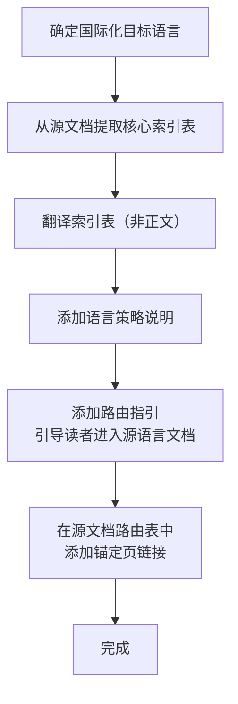

> **来源**：从 `docs/retrospective/reports/retrospective-comprehensive-20260623/execution-s4-s7.md` 七、7.2 发现四 拆分

# 国际化锚定页策略（i18n Anchor Page Strategy）

## 模式类型
方法论模式

## 成熟度
L1 实验性（1 次成功案例：AGENTS.en.md 120 行英文快速索引）

## 适用场景
项目文档体系需要进行国际化时，面临"全量翻译"还是"部分翻译"的策略选择。

## 问题背景

国际化的常见误区是追求"全量翻译"——将全部文档逐篇翻译为目标语言。这种做法有两个根本问题：

1. **维护成本爆炸**：每份源文档的每次更新都需同步翻译，文档越多、更新越频繁，翻译债务越大
2. **质量不可控**：非母语翻译的质量难以保证，低质量翻译反而降低读者信任

一个更高效的替代策略是：仅翻译核心索引结构，引导读者进入源语言文档体系阅读完整内容。

## 核心原则

> 一个 120 行的"锚定页"（包含核心表结构 + 路由指引）的战略价值远超一篇不完整的全量翻译。

锚定页的职责不是"替代源文档"，而是"降低进入门槛"——帮助非母语读者快速理解项目结构，然后通过路由表引导他们进入源文档体系。

## 操作流程

## 锚定页的内容结构

| 章节 | 内容 | 示例（AGENTS.en.md） |
|------|------|---------------------|
| **核心索引表** | 角色、模块、协议、工作流的路由表 | 角色定义索引、自我演进模块索引、协作协议索引 |
| **语言策略说明** | 明确告知读者"本页是快速索引，完整规范在 .agents/ 中" | "This is a quick-index page. For complete specifications, see the Chinese documents in .agents/" |
| **路由指引** | 每个条目的深层跳转路径 | 角色 → `.agents/roles/orchestrator.md` |

## 不包含的内容

| 不翻译 | 原因 |
|--------|------|
| 正文详细说明 | 维护成本高，翻译质量不可控 |
| 代码示例 | 代码本身是通用语言 |
| 规则/约束细则 | 歧义风险高，应引导读原文 |
| 工作流步骤详解 | 结构复杂，翻译后易丢失精确语义 |

## 本案例数据

| 指标 | 数值 |
|------|------|
| 源文档 | AGENTS.md（约 200 行） |
| 锚定页 | AGENTS.en.md（约 120 行） |
| 翻译内容 | 核心索引表 + 语言策略说明 |
| 未翻译 | 正文规则、代码示例、工作流步骤 |
| 维护策略 | 仅当索引表结构变化时同步更新 |

## 实施检查清单

- [ ] 识别源文档中"纯结构"的部分（索引表、路由表、目录）
- [ ] 翻译纯结构部分，不翻译正文
- [ ] 添加明确的语言策略说明（"本页是索引，完整文档在 X"）
- [ ] 为每个条目添加可点击的路由跳转
- [ ] 在源文档中添加锚定页的链接（双向绑定）

## 成功案例

| 场景 | 源文档行数 | 锚定页行数 | 翻译率 | 维护策略 |
|------|----------|----------|--------|---------|
| AGENTS.md → AGENTS.en.md | ~200 | ~120 | 仅结构 | 索引表变更时同步 |

## 适用条件

- 源文档包含清晰的索引表或路由表结构
- 目标读者具备阅读源语言的意愿或能力（锚定页只是降低门槛，不是替代）
- 项目处于活跃开发期（全量翻译的维护成本不可接受）

## 不适用场景

- 面向终端用户的产品文档（需要完整翻译）
- 源文档没有清晰的索引结构（无法提取"纯结构"部分）
- 项目文档量极少（全量翻译成本可接受）

> **关联模块**：
> - `convention-driven-creation.md`
> - `AGENTS.en.md`
