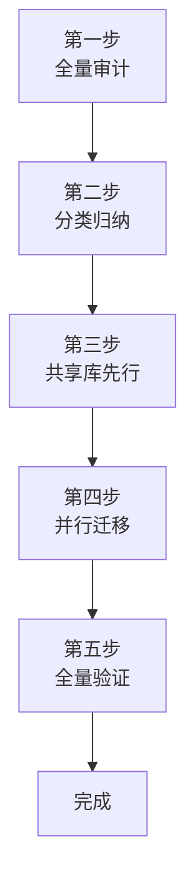

> **来源**：从 `docs/retrospective/reports/project-governance/tools-and-automation/retrospective-scripts-shared-lib-extraction-20260626/` 萃取

# 大规模重复消除法（Large-Scale Duplication Elimination）

## 模式类型
方法论模式

## 成熟度
L2 已验证（1 次大规模验证：24 脚本 12 类重复模式消除）

## 适用场景
需要对 10+ 个文件进行系统性重复代码消除并提取共享库的场景。

## 问题背景

`diff-driven-refactoring.md` 聚焦于 2 个文件的对比重构，但当重复代码分散在 20+ 个文件中、涉及 10+ 类不同重复模式时，逐对对比效率极低且容易遗漏。大规模重复消除需要系统化的审计→分类→提取→迁移→验证流程。

## 五步框架



### 第一步：全量审计

**目标**：识别所有重复代码模式，不遗漏

**方法**：使用 Agent 对目标目录下所有文件进行语义级扫描，输出重复模式清单

**审计产出**：

| 产出 | 格式 | 用途 |
|------|------|------|
| 重复模式清单 | 表格（模式名/出现次数/典型文件/消除方式） | 分类归纳输入 |
| 重复代码量统计 | 行数 | ROI 评估 |
| 重复分布特征 | 按频率排序 | 优先级判断 |

**关键原则**：审计规模越大，单位成本越低（已识别模式可快速在其他文件定位同类重复）

### 第二步：分类归纳

**目标**：将重复模式按消除方式分组，制定迁移计划

**分类维度**：

| 类别 | 特征 | 消除方式 | 示例 |
|------|------|---------|------|
| 完全重复 | 代码逐字相同 | 直接替换为共享调用 | `print("=" * 60)` → `print_header` |
| 相似但参数不同 | 逻辑相同，参数/正则不同 | 参数化为统一接口 | `FRONTMATTER_RE` → `lib.frontmatter` |
| 功能重复 | 已有共享函数但未使用 | 替换为已有共享调用 | 自建 `discover_spec_dirs` → `lib.spec` |
| 内部重复 | 同一文件内逻辑重复 | 提取内部共享函数 | `run_spec_checks()` |

**3 次阈值规律**：出现 ≥ 3 次的模式优先提取，1-2 次的可暂缓

### 第三步：共享库先行

**目标**：先创建/扩展共享库，再迁移脚本

**操作流程**（遵循 `structure-first-extension.md`）：
1. 阅读现有共享库的包结构与导出关系
2. 判断新功能的概念域归属
3. 同概念域 → 追加到已有模块；异概念域 → 新建模块
4. 更新 `__init__.py` 导出

**关键原则**：共享库是迁移的目标，必须先就位再迁移，避免"迁移到一半发现目标不存在"

### 第四步：并行迁移

**目标**：批量迁移脚本到共享库调用

**分工策略**（遵循 `multi-agent-parallel-execution.md`）：

| 划分方式 | 冲突风险 | 效率 | 适用条件 |
|---------|---------|------|---------|
| 按文件组（推荐） | 无 | 高 | 文件间无依赖 |
| 按功能类型 | 高 | 中 | 文件间有明确依赖链 |
| 按时间阶段 | 无 | 低 | 有严格顺序依赖 |

**关键原则**：按文件维度划分任务（而非功能维度），避免多代理竞争同一文件

### 第五步：全量验证

**目标**：确保重构后功能完全一致

**三层验证**：

| 层级 | 方法 | 覆盖范围 |
|------|------|---------|
| 语法层 | 所有脚本 `--help` 正常 | 接口未破坏 |
| 集成层 | ci-check.ps1 综合检查 | 无回归 |
| 功能层 | 实际运行关键脚本 | 行为一致 |

**关键原则**：重构可能发现隐藏 bug（如路径解析错误），这是"重构价值公式"的隐性收益

## 重构价值公式

```
重构价值 = 消除的重复代码量 + 发现的隐藏问题 + 建立的结构基础
```

仅评估第一层会低估 ROI 约 50%。本次案例的三层价值比为 `280行 : 1bug : 1module`。

## 实施检查清单

- [ ] 是否对所有目标文件进行了全量审计？
- [ ] 重复模式是否按消除方式分类归纳？
- [ ] 共享库是否在迁移前已创建/扩展？
- [ ] 并行子代理是否按文件组分工（非功能维度）？
- [ ] 是否执行了三层验证（语法+集成+功能）？
- [ ] Spec 三件套是否归档（spec.md/tasks.md/checklist.md）？

## 成功案例

| 任务 | 文件数 | 重复模式 | 消除代码 | 产出 |
|------|--------|---------|---------|------|
| 脚本共享库提取 | 24 | 12 类 | ~280 行 | lib/markdown.py + 6 函数 + 1 bug 修复 |

## 与现有模式的关系

- `diff-driven-refactoring.md`：本模式的大规模版本，聚焦 10+ 文件；diff-driven 聚焦 2 文件对比
- `multi-agent-parallel-execution.md`：本模式第四步的具体执行策略
- `structure-first-extension.md`：本模式第三步共享库扩展的决策依据

> **关联模块**：
> - `diff-driven-refactoring.md`
> - `multi-agent-parallel-execution.md`
> - `structure-first-extension.md`
