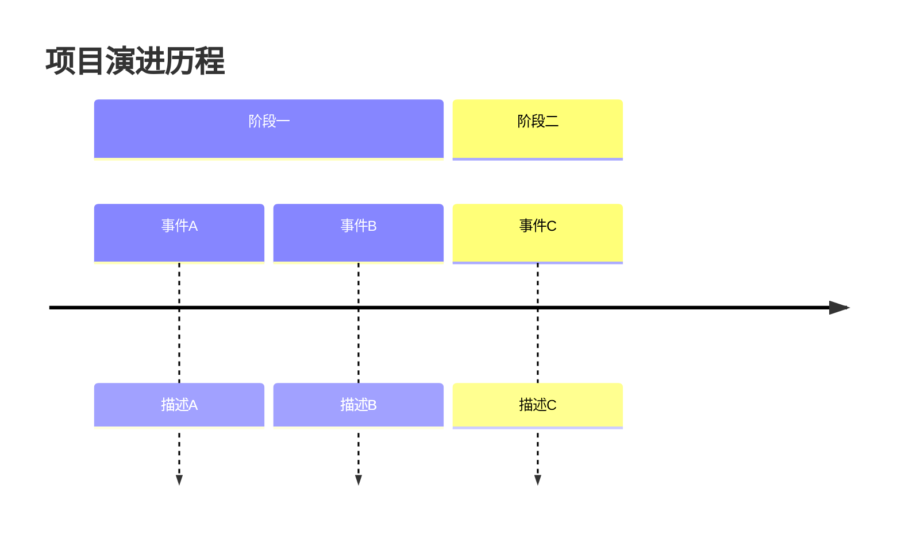
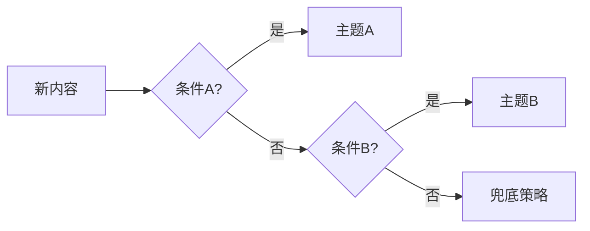
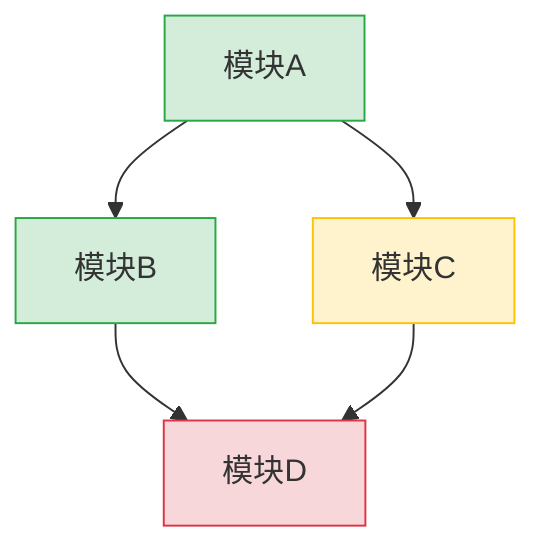
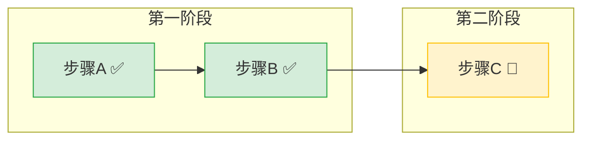

+++
id = "mermaid-layered-visualization"
domain = "methodology"
layer = "methodology"
maturity = "L2"
validation_count = 4
reuse_count = 0
documentation_level = "comprehensive"
source = "docs/retrospective/reports/spec-system/retrospective-report-specs-theme-task-board-system-20260626/insight-extraction.md"

[bindings]
rules = []
references = ["visual-atomization-principle", "meta-document-leverage", "cognitive-anchor-visualization", "mermaid-safe-coding-rules", "mermaid-trap-cheatsheet"]
skills = []
+++

# Mermaid 分层可视化：一图一义的图表策略

## 模式概述

当系统包含多种关系类型（时间、依赖、决策、流程）时，将不同维度的关系用独立的 Mermaid 图表分别表达，而非混合在一张图中。每个图表只表达一种关系类型（一图一义），通过状态标注（颜色/填充）区分节点状态，使复杂关系结构一目了然。

## 四维度分层策略

| 维度 | 图表类型 | 表达的关系 | 典型应用 |
|------|---------|----------|---------|
| 时间维度 | `timeline` | 事件随时间的演进 | 里程碑路线图、项目时间线 |
| 决策维度 | `flowchart`（决策树） | 条件判断与分支选择 | 归类决策、路由判断 |
| 依赖维度 | `flowchart`（依赖图） | 节点间的前置/后继关系 | 跨模块依赖、任务依赖 |
| 流程维度 | `flowchart`（路线图） | 执行顺序与阶段划分 | 主题内执行路线、工作流 |

## 核心原则

### 原则 1：一图一义

每个图表只表达一种关系类型，不混合。

| 做法 | 评价 | 示例 |
|------|------|------|
| 一张图表达依赖关系 | ✅ 正确 | A→B 表示 B 依赖 A |
| 一张图表达执行顺序 | ✅ 正确 | A→B 表示先执行 A 再执行 B |
| 一张图同时表达依赖和执行顺序 | ❌ 错误 | 读者无法区分 A→B 是"依赖"还是"先执行" |

**例外**：当依赖关系和执行顺序完全一致时（即依赖关系天然决定了执行顺序），可以合并为一张图，但需在图注中说明。

### 原则 2：分层独立

不同层级的图表分开绘制，不混合。

```
✅ 正确：
  全局依赖图（一张） + 主题A路线图（一张） + 主题B路线图（一张）
  
❌ 错误：
  全局+主题A+主题B 混合在一张图（信息过载，无法阅读）
```

### 原则 3：状态标注统一

用颜色/填充区分节点状态，全项目统一标注规范：

```
✅ 完成  → style 节点 fill:#d4edda,stroke:#28a745（绿色）
🔧 进行中 → style 节点 fill:#fff3cd,stroke:#ffc107（黄色）
📋 待启动 → style 节点 fill:#f8d7da,stroke:#dc3545（红色）
⏸️ 阻塞  → style 节点 fill:#e2e3e5,stroke:#6c757d（灰色）
```

**关键**：状态标注必须在所有图表中一致，读者一旦学会颜色含义即可快速扫描任意图表。

## 图表设计规范

### timeline（时间维度）



**适用条件**：
- 需要展示时间先后顺序
- 有明确的阶段划分
- 事件数量 ≥ 3（少于 3 个用文字描述即可）

### flowchart 决策树（决策维度）



**适用条件**：
- 判断流程有明确的条件分支
- 每个条件是"是/否"二选一
- 需要指导他人做出正确选择

### flowchart 依赖图（依赖维度）



**适用条件**：
- 模块间有前置依赖关系
- 需要识别关键路径和瓶颈
- 需要展示跨主题/跨模块的依赖

### flowchart 路线图（流程维度）



**适用条件**：
- 有明确的执行顺序
- 需要分阶段展示
- 需要标注当前进度

## 图表数量决策

| 系统复杂度 | 推荐图表数 | 图表类型组合 |
|-----------|----------|------------|
| 简单（< 5 个节点） | 0-1 | 用文字描述即可 |
| 中等（5-15 个节点） | 2-3 | 路线图 + 依赖图 |
| 复杂（15-30 个节点） | 4-6 | 路线图 + 依赖图 + 决策树 |
| 超复杂（> 30 个节点） | 6+ | 四维度全覆盖 + 分层独立 |

**反模式**：试图用一张图表达所有关系。节点超过 15 个时图表可读性急剧下降。

## 质量检查清单

### 结构设计检查

- [ ] 每个图表只表达一种关系类型（一图一义）
- [ ] 不同层级的关系分开绘制（分层独立）
- [ ] 状态标注全项目统一（颜色/填充一致）
- [ ] 单张图节点数 ≤ 15（超过则拆分）
- [ ] 图表有明确的 title 或标题
- [ ] flowchart 方向合理（流程用 LR，层级用 TD）
- [ ] subgraph 分组有语义化标题

### 语法安全检查（Mermaid 安全编码五规则）

- [ ] 代码块内无任何空行
- [ ] 含中文/特殊字符/空格的节点文本已用双引号包裹
- [ ] 节点文本无「数字.空格」「- 空格」「* 空格」等列表触发模式
- [ ] Subgraph 使用 `ID ["标题"]` 格式，ID 为纯英文
- [ ] 边标签使用 `-->|"标签"|` 格式（中文/特殊字符加引号）
- [ ] Style 语句前无空行
- [ ] 运行 `python .agents/scripts/check-mermaid.py` 无错误无警告

> 详细安全编码规则见 [mermaid-safe-coding-rules.md](../../code-patterns/mermaid-safe-coding-rules.md)，陷阱速查见 [mermaid-trap-cheatsheet.md](../../code-patterns/mermaid-trap-cheatsheet.md)。

## 适用场景

- 文档体系结构可视化（目录关系、依赖关系）
- 项目进度展示（里程碑、路线图、状态看板）
- 决策流程文档化（归类决策、路由判断）
- 系统架构图（模块依赖、数据流）
- 复盘报告中的过程回顾（时间线、阶段划分）

## 不适用场景

- 关系简单到文字即可描述（< 3 个节点）
- 需要精确像素级控制的图表（用专业绘图工具）
- 实时动态变化的关系（Mermaid 是静态的）
- 需要交互式的图表（用前端可视化库）

## 与视觉原子化原则的关系

本模式是 `visual-atomization-principle`（视觉原子化原则）在 Mermaid 图表场景的具体应用：

| 模式 | 核心思想 | 应用场景 |
|------|---------|---------|
| visual-atomization-principle | 一张图一个认知锚点 | 所有视觉内容（图片、图表、插图） |
| mermaid-layered-visualization（本模式） | 一图一义 + 分层独立 | Mermaid 图表 specifically |

本模式补充了 Mermaid 特有的四维度分层策略和状态标注规范，是视觉原子化原则的特化。

> 来源：SpecWeave 项目多次复盘中 Mermaid 图表的系统性应用实践（specs 看板体系 15 个图表、复盘报告中的时间线/依赖图/决策树等）
> 关联模式：`visual-atomization-principle`（视觉原子化的 Mermaid 特化）、`meta-document-leverage`（图表提升元文档价值）、`cognitive-anchor-visualization`（认知锚点可视化）
