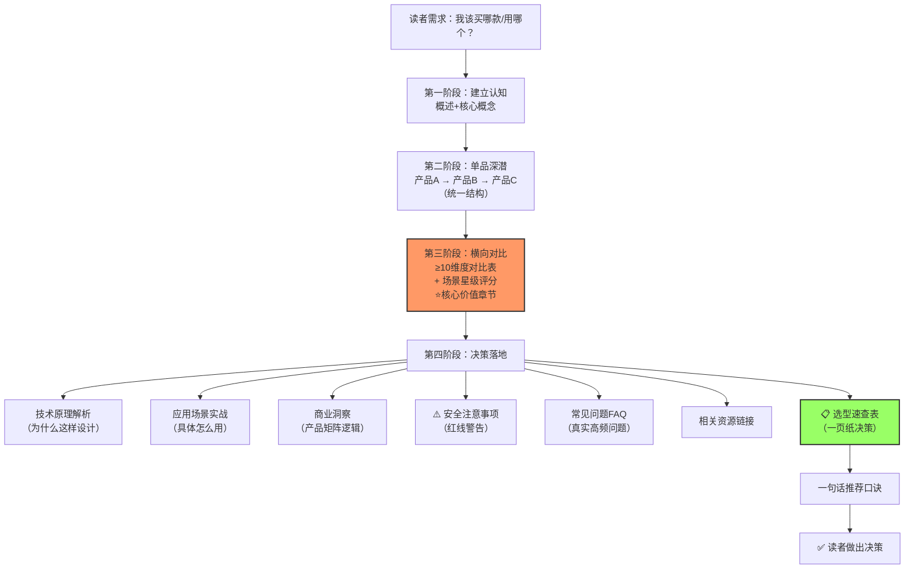

# 多产品对比学习四段式结构：产品线系统学习文档组织法

## 模式概述

当需要系统学习同一系列多款产品（如同品牌智能插座不同型号、同系列硬件产品不同SKU、同厂商软件不同版本）时，应采用"单品解析→多维度对比→场景匹配→选型决策"四段式结构。传统"逐个产品介绍"的平铺结构无法解决读者"这几款到底有什么区别、我该买哪款"的核心决策痛点——多产品学习文档的设计重心应放在"横向对比与选型指导"而非"单品信息罗列"。

该模式与 [product-learning-five-tier-pyramid.md](product-learning-five-tier-pyramid.md)（5层价值金字塔，解决"单产品文档应该写到什么深度"）和 [concept-comparison-tutorial-structure.md](concept-comparison-tutorial-structure.md)（易混技术概念对比，解决"抽象概念边界辨析"）互补：本模式专注于**实体产品/硬件/方案间的选型决策**，最终产出可直接用于决策的"一页纸选型速查表"。

## 问题现象

多产品/多SKU学习文档常见失败模式：

1. **平铺直叙无对比**：逐个产品罗列参数和功能，但从不横向对比异同，读者需要自己在各章节间翻来翻去做对比
2. **对比维度不足**：只对比功能有无，忽略安全特性、工作温度、价格、适用场景等关键决策维度
3. **缺乏场景映射**：只说产品有什么功能，不说"什么场景下该选哪款"，读者无法将功能映射到自己的需求
4. **无决策结论**：讲完所有产品后没有"我该选哪个"的答案，读者读完仍然无法做决定
5. **安全警告不突出**：硬件产品涉及安全红线（如功率限制、禁止用途），但警告埋藏在正文或完全缺失
6. **FAQ实用性差**：常见问题解答泛泛而谈，不回答真实使用中会遇到的具体问题

这些问题的共同根因是：作者按"产品清单"组织内容，而不是按"读者的决策路径"组织内容。读者来读这类文档的核心动机不是"了解每款产品参数"，而是"搞清楚区别、选对适合自己的那款"。

## 解决方案

采用"四段式决策导向"结构，可根据文档规模选择单文件或原子化多文件：

| 阶段 | 章节（单文件模式） | 核心内容 | 设计意图 | 占比 |
|------|-------------------|---------|---------|------|
| **第一阶段：建立认知** | 产品概述 + 核心概念解析 | 产品线整体定位、关键术语定义（8-10个核心概念）、学习目标 | 建立基础认知框架，先"懂行话"再看产品 | ~15% |
| **第二阶段：单品深潜** | 每款产品独立章节，统一结构 | 产品定位、核心规格、功能特性、安全设计、典型应用场景 | 逐个建立完整认知，为对比打基础 | ~25% |
| **第三阶段：横向对比（核心价值）** | 多维度对比矩阵 + 场景匹配评分 | ✅ **≥10维度对比表**（功能/安全/温度/尺寸/价格/费用等）+ 典型应用场景星级评分 | 正面回答"有什么区别"的核心问题 | ~25% |
| **第四阶段：决策与落地** | 技术原理解析 + 应用场景实战 + 商业洞察 + 安全注意事项 + FAQ + 资源 + **选型速查表** | 解释"为什么"这样设计、提供可落地使用指导、安全红线警告、高频问题解答、最终一页纸决策表 | 回答"我该怎么用、选哪个"，形成决策闭环 | ~35% |

### 关键设计原则

#### 原则1：单品章节结构强制统一

每款产品的解析章节必须使用**完全相同的内部结构**，便于读者横向对比。推荐统一结构：

```
X.X 产品定位
X.X 核心规格（规格表）
X.X 核心功能特性
X.X 安全特性
X.X 典型应用场景
```

**反模式**：C1Pro章节讲"外观设计"，C2章节讲"电量统计算法"，C4章节讲"安装教程"——每款产品讲的内容不一样，读者无法对比。

#### 原则2：对比表维度≥10个

对比矩阵是核心价值章节，维度不能少于10个。推荐使用"维度类别+具体维度"的二级框架，可根据产品品类裁剪：

**通用维度框架（适用于所有硬件产品）**：

| 维度类别 | 具体维度 |
|---------|---------|
| **基础定位** | 产品定位、目标用户群、价格档位 |
| **联网配置** | 联网方式、配网方式、网络依赖 |
| **功能特性** | 核心功能、特色功能、增值功能 |
| **安全防护** | 过载保护、浪涌保护、阻燃等级、安全门 |
| **物理参数** | 额定功率、最大电流、工作温度、产品尺寸 |
| **使用成本** | 是否有流量费/服务费、续费价格 |
| **适用场景** | 室内/户外、家用/商用、场景推荐指数 |

**KVM/远控硬件扩展维度（7大类33维度）**：

| 维度类别 | 维度数量 | 具体维度 |
|---------|---------|---------|
| **基础信息维度** | 6 | 产品名称、定位、价格、发布时间、目标用户、核心卖点 |
| **硬件规格维度** | 8 | 外观尺寸、重量、材质、视频接口、USB接口、网络接口、其他接口、电源 |
| **网络连接维度** | 5 | 有线网口、WiFi、4G/5G、蓝牙、网络冗余 |
| **视频性能维度** | 4 | 最大分辨率、帧率、延迟、色彩支持 |
| **功能特性维度** | 5 | BIOS级控制、虚拟媒体、音频支持、协作功能、远控方式 |
| **安全特性维度** | 3 | 物理隔离、访问控制、审计日志 |
| **场景适配维度** | 2 | 典型场景、行业适配 |

使用✅❌直观表示支持/不支持，避免长句描述。

#### 原则3：场景匹配必须有星级评分

仅靠对比表不够，需要把典型应用场景列出来，每个场景对每款产品打星级（⭐~⭐⭐⭐⭐⭐），并标注推荐理由。让读者可以直接"对号入座"。

推荐场景数量：5-10个典型场景。

#### 原则4：安全警告必须醒目前置

涉及用电安全、人身安全的硬件类产品，必须有**独立的安全注意事项章节**，使用⚠️符号、加粗、引用块等方式突出关键红线：

- ❌ 明确禁止的用途（如"严禁新能源车充电"、"严禁16A大功率电器"）
- ⚠️ 限制条件（如"仅支持2.4G WiFi"、"工作温度范围-10~50°C"）
- 💡 使用提示（如"AC Recovery各主板设置差异"）

**关键**：安全警告不能只写"注意安全"这种空话，必须具体到"不能做什么+为什么+后果"。

#### 原则5：FAQ回答真实高频问题

FAQ的问题必须来自**真实使用场景**（参考电商差评、用户论坛、官方客服高频问题），而不是泛泛的"产品有什么功能"。推荐问题类型：

- 故障排查类（如"配网失败怎么办？"）
- 限制条件类（如"可以接空调吗？"）
- 功能确认类（如"断网了定时还执行吗？"）
- 费用相关类（如"4G流量到期怎么续费？"）
- 设置操作类（如"指示灯太亮怎么关？"）

FAQ数量建议：6-10个。

#### 原则6：选型速查表必须"一页纸决策"

文档最后必须有**选型速查表**，格式为："你的核心需求 → 选择型号 → 一句话理由"。读者不需要看前面所有内容，直接看这张表就能做决策。

速查表推荐行数：6-10个需求场景，覆盖80%以上用户的典型需求。

最后用一句话总结口诀（如"不确定买哪款就买C1Pro；想看电费就买C2；要在没WiFi的地方用就买C4"），便于记忆和传播。

## 文档结构Mermaid流程图



## 适用场景

- ✅ 同品牌同系列多款硬件产品对比学习（如智能插座C1/C2/C4、摄像头不同型号、鼠标不同版本）
- ✅ 同厂商多款软件/服务选型对比（如云服务不同套餐、API不同层级）
- ✅ 多款竞品横向对比分析（如3款主流智能音箱、5款低代码平台）
- ✅ 技术方案选型指南（如3种微服务架构方案、4种数据库选型）
- ✅ 采购决策支持文档（帮团队/公司决定买哪款设备/选哪个方案）
- ❌ 单一产品的深度评测/教程（只有一款产品时不需要多产品对比结构）
- ❌ 抽象技术概念辨析（用concept-comparison-tutorial-structure）
- ❌ 纯功能操作手册（按操作步骤组织即可）

## 实际案例

### 案例1：向日葵智能插座C1Pro/C2/C4 Wiki（本次验证）

| 阶段 | 章节 | 内容 |
|------|------|------|
| 建立认知 | 一~二章 | 产品概述、8个核心概念（WOL/AC Recovery/蓝牙闪连/4G Cat.1/本地定时/断电记忆/延时断电/过载保护） |
| 单品深潜 | 三~五章 | C1Pro蓝牙版、C2蓝牙版、C4 4G版，每章统一结构（定位/规格/功能/安全/场景） |
| 横向对比 | 六章 | **12维度对比表** + 8场景星级评分（家用/办公/户外/路由器重启/高价值设备等） |
| 决策落地 | 七~十六章 | 技术原理（蓝牙配网/本地定时/五层安全）、AC Recovery原理、8大场景实战、产品矩阵洞察、三层安全体系、价值主张、⚠️13条安全注意事项、8个FAQ、资源链接、**8行选型速查表**、一句话口诀 |

效果：958行单文件wiki，零格式错误，选型速查表直接回答"我该买哪款"。验证数据：8个场景、12个对比维度、8个FAQ、13条安全警告。

### 案例2：向日葵P4/P1Pro智能插线板对比Wiki（四维深度框架验证）

本次在四段式结构基础上升级为"四维深度框架"，在第四阶段（决策落地）中增加了战略逻辑层和设计启示层：

| 维度 | 章节 | 内容 |
|------|------|------|
| 1. 参数对比层 | 五章 | **16维度核心规格对比表** + 全系列4款产品功能对比表 |
| 2. 场景选型层 | 八章 | P4专属5场景 + P1Pro专属5场景 + Mermaid选型决策树 |
| 3. 战略逻辑层 | 十章 | "软件引流硬件"商业模式、开机-控制-电源生态闭环、"主流+细分"双产品战略 |
| 4. 设计启示层 | 十一章 | "温柔开关机"命名情绪价值、5年流量包定价心理学、30cm线长场景意义、本地定时兜底设计 |

效果：1192行wiki，零格式错误、零需求变更。16维度对比超越案例1的12维度，新增的Mermaid决策树和商业/设计洞察层使文档从"信息导向"升级为"决策导向+洞察导向"双轮驱动。

**四维深度框架与四段式结构的关系**：四段式结构解决"文档怎么组织"（结构框架），四维深度框架解决"每个阶段写多深"（深度框架），两者互补使用。

### 案例3（参考验证）：向日葵PDU硬件学习wiki

该wiki部分应用了本模式的核心思想（单品解析+对比+场景），但对比维度和选型指南部分不如本次完整。本次是在其基础上的系统化升级。

### 案例3（反向验证）：MopMonk安全Agent wiki

该wiki为单一产品/主题学习，不适用本模式，使用了concept-comparison-tutorial-structure的变体，合理。

### 案例4：向日葵贝锐AI产品矩阵分析wiki

将四段式结构应用于AI产品矩阵对比（非硬件），验证了该模式在非硬件产品选型对比场景的适用性。

### 案例5：向日葵无网远控硬件5产品对比wiki（原子化结构+33维度框架验证）

5款产品（控控2/Q1/Q2Pro/Q0.5/Q5Pro）采用原子化结构（1索引+11章节文件），首次大规模验证：
- **维度扩展**：将通用框架扩展为7大类33维度，新增网络连接维度（5个）、视频性能维度（4个）、安全特性维度（3个）等KVM专属维度
- **结构变体**：产品数量达5款时，四段式结构在单文件中无法承载，采用原子化多文件结构（见sunlogin-hardware-wiki-structure的变体B）
- **效果**：对比表覆盖33个维度，场景评分覆盖近场隔离/个人入门/企业运维/工业4G/医疗协作5大场景，选型决策树清晰

**维度裁剪指南**：不同品类产品应根据特性裁剪维度——消费级IoT用通用框架（约20维度），KVM/远控硬件用33维度完整框架，软件服务选型可裁剪物理参数维度、增加SLA/API维度。

## 反模式

### 反模式1：产品介绍顺序随意

按产品发布时间、字母顺序、价格随意排列，不按"基础→进阶→旗舰"的阶梯顺序组织。

**正确做法**：按产品定位从入门到旗舰排列，让读者自然感受到产品线梯度。

### 反模式2：对比维度太少

只对比"有没有电量统计"、"有没有4G"两三个维度，忽略安全、温度、成本等关键因素。

**正确做法**：对比表≥10个维度，覆盖功能、安全、参数、成本、场景五大类。

### 反模式3：没有选型结论

讲完所有产品就结束了，读者还是不知道自己该选哪款。

**正确做法**：文档末尾必须有独立的"选型速查表"，直接给出"什么需求→选什么→为什么"。

### 反模式4：安全警告不突出

"注意安全"、"请正确使用"这类空话毫无价值，或者把安全限制埋在规格表的小字里。

**正确做法**：独立章节、⚠️符号、加粗警告，明确写出"严禁X"、"不要Y"、"Z情况下禁用"。

### 反模式5：FAQ是"假问题"

问"产品有哪些功能？"这种看目录就能知道答案的问题。

**正确做法**：FAQ必须是用户真实会遇到的困难、疑惑、故障，优先参考电商差评和客服高频问题。

## 与其他模式的关系

| 关系模式 | 关系类型 | 区别与互补 |
|---------|---------|-----------|
| [product-learning-five-tier-pyramid.md](product-learning-five-tier-pyramid.md) | 互补 | 5层金字塔解决"单产品文档写多深"（纵向深度），本模式解决"多产品文档怎么组织对比"（横向结构），两者组合使用效果最佳 |
| [concept-comparison-tutorial-structure.md](concept-comparison-tutorial-structure.md) | 区分 | 概念对比模式解决"抽象技术概念边界辨析"（Interface/API/ABI），本模式解决"实体产品/方案选型决策"（买哪款、用哪个） |
| [tutorial-cognitive-ladder.md](tutorial-cognitive-ladder.md) | 基础 | 认知阶梯是通用教程结构基础，本模式是其在多产品对比场景下的特化 |
| [format-evidence-over-memory-pattern.md](../governance-strategy/format-evidence-over-memory-pattern.md) | 前置 | 创建wiki前必须用三查流程（查同类/查规范/查索引）确认格式，避免格式错误 |

## 边界与选型

**何时使用本模式**：
- 文档主题涉及≥2款同系列/同品类产品（或方案、服务）
- 读者的核心痛点是"搞清楚区别、选对适合自己的"
- 产品之间存在明确的定位梯度（入门→中端→旗舰）或功能差异
- 需要提供"我该选哪个"的明确决策指导
- 产品涉及安全风险，需要突出警告事项

**何时使用其他模式**：
- 单一产品深度评测 → 用product-learning-five-tier-pyramid指导内容深度
- 易混技术概念辨析 → 用concept-comparison-tutorial-structure
- 纯操作How-to指南 → 用"问题→步骤→验证"三段式
- API/SDK参考文档 → 按模块/功能组织
- 架构决策记录 → 用spec-driven-development + ADR格式

## 检查清单（创建多产品对比wiki时用）

创建文档前：
- [ ] 已查看1-2个同类产品wiki参考结构（format-evidence-over-memory）
- [ ] 已确认产品数量≥2款
- [ ] 已识别产品线的定位梯度（入门→旗舰）

内容创作中：
- [ ] 每款产品章节结构完全统一
- [ ] 对比表维度≥10个
- [ ] 场景评分≥5个典型场景
- [ ] 有独立的安全注意事项章节（硬件类强制）
- [ ] FAQ≥6个真实高频问题
- [ ] 文末有选型速查表（一页纸决策）
- [ ] 有一句话总结口诀

完成后：
- [ ] 索引文件已更新
- [ ] 文件名符合kebab-case规范
- [ ] YAML frontmatter格式正确
