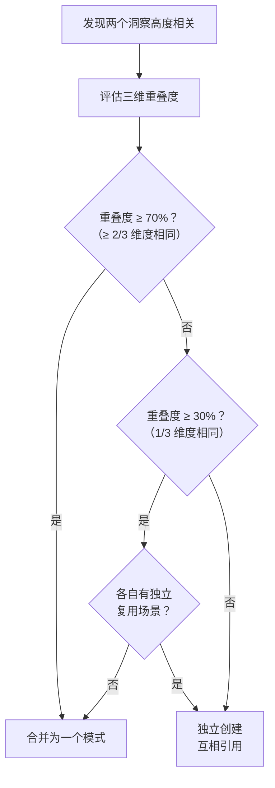

> **来源**：从 `docs/retrospective/reports/retrospective-meta-atomization-full-chain-20260624.md` 三、3.4 发现四 拆分

# 模式合并边界判断（Pattern Merge Boundary）

## 模式类型
方法论模式

## 成熟度
L1 实验性（1 次成功案例：methodology-critical-mass.md = 发现二 + 规律三 合并）

## 适用场景
原子化过程中，两个或多个洞察的核心概念高度重叠时，需要判断是独立创建多个模式还是合并为一个模式。

## 问题背景

原子化的默认倾向是"每个发现创建一个独立模式"。但实践中，两个洞察可能描述的是同一概念的不同侧面——例如"临界质量效应"和"知识复利"描述的都是模式积累的加速现象，只是前者侧重于机制（交叉组合），后者侧重于效果（复利曲线）。

如果独立创建，会导致：
- 读者需要在两个文件中来回跳转理解同一概念
- 维护者需要在两个地方同步更新相关论述
- 模式库中出现"概念冗余"

如果过度合并，又会导致：
- 模式文件过长（> 8 章节），读者难以定位
- 不同概念域的洞察被强行绑定

## 核心规则：三维重叠度判断

| 维度 | 检查项 | 判断方式 |
|------|--------|---------|
| **适用场景** | 两个洞察适用的场景是否相同？ | 对比"适用场景"段落 |
| **核心机制** | 两个洞察的操作流程/mermaid 图是否共享主路径？ | 对比流程图的核心节点 |
| **实施建议** | 两个洞察的实施步骤是否高度重合？ | 对比检查清单的前 3 项 |

### 决策矩阵

```
重叠度 = (场景相同 + 机制相同 + 建议相同) / 3

重叠度 ≥ 70%（≥ 2/3 维度相同） → 合并为一个模式
重叠度 30-70%（1/3 维度相同）     → 判断各自是否有独立的复用场景
                                   - 有独立场景 → 独立创建，互相引用
                                   - 无独立场景 → 合并
重叠度 < 30%（0/3 维度相同）       → 独立创建
```

## 操作流程



### 合并的最佳实践

| 操作 | 说明 |
|------|------|
| **文件命名** | 取覆盖范围更广的概念作为文件名 |
| **章节合并** | 将两个洞察的核心机制整合为一个流程图 |
| **来源标注** | TOML frontmatter 的 `source` 字段用逗号分隔两个来源 |
| **避免拼接** | 不要简单拼接两个文档——重新组织结构使其成为一个连贯的叙事 |

## 本案例验证

**合并案例**：insight-extraction.md 的发现二（临界质量效应）和规律三（知识复利）合并为 `methodology-critical-mass.md`。

| 维度 | 发现二（临界质量） | 规律三（知识复利） | 重叠判断 |
|------|------------------|-------------------|---------|
| 适用场景 | 模式体系评估，何时从积累进入组合 | 模式增长速度预判，三阶段划分 | ✅ 相同 |
| 核心机制 | 突破阈值后交叉组合 | 阶段一→二→三的加速曲线 | ✅ 相同（同一机制的不同表述） |
| 实施建议 | 判断所处阶段，调整资源分配 | 按阶段调整知识生产策略 | ✅ 相同 |
| **重叠度** | — | — | **100%（3/3）→ 合并** |

**合并代价**：模式文件章节数从典型 5-6 增长到 8，但在可接受范围内。

## 反例警示

| 情况 | 错误操作 | 后果 |
|------|---------|------|
| 两个洞察描述同一概念的不同侧面 | 独立创建 | 概念冗余，读者困惑 |
| 两个洞察有微弱关联但本质不同 | 强行合并 | 文件过长，不同概念被错误绑定 |
| 重叠度 50% 且各自有独立场景 | 合并 | 丢失了一个独立概念的可见性 |

## 与现有模式的关系

- `atomization-three-tier-classification.md`：本模式是其"新建模式"分支的精化——当两个洞察都需要新建但高度重叠时，需要本模式判断是否合并

> **关联模块**：
> - `atomization-three-tier-classification.md`
