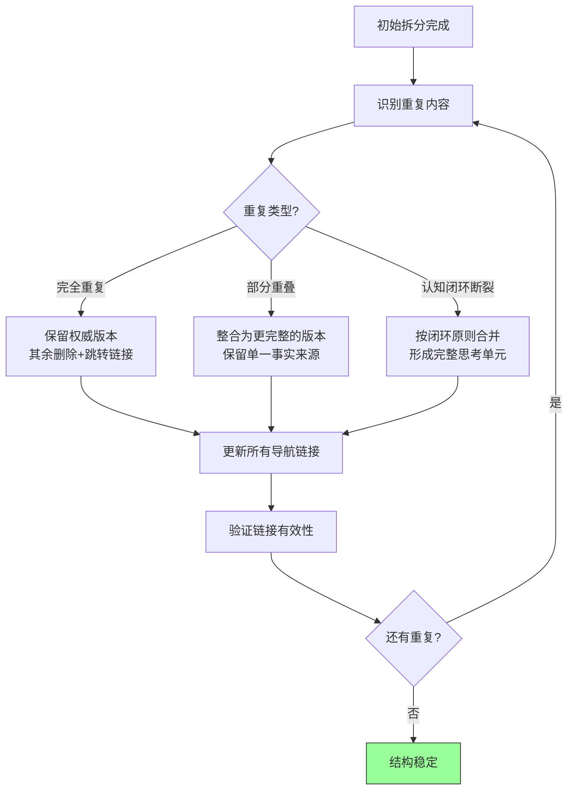

> **提炼自**：[insight-extraction.md](../../../reports/project-reports/retrospective-mdi-project-completion-20260702/insight-extraction.md) —— MDI复盘文档原子化演进（洞察14）

# 渐进式文档合并（Progressive Document Consolidation）

## 模式类型

方法论模式（文档架构/文档工程）

## 成熟度

L1 首次提炼（MDI复盘6次连续合并提交验证，1→11→4文件收敛）

## 适用场景

文档原子化重构、知识库整理、大型文档拆分后优化；当你已经完成了初始拆分但发现有重复需要合并时。

## 问题背景

文档拆分后的常见困境：
- 拆分后发现大量重复，但不知道该从哪里开始合并
- 试图一次性做大规模合并，容易出错且难以验证
- 害怕合并破坏导航和链接，不敢动手
- 合并后文件又变大，不知道是否应该停手

## 核心思想

**文档原子化不应追求初始完美拆分，而应采用"拆分暴露边界→识别重复→合并消除冗余→结构自然收敛"的渐进式策略。每次只合并一组关联最紧密的重复内容，验证无断链后再继续下一轮，直到结构自然稳定。**

这是pattern-driven-refactoring模式在文档领域的延伸——先在1-2处合并点发现重复模式，再批量推广。

## 合并流程图



## MDI复盘验证：6次渐进合并

| 提交 | 合并内容 | 合并依据 | 结果 |
|------|---------|---------|------|
| b0045a4 | 03-phase1-insights → insight-extraction | 消除洞察重复 | 10个文件，洞察有了统一位置 |
| d35f8a2 | 02-phase1-analysis → insight-extraction | 消除过程分析重复 | 9个文件，分析与洞察关联 |
| a77965c | 04/05/06 → insight-extraction | 阶段二/结论/导出与洞察构成认知闭环 | 6个文件，形成分析→洞察→结论主干 |
| a8e8700 | 08-p1-split-plan → 07 | 功能改进与结构优化都是行动建议 | 5个文件，行动计划统一 |
| e4881fd | 07 → insight-extraction | 行动建议是闭环最后一环 | 4个文件，事实/分析/洞察/行动三合一 |
| 表述优化 | 内容润色、逻辑调整 | 不改变结构，提升可读性 | v6.1完成 |

**关键观察**：每次合并只解决一类问题，合并后立即验证导航链接，确认无误后再进行下一轮。6次合并均为原子提交，每次提交单一职责（"合并XX到YY"），历史清晰可追溯。

## 核心规则

### 规则1：每次合并一个明确的问题

不要试图"一次性把所有重复都合并完"。每次合并聚焦一类问题：
- 一次合并：解决两个文件间的洞察重复
- 一次合并：整合阶段二分析与阶段一分析
- 一次合并：统一行动计划分散问题

每次合并后提交，确保可以独立回滚。

### 规则2：识别三种重复类型，分别处理

| 重复类型 | 特征 | 处理策略 |
|---------|------|---------|
| **完全重复** | 两段文字几乎一模一样 | 确定权威版本（通常是内容更完整的那个），其余删除，原位置添加指向权威版本的链接 |
| **部分重叠** | 主题相同但各有补充信息 | 整合为更完整的单一版本，取各版本的并集，消除重复叙述 |
| **认知闭环断裂** | A文件讲事实、B文件讲分析、C文件讲结论，必须一起读才能理解 | 按认知闭环原则合并为一个完整文件 |

### 规则3：合并后必须做链接验证

每次合并后必须：
1. 更新所有被删除文件的导航链接（上一章/下一章/相关文档）
2. 更新其他文件中指向被删除/被合并文件的链接
3. 运行链接检查工具验证所有本地链接有效
4. 如果保留了原文件作为跳转入口，确保跳转入口<30行且明确指向新位置

### 规则4：知道何时停止

当出现以下信号时，说明结构已稳定，停止合并：
- ✅ 每个文件有清晰的单一职责
- ✅ 没有大段重复内容（允许必要的上下文引用）
- ✅ 读者可以线性阅读一个完整主题而不频繁跳转
- ✅ 新增内容有明确的归属位置
- ✅ 最大的思考类文件在合理范围内（建议<350行）
- ❌ 如果继续合并会导致文件过大（超过认知负荷），停止

### 规则5：薄入口垫片同样适用于文档

对于被合并删除的文件，可以选择保留为薄入口（<20行）：
```markdown
# 本文档已合并
本文档内容已合并至 [insight-extraction.md](insight-extraction.md)。

请更新您的书签。
```

这在文档被外部引用时特别有用——避免链接突然404。

## 实施检查清单

**每次合并前**：
- [ ] 这次合并解决的是什么问题？（完全重复/部分重叠/闭环断裂）
- [ ] 合并范围是否明确且单一？
- [ ] 权威版本是哪个文件？

**每次合并后**：
- [ ] 内容是否正确整合（无遗漏、无重复）？
- [ ] 导航链接是否全部更新（上/下一章、目录索引）？
- [ ] 其他文件中指向被合并文件的链接是否更新？
- [ ] 是否运行了链接检查验证？
- [ ] 是否原子提交（一次合并一次提交）？

**判断停止**：
- [ ] 是否没有大段重复内容？
- [ ] 是否每个文件有清晰的单一职责？
- [ ] 最大文件是否在合理大小范围内？
- [ ] 新增内容是否有明确归属？

## 反例警示

| 错误做法 | 后果 |
|---------|------|
| 一次性合并6个文件 | 变更太大难以验证，出问题无法定位是哪一步错了 |
| 合并后不更新链接 | 导航断链，读者迷路 |
| 不提交中间状态 | 合并过程出错无法回滚 |
| 无限制合并直到只剩1个文件 | 回到"上帝文件"，违反原子化初衷 |
| 合并时不整合内容只做拼接 | 重复内容仍然存在，文件变大但质量没提升 |

## 与现有模式的关系

- `pattern-driven-refactoring.md`：本模式是其在文档领域的延伸
- `document-atomization-u-curve.md`：渐进式合并是走完U型曲线右半段的具体方法
- `cognitive-closure-document-split.md`：认知闭环是判断"应该合并什么"的核心原则
- `thin-entry-shim.md`：薄入口垫片同样适用于被合并删除的文档文件
- `bidirectional-navigation-links.md`：合并后必须维护双向导航链接的正确性
- `large-scale-duplication-elimination.md`：渐进式合并是消除大规模重复的安全策略