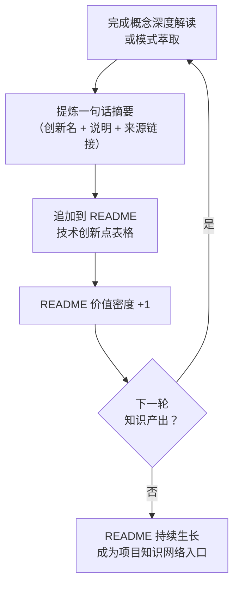

> **来源**：从 `docs/retrospective/reports/retrospective-session-insight-extraction-readme-evolution-20260624.md` 四、萃取 — 4.2 拆分

# 渐进式 README 生长（Progressive README Growth）

## 模式类型
方法论模式

## 成熟度
L1 实验性（基于 2026-06-24 会话中 README 技术创新点从 6→10 项的四轮迭代单次验证）

## 适用场景
README 已建立技术创新点表格（或类似的索引型表格），每次完成概念深度解读或模式萃取后需要将新认知纳入入口文档。

## 问题背景

README 的传统撰写模式是一次性完成，之后仅做"修正性更新"。这种方式导致两个问题：

- **更新阻力大**：每次更新意味着重新审视整个文档，心理成本高
- **价值密度停滞**：新认知无法及时进入入口层，读者看到的始终是"旧版 README"

本模式将 README 的更新从"一次性撰写"转变为"渐进式生长"——每完成一轮知识产出即追加一行，使 README 的价值密度随项目推进而持续增长。

## 核心机制

## 操作流程

### 触发条件
完成以下任一操作后触发：
- 某个概念的深度解读与文档化
- 新模式的萃取与注册
- 新决策框架的建立与验证

### 执行步骤

1. **提炼摘要**：将本轮产出浓缩为三个要素——
   - **创新名**：简洁的概念/模式名称（用于表格第一列，作为索引键）
   - **一句话说明**：该概念的核心价值或定义（用于表格第二列）
   - **来源链接**：指向详细文档的路径（用于表格第三列，支撑溯源）

2. **追加行**：在 README 技术创新点表格末尾新增一行，格式与既有行保持一致。

3. **无需审核**：单行追加不改变已有行，无合并冲突风险，可免审核直接提交。

### 反模式

| 反模式 | 问题 | 正确做法 |
|--------|------|---------|
| 积累多个概念后批量追加 | 批量更新的心理阻力接近"一次性重写" | 每轮产出后立即追加一行 |
| 摘要写得很长（> 30 字） | 表格膨胀，丧失"3 秒扫读"优势 | 严格控制一句话摘要在 20 字以内 |
| 跳过来源链接 | 读者只知道概念名，找不到详细内容 | 链接是三层沉淀体系的入口，不可省略 |

## 效率量化

| 维度 | 一次性 README 撰写 | 渐进式 README 生长 |
|------|------------------|-------------------|
| 单次更新耗时 | 30 分钟+（需审视全文） | < 1 分钟（仅追加一行） |
| 更新心理阻力 | 高（"又要改 README 了"） | 极低（"加一行就好"） |
| 价值密度增长 | 跳跃式（偶尔大更新） | 持续线性（每轮 +1） |
| 与新读者的相关性 | 滞后（新认知未注册） | 实时（新认知立即可索引） |

## 本案例验证

2026-06-24 会话中的四次 README 更新：

| 轮次 | 概念 | README 新增行 | 更新耗时 |
|------|------|-------------|---------|
| 第 2 轮 | 自指性规范体系 | 技术创新点 +1（6→7） | < 30 秒 |
| 第 5 轮 | 工具熵减非线性优化曲线 | 技术创新点 +1（7→8） | < 30 秒 |
| 第 7 轮 | 元文档杠杆效应 | 技术创新点 +1（8→9） | < 30 秒 |
| 第 9 轮 | 两栖定位 + 修正统计 | 技术创新点 +1（9→10）+ 量化修正 | < 1 分钟 |

四次更新均为"追加一行表格 + 一个链接"，零返工、零冲突。

## 与现有模式的关系

- `meta-document-leverage.md`：本模式是元文档杠杆效应的**执行手段**——杠杆效应解释了"为什么 README 值得持续投入"，本模式提供了"如何以最低成本持续投入"的具体方法
- `three-tier-knowledge-sedimentation.md`：本模式承接三层沉淀体系的第一层（README 条目），为"如何将概念注册到 README"提供操作流程
- `short-command-patterns.md`：`更新 README`（4 字）属于短指令模式库的实例——以极短指令触发高密度产出

> **关联模块**：
> - `meta-document-leverage.md`
> - `three-tier-knowledge-sedimentation.md`
> - `short-command-patterns.md`
> - `docs/retrospective/reports/retrospective-session-insight-extraction-readme-evolution-20260624.md`
