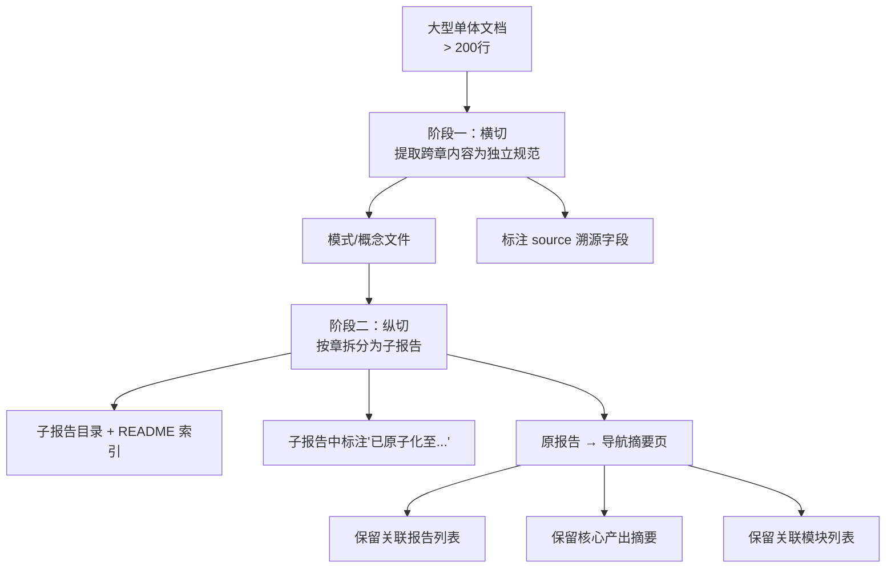

> **来源**：从 `retrospective-atomization-modularization-comprehensive-report-20260623.md` 四、萃取 拆分

# 双阶段加工策略（Two-Phase Processing）

## 模式类型
方法论模式

## 成熟度
L1 实验性（基于本次原子化+模块化双任务操作的单次萃取，需独立场景再次验证）

## 适用场景
对大型文档（> 200 行）执行深度加工——需要同时提取可复用资产（原子化）和按主题拆分（模块化）。两种操作的目标不同、维度正交，但共享同一个源文档。

## 问题背景

对于大型综合性文档的加工，常见的两个错误路径：

- **先模块化再原子化**：拆分子报告后，每个子报告中的模式/概念定义分布在多个文件中，原子化时需跨文件回溯，效率下降
- **原子化与模块化混排**：试图在一个操作中同时完成提取和拆分，导致两操作互相干扰，追溯链混乱

## 核心机制

双阶段加工策略的核心是**固定先后顺序**——先横切（提取跨章的可复用资产），再纵切（按主题边界拆分）：

## 关键规则

| 规则 | 说明 | 反例 |
|------|------|------|
| 顺序不可逆 | 原子化必须在模块化之前，否则模块化后的内容变动会迫使回溯更新原子化产出 | 先拆分子报告，再从子报告中提取模式——每次子报告内容变动都需回头更新模式文档的 source 溯源 |
| 格式复用 | 原子化文件的格式 100% 复用既有模板，零格式决策 | 为每个新文件设计专属格式 |
| 索引同步 | 每个阶段完成后同步更新所有受影响索引 | 所有文件写完后才一次性更新索引（容易遗漏） |
| 导航页保留 | 原文件不可删除，须转化为包含三条"生命线"的导航摘要页 | 模块化后直接删除原文件（导致外部链接 404） |

## 导航页的三条生命线

模块化后的原文件必须保留为一个"有效锚点"，包含：

| 生命线 | 内容 | 目的 |
|--------|------|------|
| 关联报告列表 | 横向引用的其他报告 | 外部链接不因文件变短而断裂 |
| 核心产出摘要 | 替代原内容的第一印象 | 读者不会面对一个空壳页面 |
| 关联模块列表 | 纵向归属（规范层/知识层等） | 智能体路由不丢失此文件的归属 |

## 效率量化

| 维度 | 先模块化再原子化（反序） | 先原子化再模块化（正确） |
|------|----------------------|----------------------|
| 横切操作 | 需跨 6 个子文件搜索可提取模式 | 在单体文件中一次性定位所有可提取内容 |
| 纵切操作 | 无影响 | 子报告可直接标注"已原子化至..."引用 |
| 回溯风险 | 高（每次子报告内容变动都需更新模式文档溯源） | 零（原子化在模块化之前完成，不可逆） |
| 索引同步 | 需分两次（模块化后一次、原子化后一次），索引内容前后矛盾风险 | 分两次但内容一致（原子化纳入索引后，模块化只增加子目录引用） |

## 本案例验证数据

| 指标 | 阶段一（原子化） | 阶段二（模块化） | 合计 |
|------|---------------|---------------|------|
| 源文档 | 1000 行单体报告 | 原子化完成后的报告 + 8 个新政文件 | — |
| 新增文件 | 8 个 | 7 个 | 15 个 |
| 修改文件 | 5 个（索引同步） | 1 个（原报告导航页化） | 6 个 |
| 格式决策 | 0 次 | 1 次（拆分粒度） | 1 次 |
| 回溯修正 | 0 次 | 0 次 | 0 次 |

## 与现有模式的关系

- 是 `document-system-refactoring` 在"一个文档需要同时原子化和模块化"场景的精化
- 阶段一的格式复用规则直接依赖 `convention-driven-creation`（先读范例再扩展）
- 模块化策略（按主题边界拆分 + 索引 README）复用了 `document-system-refactoring` 的六步流程

> **关联模块**：
> - `document-system-refactoring.md`
> - `convention-driven-creation.md`
> - `docs/retrospective/reports/retrospective-atomization-modularization-comprehensive-report-20260623.md`
