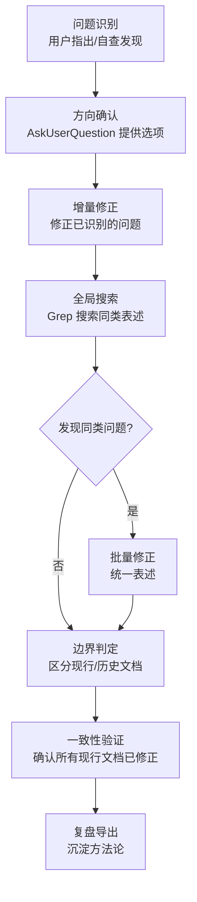
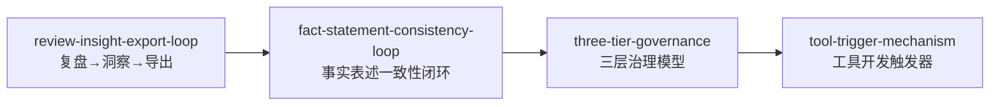

+++
id = "fact-statement-consistency-loop"
domain = "methodology"
layer = "methodology"
maturity = "L2"
validation_count = 2
reuse_count = 0
documentation_level = "basic"
source = "docs/retrospective/knowledge-extraction.md"

[bindings]
rules = []
references = []
skills = []
+++

# 事实表述一致性闭环

## 来源
事实表述修正任务（README.md 及关联文档）

## 定义
当修正文档中某处事实性表述后，必须全局搜索同类表述并统一修正的标准流程，确保所有现行文档的事实表述保持一致，同时保留历史文档的时间快照完整性。

## 流程图

## 核心要素

| 阶段 | 动作 | 关键点 |
|------|------|--------|
| 问题识别 | 用户指出或自查发现 | 明确问题的具体性质（事实偏差/措辞不当/数字无据） |
| 方向确认 | 提供明确选项供决策 | 避免开放式讨论，给出 2-4 个可选方案 |
| 增量修正 | 修正已识别的问题 | 先修正明确的问题，再扩展搜索 |
| 全局搜索 | Grep 搜索同类表述 | 使用关键词组合，覆盖整个项目 |
| 边界判定 | 区分现行文档与历史文档 | 现行文档修正，历史文档保留 |
| 一致性验证 | 确认所有现行文档已统一 | 检查表述风格、数字、措辞是否一致 |
| 复盘导出 | 沉淀方法论与改进建议 | 遵循"复盘→洞察→导出"闭环 |

## 决策矩阵

| 场景 | 是否修正 | 依据 |
|------|---------|------|
| 现行文档中的事实偏差 | 修正 | 面向读者，必须准确 |
| 现行文档中的无据数字 | 修正或删除 | 数字必须有出处 |
| 现行文档中的夸大措辞 | 改为客观表述 | 技术文档需保持客观性 |
| 历史任务记录 | 不修正 | 保持时间快照完整性 |
| 历史规格文档（.trae/specs） | 不修正 | 记录当时的工作过程 |
| 测试用例中的表述 | 不修正 | 属于功能测试，非事实声明 |

## 适用场景

- 事实性修正：修正文档中不准确的事实陈述
- 命名规范统一：统一术语、命名风格
- 术语一致性调整：确保同一概念在多处使用一致表述
- 数字声明清理：清理无依据的数字声明
- 措辞客观化：将营销式表述改为技术文档式表述

## 与现有模式的关系

**关系说明**：
- 本模式是 `review-insight-export-loop` 在"文档修正"场景的具体应用
- 本模式的"一致性验证"阶段可纳入 `three-tier-governance` 的"验证"层
- 当"修正一处 → 搜索同类"被手动执行 3 次以上时，触发 `tool-trigger-mechanism` 评估自动化

## 实施检查清单

- [ ] 已明确问题的具体性质（事实偏差/措辞不当/数字无据）
- [ ] 已通过 AskUserQuestion 确认修改方向
- [ ] 已修正用户明确指出的问题
- [ ] 已使用 Grep 全局搜索同类表述
- [ ] 已区分现行文档与历史文档
- [ ] 已对历史文档保持不动
- [ ] 已确认所有现行文档表述一致
- [ ] 已记录修正过程与决策依据

> **关联模块**：
> - `review-insight-export-loop.md` — 复盘→洞察→导出知识闭环（父模式）
> - `three-tier-governance.md` — 三层治理模型（验证层集成）
> - `tool-trigger-mechanism.md` — 工具开发触发器机制（自动化触发）
> - `../../reports/retrospective-report-fact-statement-correction.md` — 来源复盘报告
