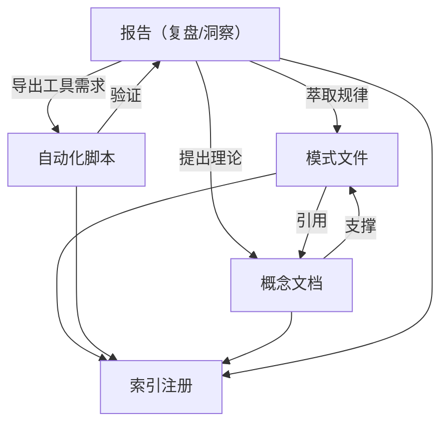

+++
id = "five-category-asset-coverage"
domain = "methodology"
layer = "methodology"
maturity = "L2"
validation_count = 2
reuse_count = 0
documentation_level = "basic"
source = "docs/retrospective/knowledge-extraction.md"

[bindings]
rules = []
references = []
skills = []
+++

# 五类资产覆盖原则（Five-Category Asset Coverage）

> **来源**：从洞察报告潜在机会实施中提炼——4 项机会分别落位到不同知识形态
> **模式类型**：方法论模式
> **验证轮次**：2（apps/ 目录创建 + 潜在机会实施）

---

## 一、模式定义

五类资产覆盖原则是指在一次知识产出（复盘、洞察萃取、机会实施等）中，应力求产出物覆盖以下五类知识形态中的**至少三类**，以最大化知识的可发现性、可复用性与可执行性：

| 类别 | 目录 | 形态 | 典型文件 |
|------|------|------|---------|
| 概念 | `concepts/` | 理论定义、体系说明 | `pattern-maturity-levels.md` |
| 模式 | `patterns/` | 可复用的方法论/架构/代码模式 | `review-insight-export-loop.md` |
| 脚本 | `scripts/` | 可执行的自动化工具 | `check-action-items.py` |
| 报告 | `reports/` | 项目复盘、洞察分析 | `retrospective-meta-analysis-cross-project.md` |
| 索引 | `assets/` + `README.md` | 资产清单、导航入口 | `asset-inventory.md` |

## 二、原则推导

### 2.1 为何需要五类覆盖

单类产出（例如只写一篇复盘报告）存在以下问题：

- **可发现性低**：只剩报告，没有导航入口指向，后续难以被检索到
- **可复用性低**：报告中的方法论规律未被萃取为独立模式文件，无法跨项目复用
- **可执行性低**：报告中提出的改进建议缺乏自动化脚本支撑，依赖人工跟进
- **缺乏理论基础**：新模式缺少概念文档解释其设计原理

### 2.2 各类别的互补关系

### 2.3 覆盖度评估

| 覆盖类别数 | 评价 | 典型场景 |
|-----------|------|---------|
| 5/5（全覆盖） | 典范 | 大规模项目结项 / 体系级改进 |
| 3-4/5 | 良好 | 中规模复盘 / 机会实施 |
| 1-2/5 | 不足 | 快速修复 / 单文件修改 |

## 三、应用案例

### 案例 1：apps/ 目录创建（首次应用）

| 类别 | 产出 | 覆盖 |
|------|------|:--:|
| 概念 | — | ✗ |
| 模式 | 双区开发模型、生命周期协议三阶段、目录创建三件套 | ✓ |
| 脚本 | — | ✗ |
| 报告 | 复盘报告 | ✓ |
| 索引 | asset-inventory.md + README.md 更新 | ✓ |

**覆盖**：3/5（良好）

### 案例 2：潜在机会实施（本次）

| 类别 | 产出 | 覆盖 |
|------|------|:--:|
| 概念 | pattern-maturity-levels.md | ✓ |
| 模式 | short-command-patterns.md | ✓ |
| 脚本 | check-action-items.py | ✓ |
| 报告 | retrospective-meta-analysis-cross-project.md | ✓ |
| 索引 | asset-inventory.md + README.md 更新 | ✓ |

**覆盖**：5/5（全覆盖）

## 四、使用指南

### 4.1 实施步骤

1. 在复盘报告完成后，审视报告的内容结构
2. 识别哪些发现可被萃取为独立模式 → 创建 `patterns/` 文件
3. 识别哪些理论需要独立概念文档 → 创建 `concepts/` 文件
4. 识别哪些重复操作可自动化 → 创建 `scripts/` 文件
5. 所有新文件注册到 `asset-inventory.md` 和 `README.md`

### 4.2 最低标准

每次复盘/洞察/萃取至少达到 3/5 覆盖：
- **报告**（必须）：复盘报告本身
- **索引**（必须）：新文件注册
- **至少一个** 模式或概念或脚本

---

> **关联模块**：`patterns/methodology-patterns/review-insight-export-loop.md`、`concepts/pattern-maturity-levels.md`、`reports/retrospective-report-insight-opportunities-implementation.md`
