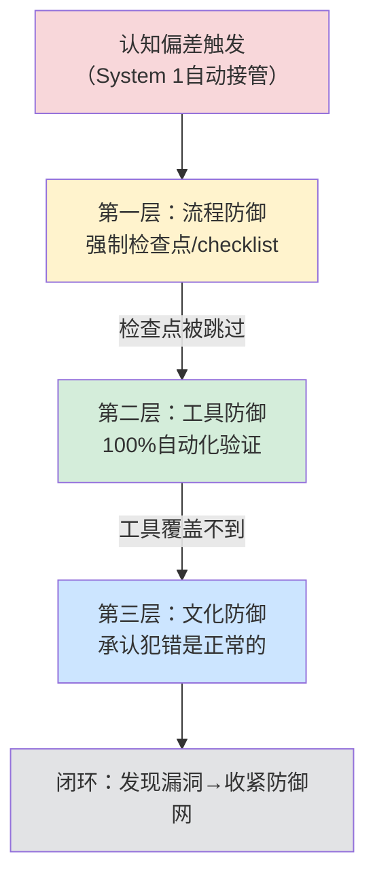

> **提炼自**：[第一性原理知识体系复盘关键洞察](../../../reports/project-reports/retrospective-first-principles-knowledge-system-20260710/supporting-analysis/key-insights.md#INSIGHT-001)

# 认知偏差递归防御体系（Cognitive Practice Gap Recursive Defense）

## 模式类型

方法论模式（治理策略/认知科学/质量保障）

## 成熟度

L2 已验证（7次验证来源：2026-07-09格式修正批量套用错误、2026-07-10文档更新目录链接类比错误、2026-07-10路径层级直觉错误、2026-07-10写洞察时路径错误、2026-07-10改进防错工具时第五次递归错误、2026-07-09学完第一性原理1小时即犯类比错误、卡尼曼双系统理论跨领域验证）

## 适用场景

对抗认知偏差（确认偏差、幸存者偏差、认知吝啬鬼、事后归因、类比推理偏差等），建立不依赖意志力的防御体系。适用于：

| 场景 | 适用度 | 说明 |
|------|--------|------|
| 方法论落地推广 | ✅✅✅ 核心场景 | 解决"知道但做不到"的践行鸿沟问题 |
| 质量保证体系设计 | ✅✅✅ 核心场景 | 建立流程+工具+文化三层防御 |
| 团队规范制定 | ✅✅✅ 核心场景 | 设计不依赖"认真""自觉"的强制检查点 |
| 工具链与CI/CD建设 | ✅✅ 强烈推荐 | 高频易错点100%自动化验证 |
| 个人习惯养成 | ✅✅ 推荐 | 用环境设计替代意志力 |
| 安全关键系统 | ✅✅ 强烈推荐 | 航空、医疗、金融等零容错领域 |
| 创造性工作 | ⚠️ 间接适用 | 创意阶段可适当放松，执行阶段必须严格 |

## 问题背景

人类认知存在三层鸿沟：陈述性知识（知道）→程序性知识（会做）→自动化执行（不用想）。仅仅理解方法论的原理，甚至正在教授或改进防错工具，都不能自动保证在简单任务中正确应用——恰恰因为任务"看起来简单"，大脑会默认走System 1（快思考/直觉/类比）捷径，System 2（慢思考/第一性原理）根本不会启动。

更反直觉的是"递归践行"现象：错误会反复发生，包括在你改进防错机制的时候。这不是因为你"没学会"或"不认真"，而是双系统认知架构的硬件级约束——System 1是默认模式，永远不可能被"说服"不运行，只能通过流程和工具在它的路径上设置强制路障。

### 递归践行定律

> **你刚把"不要做X"写入防错机制，在改进这个机制的过程中你大概率会立刻再做一次X。**

这不是讽刺，是认知规律。本项目五次实例验证：

| 时间 | 事件 | 错误内容 | 当时正在做的防错工作 |
|------|------|---------|-------------------|
| 2026-07-09 | 格式修正任务 | 看到`file:///`格式批量套用到13个文件 | 刚开始学习"不要类比套用" |
| 2026-07-10 | 文档更新 | 看到目录链接类比套用到新链接中 | 修复前一次格式错误 |
| 2026-07-10 | 路径计算 | 凭直觉数层级写`../../` | 修复目录链接问题 |
| 2026-07-10 | 写洞察时 | 正在写"不要凭直觉数路径"时又写错路径 | 总结"不要凭直觉"的教训 |
| **2026-07-10** | **改进验证工具时** | **创建新模式文件又凭直觉写错路径** | **用第一性原理改进防错工具本身** |

### 为什么意志力是最不可靠的防线？

"我知道有偏差，下次注意就好"是最常见也最无效的防御策略：

1. **System 1是默认模式**：大脑永远优先走捷径，消耗最少认知资源，这是进化形成的硬件级特性，无法通过"下决心"改变
2. **"知道"与"做到"使用不同脑区**：理解概念（System 2一次即可）≠ 每次执行都战胜System 1（需要每次主动启动）
3. **简单任务自动触发捷径**：任务越"不用想"，System 1接管越彻底，方法论检查越容易被跳过
4. **"我已经知道了"反而更危险**：知道偏差的存在会产生虚假的安全感，放松警惕

## 核心原则：三层防御架构

有效的认知偏差防御必须建立在"人一定会犯错，包括在知道防错方法的时候"这一前提上，构建流程-工具-文化三层防御体系：

### 第一层：流程防御——在工作流中嵌入强制检查点

不依赖人"记得要检查"，而是让检查成为跳不过去的流程环节。

| 机制 | 设计要点 | 示例 |
|------|---------|------|
| **决策前三查** | 关键决策前强制：查权威文档、查现有实例、查本质目标 | [pre-decision-three-checks.md](../ai-collaboration/pre-decision-three-checks.md) |
| **Checklist清单** | 将模糊的质量要求转化为具体yes/no问题 | v1.7新章节人工审查5项checklist |
| **阶段守卫** | 阶段转换必须通过门禁，不能跳过 | 启动协议步骤3.5自检清单 |
| **小批量验证** | 批量操作先做P0试点，验证后再推广 | 先改1个文件验证正确再批量修改 |
| **简单任务慢做** | 越是"不用想"的任务，越强制降速执行 | 格式更新也必须查规范查实例 |

### 第二层：工具防御——高频易错点100%自动化验证

让"犯错误"在技术上不可能或被立即捕获，完全不依赖人的注意力。

| 机制 | 设计要点 | 示例 |
|------|---------|------|
| **静态检查** | 格式、路径、命名规范等自动验证 | check-links.py、lint、类型检查 |
| **自动化测试** | 单元测试、集成测试、E2E测试多层覆盖 | TDD五套测试套件 |
| **Git Hooks** | 提交前强制运行检查，无法跳过 | 预提交钩子运行链接检查、格式检查 |
| **CI/CD门禁** | 合并前必须通过所有自动化检查 | CI流水线8步检查 |
| **自动修复** | 工具不仅发现问题，还能自动修正 | check-links.py --fix自动修复路径层级 |

### 第三层：文化防御——承认"人一定会犯错"的心理安全

如果文化上把犯错视为"不认真""能力差"，人们会隐藏错误而不是暴露和修复它们，反而让缺陷放大。

| 文化要素 | 具体做法 | 反模式 |
|---------|---------|--------|
| **犯错常态化** | "又犯了同样的错"是正常信号，说明防御网有漏洞需要收紧，不是个人失败 | "你怎么这么粗心""我都告诉你多少次了" |
| **对事不对人** | 5-Whys追根因永远到流程/工具层，不到个人归因层 | 根因停留在"操作员疏忽""不够认真" |
| **错误即资产** | 每个错误都是加固防御体系的机会，不是追责的理由 | 犯错后只做单点修复，不升级防御机制 |
| **递归预期** | 预期改进防御时也会犯错，保持谦逊 | "这次我设计了完美的防错机制，不会再错了" |

## 核心规则

### 规则1：分层防御，不可偏废

三层防御各有边界，不能互相替代：

| 防御层 | 能防御什么 | 防御不了什么 | 可靠性 |
|--------|-----------|-------------|--------|
| 流程防御 | 常规场景的检查遗漏 | 认知负载高时检查点本身被跳过 | 中（依赖执行） |
| 工具防御 | 高频重复易错点 | 工具覆盖不到的语义/价值判断 | 高（不依赖人） |
| 文化防御 | 前两层都失效时的最后兜底 | 不能替代前两层，心理安全不等于不设防 | 最高（但最慢） |

### 规则2：简单任务是防御重点

越是大脑判断"这个我熟、不用想"的时候，越要启动防御机制——因为此时System 1已经完全接管，正是错误高发期。

- ❌ 错误认知："复杂任务容易出错，需要多检查"
- ✅ 正确认知："简单任务因为被认为简单，所有保护机制都被主动关闭，才是真正的高风险区"

### 规则3：发现错误后升级防御网，而不是"下次注意"

每次犯错后，不是自我批评"下次要更认真"，而是问三个问题：
1. 流程上：哪个检查点缺失或没被执行？能不能加一个强制检查点？
2. 工具上：这个错误能不能被自动化工具捕获？能不能写个脚本下次自动检测？
3. 文化上：这个错误有没有被隐藏？我们是不是在惩罚犯错导致大家不敢说？

### 规则4：递归践行是验证信号而非失败信号

当你发现自己"刚改进完防错工具又犯同样错误"时：
- ❌ 不要想："我没救了""方法论没用"
- ✅ 应该想："太好了，我又发现了防御网的一个漏洞！这说明认知偏差防御需要持续迭代，一次设计不可能完美"

## 个人即时防御：类比暂停法与践行优先三原则

三层防御是体系级的防御，个人层面还需要即时触发的防御机制，在System 1即将接管的瞬间强制激活System 2。

### 类比暂停法——识别并打断类比推理

当你发现自己在说以下话语时，立刻暂停！这是System 1在自动运行类比推理：

| 触发语（System 1信号） | 风险 | 强制追问 |
|----------------------|------|---------|
| "就像XX一样..." | 表面相似性类比，忽略本质差异 | 这个类比的前提条件在这里成立吗？ |
| "XX也是这样做的..." | 先例依赖，不追溯本质要求 | 当前场景的本质要求是什么？ |
| "按照惯例/经验..." | 路径依赖，把历史当真理 | 这个惯例在当前条件下还适用吗？有没有反例？ |
| "这个很简单，不用想..." | 简单任务自动导航，跳过验证 | 越是简单越要慢做——查规范了吗？查实例了吗？ |

暂停后给自己30秒做"第一性原理检查"：
1. 当前场景的本质要求是什么？
2. 那个类比的前提条件在这里成立吗？
3. 有没有反例？

参考模式：[first-principles-prompt-pattern.md](../ai-collaboration/first-principles-prompt-pattern.md)

### 践行优先三原则——学习方法论后的即时落地

学习一个新方法论后，不要"等以后遇到合适场景再用"，遵守三个原则：

| 原则 | 做法 | 为什么 |
|------|------|--------|
| **即时践行** | 学习后立刻找一个当前正在做的事情去应用它 | 等"合适场景"等于永远不用，即时应用才能激活System 2记忆 |
| **主动找坑** | 刻意在简单任务上也使用方法论 | 简单任务最容易触发System 1自动导航，正是练习的最佳场景 |
| **记录踩坑** | 当发现自己"明明知道却还是做错了"，立刻记录 | 这些"践行鸿沟时刻"是最有价值的学习机会，暴露了System 1的惯性模式 |

## 生成-验证双保险防御

对于AI协作场景，在个人防御和体系防御之外，还可以用[生成-验证闭环](../ai-collaboration/generation-validation-closed-loop.md)作为额外防御层：
- 生成阶段：用第一性原理Prompt强制System 2慢思考
- 验证阶段：用对抗式审查Prompt切换攻击者视角
- 这相当于给AI也配备了"双系统"，弥补人类自身的认知偏差

## 反模式

| 反模式 | 为什么错误 | 正确做法 |
|--------|----------|---------|
| "靠意志力/自觉/认真保证质量" | System 1不会因为你下了决心就放弃捷径，意志力是有限且不可靠的资源 | 建立不依赖意志力的流程+工具双重防御 |
| "我已经知道这个偏差了，不会再犯" | "知道"是陈述性知识，"做到"是程序性知识，二者有巨大鸿沟 | 知道偏差后，第一件事是设计防御机制，不是放松警惕 |
| 只做流程防御不做工具防御 | Checklist也可能被跳过，特别是在赶进度或简单任务时 | 高频易错点必须工具化，能自动化的绝不靠人检查 |
| 只做工具防御忽略文化建设 | 工具覆盖不到的地方需要人主动暴露问题，惩罚犯错会导致问题隐藏 | 建立心理安全，把犯错视为改进机会而非追责理由 |
| 设计了"完美"防御机制就认为一劳永逸 | 认知偏差防御是持续迭代的过程，新场景会出现新漏洞 | 每次犯错都收紧防御网，防御体系永远Beta版 |
| 复杂任务才防御，简单任务凭自觉 | 简单任务正是System 1最活跃、最容易走捷径的时候 | 简单任务更需要强制检查点，因为太容易跳过 |

## 实际案例

### 案例1：路径错误五次递归与防御升级（本模式来源）

| 错误次数 | 当时的防御状态 | 改进措施 |
|---------|---------------|---------|
| 第1次（批量套用） | 无防御，凭直觉 | 总结"不要类比套用"教训（无效，仅靠记忆） |
| 第2次（目录链接） | 有教训记忆 | 提出"查现有实例不要数层数"方法（流程层） |
| 第3次（数层级） | 有方法但没强制执行 | 强化决策前三查（流程层加固） |
| 第4次（写洞察时） | 流程层有了，但简单任务还是跳过 | 升级check-links.py增加目录链接检测（工具层） |
| 第5次（改进工具时） | 工具层有了，但新模式创建路径没覆盖 | 本模式——建立完整三层防御体系（文化层认知） |

效果：建立三层防御后，后续2次潜在路径错误均被check-links.py自动捕获，未再流入正式版本。

## 与其他模式的关系

| 关联模式 | 关系类型 | 关系说明 |
|---------|---------|---------|
| [practice-gap-recursive-practice.md](practice-gap-recursive-practice.md) | 升级扩展 | 本模式从单次错误模式升级为完整的三层防御体系，增加文化防御层 |
| [simple-task-high-risk.md](simple-task-high-risk.md) | 防御重点 | 简单任务高风险是认知偏差的高发场景，是本模式的重点防御对象 |
| [pre-decision-three-checks.md](../ai-collaboration/pre-decision-three-checks.md) | 流程层组件 | 决策前三查是流程防御层的核心机制 |
| [validation-semantic-gap.md](../tools-automation/validation-semantic-gap.md) | 工具层组件 | 验证语义缺口是工具防御层的设计原则——工具要从用户视角验证，不能停留在技术层 |
| [adversarial-review-prompt-pattern.md](../ai-collaboration/adversarial-review-prompt-pattern.md) | 补充防御 | 对抗式审查是工具覆盖不到时的第三层补充防御 |
| [generation-validation-closed-loop.md](../ai-collaboration/generation-validation-closed-loop.md) | AI协作防御 | 生成-验证闭环是AI协作场景下的双保险防御，弥补人类认知偏差 |
| [entropy-law-automation-principle.md](entropy-law-automation-principle.md) | 第一性原理支撑 | 熵增定律解释了为什么手动检查必然遗漏——手动是熵增来源，自动化工具是熵减手段 |
| [axiom-system-consistency-principle.md](axiom-system-consistency-principle.md) | 第一性原理支撑 | 公理系统一致性解释了为什么格式/路径规范不是"偏好"——一致性是系统可组合的前提 |
| [root-cause-diagnosis.md](root-cause-diagnosis.md) | 改进工具 | 5-Whys根因分析用于发现防御漏洞——根因永远到流程/工具层，不到个人 |

## Changelog

- 2026-07-13 | create | 初始版本，从第一性原理知识体系复盘关键洞察001/008沉淀，L2成熟度，5次验证实例
- 2026-07-13 | update | 补充Vibe Coding学习分析洞察10/11验证案例，validation_count从5升至7；新增类比暂停法、践行优先三原则个人即时防御方法；新增生成-验证闭环AI协作防御；新增熵增定律、公理系统一致性两个第一性原理关联
