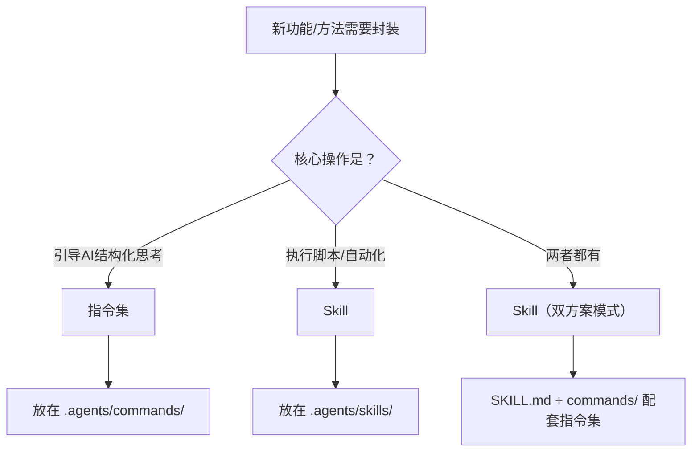

# 指令集与Skill边界判断（Command vs Skill Boundary）

## 模式类型
方法论模式（治理策略/分类决策）

## 成熟度
L1 实验级（1次验证：对抗性审查指令集创建任务；5个已验证案例）

## 问题陈述

"指令集还是Skill"是AI工作流封装中的常见决策点，但判断标准常被混淆：
- **误判方向1**："这个功能很重要，应该做成Skill"——混淆了"重要性"和"核心操作类型"
- **误判方向2**："这个功能很简单，不需要独立指令集"——混淆了"复杂度"和"是否需要结构化"

## 解决方案

基于"核心操作类型"而非"重要性"或"复杂度"来判断边界。

### 判断公式

```
如果核心操作是"引导AI进行结构化思考" → 指令集（.agents/commands/）
如果核心操作是"执行Python脚本/自动化流程" → Skill（.agents/skills/）
如果两者都有（如forum-posting既有脚本又有决策树）→ Skill（双方案模式）
```

### 边界判断矩阵

| 特征 | 指令集 | Skill |
|------|--------|-------|
| 核心操作 | 引导AI进行结构化思考 | 执行脚本/自动化流程 |
| 执行方式 | 纯文本指令，AI按步骤推理 | 调用Python/Shell脚本 |
| 典型场景 | 对抗性审查、第一性原理、复盘、洞察 | forum-posting、link-check、ci-check |
| 是否需要脚本 | 否 | 通常需要 |
| 抽象层次 | 认知方法层 | 工具执行层 |
| 可独立使用 | 是（AI可直接按指令执行） | 是（但通常需要脚本支撑） |

### 判断流程



## 常见误判类型

| 误判 | 为什么错 | 正确判断 |
|------|---------|---------|
| "X很重要，应该做成Skill" | 重要性≠需要脚本。认知方法不需要脚本执行 | 以核心操作类型为准 |
| "X很简单，不需要独立指令集" | 简单≠不需要结构化。认知方法需要防止直觉跳跃 | 以是否需要结构化引导为准 |
| "有决策树，应该做成指令集" | 有决策树但核心操作是脚本驱动→仍应归为Skill | 以核心操作为准，决策树是辅助 |

## 已验证案例

| 案例 | 判断 | 验证结果 |
|------|------|---------|
| 对抗性审查 | 指令集 | 283行指令集，无需脚本，AI可直接按步骤执行 |
| 第一性原理分析 | 指令集 | 6步分析流程，纯推理，无需脚本 |
| forum-posting | Skill | 双方案模式：Playwright脚本 + 决策树 |
| link-check | Skill | Python脚本驱动，自动化检测 |
| insight-cmd | Skill | Skill门面 + 指令集L2文档 |

## 验证来源

- **对抗性审查指令集创建任务**（2026-07-10）：Skill vs 指令集是3个关键决策之一，通过第一性原理分析得出"指令集"结论，283行指令集运行验证通过

## 关联资源

- 洞察来源：[command-vs-skill-boundary.md](../../reports/insight-extraction/meta-methodology/retrospective-adversarial-review-cmd-20260710/insights/command-vs-skill-boundary.md)
- 关联模式：[knowledge-to-command-pipeline.md](knowledge-to-command-pipeline.md)（知识库→指令集转化）